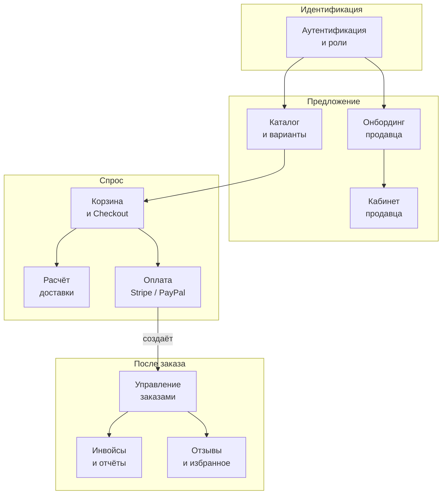
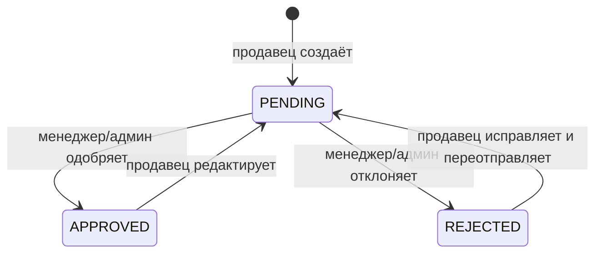
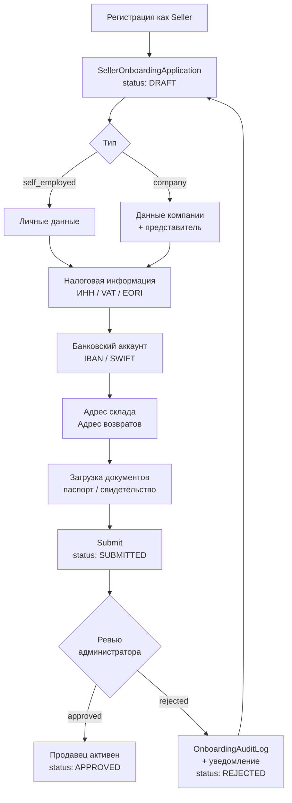
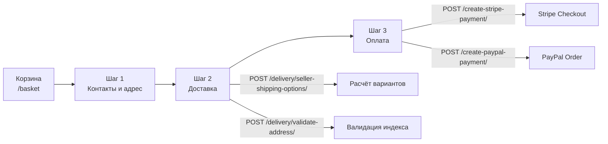
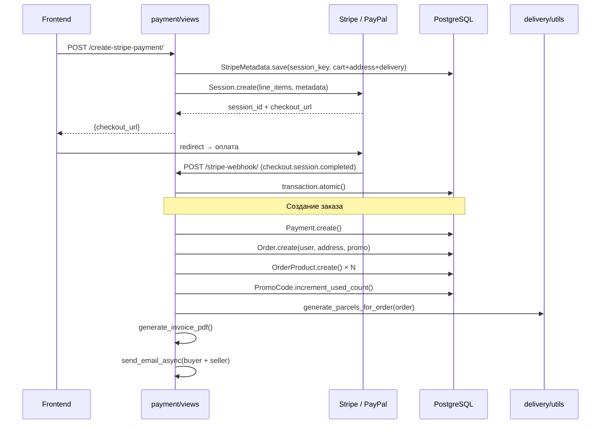
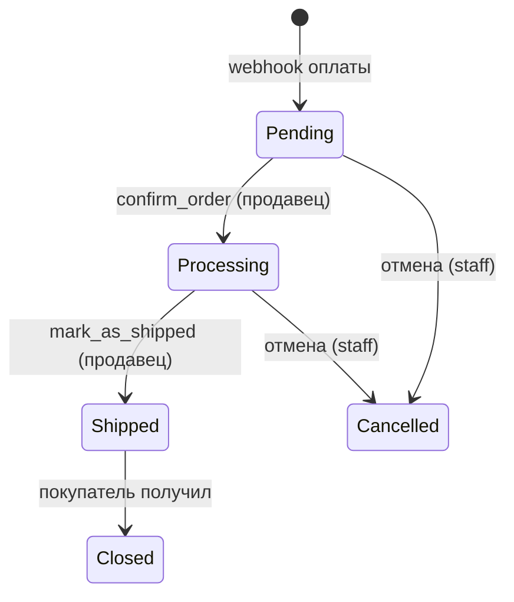
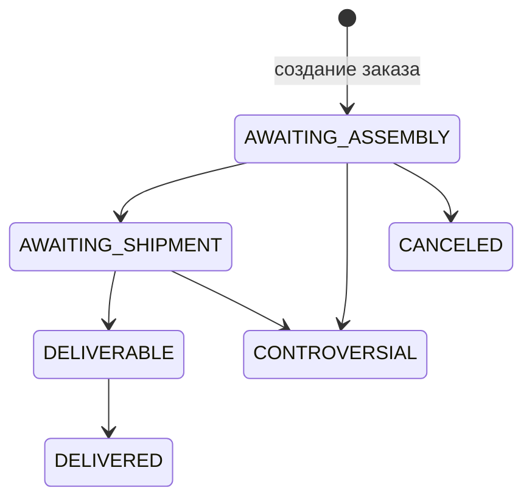

# 01. Business Domains

> Описание предметных областей проекта на основе реального кода.

## Карта доменов



---

## 1. Аутентификация и роли

### Назначение
Управление идентификацией пользователей, ролевая модель, OTP, OAuth. Центральный домен — все остальные зависят от него.

### Основные сущности

| Сущность | Поля |
|---------|------|
| `CustomUser` | `email` (PK), `role` (Admin / Manager / Customer / Seller), `phone_number`, `image`, `email_confirmed`, `phone_number_confirmed` |
| `OTP` | FK `CustomUser`, `value`, `expired_date`, `attempts_count`, `locked_until` |

**Роли (`UserRole`):** `CUSTOMER`, `SELLER`, `MANAGER`, `ADMIN`.
Каждая роль синхронизируется с Django `Group` через `CustomUser.save()` в транзакции.

### Основные пользовательские действия

| Действие | Актор |
|---------|-------|
| Регистрация по email | Покупатель / Продавец |
| Подтверждение email через OTP | Покупатель / Продавец |
| Вход по email + пароль | Все |
| OAuth через Google / Facebook | Покупатель |
| Сброс пароля через OTP | Все |
| Обновление профиля | Все |
| Удаление аккаунта | Все |

### Backend apps
- `accounts` — основной

### Frontend части
- `Components/Auth/` — Google, Facebook кнопки
- `Components/MobAuth/` — мобильная версия
- `pages/SignUpPage`, `EmailConfirmPage`, `OtpConfirmPage`, `MobLoginPage`, `ChangePassPage`
- `src/api/auth.js` — все методы авторизации
- `localStorage['token']` — хранение JWT `{access, refresh}`

### Входные и выходные данные

| Операция | Вход | Выход |
|---------|------|-------|
| Регистрация | `email`, `password`, `first_name`, `last_name` | `CustomUser` + OTP на email |
| Вход | `email`, `password` | `{access, refresh}` JWT |
| OTP-подтверждение | `email`, `otp_code` | `email_confirmed = True` |
| Refresh | `refresh` token | новый `access` token |
| Google OAuth | Google ID token | JWT-пара + `CustomUser` |

### Интеграции
- **Google OAuth** — `allauth.socialaccount.providers.google`
- **Facebook OAuth** — `allauth.socialaccount.providers.facebook`
- **Email (SMTP)** — отправка OTP

### Риски

| Риск | Описание |
|------|---------|
| Logout без try/except | `CustomLogoutView` не обрабатывает `TokenError` → 500 при невалидном refresh |
| Мёртвый сигнал | `assign_default_role` проверяет `not instance.role`, но `default=UserRole.CUSTOMER` — ветка никогда не срабатывает |
| OTP без транзакции | `create_and_send_otp` делает `update_or_create` без `atomic` — состояние гонки при двойном запросе |
| `clientId` Google OAuth в коде | `GoogleOAuthProvider clientId` захардкожен в `main.jsx` фронтенда |

---

## 2. Каталог и варианты товаров

### Назначение
Хранение и модерация товаров продавцов, иерархия категорий, вариации по цвету/размеру/типу, изображения, складские остатки.

### Основные сущности

| Сущность | Ключевые поля |
|---------|--------------|
| `Category` | MPTT-дерево: `parent`, `image` |
| `BaseProduct` | `seller`, `category`, `status` (pending/approved/rejected), `rating`, `vat_rate`, `is_age_restricted` |
| `ProductVariant` | `sku` (автогенерация 9 символов), `price`, габариты, вес; обязательный `text`, опциональный `image`; общий `name` для всех вариантов товара |
| `ProductParameter` | key/value атрибуты продукта |
| `BaseProductImage` | автоконвертация в WebP при сохранении |
| `LicenseFile` | OneToOne к `BaseProduct` |
| `WarehouseItem` | `warehouse`, `product_variant`, `quantity_in_stock` |

**Жизненный цикл модерации продукта:**


### Основные пользовательские действия

| Действие | Актор |
|---------|-------|
| Просмотр каталога с фильтрами/сортировкой | Покупатель |
| Поиск товаров | Покупатель |
| Просмотр карточки товара | Покупатель |
| Создание / редактирование товара | Продавец |
| Загрузка изображений, параметров, вариантов | Продавец |
| Модерация (approve/reject) | Менеджер / Админ |
| Добавление в избранное | Покупатель |

### Backend apps
- `product` — модели, views, сериализаторы
- `sellers` — ViewSets для управления товарами продавца
- `warehouses` — остатки по вариантам
- `favorites` — избранное

### Frontend части
- `Components/Catalog/` — карточки, фильтры, сортировка
- `Components/Product/` — детальная страница, галерея, варианты
- `pages/CategoryPage`, `SearchPage`, `ProductPage`
- `src/api/productsApi.js`, `categoryApi.js`
- Redux: `products`, `category`
- Seller: `Components/Seller/create/`, `edit/`, `preview/`, `goods/`

### Входные и выходные данные

| Операция | Вход | Выход |
|---------|------|-------|
| Листинг | `category_id`, `filters`, `sort`, `page` | Список `BaseProduct` с мин. ценой |
| Поиск | `query` | Отфильтрованные `BaseProduct` |
| Карточка | `product_id` | `BaseProduct` + `ProductVariant[]` + `ProductParameter[]` + `can_review` |
| Создание товара | `name`, `category`, `description`, `vat_rate`, изображения, варианты | `BaseProduct` + `ProductVariant[]` |

### Интеграции
- **Cloudinary** — хранение и трансформация изображений
- `django-mptt` — дерево категорий

### Риски

| Риск | Описание |
|------|---------|
| Коэффициент 1.04 задублирован | `BaseProduct.min_price_with_acquiring`, `ProductVariant.price_with_acquiring`, `favorites` — при изменении ставки нужно менять в 3 местах |
| Дублирование `apply_ordering` | Два view-класса в `product/views.py` с одинаковой логикой сортировки |
| `getSearchProducts` — пустой URL | Во фронтенде `get("")` — возвращает HTML вместо JSON |
| Нет транзакции при создании товара | Создание `BaseProduct` + `ProductVariant` + `BaseProductImage` не атомарно |

---

## 3. Онбординг продавца

### Назначение
Многошаговый процесс верификации продавца: сбор юридических данных, банковских реквизитов, документов, ревью администратором.

### Основные сущности

| Сущность | Описание |
|---------|---------|
| `SellerProfile` | OneToOne к `CustomUser`, связан со складами и менеджерами |
| `SellerOnboardingApplication` | Заявка: тип (`self_employed` / `company`), `status` |
| Блоки данных | `SellerSelfEmployedPersonalDetails`, `SellerSelfEmployedTaxInfo`, `SellerSelfEmployedAddress`, `SellerCompanyInfo`, `SellerCompanyRepresentative`, `SellerCompanyAddress` |
| `SellerBankAccount` | Банковские реквизиты |
| `SellerWarehouseAddress`, `SellerReturnAddress` | Адреса |
| `SellerDocument` | Загруженные документы по типу/стороне |
| `OnboardingAuditLog` | Лог всех действий продавца и администратора |

**Статусы заявки (`OnboardingStatus`):** `DRAFT` → `SUBMITTED` → `PENDING_VERIFICATION` → `APPROVED` / `REJECTED`

**Флоу онбординга:**


### Основные пользовательские действия

| Действие | Актор |
|---------|-------|
| Выбор типа (ИП / компания) | Продавец |
| Заполнение шагов данных | Продавец |
| Загрузка документов | Продавец |
| Отправка заявки на ревью | Продавец |
| Одобрение / отклонение | Администратор |
| Просмотр статуса | Продавец |

### Backend apps
- `sellers` — `views_onboarding.py` (~1940 строк), `services_onboarding.py` (~788 строк)
- `accounts` — создание `SellerProfile` через сигнал

### Frontend части
- `/seller/seller-type`, `create-account`, `application-sub`
- `/seller/seller-info`, `seller-company`, `seller-review`, `seller-review-company`
- `/seller/finish-verification`, `action-required`, `under-review`
- `Components/Seller/` (onboarding-шаги)
- Redux: `selfEmploed`
- `src/api/seller/onboarding.js`, `getOnboardingData.js`

### Входные и выходные данные

| Операция | Вход | Выход |
|---------|------|-------|
| Шаг данных (PATCH) | Поля секции | Обновлённый блок + `OnboardingAuditLog` |
| Загрузка документа | `file`, `doc_type`, `scope`, `side` | `SellerDocument` |
| Submit | — | `status: SUBMITTED`, уведомление админу |
| Ревью (approve) | `reviewed_by` | `status: APPROVED`, `SellerProfile.is_active = True` |

### Интеграции
Нет внешних интеграций — только внутренняя логика и email-уведомления.

### Риски

| Риск | Описание |
|------|---------|
| `views_onboarding.py` ~1940 строк | Монолит с ветвлениями по типу заявки и стране — сложно тестировать |
| Правила для стран захардкожены | Логика CZ/SK vs другие страны в нескольких местах views |
| `onbordingStatus.js` (фронтенд) | POST на `/accounts/password/reset/confirmation/` с пустым телом вместо получения статуса — явная ошибка |
| Нет уведомления при смене статуса | Продавец узнаёт о статусе только зайдя на страницу |

---

## 4. Кабинет продавца

### Назначение
Управление товарным каталогом продавца, обработка входящих заказов, просмотр аналитики продаж.

### Основные сущности
`SellerProfile`, `BaseProduct`, `ProductVariant`, `Order`, `OrderProduct`, `DeliveryParcel`, `WarehouseItem`

### Основные пользовательские действия

| Действие | Описание |
|---------|---------|
| Создание товара | Многошаговый wizard: категория → описание → параметры → варианты → изображения |
| Редактирование товара | PATCH вариантов, параметров, изображений |
| Просмотр заказов | Фильтрация по статусу, дате, курьерской службе |
| Подтверждение заказа | `confirm_order` → статус Processing |
| Отметка об отправке | `mark_as_shipped` → требует `DeliveryParcel` |
| Отмена заказа | Только staff/superuser |
| Экспорт этикеток / CSV | ZIP с PDF-этикетками или CSV заказов |
| Аналитика | Статистика по складам и продажам за последние N дней |

### Backend apps
- `sellers` — ViewSets товаров, `seller_views.py`
- `order` — `seller_views.py`, `seller_order_actions.py`
- `delivery` — этикетки, посылки
- `analytics` — статистика по складам

### Frontend части
- `/seller/seller-home`, `goods-list`, `seller-create`, `seller-edit/:id`
- `/seller/seller-orders`, `seller-order-detal/:id`
- `Components/Seller/goods/`, `create/`, `edit/`, `newOrder/`, `orderDetal/`
- `Components/sellerAnalytics/`
- Redux: `seller_goods`, `newOrder`, `warehouse`, `seller_statics`, `create`, `craetePrev`, `edit_goods`

### Входные и выходные данные

| Операция | Вход | Выход |
|---------|------|-------|
| Список заказов | `courier_service`, `status`, даты | Пагинированный список с суммами |
| Подтверждение заказа | `order_id` | Обновлённый статус + `OrderEvent` |
| Экспорт этикеток | `order_ids[]` | ZIP с PDF-этикетками |
| Аналитика | `days=15` | Агрегаты по статусам позиций |

### Интеграции
- **DPD / MyGLS / Packeta** — генерация этикеток для отправлений

### Риски

| Риск | Описание |
|------|---------|
| Имена складов захардкожены в analytics | `"Vendor warehouse"` / `"Reli warehouse"` → `DoesNotExist` при переименовании |
| `select_for_update` только в seller_order_actions | Прямые обновления заказа минуя сервис — без блокировки |
| Нет `ProtectedRoute` на фронтенде | Страницы `/seller/*` открыты без проверки авторизации |

---

## 5. Корзина и Checkout

### Назначение
Выбор товаров, формирование заказа, ввод контактных данных и адреса доставки, выбор способа доставки и оплаты.

### Основные сущности
Корзина — только на фронтенде (Redux `basket` + `redux-persist`). Бэкенд получает корзину в момент создания платёжной сессии.

**Шаги чекаута (Redux `payment.pageSection`):**


### Основные пользовательские действия

| Действие | Описание |
|---------|---------|
| Добавление в корзину | Выбор варианта + количество |
| Изменение количества / удаление | Прямая мутация Redux |
| Ввод контактных данных | Имя, email, телефон |
| Выбор доставки | PUDO / Home Delivery по провайдерам |
| Применение промокода | Ввод кода → скидка на сумму |
| Переход к оплате | Выбор Stripe или PayPal |

### Backend apps
- `payment` — создание сессий
- `delivery` — расчёт стоимости
- `promocode` — применение скидки

### Frontend части
- `pages/BasketPage`, `PaymentPage`
- `Components/Basket/`
- `Components/Payment/` — `PaymentContentBlock`, `PaymentDeliveryBlock`, `PaymentPlataBlock`
- `Components/Payment/Delivery/` — виджеты DPD, Packeta, GLS, CountrySelect
- Redux: `basket`, `payment`
- `src/api/payment.js`

### Входные и выходные данные

| Операция | Вход | Выход |
|---------|------|-------|
| Расчёт доставки | `seller_id`, `sku[]`, `address`, `country` | Варианты с ценой / весом |
| Валидация адреса | `zip_code`, `country` | `valid: bool` |
| Создание Stripe-сессии | Корзина + адрес + доставка + промокод | `checkout_url` |
| Создание PayPal-сессии | То же | `approval_url` |

### Интеграции
- **Stripe** — Checkout Session
- **PayPal** — Order API
- **Packeta / MyGLS / DPD** — расчёт вариантов доставки

### Риски

| Риск | Описание |
|------|---------|
| Корзина только на фронтенде | При потере `localStorage` корзина исчезает |
| Шаги чекаута в Redux persist | При перезагрузке на `/payment` шаг восстанавливается, но данные формы могут быть неполными |
| Промокод сломан | `promocode/signal.py` падает при любом сохранении `PromoCode` — Stripe Coupon sync нерабочий |
| Группировка по продавцам на фронтенде | Логика `groups` в `paymentSlice` — риск рассинхронизации с бэкендом |

---

## 6. Расчёт доставки

### Назначение
Определение доступных способов доставки, расчёт стоимости по тарифам, валидация адреса, разбивка на посылки после оплаты.

### Основные сущности

| Сущность | Описание |
|---------|---------|
| `ShippingRate` | Тариф: курьер, страна, канал (PUDO/HD), категория, лимит веса, цена |
| `DeliveryParcel` | Посылка, привязанная к заказу: провайдер, трек-номер, этикетка |
| `DeliveryParcelItem` | Позиция заказа в посылке |
| `DeliveryAddress` | Адрес доставки покупателя |

**Провайдеры:**
```
delivery/
├── providers/dpd/     — DPD NST API
├── providers/mygls/   — MyGLS HTTP/SOAP
└── services/packeta/  — Packeta API
```

### Основные пользовательские действия

| Действие | Актор |
|---------|-------|
| Расчёт вариантов доставки | Покупатель (в чекауте) |
| Выбор пункта выдачи (PUDO) | Покупатель |
| Валидация почтового индекса | Покупатель |
| Создание посылок после оплаты | Система (webhook) |
| Генерация этикеток | Продавец |
| Отслеживание трек-номера | Продавец |

### Backend apps
- `delivery` — основной
- `order` — связь через `DeliveryParcel` → `Order`
- `warehouses` — выбор склада-источника

### Frontend части
- `Components/Payment/Delivery/` — виджеты DPD, Packeta, GLS
- `Components/Payment/CountrySelect/`
- `src/api/payment.js` — `calculateDelivery`, `getIsValidZipCode`
- Redux: `payment` (хранит выбранный вариант доставки)

### Входные и выходные данные

| Операция | Вход | Выход |
|---------|------|-------|
| `seller-shipping-options` | `seller_id`, список SKU/количеств, `delivery_type`, `country`, `zip` | Варианты: провайдер, цена, оценка срока |
| `validate-address` | `zip_code`, `country` | `{valid: bool}` |
| `generate_parcels_for_order` | `Order` (после webhook) | `DeliveryParcel[]` + этикетки от провайдеров |

### Интеграции
- **Packeta** — создание отправлений, трекинг
- **MyGLS** — расчёт тарифов, создание посылок (SOAP/HTTP)
- **DPD** — NST API, генерация ярлыков
- **CNB** (опционально) — курсы валют для топливного/toll-сбора GLS

### Риски

| Риск | Описание |
|------|---------|
| `delivery/utils.py` ~662 строки | Оркестрирует разбивку, создание посылок, вызовы трёх провайдеров — высокая сложность |
| `dev_views.py` в продакшне | Dev-эндпоинты MyGLS/DPD доступны без ограничений |
| `format_zip` только для CZ/SK | Другие страны могут получить неверно отформатированный индекс |
| Нет retry при ошибке провайдера | Если Packeta/DPD недоступны в момент webhook — посылка не создастся, тихая ошибка |

---

## 7. Оплата (Stripe / PayPal)

### Назначение
Создание платёжных сессий, обработка webhook-событий, запуск post-payment flow: создание заказа, генерация посылок, PDF-инвойса, email-уведомлений.

### Основные сущности

| Сущность | Поля |
|---------|------|
| `Payment` | `payment_system`, `session_id`, `payment_intent_id`, `amount_total`, `currency`, `customer_email` |
| `StripeMetadata` | JSON-снимок корзины/адреса/доставки по `session_key` |
| `PayPalMetadata` | JSON-снимок PayPal ордера |

### Post-payment flow



### Основные пользовательские действия

| Действие | Актор |
|---------|-------|
| Создание сессии оплаты | Покупатель (чекаут) |
| Завершение оплаты | Покупатель (в интерфейсе провайдера) |
| Получение подтверждения по email | Покупатель |
| Получение уведомления о новом заказе | Продавец |

### Backend apps
- `payment` — основной (`views.py` ~2198 строк)
- `order` — создание `Order` + `OrderProduct`
- `delivery` — `generate_parcels_for_order`
- `promocode` — `increment_used_count`

### Frontend части
- `Components/Payment/PaymentPlataBlock/` — кнопки Stripe / PayPal
- `pages/PaymentEnd` — обработка возврата после оплаты
- `src/api/payment.js` — `createStripeSession`, `createPayPalSession`, `getDataFromSessionId`
- Redux: `payment`

### Входные и выходные данные

| Операция | Вход | Выход |
|---------|------|-------|
| Stripe сессия | Корзина, адрес, доставка, промокод | `{checkout_url, session_id}` |
| PayPal сессия | То же | `{approval_url, order_id}` |
| Stripe webhook | `checkout.session.completed` event | `Order` + `OrderProduct[]` + `DeliveryParcel[]` + PDF инвойс + emails |
| Conversion payload | `session_id` | Данные для пикселей (GA, FB) |

### Интеграции
- **Stripe** — Checkout Session API, Webhook
- **PayPal** — Order API, Webhook

### Риски

| Риск | Описание |
|------|---------|
| ~~**Нет idempotency**~~ | Закрыто: уникальность `(payment_system, session_id)` + replay в `webhook_processing` (см. Task 003). |
| `payment/views.py` объём | Исторически ~2198 строк; после refactor/cleanup **~775**; оркестрация — в `payment/services/`. |
| Нет retry для email/посылок | Если async посылки/email упадут после commit — см. PAY-2 / Celery backlog. |
| ~~`apply_promo_code` в `views.py`~~ | Мёртвый хелпер удалён из `views.py` (2026-05); промокоды вне текущего product roadmap. |

---

## 8. Управление заказами

### Назначение
Отслеживание жизненного цикла заказа покупателем и продавцом, управление статусами позиций, генерация событий, экспорт.

### Основные сущности

| Сущность | Описание |
|---------|---------|
| `Order` | Заказ: `order_number`, статусы, суммы, адрес, промокод, курьер |
| `OrderProduct` | Позиция: вариант, количество, цена, `status`, `received`, продавец |
| `OrderEvent` | Лог событий: создание, подтверждение, отправка, трекинг, доставка, отмена |
| `CourierService` | Справочник курьерских служб |
| `DeliveryType`, `OrderStatus`, `DeliveryStatus` | Справочники (name-based, не TextChoices) |

**Жизненный цикл заказа:**


**Жизненный цикл позиции (`OrderProduct.status`):**


### Основные пользовательские действия

| Действие | Актор |
|---------|-------|
| Просмотр своих заказов | Покупатель |
| Подтверждение получения | Покупатель |
| Просмотр входящих заказов с фильтрами | Продавец |
| Подтверждение / отправка / отмена | Продавец / Staff |
| Экспорт этикеток (ZIP) / CSV | Продавец |

### Backend apps
- `order` — модели, сервисы, views
- `payment` — создаёт `Order` в webhook
- `delivery` — `DeliveryParcel` связан с `Order`

### Frontend части
- `pages/MyOrdersPage` — заказы покупателя
- `/seller/seller-orders`, `seller-order-detal/:id` — кабинет продавца
- `Components/Seller/newOrder/`, `orderDetal/`
- Redux: `orders`, `newOrder`
- `src/api/orders.js`, `seller/orders.js`

### Входные и выходные данные

| Операция | Вход | Выход |
|---------|------|-------|
| Список (покупатель) | `status=closed/not_closed` | `Order[]` с позициями |
| Список (продавец) | `courier_service`, `status`, даты, пагинация | `Order[]` с агрегатами |
| Подтверждение | `order_id` | Обновлённый `Order` + `OrderEvent` |
| Экспорт | `order_ids[]` | ZIP / CSV файл |

### Интеграции
- DPD / MyGLS / Packeta — через `DeliveryParcel` при экспорте этикеток

### Риски

| Риск | Описание |
|------|---------|
| Статусы как raw-строки | `OrderStatus.name` в БД — без `TextChoices` защиты. `'Closed'` в `reviews/permissions.py`, `'Cancelled'` в actions-сервисе — опечатка не поймается при разработке |
| `OrderProduct.save` c `datetime.now()` | Timezone-naive время для `received_at` при UTC-окружении |
| `getDetalOrders` с `?pk=16` | Хардкод первичного ключа в `src/api/orders.js` |
| Пробел в фильтре | `?status=not_closed ` с пробелом — фильтр может не работать |

---

## 9. Инвойсы и отчёты

### Назначение
Генерация PDF-инвойсов для покупателей, HTML-отчётов прибыли для поставщиков.

### Основные сущности

| Сущность | Описание |
|---------|---------|
| `Invoice` | OneToOne к `Payment`, `invoice_number`, `variable_symbol`, PDF-файл |
| `InvoiceSequence` | Атомарная нумерация инвойсов (`series` + `last_number`) |
| `Supplier` | Поставщик (отдельный app) |
| `OrderProduct` | Источник данных для отчётов |

### Основные пользовательские действия

| Действие | Актор |
|---------|-------|
| Получение PDF-инвойса по email | Покупатель (автоматически после оплаты) |
| Просмотр HTML-отчёта прибыли | Поставщик / Администратор |

### Backend apps
- `order` — `Invoice`, `InvoiceSequence`
- `payment` — триггер генерации (после webhook)
- `reports` — `generate_report` view
- `supplier` — модель поставщика

### Frontend части
- Нет прямого UI для инвойсов на фронтенде
- Инвойс отправляется по email

### Входные и выходные данные

| Операция | Вход | Выход |
|---------|------|-------|
| Генерация инвойса | `Order` + `Payment` | PDF + `Invoice` запись в БД |
| Отчёт поставщика | `supplier_id`, `from_date`, `to_date` | HTML-страница с агрегатами |

### Интеграции
- **reportlab** — генерация PDF-инвойсов
- **pandas** — агрегации в отчётах

### Риски

| Риск | Описание |
|------|---------|
| `generate_report` — не DRF | Единственный HTML-endpoint в JSON API-проекте |
| `Supplier.DoesNotExist` не обработан | При неверном `supplier_id` — 500 без информативного ответа |
| Логика прибыли захардкожена | `get_profit_percentage` содержит словарь категорий и пороговые цены прямо в функции |
| Генерация инвойса в `payment/views.py` | Нет изоляции — если PDF не сгенерировался, транзакция может откатиться вместе с заказом |

---

## 10. Отзывы и избранное

### Назначение
Пользовательский контент: отзывы с рейтингом и медиа, список избранных товаров.

### Основные сущности

| Сущность | Поля |
|---------|------|
| `Review` | `author`, `product_variant`, `content`, `rating` (1–5, optional), `date_created` |
| `ReviewMedia` | `review`, `file`, `media_type` (image / video) |
| `Favorite` | `user`, `product` (BaseProduct), `added_at`; `unique_together` |

### Основные пользовательские действия

| Действие | Актор |
|---------|-------|
| Добавление / удаление из избранного | Покупатель |
| Просмотр списка избранного | Покупатель |
| Написание отзыва с фото/видео | Покупатель (только купившие и получившие) |
| Просмотр отзывов на товар | Все |

**Условие написания отзыва** (permission `CanCreateReview`):
1. У пользователя есть `OrderProduct` с данным вариантом
2. Статус заказа = `'Closed'` (строковая константа)
3. Отзыв ещё не написан

Рейтинг пересчитывается через `signal.py` при каждом новом `Review` → обновляет `BaseProduct.rating` и `total_reviews`.

### Backend apps
- `reviews` — основной
- `favorites` — основной
- `product` — обновление рейтинга через сигнал

### Frontend части
- `pages/LikedPage` — избранное
- `Components/Product/` — отзывы на карточке
- `src/api/favorite.js`, `commentApi.js`
- Redux: `favorites`, `comment`

### Входные и выходные данные

| Операция | Вход | Выход |
|---------|------|-------|
| Toggle избранного | `product_id` | `{added: bool}` |
| Список избранного | `sort` | `Favorite[]` + продукты |
| Создание отзыва | `product_variant`, `content`, `rating`, `files[]` | `Review` + `ReviewMedia[]` |
| Список отзывов | `product_id`, `page` | Пагинированный `Review[]` |

### Интеграции
Нет внешних интеграций.

### Риски

| Риск | Описание |
|------|---------|
| `'Closed'` — строковая константа | В `reviews/permissions.py` без `TextChoices` — хрупко к переименованию статуса |
| Дублирование проверки | `CanCreateReview` и `BaseProductDetailSerializer.get_can_review` — два места одной логики |
| `commentApi.js` — парсинг токена в модуле | `JSON.parse(localStorage.getItem("token"))` при загрузке модуля — не обновляется при логине |
| Коэффициент 1.04 в favorites | `FavoriteProductListAPIView` дублирует логику цены из `product` |
