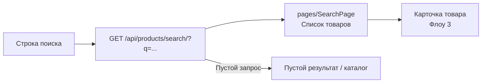
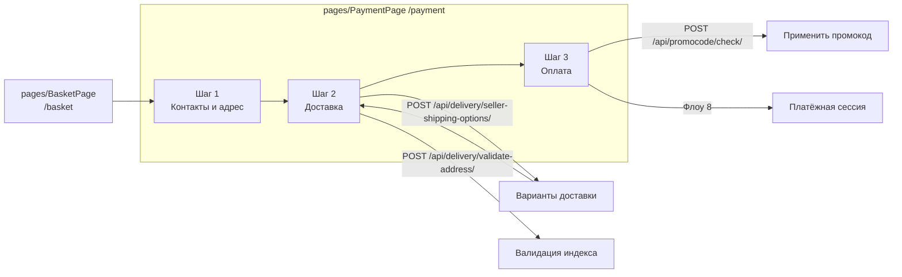
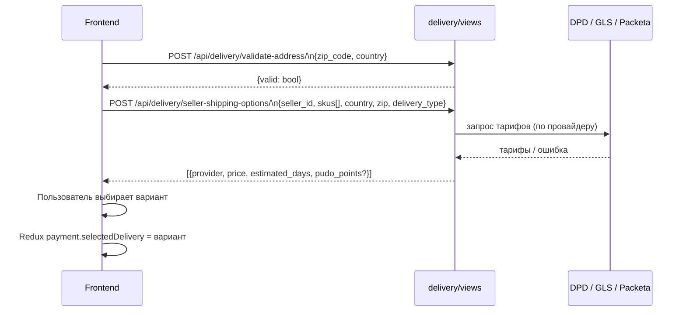
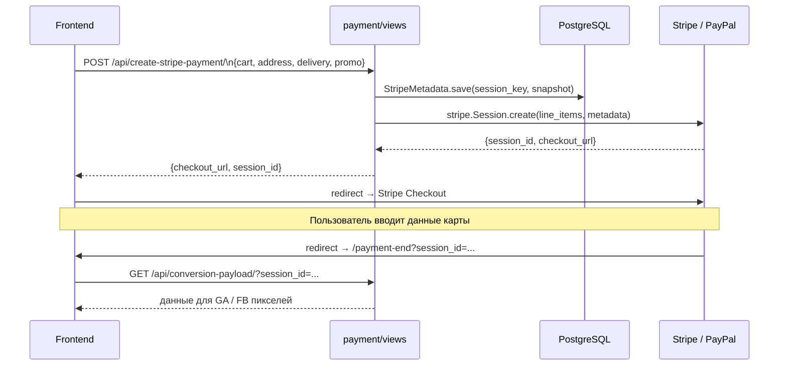
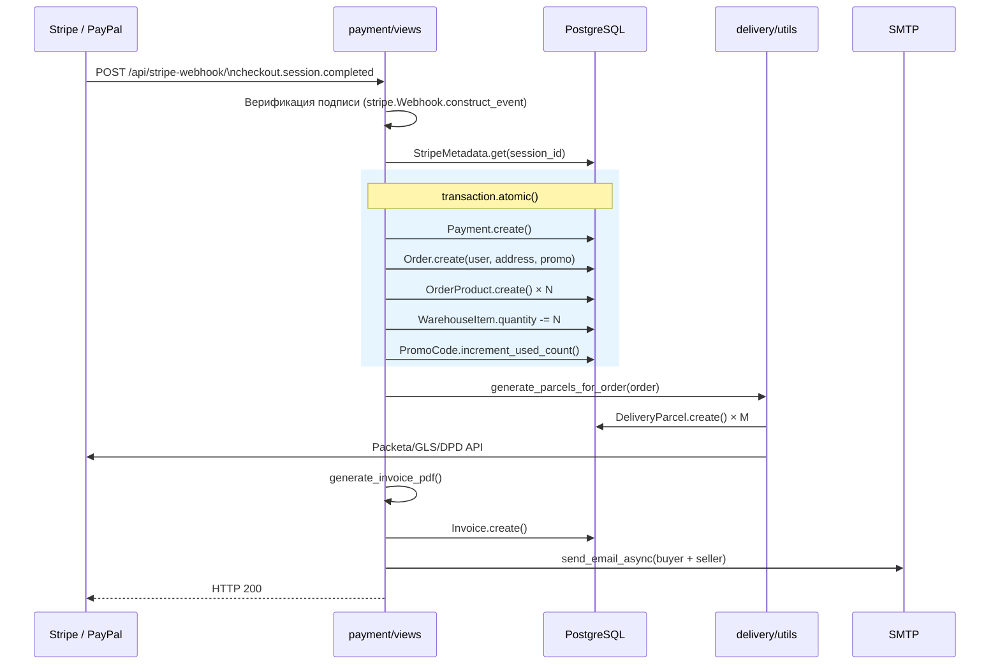
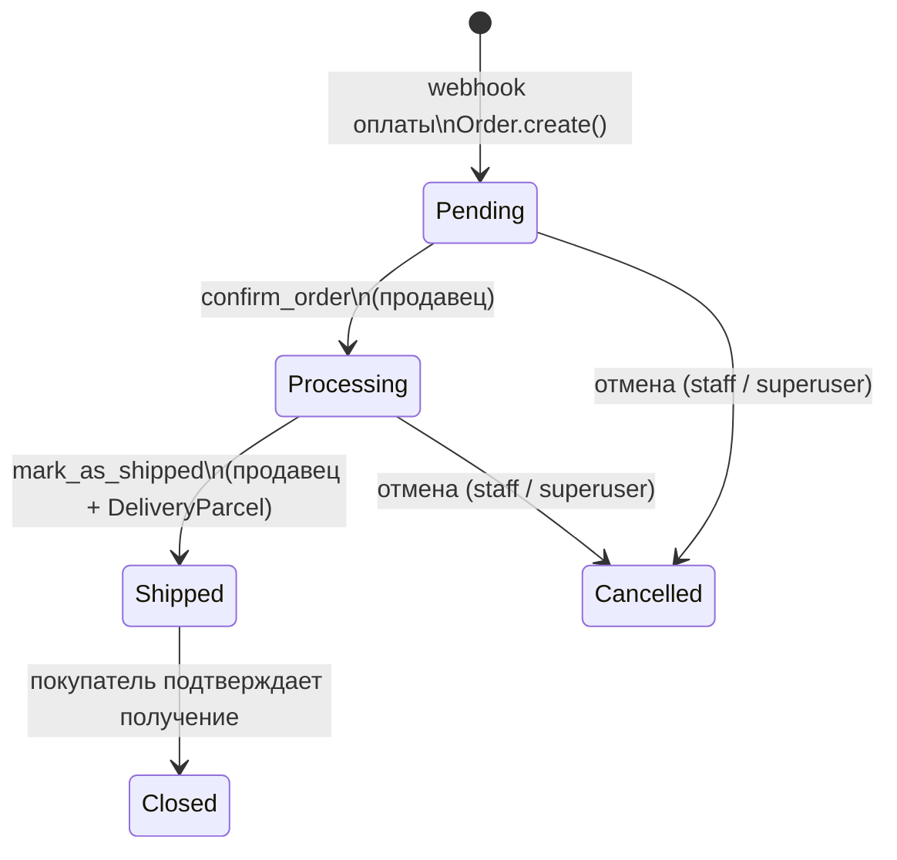
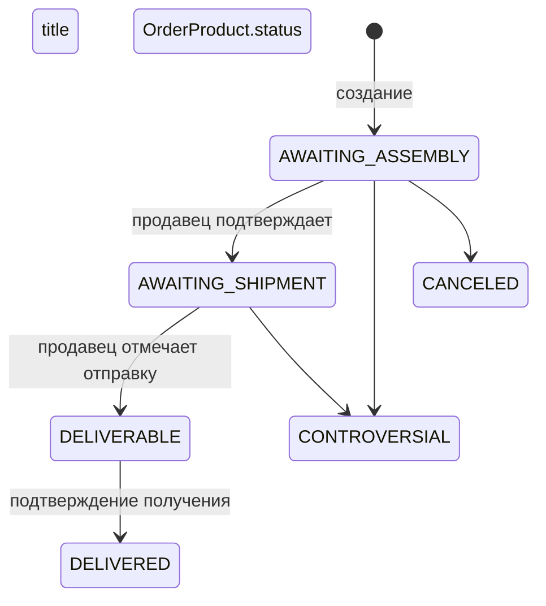
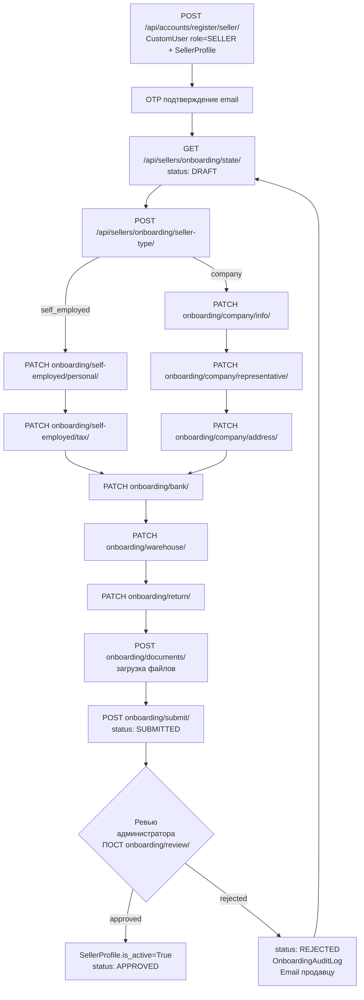
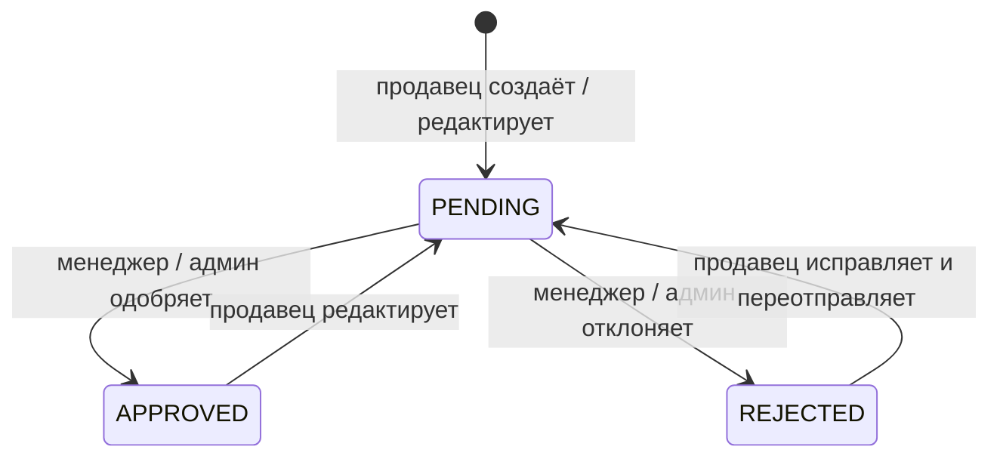

# 02. User Flows

> Основные пользовательские сценарии проекта на основе реального кода.
> Источники: `backend/accounts/`, `backend/product/`, `backend/payment/`, `backend/order/`,
> `backend/sellers/`, `backend/delivery/`, `backend/favorites/`, `backend/reviews/`.

---

## Содержание

1. [Регистрация и вход покупателя](#1-регистрация-и-вход-покупателя)
2. [Просмотр каталога](#2-просмотр-каталога)
3. [Карточка товара](#3-карточка-товара)
4. [Поиск](#4-поиск)
5. [Избранное](#5-избранное)
6. [Оформление заказа (Checkout)](#6-оформление-заказа-checkout)
7. [Выбор доставки](#7-выбор-доставки)
8. [Создание платёжной сессии](#8-создание-платёжной-сессии)
9. [Обработка payment webhook](#9-обработка-payment-webhook)
10. [Создание заказа](#10-создание-заказа)
11. [Регистрация и онбординг продавца](#11-регистрация-и-онбординг-продавца)
12. [Управление товарами и заказами продавца](#12-управление-товарами-и-заказами-продавца)
13. [Администрирование и модерация](#13-администрирование-и-модерация)

---

## 1. Регистрация и вход покупателя

### Цель пользователя
Получить аккаунт покупателя и JWT-пару для доступа к персонализированным функциям (корзина, заказы, избранное, отзывы).

### Шаги пользователя

**Регистрация по email:**
1. Открыть `/signup` или нажать «Зарегистрироваться».
2. Заполнить `email`, `password`, `first_name`, `last_name`.
3. Получить OTP на email и ввести код подтверждения.
4. После подтверждения — получить JWT и попасть в личный кабинет.

**Вход по email:**
1. Открыть `/login`.
2. Ввести `email` + `password` → получить `{access, refresh}`.

**Сброс пароля:**
1. Запросить OTP на email.
2. Проверить OTP.
3. Установить новый пароль.

**OAuth (Google / Facebook):**
1. Нажать кнопку → редирект на провайдера.
2. Получить ID token → передать на бэкенд → получить JWT.

```mermaid
flowchart TD
    A[Главная страница] --> B{Есть аккаунт?}
    B -- Нет --> C[POST /api/accounts/register/customer/]
    B -- Да --> D[POST /api/accounts/login/]
    B -- OAuth --> E[POST /api/accounts/auth/social/google/\nPOST /api/accounts/auth/social/facebook/]
    C --> OTP[POST /api/accounts/email/confirmation/\nввод OTP-кода]
    OTP --> JWT[JWT access + refresh\n→ localStorage['token']]
    D --> JWT
    E --> JWT
    JWT --> G[Личный кабинет]

    C -->|OTP не пришёл| RESEND[POST /api/accounts/email/otp/resend/]
    RESEND --> OTP

    subgraph Сброс пароля
        FP1[POST /api/accounts/password/reset/otp/send/]
        FP2[POST /api/accounts/check-otp-password-reset/]
        FP3[POST /api/accounts/password/reset/confirmation/]
        FP1 --> FP2 --> FP3
    end
```

### Frontend pages / components
| Элемент | Путь |
|---------|------|
| Страницы | `pages/SignUpPage`, `pages/EmailConfirmPage`, `pages/OtpConfirmPage`, `pages/MobLoginPage`, `pages/ChangePassPage` |
| Компоненты | `Components/Auth/` (Google/Facebook кнопки), `Components/MobAuth/` |
| API | `src/api/auth.js` |
| State | `localStorage['token']` → `{access, refresh}` |

### Backend endpoints / views
| Метод | URL | View |
|-------|-----|------|
| POST | `/api/accounts/register/customer/` | `CustomerRegistrationView` |
| POST | `/api/accounts/email/confirmation/` | `EmailConfirmationAPIView` |
| POST | `/api/accounts/email/otp/resend/` | `SendOTPForEmailVerificationAPIView` |
| POST | `/api/accounts/login/` | `CustomTokenObtainPairView` |
| POST | `/api/accounts/token/refresh/` | `TokenRefreshView` |
| POST | `/api/accounts/logout/` | `CustomLogoutView` |
| POST | `/api/accounts/auth/social/google/` | `GoogleLogin` |
| POST | `/api/accounts/auth/social/facebook/` | `FacebookLogin` |
| POST | `/api/accounts/password/reset/otp/send/` | `SendOTPForPasswordResetAPIView` |
| POST | `/api/accounts/check-otp-password-reset/` | `CheckingOTPPasswordResetAPIView` |
| POST | `/api/accounts/password/reset/confirmation/` | `PasswordResetConfirmationAPIView` |
| GET | `/api/accounts/profile/me/` | `UserProfileGetAPIView` |
| PATCH | `/api/accounts/profile/update/` | `UserProfileUpdateAPIView` |
| DELETE | `/api/accounts/deletion/me/` | `AccountDeletionAPIView` |

### Models involved
`CustomUser`, `OTP`

### Integrations
- Google OAuth (`allauth.socialaccount.providers.google`)
- Facebook OAuth (`allauth.socialaccount.providers.facebook`)
- SMTP — отправка OTP на email

### Возможные ошибки и edge cases
| Кейс | Описание |
|------|---------|
| Двойная регистрация | Email уже существует → 400 с сообщением об ошибке |
| OTP истёк | `OTP.expired_date < now()` → 400, нужно запросить повторно |
| OTP заблокирован | `attempts_count` превышен → `locked_until` → нельзя повторить до истечения блокировки |
| Logout с невалидным refresh | `CustomLogoutView` не обрабатывает `TokenError` → 500 (известный риск) |
| OAuth email конфликт | Если email от провайдера совпадает с существующим — поведение зависит от `allauth` настроек |
| Гонка при OTP | `create_and_send_otp` без `atomic()` — двойной запрос может создать два OTP |

### Что покрывать тестами
- Регистрация с валидными данными → 201, OTP отправлен
- Регистрация с дублирующим email → 400
- Подтверждение email с верным OTP → `email_confirmed = True`
- Подтверждение с неверным / истёкшим OTP → 400
- Вход с верными данными → JWT-пара в ответе
- Вход с неверным паролем → 401
- Refresh истёкшего токена → 401
- Logout с невалидным refresh → убедиться, что нет 500
- Сброс пароля: полный флоу OTP → новый пароль

---

## 2. Просмотр каталога

### Цель пользователя
Найти нужный товар через иерархию категорий с фильтрацией и сортировкой.

### Шаги пользователя
1. Открыть главную → выбрать категорию из дерева или перейти через навигацию.
2. На `CategoryPage` получить список товаров с пагинацией.
3. Применить фильтры (цена, характеристики) и сортировку.
4. Перейти на карточку интересующего товара.

```mermaid
flowchart LR
    HOME[Главная] --> CAT_TREE[GET /api/products/category/\nДерево категорий]
    CAT_TREE --> CAT_PAGE[pages/CategoryPage\n/category/:id]
    CAT_PAGE --> PRODUCTS[GET /api/products/categories/{category_id}/\n?filters&sort&page]
    PRODUCTS --> CARD[Карточка товара\nФлоу 3]
    PRODUCTS --> FILTER[Применить фильтры]
    FILTER --> PRODUCTS
```

### Frontend pages / components
| Элемент | Путь |
|---------|------|
| Страница | `pages/CategoryPage` |
| Компоненты | `Components/Catalog/` — карточки, фильтры, сортировка |
| API | `src/api/productsApi.js`, `src/api/categoryApi.js` |
| Redux | `products`, `category` |

### Backend endpoints / views
| Метод | URL | View |
|-------|-----|------|
| GET | `/api/products/category/` | `CategoryListView` |
| GET | `/api/products/categories/<category_id>/` | `CategoryBaseProductListView` |

### Models involved
`Category` (MPTT), `BaseProduct`, `ProductVariant`, `WarehouseItem`

### Integrations
- `django-mptt` — иерархия категорий
- Cloudinary — изображения товаров

### Возможные ошибки и edge cases
| Кейс | Описание |
|------|---------|
| Пустая категория | `[]` — показать заглушку «нет товаров» |
| Категория без подкатегорий | MPTT-запрос должен вернуть только листовые товары |
| Товары без вариантов | `BaseProduct` без `ProductVariant` — `min_price` будет `None` |
| Коэффициент 1.04 | Дублируется в 3 местах — риск рассинхронизации при изменении ставки эквайринга |

### Что покрывать тестами
- Список товаров категории → 200, правильная пагинация
- Фильтрация по цене — граничные значения
- Сортировка по цене и рейтингу — правильный порядок
- Только `APPROVED` товары попадают в выдачу
- Категория без товаров → пустой список, не 404

---

## 3. Карточка товара

### Цель пользователя
Изучить детали товара, выбрать вариант (цвет, размер), добавить в корзину.

### Шаги пользователя
1. Кликнуть по карточке в каталоге / результатах поиска.
2. Просмотреть галерею, описание, параметры.
3. Выбрать вариант (текстовый или image-тип).
4. Проверить наличие (`WarehouseItem.quantity_in_stock`).
5. Добавить в корзину (Redux, без запроса к бэкенду).
6. Опционально: прочитать отзывы, добавить в избранное.

```mermaid
flowchart TD
    LIST[Каталог / Поиск] --> DETAIL[GET /api/products/{id}/\nBaseProductDetailAPIView]
    DETAIL --> VARIANT[Выбор варианта\nProductVariant]
    VARIANT --> STOCK{quantity_in_stock > 0?}
    STOCK -- Да --> BASKET[Добавить в корзину\nRedux basket]
    STOCK -- Нет --> OUTOFSTOCK[«Нет в наличии»]
    DETAIL --> REVIEWS[GET /api/reviews/{product_id}/product/]
    DETAIL --> FAV[Добавить в избранное\nФлоу 5]
    BASKET --> CHECKOUT[Оформить заказ\nФлоу 6]
```

### Frontend pages / components
| Элемент | Путь |
|---------|------|
| Страница | `pages/ProductPage` |
| Компоненты | `Components/Product/` — галерея, варианты, параметры, отзывы |
| Redux | `basket` (добавление), `comment` (отзывы) |
| API | `src/api/productsApi.js`, `src/api/commentApi.js` |

### Backend endpoints / views
| Метод | URL | View |
|-------|-----|------|
| GET | `/api/products/<id>/` | `BaseProductDetailAPIView` |
| GET | `/api/reviews/<product_id>/product/` | `ProductReviewListAPIView` |

### Models involved
`BaseProduct`, `ProductVariant`, `ProductParameter`, `BaseProductImage`, `WarehouseItem`, `Review`, `ReviewMedia`

### Integrations
- Cloudinary — изображения

### Возможные ошибки и edge cases
| Кейс | Описание |
|------|---------|
| Товар не найден | 404 |
| Товар `PENDING` / `REJECTED` | Должен возвращать 404 или 403 для покупателей |
| Вариант без склада | `WarehouseItem` отсутствует → quantity = 0 |
| `can_review` | Требует авторизации; анонимный пользователь должен видеть `false` без 401 |
| Товар 18+ | `is_age_restricted = True` → требует подтверждения возраста |

### Что покрывать тестами
- Детальная страница существующего `APPROVED` товара → 200 с вариантами и параметрами
- Запрос несуществующего ID → 404
- `can_review = True` для покупателя с `Closed` заказом, содержащим вариант
- `can_review = False` для пользователя без заказа
- Список отзывов — правильная пагинация

---

## 4. Поиск

### Цель пользователя
Найти товары по ключевому слову.

### Шаги пользователя
1. Ввести запрос в поисковую строку.
2. Получить список релевантных товаров.
3. Перейти на карточку товара.



### Frontend pages / components
| Элемент | Путь |
|---------|------|
| Страница | `pages/SearchPage` |
| Компоненты | `Components/Catalog/` — карточки |
| API | `src/api/productsApi.js` → `getSearchProducts` |
| Redux | `products` |

### Backend endpoints / views
| Метод | URL | View |
|-------|-----|------|
| GET | `/api/products/search/` | `SearchView` |

**Query параметры:** `q` (строка поиска), опционально фильтры категории, пагинация.

### Models involved
`BaseProduct`, `ProductVariant`

### Integrations
Нет внешних — поиск через Django ORM (`icontains`).

### Возможные ошибки и edge cases
| Кейс | Описание |
|------|---------|
| Пустая строка | `getSearchProducts` вызывает `get("")` → возвращает HTML вместо JSON (известная ошибка фронтенда) |
| Спецсимволы в запросе | SQL-инъекция через ORM исключена, но XSS на стороне рендеринга нужно проверить |
| Нет результатов | Показать «ничего не найдено» — не 404 |
| Только `APPROVED` товары | Поисковый индекс не должен включать модерируемые товары |

### Что покрывать тестами
- Поиск по существующему слову → список непустой
- Поиск по несуществующему слову → пустой список, не ошибка
- Только `APPROVED` товары в результатах
- Пагинация работает корректно
- Специальные символы в запросе не вызывают 500

---

## 5. Избранное

### Цель пользователя
Сохранить понравившиеся товары для последующего просмотра или покупки.

### Шаги пользователя
1. На карточке товара нажать «В избранное» (toggle).
2. Перейти на `/liked` для просмотра всего списка.
3. Убрать из избранного — повторный toggle.

```mermaid
flowchart TD
    CARD[Карточка товара] --> TOGGLE[POST /api/favorites/toggle-favorite/{product_id}/]
    TOGGLE -->|added: true| HEART_ON[Иконка ❤ активна]
    TOGGLE -->|added: false| HEART_OFF[Иконка ❤ неактивна]
    LIKED[pages/LikedPage\n/liked] --> LIST[GET /api/favorites/products/\n?sort=...]
    LIST --> CARD2[Карточки товаров]
    CARD2 --> TOGGLE
```

### Frontend pages / components
| Элемент | Путь |
|---------|------|
| Страница | `pages/LikedPage` |
| Компоненты | `Components/Product/` (кнопка избранного) |
| API | `src/api/favorite.js` |
| Redux | `favorites` |

### Backend endpoints / views
| Метод | URL | View |
|-------|-----|------|
| POST | `/api/favorites/toggle-favorite/<product_id>/` | `ToggleFavoriteAPIView` |
| GET | `/api/favorites/products/` | `FavoriteProductListAPIView` |

### Models involved
`Favorite`, `BaseProduct`, `ProductVariant`

### Integrations
Нет внешних.

### Возможные ошибки и edge cases
| Кейс | Описание |
|------|---------|
| Анонимный пользователь | Требует авторизации → 401 |
| Дубль toggle | `unique_together (user, product)` — повторный POST удаляет запись |
| Коэффициент 1.04 в ответе | `FavoriteProductListAPIView` дублирует логику цены из `product` — риск рассинхронизации |
| Удалённый товар в избранном | `BaseProduct` удалён → `Favorite` с dangling FK |

### Что покрывать тестами
- Toggle для авторизованного пользователя → `{added: true}` при первом запросе
- Повторный toggle → `{added: false}`
- Список избранного → содержит добавленные товары
- Запрос от анонима → 401
- Корректная цена с коэффициентом в списке

---

## 6. Оформление заказа (Checkout)

### Цель пользователя
Оформить покупку: заполнить контакты, выбрать доставку, применить промокод и перейти к оплате.

### Шаги пользователя
1. Открыть корзину `/basket` — просмотреть состав, изменить количество.
2. Перейти на `/payment` — шаг 1: ввести имя, email, телефон, адрес.
3. Шаг 2: выбрать способ доставки (PUDO / Home Delivery).
4. Опционально: применить промокод.
5. Шаг 3: выбрать провайдер оплаты (Stripe / PayPal) и создать сессию.



### Frontend pages / components
| Элемент | Путь |
|---------|------|
| Страницы | `pages/BasketPage`, `pages/PaymentPage` |
| Компоненты | `Components/Basket/`, `Components/Payment/PaymentContentBlock/`, `Components/Payment/PaymentDeliveryBlock/`, `Components/Payment/PaymentPlataBlock/` |
| Delivery widgets | `Components/Payment/Delivery/` — DPD, Packeta, GLS, CountrySelect |
| Redux | `basket` (redux-persist), `payment` (`pageSection`) |
| API | `src/api/payment.js` |

### Backend endpoints / views
| Метод | URL | View |
|-------|-----|------|
| POST | `/api/delivery/seller-shipping-options/` | `SellerShippingOptionsView` |
| POST | `/api/delivery/validate-address/` | `ValidateAddressView` |

### Models involved
Корзина — только Redux (нет модели на бэкенде). `ShippingRate`, `PromoCode`.

### Integrations
- Packeta / MyGLS / DPD — расчёт вариантов доставки

### Возможные ошибки и edge cases
| Кейс | Описание |
|------|---------|
| Корзина пуста | Кнопка «Оформить» должна быть неактивна |
| Потеря localStorage | Корзина исчезает — нет серверного хранилища корзины |
| Невалидный индекс | `validate-address` → `{valid: false}` → блокировать переход дальше |
| Промокод сломан | `promocode/signal.py` падает при сохранении `PromoCode` — Stripe Coupon sync неработоспособен |
| Перезагрузка на `/payment` | `pageSection` из Redux persist восстанавливается, но данные формы могут быть неполными |
| Товар закончился | Между добавлением в корзину и оплатой `quantity_in_stock` могло обнулиться |

### Что покрывать тестами
- Расчёт вариантов доставки: корректная цена по тарифам `ShippingRate`
- Валидация ZIP-кода: валидный CZ индекс → `{valid: true}`, невалидный → `{valid: false}`
- Применение промокода: скидка рассчитывается правильно
- Просроченный / уже использованный промокод → ошибка
- Страна, не поддерживаемая провайдером доставки → нет вариантов, не 500

---

## 7. Выбор доставки

### Цель пользователя
Получить список доступных вариантов доставки с ценами и выбрать удобный.

### Шаги пользователя
1. На шаге 2 чекаута ввести страну и почтовый индекс.
2. Получить список вариантов (PUDO / Home Delivery) от провайдеров.
3. Выбрать вариант (опционально — выбрать ПВЗ на карте Packeta/GLS/DPD).
4. Вариант сохраняется в Redux `payment` для передачи в платёжную сессию.



### Frontend pages / components
| Элемент | Путь |
|---------|------|
| Компоненты | `Components/Payment/Delivery/` — виджеты DPD, Packeta, GLS |
| Компоненты | `Components/Payment/CountrySelect/` |
| Redux | `payment` |
| API | `src/api/payment.js` → `calculateDelivery`, `getIsValidZipCode` |

### Backend endpoints / views
| Метод | URL | View |
|-------|-----|------|
| POST | `/api/delivery/seller-shipping-options/` | `SellerShippingOptionsView` |
| POST | `/api/delivery/validate-address/` | `ValidateAddressView` |

### Models involved
`ShippingRate`, `DeliveryParcel`, `DeliveryAddress`

### Integrations
- **Packeta** — расчёт тарифов, список ПВЗ
- **MyGLS** — расчёт тарифов (SOAP/HTTP)
- **DPD** — NST API
- **CNB** — курсы валют (опционально, для топливного сбора GLS)

### Возможные ошибки и edge cases
| Кейс | Описание |
|------|---------|
| Провайдер недоступен | Timeout → показать доступные варианты остальных провайдеров |
| Страна не обслуживается | Нет `ShippingRate` → пустой список вариантов |
| `format_zip` только CZ/SK | Для других стран индекс может быть неверно отформатирован |
| Dev-эндпоинты в продакшне | `/api/delivery/dev/*` доступны без ограничений |
| Вес корзины превышает тариф | `ShippingRate.max_weight` → должен фильтровать неподходящие тарифы |

### Что покрывать тестами
- Расчёт доставки с известным тарифом → правильная цена
- Валидация CZ индекса: `10000` → valid, `000` → invalid
- Провайдер возвращает ошибку → остальные варианты всё равно показываются
- Запрос с неизвестной страной → пустой список, не 500
- Тариф по весу: корзина 5 кг → фильтруются только тарифы с `max_weight >= 5`

---

## 8. Создание платёжной сессии

### Цель пользователя
Инициировать оплату через Stripe или PayPal и перейти на страницу провайдера.

### Шаги пользователя
1. Выбрать «Оплатить через Stripe» или «Оплатить через PayPal».
2. Бэкенд сохраняет снимок корзины в `StripeMetadata` / `PayPalMetadata`.
3. Получить `checkout_url` (Stripe) или `approval_url` (PayPal).
4. Браузер редиректит на страницу провайдера.
5. После оплаты — редирект обратно на `/payment-end`.



### Frontend pages / components
| Элемент | Путь |
|---------|------|
| Страница | `pages/PaymentEnd` |
| Компоненты | `Components/Payment/PaymentPlataBlock/` — кнопки Stripe / PayPal |
| API | `src/api/payment.js` → `createStripeSession`, `createPayPalSession`, `getDataFromSessionId` |
| Redux | `payment` |

### Backend endpoints / views
| Метод | URL | View |
|-------|-----|------|
| POST | `/api/create-stripe-payment/` | `CreateStripePaymentView` |
| POST | `/api/create-paypal-payment/` | `CreatePayPalPaymentView` |
| GET | `/api/conversion-payload/` | `ConversionPayloadView` |

### Models involved
`StripeMetadata`, `PayPalMetadata`, `PromoCode`

### Integrations
- **Stripe** — Checkout Session API
- **PayPal** — Orders API v2

### Возможные ошибки и edge cases
| Кейс | Описание |
|------|---------|
| Stripe недоступен | API-ошибка → 503 с сообщением пользователю |
| Промокод недействителен | Скидка не применяется, сессия создаётся по полной цене |
| Пользователь закрыл вкладку | Сессия висит в Stripe, заказ не создаётся (webhook не придёт) |
| Двойное нажатие | Две сессии на одну корзину — без idempotency key возможно создание двух заказов |
| Snapshot устарел | `StripeMetadata` хранит снимок — если цена изменилась, несоответствие |
| Возврат без оплаты | Пользователь нажал «назад» — сессия не завершена, `payment-end` должен обработать |

### Что покрывать тестами
- Создание Stripe сессии с полными данными → 200, `checkout_url` в ответе
- `StripeMetadata` сохранён с корректным снимком корзины
- Создание PayPal сессии → 200, `approval_url` в ответе
- Запрос с пустой корзиной → 400
- `ConversionPayloadView` с валидным `session_id` → данные для пикселей

---

## 9. Обработка payment webhook

### Цель пользователя (системный сценарий)
После успешной оплаты автоматически создать заказ, сгенерировать посылки, инвойс и отправить email-уведомления.

### Шаги (автоматически, без участия пользователя)
1. Stripe / PayPal отправляет webhook на бэкенд.
2. Верификация подписи webhook.
3. Извлечение `StripeMetadata` / `PayPalMetadata` по `session_id`.
4. Создание `Payment`, `Order`, `OrderProduct[]` в атомарной транзакции.
5. Списание промокода (`increment_used_count`).
6. `generate_parcels_for_order(order)` — создание `DeliveryParcel[]` + этикетки.
7. `generate_invoice_pdf()` → `Invoice`.
8. `send_email_async()` — покупателю + продавцу.



### Frontend pages / components
| Элемент | Путь |
|---------|------|
| Страница успеха | `pages/PaymentEnd` |
| API | `src/api/payment.js` → `getDataFromSessionId` |

### Backend endpoints / views
| Метод | URL | View |
|-------|-----|------|
| POST | `/api/stripe-webhook/` | `StripeWebhookView` |
| POST | `/api/paypal-webhook/` | `PayPalWebhookView` |

### Models involved
`Payment`, `StripeMetadata`, `PayPalMetadata`, `Order`, `OrderProduct`, `DeliveryParcel`, `Invoice`, `InvoiceSequence`, `PromoCode`, `WarehouseItem`

### Integrations
- **Stripe** — webhook signature verification
- **PayPal** — webhook verification
- **Packeta / MyGLS / DPD** — создание отправлений
- **reportlab** — генерация PDF инвойса
- **SMTP** — email-уведомления

### Возможные ошибки и edge cases
| Кейс | Описание |
|------|---------|
| **Дублирование webhook** | Stripe может доставить событие дважды — нет idempotency check (`Payment.objects.get_or_create`) → двойной заказ |
| Неверная подпись | `stripe.error.SignatureVerificationError` → 400 |
| `StripeMetadata` не найдена | Сессия без снимка → заказ не создастся |
| Ошибка генерации посылок | Если DPD/Packeta недоступны — посылка не создаётся, тихая ошибка (нет retry) |
| Ошибка PDF | `generate_invoice_pdf()` бросает исключение → откат транзакции? Заказ тоже откатится |
| Товар закончился | `WarehouseItem.quantity` упало в 0 между сессией и webhook |
| Промокод уже использован | Race condition при параллельных webhook |

### Что покрывать тестами
- Корректный webhook → создаётся ровно один `Order` + `Payment`
- Дублирующийся webhook (тот же `session_id`) → второй заказ не создаётся
- Неверная подпись webhook → 400, заказ не создан
- Webhook с несуществующим `session_id` → логируется, не 500
- Промокод списывается ровно один раз
- `WarehouseItem.quantity` уменьшается на количество купленных позиций

---

## 10. Создание заказа

### Цель пользователя
Получить подтверждённый заказ после успешной оплаты.

> Создание заказа — часть webhook-обработки (Флоу 9). Отдельного endpoint инициации нет;
> покупатель видит результат на `/payment-end` и в email.

### Жизненный цикл заказа





### Frontend pages / components
| Элемент | Путь |
|---------|------|
| Страница успеха | `pages/PaymentEnd` |
| Заказы покупателя | `pages/MyOrdersPage` |
| API | `src/api/orders.js` |
| Redux | `orders` |

### Backend endpoints / views
| Метод | URL | View |
|-------|-----|------|
| GET | `/api/orders/` | `OrderListView` |
| GET | `/api/orders/<pk>/` | `OrderDetailView` |

### Models involved
`Order`, `OrderProduct`, `OrderEvent`, `DeliveryParcel`, `Invoice`, `CourierService`, `DeliveryType`, `OrderStatus`

### Integrations
- Создаётся в рамках `StripeWebhookView` / `PayPalWebhookView`
- `DeliveryParcel` → Packeta / GLS / DPD

### Возможные ошибки и edge cases
| Кейс | Описание |
|------|---------|
| Статусы как raw-строки | `OrderStatus.name` без `TextChoices` — опечатка в коде не поймается |
| `datetime.now()` без timezone | `OrderProduct.received_at` — timezone-naive при UTC-окружении |
| `getDetalOrders?pk=16` | Хардкод PK в `src/api/orders.js` — известная ошибка фронтенда |
| Фильтр с пробелом | `?status=not_closed ` — пробел ломает фильтрацию |

### Что покрывать тестами
- Список заказов покупателя → только его заказы, не чужие
- Фильтр `?status=closed` → только закрытые
- Детальная страница заказа → все позиции присутствуют
- Авторизация: анонимный запрос → 401
- Другой пользователь не видит чужой заказ → 403 / 404

---

## 11. Регистрация и онбординг продавца

### Цель пользователя
Пройти верификацию и получить статус активного продавца для размещения товаров.

### Шаги пользователя

**Регистрация:**
1. `POST /api/accounts/register/seller/` → создаётся `CustomUser` с ролью `SELLER` + `SellerProfile`.
2. Подтверждение email через OTP (аналогично Флоу 1).

**Онбординг (многошаговая заявка):**
1. `GET /api/sellers/onboarding/state/` — получить текущий статус и заполненность шагов.
2. `POST /api/sellers/onboarding/seller-type/` — выбрать тип (`self_employed` / `company`).
3. Заполнить шаги данных в зависимости от типа.
4. `PATCH /api/sellers/onboarding/bank/` — банковские реквизиты.
5. `PATCH /api/sellers/onboarding/warehouse/` + `return/` — адреса.
6. `POST /api/sellers/onboarding/documents/` — загрузка документов.
7. `POST /api/sellers/onboarding/submit/` — отправить на ревью.
8. Ожидание решения администратора.



### Frontend pages / components
| Элемент | Путь |
|---------|------|
| Страницы | `/seller/seller-type`, `/seller/create-account`, `/seller/application-sub` |
| Страницы данных | `/seller/seller-info`, `/seller/seller-company`, `/seller/seller-review`, `/seller/seller-review-company` |
| Статус | `/seller/finish-verification`, `/seller/action-required`, `/seller/under-review` |
| Компоненты | `Components/Seller/` (onboarding-шаги) |
| Redux | `selfEmploed` |
| API | `src/api/seller/onboarding.js`, `src/api/seller/getOnboardingData.js` |

### Backend endpoints / views
| Метод | URL | View |
|-------|-----|------|
| GET | `/api/sellers/onboarding/state/` | `SellerOnboardingStateAPIView` |
| POST | `/api/sellers/onboarding/seller-type/` | `SellerSetSellerTypeAPIView` |
| GET/PATCH | `/api/sellers/onboarding/self-employed/personal/` | `SellerSelfEmployedPersonalAPIView` |
| GET/PATCH | `/api/sellers/onboarding/self-employed/tax/` | `SellerSelfEmployedTaxAPIView` |
| GET/PATCH | `/api/sellers/onboarding/self-employed/address/` | `SellerSelfEmployedAddressAPIView` |
| GET/PATCH | `/api/sellers/onboarding/company/info/` | `SellerCompanyInfoAPIView` |
| GET/PATCH | `/api/sellers/onboarding/company/representative/` | `SellerCompanyRepresentativeAPIView` |
| GET/PATCH | `/api/sellers/onboarding/company/address/` | `SellerCompanyAddressAPIView` |
| GET/PATCH | `/api/sellers/onboarding/bank/` | `SellerBankAccountAPIView` |
| GET/PATCH | `/api/sellers/onboarding/warehouse/` | `SellerWarehouseAddressAPIView` |
| GET/PATCH | `/api/sellers/onboarding/return/` | `SellerReturnAddressAPIView` |
| POST | `/api/sellers/onboarding/documents/` | `SellerDocumentUploadAPIView` |
| POST | `/api/sellers/onboarding/submit/` | `SellerOnboardingSubmitAPIView` |
| POST | `/api/sellers/onboarding/review/` | `SellerOnboardingReviewAPIView` (admin) |

### Models involved
`CustomUser`, `SellerProfile`, `SellerOnboardingApplication`, `SellerSelfEmployedPersonalDetails`, `SellerSelfEmployedTaxInfo`, `SellerSelfEmployedAddress`, `SellerCompanyInfo`, `SellerCompanyRepresentative`, `SellerCompanyAddress`, `SellerBankAccount`, `SellerWarehouseAddress`, `SellerReturnAddress`, `SellerDocument`, `OnboardingAuditLog`

**Статусы заявки:** `DRAFT` → `SUBMITTED` → `PENDING_VERIFICATION` → `APPROVED` / `REJECTED`

### Integrations
Только внутренняя логика и SMTP email-уведомления.

### Возможные ошибки и edge cases
| Кейс | Описание |
|------|---------|
| Submit без заполненных шагов | Валидация completeness перед переходом в `SUBMITTED` |
| Повторная подача после `REJECTED` | Статус должен сброситься в `DRAFT`, старые данные доступны для редактирования |
| Страна-специфичные правила | CZ/SK vs другие страны — логика захардкожена в нескольких местах `views_onboarding.py` |
| `onbordingStatus.js` | POST на `/accounts/password/reset/confirmation/` с пустым телом вместо проверки статуса — явная ошибка фронтенда |
| Нет push-уведомлений | Продавец не знает об изменении статуса без захода в кабинет |
| Загрузка недопустимого файла | `SellerDocument` — нужна валидация типа и размера файла |

### Что покрывать тестами
- Регистрация продавца → `SellerProfile` создан, роль `SELLER`
- Установка типа `self_employed` → доступны шаги SE, недоступны company-шаги
- Заполнение каждого шага PATCH → 200, данные сохранены, `OnboardingAuditLog` создан
- Submit без обязательных данных → 400
- Submit с полными данными → `status: SUBMITTED`
- Approve администратором → `SellerProfile.is_active = True`, email отправлен
- Reject → `status: REJECTED`, `OnboardingAuditLog` с причиной

---

## 12. Управление товарами и заказами продавца

### Цель пользователя
Размещать и редактировать товары, обрабатывать входящие заказы, экспортировать этикетки и отчёты.

### Шаги — управление товарами
1. Открыть `/seller/goods-list` — список своих товаров.
2. Нажать «Создать» → многошаговый wizard (категория → описание → параметры → варианты → изображения).
3. Сохранить черновик → отправить на модерацию.
4. Редактирование: изменить вариант → товар снова уходит в `PENDING`.

### Шаги — управление заказами
1. Открыть `/seller/seller-orders` — входящие заказы.
2. Фильтровать по статусу, дате, курьерской службе.
3. Подтвердить заказ (`confirm`) → статус `Processing`.
4. Отметить как отправленный (`mark-shipped`) → `DeliveryParcel` + трек.
5. Скачать этикетки (ZIP) или экспортировать CSV.

```mermaid
flowchart TD
    subgraph Товары
        GL[GET /api/sellers/my-products/] --> CREATE[POST /api/sellers/products/]
        CREATE --> PARAM[POST /api/sellers/products/{id}/parameters/]
        PARAM --> VARIANT[POST /api/sellers/products/{id}/variants/]
        VARIANT --> IMAGE[POST /api/sellers/products/{id}/images/]
        IMAGE --> MODERATE{Модерация\nstatus: PENDING}
        MODERATE -- approved --> LIVE[Товар в каталоге]
        MODERATE -- rejected --> EDIT[PATCH /api/sellers/products/{id}/\nисправить]
        EDIT --> MODERATE
    end

    subgraph Заказы
        OL[GET /api/sellers/orders/] --> OD[GET /api/sellers/orders/{pk}/]
        OD --> CONFIRM[POST /api/sellers/orders/{pk}/confirm/]
        CONFIRM --> SHIP[POST /api/sellers/orders/{pk}/mark-shipped/]
        SHIP --> LABEL[GET /api/sellers/orders/{order_id}/labels/]
        OL --> CSV[GET /api/sellers/orders/export/]
        OL --> BULKLABEL[POST /api/sellers/orders/labels/]
    end
```

### Frontend pages / components
| Элемент | Путь |
|---------|------|
| Страницы товаров | `/seller/seller-home`, `/seller/goods-list`, `/seller/seller-create`, `/seller/seller-edit/:id` |
| Страницы заказов | `/seller/seller-orders`, `/seller/seller-order-detal/:id` |
| Компоненты | `Components/Seller/goods/`, `create/`, `edit/`, `newOrder/`, `orderDetal/` |
| Аналитика | `Components/sellerAnalytics/` |
| Redux | `seller_goods`, `newOrder`, `warehouse`, `seller_statics`, `create`, `craetePrev`, `edit_goods` |
| API | `src/api/seller/orders.js`, `src/api/seller/goods.js` |

### Backend endpoints / views
**Товары (prefix `/api/sellers/`):**
| Метод | URL | View |
|-------|-----|------|
| GET | `my-products/` | `SellerProductListView` |
| GET/POST | `products/` | `BaseProductViewSet` |
| GET/PATCH/DELETE | `products/<id>/` | `BaseProductViewSet` |
| GET/POST | `products/<id>/parameters/` | `ProductParameterViewSet` |
| GET/POST | `products/<id>/variants/` | `ProductVariantViewSet` |
| GET/POST | `products/<id>/images/` | `BaseProductImageViewSet` |
| GET | `statistics/sales/` | `SellerSalesStatisticsView` |

**Заказы (prefix `/api/sellers/orders/`):**
| Метод | URL | View |
|-------|-----|------|
| GET | `` | `SellerOrderListView` |
| GET | `<pk>/` | `SellerOrderDetailView` |
| POST | `<pk>/confirm/` | `SellerOrderConfirmView` |
| POST | `<pk>/mark-shipped/` | `SellerOrderMarkShippedView` |
| POST | `<pk>/cancel/` | `SellerOrderCancelView` |
| GET | `<order_id>/labels/` | `SellerOrderLabelsView` |
| POST | `labels/` | `SellerBulkOrderLabelsView` |
| GET | `<order_id>/export/` | `SellerOrderExportCSVView` |
| GET | `export/` | `SellerBulkOrdersExportCSVView` |

### Models involved
`SellerProfile`, `BaseProduct`, `ProductVariant`, `ProductParameter`, `BaseProductImage`, `LicenseFile`, `WarehouseItem`, `Order`, `OrderProduct`, `OrderEvent`, `DeliveryParcel`

### Integrations
- **Cloudinary** — загрузка изображений товаров
- **DPD / MyGLS / Packeta** — генерация этикеток

### Возможные ошибки и edge cases
| Кейс | Описание |
|------|---------|
| Нет `ProtectedRoute` на фронтенде | Страницы `/seller/*` доступны без проверки авторизации |
| Нет транзакции при создании товара | `BaseProduct` + `ProductVariant` + `Image` не атомарно |
| Отмена заказа | Доступна только staff/superuser — рядовой продавец не может отменить |
| `mark-shipped` без `DeliveryParcel` | Должна быть валидация наличия посылки перед сменой статуса |
| Имена складов захардкожены | `"Vendor warehouse"` / `"Reli warehouse"` в analytics → `DoesNotExist` при переименовании |
| Редактирование `APPROVED` товара | Статус сбрасывается в `PENDING` — товар пропадает из каталога |

### Что покрывать тестами
- Создание товара с вариантами → `BaseProduct` + `ProductVariant` созданы, статус `PENDING`
- Создание товара не-продавцом → 403
- Просмотр заказов → только заказы данного продавца
- Confirm → статус `Processing`, `OrderEvent` создан
- Mark-shipped без `DeliveryParcel` → 400
- Mark-shipped с `DeliveryParcel` → статус `Shipped`
- Экспорт CSV → корректный файл с заголовками
- Экспорт этикеток → ZIP с PDF

---

## 13. Администрирование и модерация

### Цель пользователя (роль Admin / Manager)
Модерировать товары продавцов, управлять онбордингом, просматривать заказы и управлять справочниками.

### Шаги — модерация товаров
1. Открыть Django Admin → раздел `BaseProduct`, фильтр `status=PENDING`.
2. Просмотреть товар, изображения, варианты.
3. Установить `status = APPROVED` → товар появляется в каталоге.
4. Или `status = REJECTED` → продавцу уходит уведомление, может исправить.

### Шаги — ревью онбординга
1. `POST /api/sellers/onboarding/review/` — принять решение по заявке.
2. Входные данные: `{application_id, decision: "approved"|"rejected", comment}`.
3. При approve: `SellerProfile.is_active = True`, `status: APPROVED`.
4. При reject: `status: REJECTED`, `OnboardingAuditLog` с комментарием, email продавцу.

### Шаги — управление справочниками
- `CourierService`, `DeliveryType`, `OrderStatus` — через Django Admin.
- Баннеры: `GET/POST /api/banner/`.
- Новости и вакансии: `/api/news/`, `/api/vacancies/`.

```mermaid
flowchart TD
    subgraph Модерация товаров
        ADM_P[Django Admin\nBaseProduct list\nstatus=PENDING] --> VIEW_P[Просмотр товара]
        VIEW_P --> APPROVE_P[status=APPROVED\nТовар в каталоге]
        VIEW_P --> REJECT_P[status=REJECTED\nEmail продавцу]
        REJECT_P --> SELLER_FIX[Продавец исправляет\n→ PENDING снова]
        SELLER_FIX --> ADM_P
    end

    subgraph Онбординг
        ADM_O[POST /api/sellers/onboarding/review/\nSellerOnboardingReviewAPIView] --> APPROVE_O[APPROVED\nSellerProfile.is_active=True]
        ADM_O --> REJECT_O[REJECTED\nOnboardingAuditLog\nEmail продавцу]
    end

    subgraph Заказы
        ADM_ORD[Django Admin / API\nOrderListView] --> CANCEL[POST /api/sellers/orders/{pk}/cancel/\nТолько staff]
    end
```

### Frontend pages / components
Администраторский UI — только Django Admin (нет отдельного фронтенд-интерфейса для модерации).

### Backend endpoints / views
| Метод | URL | Описание |
|-------|-----|---------|
| POST | `/api/sellers/onboarding/review/` | Approve / Reject онбординга |
| POST | `/api/sellers/orders/<pk>/cancel/` | Отмена заказа (только staff) |
| `admin/` | Django Admin | Модерация `BaseProduct`, управление справочниками |

### Models involved
`BaseProduct`, `SellerOnboardingApplication`, `SellerProfile`, `OnboardingAuditLog`, `Order`, `OrderProduct`, `CourierService`, `DeliveryType`, `OrderStatus`, `CustomUser`

**Жизненный цикл модерации продукта:**


### Integrations
- SMTP — email уведомления при изменении статуса онбординга

### Возможные ошибки и edge cases
| Кейс | Описание |
|------|---------|
| Approve без проверки данных | Неполная заявка может быть одобрена через API (нет server-side validation completeness) |
| Отмена заказа — только staff | Рядовой менеджер с ролью `MANAGER` может не иметь прав |
| Нет уведомления о новом PENDING товаре | Администратор не получает push/email при появлении нового товара на модерацию |
| `OnboardingAuditLog` без комментария | Reject без обязательного комментария — продавец не знает причины |
| Статусы как raw-строки | `OrderStatus.name` — без `TextChoices` опечатка не отловится на уровне ORM |

### Что покрывать тестами
- Approve онбординга → `SellerProfile.is_active = True`, статус `APPROVED`, лог создан
- Reject онбординга → статус `REJECTED`, лог с комментарием, email отправлен
- Approve онбординга не-администратором → 403
- Approve товара → `BaseProduct.status = APPROVED`, товар виден в каталоге
- Reject товара → товар не виден в каталоге
- Отмена заказа staff-пользователем → статус `Cancelled`
- Отмена заказа продавцом (не staff) → 403
