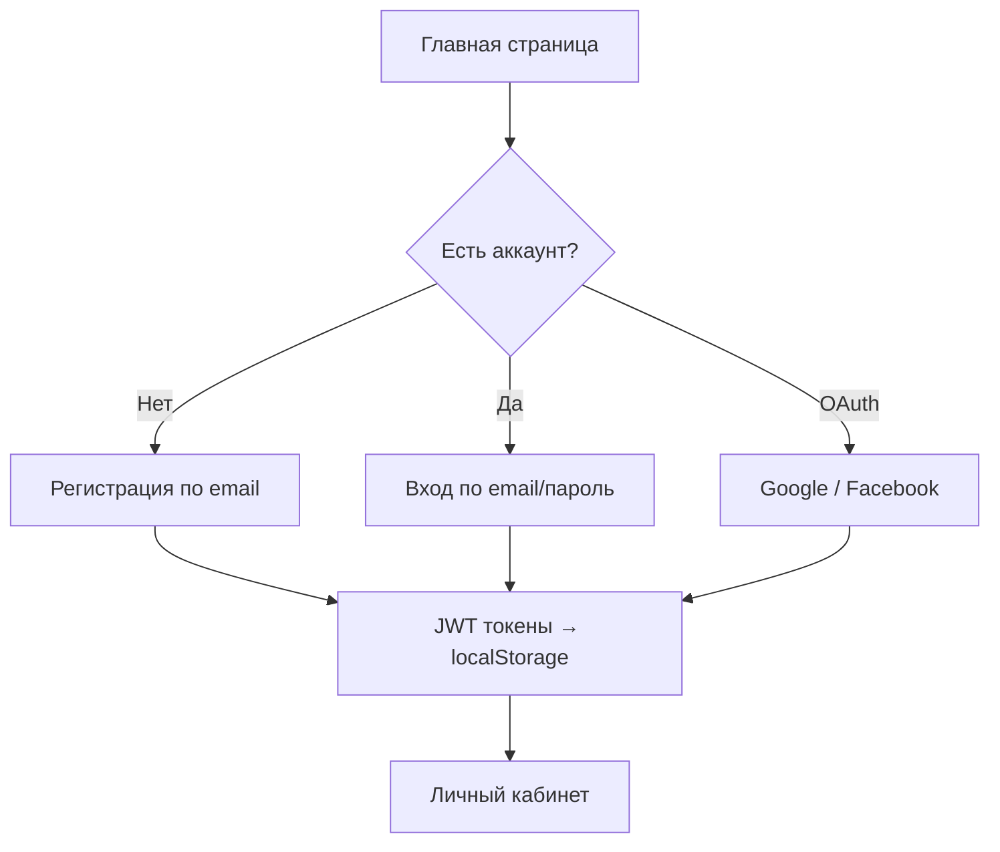
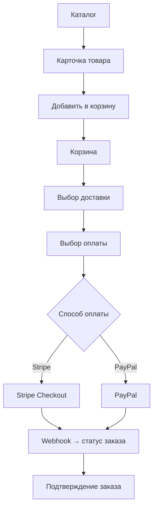
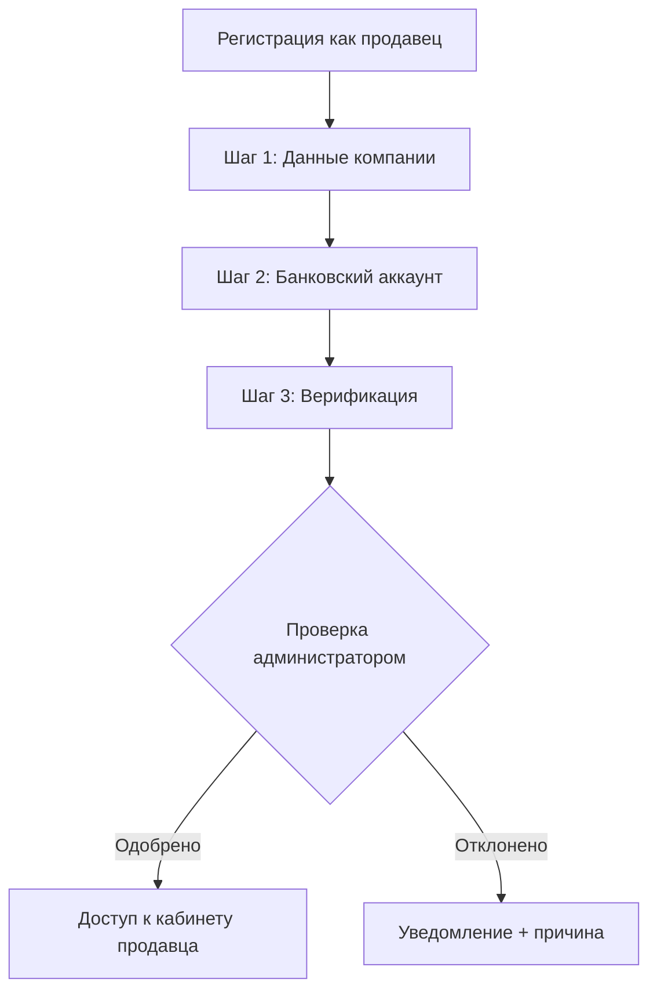

# 02. User Flows

> TODO: Для каждого флоу — описать шаги, участников и граничные случаи.
> Диаграммы — Mermaid.

## Флоу 1 — Регистрация и вход покупателя

> TODO: Уточнить — токены в куках или localStorage? OTP при регистрации?

---

## Флоу 2 — Оформление заказа (покупатель)

> TODO: Уточнить флоу промокода — на каком шаге применяется.
> TODO: Что происходит при неуспешной оплате.

---

## Флоу 3 — Онбординг продавца

> TODO: Описать шаги онбординга подробнее, особенности для разных стран (CZ/SK/другие).

---

## Флоу 4 — Управление заказом (продавец)

> TODO

---

## Флоу 5 — Возврат товара

> TODO

---

## Флоу 6 — Администратор: управление каталогом и пользователями

> TODO
