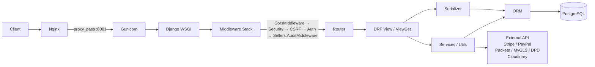
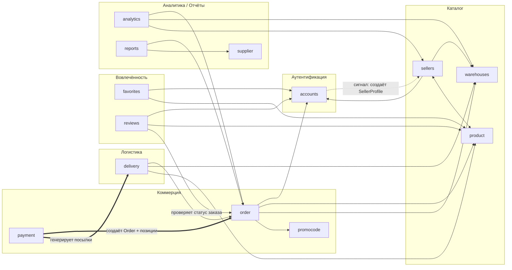
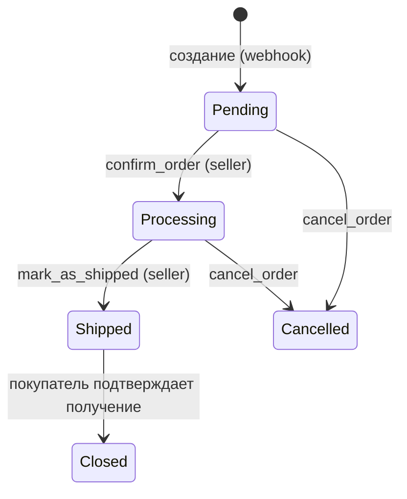
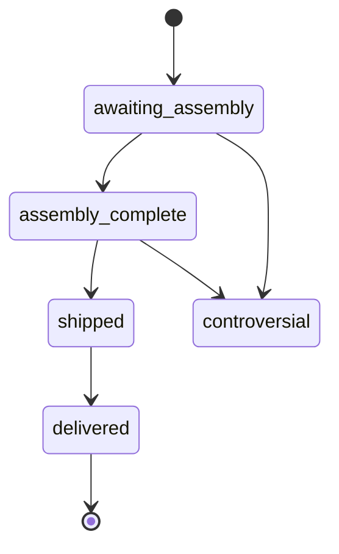
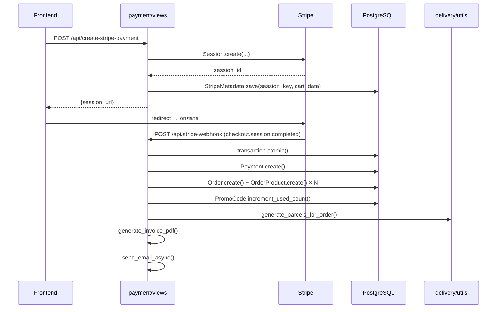
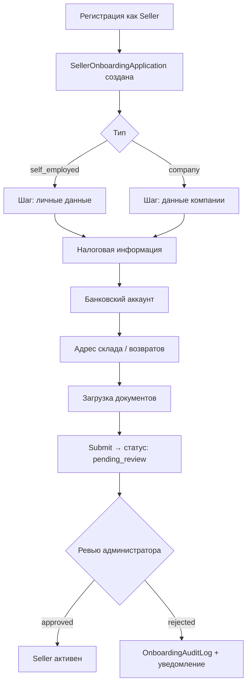

# 03. Backend Architecture

## Обзор

Django 5.1 / DRF. Gunicorn 4 workers, 0.0.0.0:8081. PostgreSQL 17.

```
backend/
├── backend/               # settings, urls, wsgi
├── accounts/              # аутентификация, пользователи
├── product/               # каталог, категории, варианты
├── order/                 # заказы, покупатель и продавец
├── payment/               # Stripe, PayPal, webhooks, создание заказа
├── delivery/              # Packeta, MyGLS, DPD, посылки
├── sellers/               # кабинет продавца, онбординг
├── favorites/             # избранное
├── reviews/               # отзывы
├── promocode/             # промокоды, Stripe Coupon sync
├── analytics/             # статистика по складам для продавца
├── reports/               # отчёты для поставщиков (PDF/HTML)
├── warehouses/            # склады, остатки по вариантам
├── banners/               # баннеры
├── news/                  # новости
├── vacancies/             # вакансии
├── contactform/           # форма обратной связи
├── supplier/              # поставщики
└── fixtures/
```

**Общий объём:** ~17 600 строк Python кода.

---

## Request lifecycle



---

## Зависимости между приложениями



**Обозначения:**
- `-->` обычная зависимость (импорт модели / сериализатора)
- `==>` оркестрация (payment создаёт order и delivery-посылки в рамках webhook)
- `-.->` сигнал Django (post_save)
- `<-->` взаимная зависимость (product ↔ sellers)

---

## Приложения

---

### accounts

**Назначение:** регистрация, аутентификация, профили, OTP, OAuth (Google, Facebook).

#### Модели

| Модель | Ключевые поля |
|--------|--------------|
| `CustomUser` | `email` (unique), `phone_number` (unique, nullable), `role` (`UserRole`: Admin / Manager / Customer / Seller), `image`, `phone_number_confirmed`, `email_confirmed` |
| `OTP` | FK `CustomUser`, `title`, `value`, `expired_date`, `attempts_count`, `locked_until`, `sent_at` |

`CustomUser.save()` — `transaction.atomic`, синхронизация с Django `Group` по роли.

#### Views

| View | Метод | Описание |
|------|-------|----------|
| `CustomerRegistrationView` | POST | Регистрация покупателя |
| `SellerRegistrationView` | POST | Регистрация продавца |
| `SendEmailOTPView` | POST | Отправка OTP на email |
| `VerifyEmailView` | POST | Подтверждение email |
| `LoginView` | POST | JWT login |
| `LogoutView` | POST | Блэклист refresh-токена |
| `UserProfileView` | GET / PATCH / DELETE | Профиль пользователя |
| `GoogleLogin` / `FacebookLogin` | POST | OAuth |
| `PasswordResetOTPView` / `ConfirmPasswordResetView` | POST | Сброс пароля через OTP |

**Объём:** `views.py` — ~1 109 строк.

#### Serializers

| Serializer | Назначение |
|------------|-----------|
| `UserRegistrationSerializer` | Регистрация с валидацией пароля |
| `OTPSerializer` | Проверка OTP-кода |
| `PasswordResetSerializer` | Сброс пароля |
| `TokenPairSerializer` | JWT-пара с полем `role` |
| `UserProfileSerializer` | Чтение/обновление профиля |

#### Бизнес-логика

Распределена между `views.py` (логика OTP-блокировок, retry) и `utils.py` (`create_and_send_otp`). Сервисного слоя нет.

#### Риски

- `CustomLogoutView` вызывает `RefreshToken(refresh_token)` без `try/except` → при невалидном токене вернёт 500 вместо 400.
- Сигнал `assign_default_role` проверяет `not instance.role`, но у модели есть `default=UserRole.CUSTOMER` — условие никогда не выполняется, ветка мёртвая.
- Транзакции отсутствуют в OTP-views, хотя `create_and_send_otp` делает `update_or_create`.

---

### product

**Назначение:** каталог товаров, категории, варианты, модерация, изображения.

#### Модели

| Модель | Ключевые поля |
|--------|--------------|
| `Category` | MPTT: `parent`, `image` |
| `BaseProduct` | FK `Category`, FK `SellerProfile`, `status` (pending/approved/rejected), `approved_by` (Manager/Admin), `rating`, `total_reviews`, `vat_rate`, `is_age_restricted`, `is_active` |
| `ProductParameter` | FK `BaseProduct`, key/value |
| `BaseProductImage` | FK `BaseProduct`, автоконвертация в WebP при save |
| `ProductVariant` | FK `BaseProduct`, `sku` (автогенерация), цена, габариты, вес, text vs image variant |
| `LicenseFile` | OneToOne `BaseProduct` |

#### Views

| View | Описание |
|------|----------|
| `SearchView` | Полнотекстовый поиск по продуктам |
| `CategoryListView` | Дерево категорий |
| `CategoryBaseProductListView` | Листинг с фильтрами, сортировкой, пагинацией |
| `BaseProductDetailAPIView` | Детальная карточка |

Видимость: публичные — только `approved + active`; staff/manager/admin — все статусы.

#### Serializers

| Serializer | Назначение |
|------------|-----------|
| `BaseProductListSerializer` | Листинг (переиспользуется в favorites) |
| `BaseProductDetailSerializer` | Карточка + `get_can_review` |
| `CategorySerializer` | Дерево категорий |
| `ProductVariantSerializer` | Вариант с ценой и остатком |

#### Риски

- Дублирование `apply_ordering` в двух view-классах.
- Нет явных транзакций.
- Коэффициент 1.04 (эквайринг) дублируется в product, favorites, вариантах — риск расхождения при изменении ставки.

---

### order

**Назначение:** корзина, заказы покупателей, управление заказами продавцом.

#### Модели

| Модель | Ключевые поля |
|--------|--------------|
| `Order` | FK `CustomUser`, FK `Payment`, FK `PromoCode`, FK `DeliveryAddress`, суммы, `pickup_point_id`, `delivery_cost`, `courier_service`, статус заказа и доставки |
| `OrderProduct` | FK `Order`, FK `ProductVariant`, `quantity`, `status` (awaiting_assembly … controversial), `received`, `seller_profile`, `warehouse`, `product_price`, `received_at` |
| `Invoice` | OneToOne `Payment`, PDF-файл, номера |
| `OrderEvent` | FK `Order`, тип события, `created_by` |
| `InvoiceSequence` | Атомарная генерация номеров инвойсов |

**Жизненный цикл заказа:**


**Жизненный цикл позиции заказа (OrderProduct):**


#### Views

**Покупатель:** `OrderListView`, `OrderDetailView` — только аутентифицированный владелец.

**Продавец** (`seller_views.py`, ~746 строк): список/деталка с фильтрами, confirm/ship/cancel, экспорт этикеток/ZIP/CSV — делегирует в сервисы.

#### Serializers

| Serializer | Назначение |
|------------|-----------|
| `OrderSerializer` | Заказ для покупателя |
| `OrderProductSerializer` | Позиция заказа |
| `SellerOrderSerializer` | Заказ для кабинета продавца |
| `SellerOrderListSerializer` | Список заказов продавца с фильтрами |

#### Бизнес-логика

Правильно вынесена в `order/services/`:
- `seller_order_actions.py` — confirm/ship/cancel с `select_for_update` + `transaction.atomic`
- `invoice_numbers.py` — атомарная нумерация
- экспорт, этикетки — отдельные модули

#### Риски

- `OrderProduct.save` использует `datetime.now()` вместо `timezone.now()` — проблема с timezone-aware окружением.
- Имена статусов (`'Closed'`, `'Pending'` и т.д.) хранятся как строки в БД без `TextChoices`-защиты в ряде мест — хрупко при опечатке.
- `reviews.permissions.CanCreateReview` проверяет статус `'Closed'` — строковая завязка на конкретное значение OrderStatus.

---

### payment

**Назначение:** платёжные сессии, обработка webhook Stripe/PayPal, создание заказа после оплаты, инвойсы, email-уведомления, генерация посылок.

**⚠ Центральная точка оркестрации всего post-payment flow.**

#### Модели

| Модель | Ключевые поля |
|--------|--------------|
| `Payment` | `provider` (stripe/paypal), `session_id`, `payment_intent_id`, `amount`, `currency`, `email` |
| `StripeMetadata` | JSON-снимок сессии по `session_key` |
| `PayPalMetadata` | JSON-снимок PayPal ордера |

#### Views

| View | Размер / Назначение |
|------|---------------------|
| `CreateStripePaymentView` | Создание Checkout Session, сохранение метаданных |
| `StripeWebhookView` | Обработка `checkout.session.completed` / `payment_intent.*` |
| `CreatePayPalPaymentView` | Создание PayPal Order |
| `PayPalWebhookView` | Обработка `CHECKOUT.ORDER.APPROVED` и пр. |
| `ConversionPayloadView` | Данные для пикселей аналитики |
| `PaymentSessionValidator` | Валидация статуса сессии |

**Объём `views.py`: ~2 198 строк** — крупнейший файл в проекте.

#### Serializers

| Serializer | Назначение |
|------------|-----------|
| `DeliveryAddressSerializer` | Адрес доставки (вложен в payment) |
| `CartGroupSerializer` | Группировка корзины по продавцам |
| `StripeSessionInputSerializer` | Входные данные для создания Stripe-сессии |
| `StripeSessionOutputSerializer` | Ответ с `checkout_url` |

#### Post-payment flow (Stripe)



#### Риски

- **Idempotency**: при повторной доставке webhook события (`checkout.session.completed`) нет явной проверки уникальности `session_id` перед созданием `Payment` — риск двойного заказа. Нужен `get_or_create` по `session_id`.
- **Размер `views.py`**: 2 198 строк — создание Order, генерация посылок, PDF, email — всё в одном файле.
- `services.py` используется для email-контента, но основная логика создания Order остаётся во views.

---

### delivery

**Назначение:** расчёт стоимости доставки, создание посылок, интеграция с Packeta / MyGLS / DPD.

#### Модели

| Модель | Ключевые поля |
|--------|--------------|
| `DeliveryAddress` | FK `CustomUser`, страна, город, адрес, индекс |
| `DeliveryParcel` | FK `Order`, провайдер, tracking number, label URL |
| `DeliveryParcelItem` | FK `DeliveryParcel`, FK `OrderProduct` |
| `ShippingRate` | FK `CourierService`, country, channel (PUDO/HD), category, price, weight_limit; `unique_together` |

#### Views

| View | Описание |
|------|----------|
| `SellerShippingOptionsView` | POST: расчёт опций доставки для корзины продавца |
| `ValidateAddressView` | Валидация адреса доставки |

**Объём `delivery/utils.py`:** ~662 строк — `generate_parcels_for_order` с `@transaction.atomic`.

#### Serializers

| Serializer | Назначение |
|------------|-----------|
| `ShippingOptionsRequestSerializer` | Запрос расчёта доставки (seller + SKU) |
| `ShippingOptionsResponseSerializer` | Варианты доставки с ценой |
| `AddressValidationSerializer` | Валидация адреса / индекса |

#### Провайдеры

```
delivery/
├── providers/
│   ├── dpd/      — DPD NST API
│   └── mygls/    — MyGLS HTTP/SOAP
├── services/
│   ├── packeta/  — Packeta API
│   ├── rates/    — загрузка тарифов
│   └── split/    — разбивка посылок
```

#### Риски

- `delivery/api/dev_views.py` — dev-эндпоинты для MyGLS/DPD, доступные в продакшн-конфигурации.
- `delivery/utils.py` перегружен — оркестрирует логику разбивки, создания посылок, вызовы провайдеров.

---

### sellers

**Назначение:** кабинет продавца (управление товарами, статистика продаж), многошаговый онбординг.

#### Модели

| Модель | Описание |
|--------|----------|
| `SellerProfile` | OneToOne `CustomUser`, `managers` M2M, `default_warehouse`, `warehouses` M2M |
| `SellerLegalInfo` | Юридические данные |
| `SellerOnboardingApplication` | Заявка, статус, тип (`self_employed` / `company`) |
| `SellerDocument` | Загруженные документы к заявке |
| `SellerBankAccount` | Банковские реквизиты |
| `SellerWarehouseAddress` / `SellerReturnAddress` | Адреса |
| Блоки онбординга | `SellerPersonalInfo`, `SellerTaxInfo`, `SellerCompanyInfo`, `SellerCompanyAddress`, `SellerCompanyRepInfo` |
| `OnboardingAuditLog` | Лог событий онбординга |

#### Views

| Файл | Строк | Описание |
|------|------:|---------|
| `views.py` | ~1 154 | ViewSets: товары/параметры/картинки/варианты/лицензии, статистика продаж |
| `views_onboarding.py` | ~1 940 | Пошаговые PATCH-эндпоинты всех секций онбординга, загрузка документов, submit/review |

**Объём `services_onboarding.py`:** ~732 строк.

#### Serializers

| Serializer | Назначение |
|------------|-----------|
| `SellerProductSerializer` | Товар в кабинете продавца |
| `SellerProductVariantSerializer` | Вариант товара продавца |
| `OnboardingApplicationSerializer` | Статус и тип заявки |
| `SellerPersonalInfoSerializer` | Личные данные (self-employed) |
| `SellerCompanyInfoSerializer` | Данные компании |
| `SellerBankAccountSerializer` | Банковские реквизиты |

#### Онбординг flow



#### Риски

- `views_onboarding.py` (~1 940 строк) — монолитный файл с многочисленными условными ветками по типу заявки.
- Особые правила для разных стран (CZ/SK vs другие) захардкожены в нескольких местах views.

---

### favorites

**Назначение:** добавление/удаление товаров из избранного.

#### Модели

| Модель | Поля |
|--------|------|
| `Favorite` | FK `CustomUser`, FK `BaseProduct`, `added_at`; `unique_together` |

#### Views

- `ToggleFavoriteAPIView` — POST: toggle
- `FavoriteProductListAPIView` — GET: список с сортировками

Переиспользует `BaseProductListSerializer` из `product`.

#### Риски

- Логика отображения цены (коэффициент 1.04) дублируется из `product` — риск расхождения при изменении.

---

### reviews

**Назначение:** отзывы покупателей на товары с медиа-вложениями.

#### Модели

| Модель | Поля |
|--------|------|
| `Review` | FK `CustomUser` (author), FK `ProductVariant`, `content`, `rating` (1–5, optional), `date` |
| `ReviewMedia` | FK `Review`, `file`, `type` (image/video) |

#### Views

- Список отзывов по `product_id`
- Создание отзыва (multipart)

#### Permissions

`CanCreateReview` — проверяет:
1. Пользователь купил товар (`OrderProduct` с нужным вариантом)
2. Статус заказа = `'Closed'`
3. Отзыв ещё не оставлен

#### Риски

- Статус `'Closed'` — строковая константа в `permissions.py` без ссылки на `TextChoices`. Несоответствие с именами статусов в seller flow.
- Проверка "можно ли оставить отзыв" дублируется в `CanCreateReview` и в `BaseProductDetailSerializer.get_can_review`.

---

### promocode

**Назначение:** промокоды со скидкой, синхронизация с Stripe Coupons.

#### Модели

| Модель | Поля |
|--------|------|
| `PromoCode` | `code` (unique), `discount` %, `valid_from/to`, `max_usage`, `used_count` |

#### Статус: черновик / нерабочий

| Проблема | Описание |
|----------|----------|
| `PromoCode.clean()` | Вызывает `PromoCode.ValidationError` — такого класса нет, нужен `django.core.exceptions.ValidationError` |
| `signal.py` | При `post_save` обращается к `instance.duration_in_months` — поля нет в модели → `AttributeError` при первом сохранении PromoCode |
| `signal.py` | Использует `settings.STRIPE_SECRET_KEY_TEST` — в `settings.py` такой переменной нет (есть `STRIPE_API_SECRET_KEY`) → `AttributeError` |
| `views.py` | `add_stripe_coupons` не имеет `return` после создания купона; `print` в production-коде |
| Идемпотентность | Нет проверки на существование Stripe Coupon перед созданием — дублирование |

---

### analytics

**Назначение:** статистика заказов по складам для продавца.

- `models.py` — пустой.
- `WarehouseOrdersStatsView` — агрегация `OrderProduct` по складам через `services.py`.
- Имена складов `"Vendor warehouse"` и `"Reli warehouse"` захардкожены в сервисе.

#### Риски

- `Warehouse.objects.get(name="...")` → `DoesNotExist` при переименовании склада в БД.
- Broad `except Exception` в view → все ошибки возвращают 500 JSON без различения типов.

---

### reports

**Назначение:** HTML-отчёт прибыли для поставщика.

- `models.py` — пустой.
- `generate_report` — одна Django view-функция (~вся бизнес-логика внутри).
- Не DRF: возвращает `render(request, template)`, остальной проект — JSON API.
- Нет обработки `Supplier.DoesNotExist`.

---

### warehouses

**Назначение:** склады и остатки по вариантам товаров.

#### Модели

| Модель | Поля |
|--------|------|
| `Warehouse` | Адрес, контакты, `pickup_by_courier` |
| `WarehouseItem` | FK `Warehouse`, FK `ProductVariant`, `quantity`; `unique_together` |

- REST API отсутствует (`views.py` — заглушка, `urls.py` — пустой).
- `services.py`: `decrease_stock` — без `transaction.atomic` и `select_for_update`.

#### Риски

- **Race condition**: `decrease_stock` читает и обновляет `quantity` без блокировки → при параллельных заказах возможен уход в минус.

---

## Транзакции: сводная карта

| Место | `transaction.atomic` | `select_for_update` | Проблема |
|-------|:--------------------:|:-------------------:|---------|
| `CustomUser.save()` | ✅ | — | — |
| `payment/views.py` (webhook) | ✅ | — | Нет idempotency по `session_id` |
| `order/services/seller_order_actions.py` | ✅ | ✅ | — |
| `order/services/invoice_numbers.py` | ✅ | — | — |
| `delivery/utils.generate_parcels_for_order` | ✅ | — | — |
| `sellers/views.py` и `services_onboarding.py` | ✅ | — | — |
| `warehouses/services.decrease_stock` | ❌ | ❌ | **Race condition при параллельных заказах** |
| `accounts` OTP-views | ❌ | — | `update_or_create` без атомарности |
| `product` views | ❌ | — | Нет мутирующих операций в публичных views |
| `promocode` signal | ❌ | — | Сигнал падает до транзакции |

---

## Где находится бизнес-логика

| App | views | models | services | signals | utils |
|-----|:-----:|:------:|:--------:|:-------:|:-----:|
| accounts | ✓ | ✓ | — | ✓ | ✓ |
| product | ✓ | ✓ | — | ✓ | — |
| order | — | ✓ | ✓ | — | — |
| **payment** | **✓✓** | — | частично | — | — |
| delivery | частично | — | ✓ | ✓ | ✓ |
| **sellers** | **✓✓** | ✓ | ✓ | — | — |
| favorites | — | — | — | — | — |
| reviews | — | — | — | — | — |
| promocode | ✓ | ✓ | — | ✓ | — |
| analytics | частично | — | ✓ | — | — |
| reports | ✓✓ | — | — | — | — |
| warehouses | — | — | ✓ | — | — |

---

## Архитектурно рискованные файлы

| Файл | Строк | Риск |
|------|------:|------|
| `payment/views.py` | ~2 198 | Оркестрирует создание Order + посылок + PDF + email — нет разделения ответственности |
| `sellers/views_onboarding.py` | ~1 940 | Монолит онбординга; много ветвлений по типу/стране |
| `sellers/views.py` | ~1 154 | Смешение CRUD и бизнес-валидаций |
| `accounts/views.py` | ~1 109 | OTP-логика, блокировки, OAuth — всё в одном |
| `delivery/utils.py` | ~662 | Атомарная генерация посылок + оркестрация провайдеров |
| `sellers/services_onboarding.py` | ~732 | Сложная логика онбординга — уже вынесена, но объёмна |
| `promocode/signal.py` | ~30 | **Гарантированно падает** при сохранении PromoCode |

---

## Сводка проблем

### Критические (поломан функционал)

1. **`promocode` сломан**: сигнал упадёт при любом сохранении `PromoCode` (`AttributeError: duration_in_months`, `AttributeError: settings.STRIPE_SECRET_KEY_TEST`).
2. **`warehouses.decrease_stock`** без `select_for_update` — race condition при параллельных заказах.

### Высокий приоритет

3. **Idempotency webhook Stripe**: нет `get_or_create` по `session_id` → риск дублирования заказа при повторной доставке события.
4. **Статусы заказа как raw strings**: `'Closed'`, `'Pending'` без единого `TextChoices` — опечатка в любом месте сломает логику незаметно.
5. **`CustomLogoutView`** без `try/except` → 500 при невалидном refresh-токене.

### Средний приоритет

6. **`payment/views.py`** слишком большой — нарушает single responsibility.
7. **`sellers/views_onboarding.py`** слишком большой — сложно тестировать.
8. **Дублирование коэффициента 1.04** в product / favorites / variants.
9. **`analytics`**: хардкод имён складов → хрупкость к данным.
10. **`OrderProduct.save`**: `datetime.now()` вместо `timezone.now()`.
11. **`reports`**: не DRF, `Supplier.DoesNotExist` не обработан.
12. **`delivery/api/dev_views.py`**: dev-эндпоинты доступны в проде.

### Дублирование логики

| Дубль | Где |
|-------|-----|
| Проверка "можно оставить отзыв" | `reviews/permissions.py` + `product/serializers.py` |
| Коэффициент 1.04 (цена с эквайрингом) | `product/`, `favorites/`, `ProductVariant` |
| `apply_ordering` | Два view-класса в `product/views.py` |
