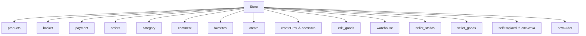
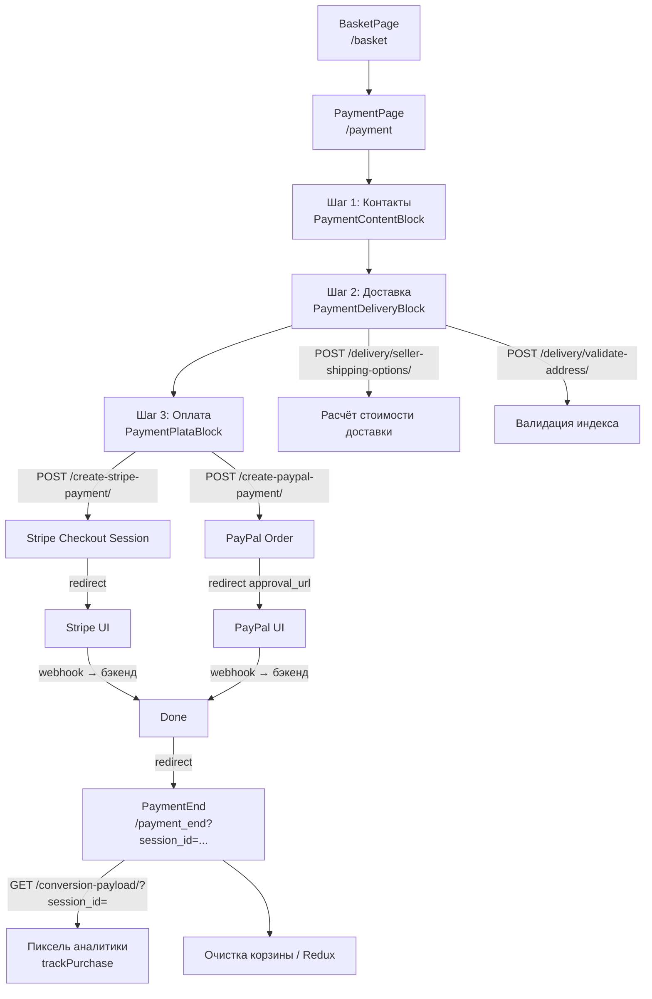
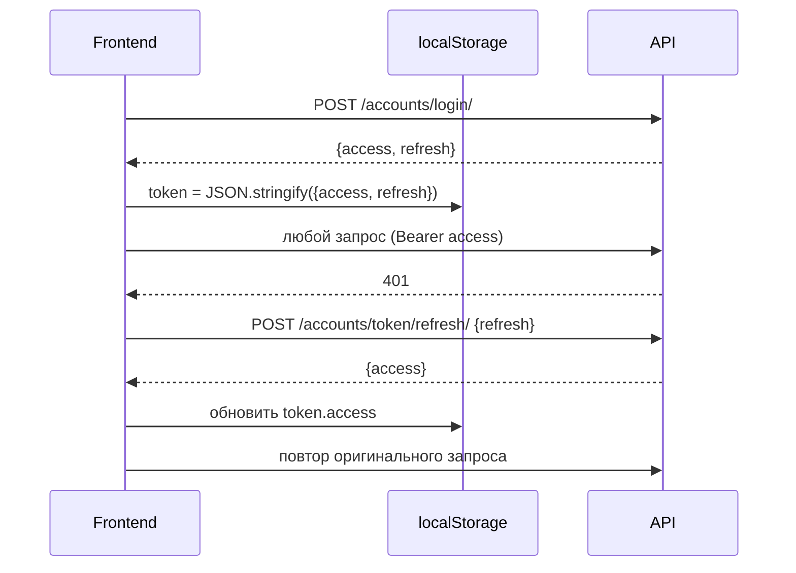

# 04. Frontend Architecture

## Состав фронтендов

| | **Frontend2** | **Frontend3** |
|---|---|---|
| `package.json` name | `new-10k-landing` | `frontend3` |
| Назначение | Маркетинговый лендинг | Основной маркетплейс |
| Файлов в src | ~248 | ~828 |
| Роутинг | React Router **7** | React Router **6** |
| Стейт | Нет (React local) | Redux Toolkit + redux-persist |
| UI | MUI 6 + Tailwind 3 + SCSS | MUI 5 + SCSS |
| HTTP | Axios, 1 метод | Axios + interceptors + axios-retry |
| URL сервера | `https://reli.one` | `https://reli.one` |

**Вывод: Frontend3 — основной продукт.** Frontend2 — отдельный лендинг под `info.reli.one`.

---

## Frontend2 — Лендинг

### Назначение
Маркетинговые страницы: о сервисе, для продавцов, контакты, условия, политики, тарифы. Нет авторизации, нет корзины.

### Маршруты

| Path | Страница |
|------|---------|
| `/` | Главная (секции в `App.jsx`) |
| `/for-sell` | Для продавцов |
| `/about` | О нас |
| `/contact` | Контакты |
| `/pricing-commission` | Тарифы и комиссии |
| `/terms` | Условия использования |
| `/policy` | Политика конфиденциальности |
| `/new-term` | Обновлённые условия |

### API
Единственный вызов: `POST /contact/message/` — форма обратной связи.

**Проблема:** в обработчике после успешной отправки — `console.log(res)`.

### Компоненты Frontend2

```
src/components/
├── Header/, Header_menu/, Portal_menu/
├── Footer/                          # FooterMain, footerLinks, footerPaymentMethods, StayUpdated
├── BannerNew/, BannerSlider/
├── Cards/, NewsCard/, VacanciesCard/, OpennedNewsCard/
├── AskedQuestions/Accordion/
├── WhyChoose/                       # OurBenefits, StartSelling, Benefits
├── HowItWorks/Steps/
├── sellingIsEasy/steps/
├── ForSeller/, GetInTouch/, SupportBlocks/
├── TransperentPricing/, CategoryAndRateTable/
├── changeLang/                      # i18n переключатель
├── ScrollToTop/
├── WhatsAppManager/                 # плавающая кнопка WhatsApp
├── messengBtns/
└── Container/
```

### Интернационализация (i18n)

- Оба фронтенда: `i18next` + `react-i18next`.
- Frontend2: `changeLang/` компонент, переводы в `public/locales/` или inline-объектах.
- Frontend3: `ChangeLang/` компонент в основном и seller-layout.
- Языки: TODO — уточнить (чешский / словацкий / английский?).

### Риски Frontend2
- React Router v7 при RR v6 во Frontend3 — разная семантика API роутера.
- Нет `.env` — `BaseURL` захардкожен как во Frontend3.

---

## Frontend3 — Основной маркетплейс

### Структура src

```
src/
├── api/              # Axios-методы по доменам
├── analytics/        # Трекинг событий (trackPurchase и др.)
├── code/
│   └── test.js       # ⚠ Закомментированные PII и session_id
├── Components/       # ~290 файлов, все UI-компоненты
│   ├── Auth/
│   ├── Basket/
│   ├── Catalog/
│   ├── Payment/      # Delivery, CountrySelect, виджеты DPD/Packeta/GLS
│   ├── Product/
│   ├── Seller/       # auth, create, edit, orders, onboarding...
│   ├── sellerAnalytics/
│   └── ...
├── pages/            # 48 страниц-обёрток
├── redux/            # Store + 15 слайсов
└── ui/               # Переиспользуемые примитивы
```

### Маршруты покупателя

| Path | Страница |
|------|---------|
| `/` | `HomePage` |
| `/search` | `SearchPage` |
| `/product/:id` | `ProductPage` |
| `/product_category/:id` | `CategoryPage` |
| `/basket` | `BasketPage` |
| `/payment` | `PaymentPage` |
| `/payment_end` | `PaymentEnd` (завершение оплаты) |
| `/liked` | `LikedPage` (избранное) |
| `/my_orders` | `MyOrdersPage` |
| `/sign_up` | `SignUpPage` |
| `/email_conf` | `EmailConfirmPage` |
| `/otp_conf` | `OtpConfirmPage` |
| `/change_pass` | `ChangePassPage` |
| `/terms`, `/new-term` | `TermsPage`, `NewTermsPage` |
| `/privacy-policy`, `/cookie-policy` | Политики |
| `/claim`, `/withdrawal` | Рекламация, возврат |
| `/contact`, `/contact-return` | Контакты |
| `/for_sell`, `/for-sell-new` | Страницы для продавцов |
| `/for_buy` | Страница для покупателей |
| `/products-seller/:id` | `SellerIdPage` |

### Маршруты продавца `/seller/...`

| Path | Назначение |
|------|-----------|
| `login` / `reset` / `verify-email` / `create-password` | Вход / сброс пароля |
| `seller-type` | Выбор типа (ИП / компания) |
| `create-account` / `create-verify` | Регистрация |
| `application-sub` | Подача заявки |
| `seller-info` / `seller-company` | Данные онбординга |
| `seller-review` / `seller-review-company` | Ревью заявки |
| `finish-verification` / `action-required` / `under-review` | Статусы онбординга |
| `seller-home` | Дашборд |
| `goods-choice` / `goods-list` / `seller-create` | Управление товарами |
| `seller-preview/:id` / `edit-preview/:id` / `seller-edit/:id` | Превью и редактирование |
| `seller-orders` / `seller-order` / `seller-order-detal/:id` | Заказы продавца |

---

## Redux: слайсы и содержимое



| Слайс | persist | Что хранит |
|-------|:-------:|-----------|
| `basket` | ✓ | Товары в корзине, выбранные позиции, multi-email для разных пользователей |
| `payment` | ✓ | Данные оплаты/доставки, шаг чекаута (`pageSection`), группы заказа |
| `edit_goods` | ✓ | Черновик редактирования товара продавца |
| `products` | — | Каталог, поиск, карточка, товары продавца |
| `orders` | — | Заказы покупателя (closed / current / детализация) |
| `category` | — | Дерево категорий |
| `comment` | — | Отзывы с пагинацией |
| `favorites` | — | Избранное |
| `create` | — | Создание товара: этапы, категории |
| `craetePrev` | — | Превью создания товара (атрибуты, варианты) |
| `warehouse` | — | Аналитика складов → GET `/analytics/statistics/warehouses/?days=15` |
| `seller_statics` | — | Статистика продаж → GET `/sellers/statistics/sales/?days=15` |
| `seller_goods` | — | Список товаров продавца |
| `selfEmploed` | — | Данные онбординга (ИП + компания) |
| `newOrder` | — | Фильтры и список заказов продавца |

---

## Checkout / Order / Payment / Delivery flow



**Управление шагами чекаута:** `payment.pageSection` в Redux (1/2/3). Переход вперёд/назад через `setPageSection` dispatch.

**Группировка заказа:** корзина разбивается по продавцам на уровне UI (`groups` в `paymentSlice`), каждая группа — отдельный seller-блок с расчётом доставки.

---

## Авторизация



**Хранение:** `localStorage['token']` — JSON-объект `{access, refresh}`.

**Защита маршрутов:** явных `ProtectedRoute`-компонентов нет. Защита работает через 401 → редирект по логике UI (ссылки на `/seller/login`).

**Google OAuth:** `GoogleOAuthProvider` в `main.jsx` с `clientId` захардкожен в исходнике.

---

## API: все эндпоинты

### Аккаунты

| Метод | Путь | Функция |
|-------|------|---------|
| POST | `/accounts/register/customer/` | Регистрация покупателя |
| POST | `/accounts/register/seller/` | Регистрация продавца |
| POST | `/accounts/login/` | Вход |
| POST | `/accounts/logout/` | Выход |
| POST | `/accounts/token/refresh/` | Обновление JWT |
| POST | `/accounts/email/otp/resend/` | Отправить OTP |
| POST | `/accounts/email/confirmation/` | Подтверждение email |
| POST | `/accounts/password/reset/otp/send/` | OTP для сброса пароля |
| POST | `/accounts/check-otp-password-reset/` | Проверка OTP сброса |
| POST | `/accounts/password/reset/confirmation/` | Новый пароль |
| DELETE | `/accounts/deletion/me/` | Удаление аккаунта |
| POST | `/accounts/auth/social/google/` | Google OAuth |
| POST | `/accounts/auth/social/facebook/` | Facebook OAuth |

### Каталог

| Метод | Путь |
|-------|------|
| GET | `/products/` + query params |
| GET | `/products/{id}/?id={id}` |
| GET | `/products/category/` |
| GET | `/products/categories/{category}` |
| GET | `""` *(пустой путь — заглушка `getSearchProducts`)* |
| GET | `/sellers/{id}/products/` |

### Корзина / Заказы покупателя

| Метод | Путь | Примечание |
|-------|------|-----------|
| GET | `/orders/?status=closed` | Завершённые |
| GET | `/orders/?status=not_closed ` | ⚠ пробел в конце строки |
| GET | `/orders/{id}/?pk=16` | ⚠ захардкожен `pk=16` |

### Оплата и доставка

| Метод | Путь |
|-------|------|
| POST | `/create-stripe-payment/` |
| POST | `/create-paypal-payment/` |
| POST | `/delivery/seller-shipping-options/` |
| POST | `/delivery/validate-address/` |
| GET | `/conversion-payload/?session_id=...` |

### Контент

| Метод | Путь |
|-------|------|
| GET | `/banner/banners/` |
| GET | `/reviews/{id}/product/?...` |
| POST | `/reviews/create/` |
| POST | `/favorites/toggle-favorite/{id}/` |
| GET | `/favorites/products/?...` |
| POST | `/contact/message/` |

### Продавец — товары

| Метод | Путь |
|-------|------|
| GET/POST | `/sellers/products/` |
| GET/PATCH/DELETE | `/sellers/products/{id}/` |
| POST | `/sellers/products/{id}/images/` |
| POST/PATCH/DELETE | `/sellers/products/{id}/parameters/` |
| POST/PATCH/DELETE | `/sellers/products/{id}/variants/` |
| POST | `/sellers/products/{id}/license/` |

### Продавец — заказы

| Метод | Путь |
|-------|------|
| GET | `/sellers/orders/?courier_service=2` |
| GET | `/sellers/orders/{id}/` |
| POST | `/sellers/orders/{id}/confirm/` |
| POST | `/sellers/orders/{id}/mark-shipped/` |
| POST | `/sellers/orders/{id}/cancel/` |
| GET | `/sellers/orders/shipments/{id}/label/` |
| POST | `/sellers/orders/labels/` |
| POST | `/sellers/orders/export/` |

### Продавец — онбординг

| Метод | Путь |
|-------|------|
| GET/PUT/POST | `/sellers/onboarding/seller-type/` |
| GET/PUT | `/sellers/onboarding/state/` |
| GET/PUT | `/sellers/onboarding/self-employed/*` |
| GET/PUT | `/sellers/onboarding/company/*` |
| GET/PUT | `/sellers/onboarding/bank/` |
| GET/PUT | `/sellers/onboarding/warehouse/` |
| GET/PUT | `/sellers/onboarding/return/` |
| POST | `/sellers/onboarding/documents/` |
| POST | `/sellers/onboarding/submit/` |

### Аналитика продавца

| Метод | Путь |
|-------|------|
| GET | `/analytics/statistics/warehouses/?days=15` |
| GET | `/sellers/statistics/sales/?days=15` |

---

## UI/UX проблемы

| Проблема | Где |
|----------|-----|
| Нет `ProtectedRoute` — неавторизованный пользователь видит страницы продавца до первого API-запроса | `main.jsx` |
| Мобильные страницы (`/mob_login`, `/mob_basket`, `/mob_category/:id`) — дублирование логики десктопных | `pages/Mob*` |
| Два React Router с разными мажорными версиями (v6 / v7) между проектами — несовместимый API | — |
| `RouterProvider` с `<App />` как `children` в v6 — дети не монтируются в дерево маршрутов | `main.jsx` 300–302 |
| Шаги чекаута хранятся в Redux (глобально) — при перезагрузке страницы на `/payment` шаг сбрасывается без сохранения данных формы | `paymentSlice` |
| Нет индикатора загрузки на `PaymentEnd` при polling `getDataFromSessionId` | `PaymentEnd.jsx` |

---

## Дублирование

| Что дублируется | Где |
|-----------------|-----|
| `ScrollToTop` | Frontend2 и Frontend3 |
| `ChangeLang` | Frontend2 `changeLang/` и Frontend3 `ChangeLang/` + ветка Seller |
| `BannerSlider` | Оба проекта, разные реализации |
| Страницы лендинга (`ForSell`, `Terms`, `Policy`) | Frontend2 (основные) и Frontend3 (копии внутри магазина) |
| Мобильные дубли страниц | `MobLoginPage`, `MobBasketPage`, `MobCategoryPage` vs десктоп версии |
| `editProduct.js` / `sellerProduct.js` | Дублирует `getSellerProductById` |
| Токен из localStorage в начале модуля | `productsSlice.js` и `commentApi.js` — не обновляется при логине |

---

## Зависимости package.json

### Frontend2

| Категория | Пакеты |
|-----------|--------|
| Фреймворк | React 18, Vite 5 |
| Роутинг | react-router-dom **^7.9.1** |
| UI | MUI 6, Emotion, Tailwind CSS 3 (dev), SCSS/Sass |
| HTTP | axios |
| Формы | formik, yup |
| i18n | i18next, react-i18next |
| Слайдеры | react-slick, swiper |
| Прочее | react-scroll, react-toastify |
| Линтинг | eslint, @vitejs/plugin-react |

### Frontend3

| Категория | Пакеты | Примечание |
|-----------|--------|-----------|
| Фреймворк | React 18, Vite 5 | |
| Роутинг | react-router-dom **^6.23.0** | Другая версия, чем Frontend2 |
| UI | MUI **5** (не 6), @mui/x-date-pickers, Emotion, SCSS | |
| HTTP | axios, axios-retry | |
| Стейт | @reduxjs/toolkit, react-redux, redux-persist | |
| Графики | recharts | |
| OAuth | @react-oauth/google, @greatsumini/react-facebook-login | clientId в коде |
| Медиа | react-player | |
| Прочее | dayjs, react-toastify, react-loading-skeleton, react-input-mask, react-pin-input, swiper | |
| i18n | i18next, react-i18next | |
| CSS | **node-sass** + **sass** (dev) | ⚠ дублирование — node-sass устарел |
| Линтинг | eslint, @vitejs/plugin-react | |

---

## Список вопросов и рисков

### Критические

| # | Риск |
|---|------|
| 1 | **`code/test.js`** — реальные PII (имя, email, телефон, адрес, Stripe session_id) в закомментированном коде — **нужно удалить файл** |
| 2 | **`clientId` Google OAuth захардкожен** в `main.jsx` — при утечке репо компрометируется OAuth-приложение |
| 3 | **`getDetalOrders` с `pk=16`** — хардкод первичного ключа в production-коде: `/orders/{id}/?pk=16` |
| 4 | **Нет `ProtectedRoute`** — страницы продавца доступны без авторизации, ошибки приходят от API |
| 5 | **`getSearchProducts` → `get("")`** — сломанный API-метод, вероятно возвращает HTML главной страницы |

### Высокий приоритет

| # | Риск |
|---|------|
| 6 | **Токен читается при инициализации модуля** (`productsSlice.js` строка 6-7, `commentApi.js`) — не обновляется при логине без перезагрузки → стабильные 401 после входа |
| 7 | **`orders.js`**: пробел в `?status=not_closed ` — возможно неправильный фильтр на бэкенде |
| 8 | **Нет `.env`-файлов** — `BaseURL` и OAuth `clientId` захардкожены, нет способа переключить на staging без правки кода |
| 9 | **`onbordingStatus.js`** вызывает POST `/accounts/password/reset/confirmation/` с пустым телом как «получение статуса онбординга» — явная ошибка |
| 10 | **`RouterProvider` + `<App />` как children** в v6 — дети `RouterProvider` не являются частью дерева маршрутов, логика в `App.jsx` не выполняется |

### Средний приоритет

| # | Риск |
|---|------|
| 11 | `console.log` / `console.error` в production-коде (`auth.js`, `payment.js`, `banner.js`, `newOrderSlice.js`, `paymentSlice.js` и др.) |
| 12 | `node-sass` + `sass` одновременно в devDependencies Frontend3 |
| 13 | Закомментированный код в `App.jsx` (Frontend2), `HomePage.jsx`, `Test.jsx` |
| 14 | Мобильные страницы (`Mob*`) — дублирование вместо адаптивных компонентов |
| 15 | Опечатки в именах слайсов: `selfEmploed`, `craetePrev` |
| 16 | Смешение полных URL (`https://reli.one/api/...`) и относительных путей в разных API-файлах |

---

## Что нужно стабилизировать перед развитием

1. **Удалить `src/code/test.js`** — содержит PII.
2. **Вынести `BaseURL` и `clientId` в `VITE_*` переменные** — добавить `.env.example` для Frontend3.
3. **Добавить `ProtectedRoute`** для маршрутов `/seller/*` и авторизованных страниц покупателя.
4. **Исправить `getDetalOrders`** — убрать `?pk=16`.
5. **Исправить `getSearchProducts`** — заглушка с пустым URL.
6. **Исправить пробел** в `?status=not_closed `.
7. **Убрать чтение токена на уровне модуля** в `productsSlice.js` и `commentApi.js` — читать в момент запроса.
8. **Исправить `onbordingStatus.js`** — неправильный эндпоинт.
9. **Убрать `console.log`** из production-кода.
10. **Решить вопрос мобильных страниц** — адаптивный CSS vs отдельные `Mob*`-компоненты.
