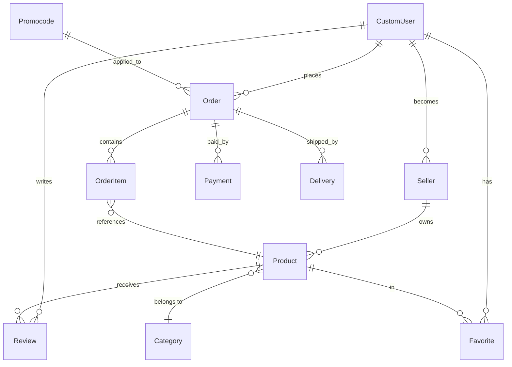

# 05. Database Model

> TODO: Заполнить по каждому приложению — ключевые модели, поля, связи.
> Диаграммы — Mermaid ER.

## СУБД

PostgreSQL 17. Подключение через `psycopg2`. Миграции — Django ORM.

## Схема (верхний уровень)

> TODO: Уточнить реальные связи по коду моделей.

## accounts

| Модель | Ключевые поля | Примечания |
|--------|---------------|------------|
| `CustomUser` | TODO | Кастомная модель, `AUTH_USER_MODEL` |

## product

| Модель | Ключевые поля | Примечания |
|--------|---------------|------------|
| `Product` | TODO | |
| `Category` | TODO | MPTT (django-mptt) |

> TODO: Атрибуты, изображения (Cloudinary), вариации?

## order

| Модель | Ключевые поля | Примечания |
|--------|---------------|------------|
| `Order` | TODO | Статусы: TODO |
| `OrderItem` | TODO | |

## payment

| Модель | Ключевые поля | Примечания |
|--------|---------------|------------|
| TODO | | |

## delivery

| Модель | Ключевые поля | Примечания |
|--------|---------------|------------|
| TODO | | |

## sellers

| Модель | Ключевые поля | Примечания |
|--------|---------------|------------|
| TODO | | |

## reviews

| Модель | Ключевые поля | Примечания |
|--------|---------------|------------|
| TODO | | |

## promocode

| Модель | Ключевые поля | Примечания |
|--------|---------------|------------|
| TODO | | Типы: TODO |

## Остальные приложения

> TODO: banners, news, vacancies, analytics, warehouses, supplier, contactform.

## Миграции

Миграции исключены из git (`.gitignore: */migrations`).

> TODO: Описать процесс применения миграций при деплое (сейчас: `manage.py migrate --noinput` в docker-compose command).

## Фикстуры

Файл `backend/fixtures/all_data.json` — TODO: описать назначение, когда применяется.
