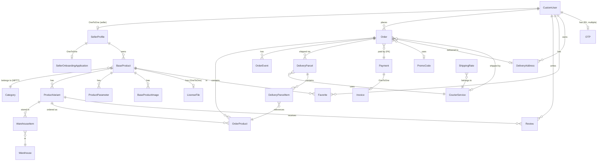
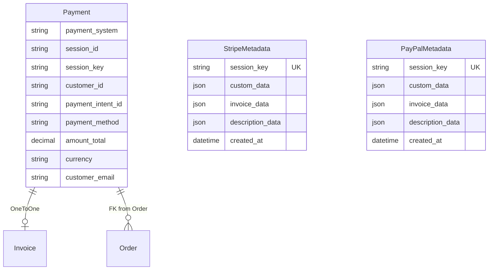
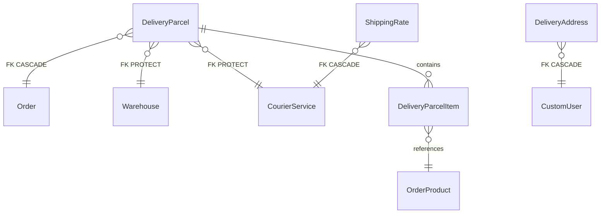
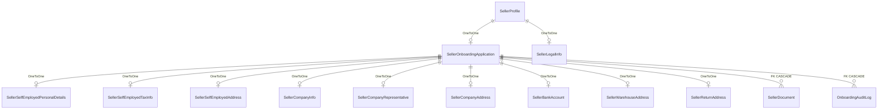
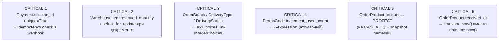
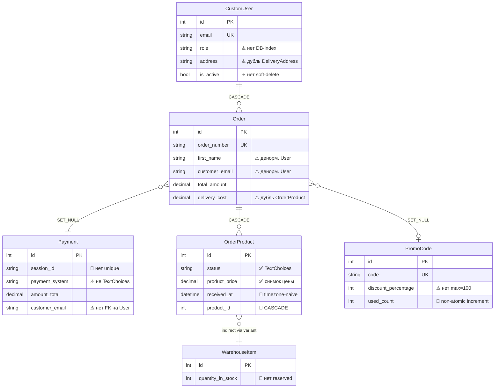
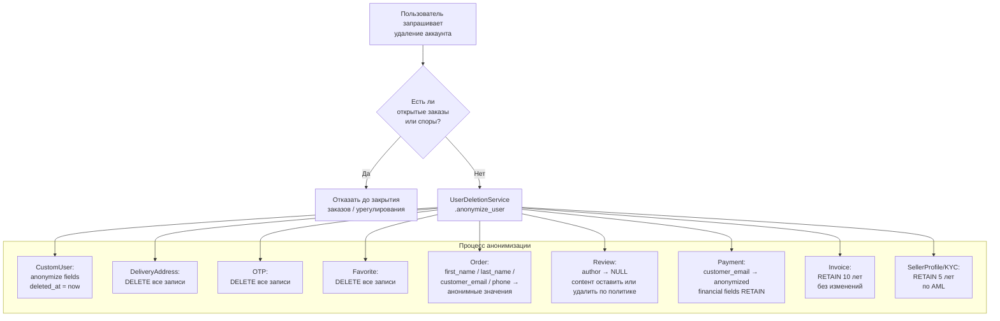
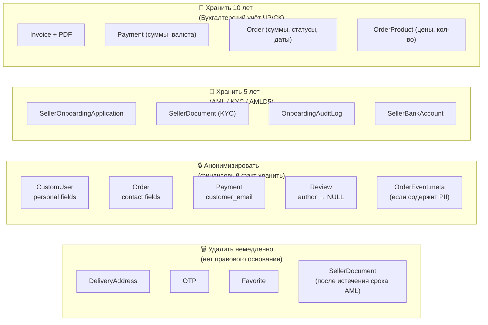
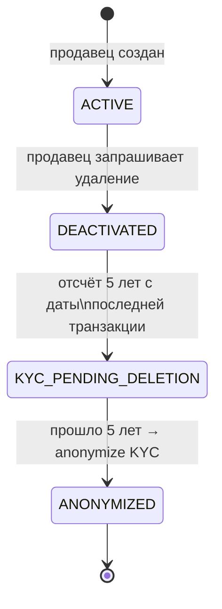
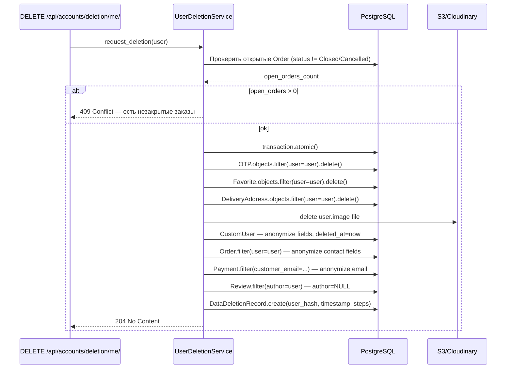

# 05. Database Model

> Архитектурный аудит моделей данных Django на основе реального кода.
> PostgreSQL 17. Миграции — Django ORM. Подключение через `psycopg2`.

---

## Содержание

1. [ER-диаграмма (верхний уровень)](#er-диаграмма-верхний-уровень)
2. [accounts](#accounts)
3. [product](#product)
4. [order](#order)
5. [payment](#payment)
6. [delivery](#delivery)
7. [sellers](#sellers)
8. [favorites](#favorites)
9. [reviews](#reviews)
10. [promocode](#promocode)
11. [warehouses](#warehouses)
12. [Recommended Target Data Model Improvements](#recommended-target-data-model-improvements)
13. [GDPR — Стратегия хранения и удаления персональных данных](#gdpr--стратегия-хранения-и-удаления-персональных-данных)

---

## ER-диаграмма (верхний уровень)



---

## accounts

### CustomUser

**Назначение:** Центральная модель идентификации. `AUTH_USER_MODEL`. Расширяет `AbstractBaseUser + PermissionsMixin`.

**Основные поля:**
| Поле | Тип | Примечания |
|------|-----|-----------|
| `email` | `EmailField(unique=True)` | `USERNAME_FIELD` |
| `first_name`, `last_name` | `CharField(150)` | `REQUIRED_FIELDS` |
| `address` | `CharField(500, null)` | Дублирует `DeliveryAddress` |
| `phone_number` | `PhoneNumberField(unique, null)` | `django-phonenumber-field` |
| `role` | `CharField(choices=UserRole)` | `CUSTOMER / SELLER / MANAGER / ADMIN` |
| `email_confirmed` | `BooleanField` | |
| `phone_number_confirmed` | `BooleanField` | |
| `is_active` | `BooleanField(default=True)` | Нет soft-delete |
| `date_created`, `date_updated` | `DateTimeField(auto_now)` | |

**Связи:**
- ← `OTP` (FK, CASCADE) — несколько OTP на пользователя
- → `SellerProfile` (OneToOne, CASCADE)
- ← `Order` (FK)
- ← `Favorite` (FK)
- ← `Review` (FK)
- ← `DeliveryAddress` (FK)

**Бизнес-процессы:** регистрация, вход, OAuth, сброс пароля, онбординг продавца, все роле-зависимые операции.

**Проблемы:**

| # | Категория | Описание |
|---|-----------|---------|
| 1 | Денормализация | `address` (`CharField`) дублирует структуру `DeliveryAddress` — два источника одних данных |
| 2 | Нет индекса | `role` — часто используется в фильтрах (`limit_choices_to`, managers) без DB-индекса |
| 3 | Нет soft-delete | `is_active=False` лишает доступа, но запись остаётся; при CASCADE-удалении пропадают Order/Review/Favorite |
| 4 | Синхронизация Groups в `save()` | `transaction.atomic()` внутри `save()` делает N+1 запросов при каждом сохранении пользователя |
| 5 | `try/except Group.DoesNotExist` | `get_or_create` не бросает `DoesNotExist` — мёртвая ветка `except` |

---

### OTP

**Назначение:** Одноразовые коды для подтверждения email и сброса пароля.

**Основные поля:**
| Поле | Тип | Примечания |
|------|-----|-----------|
| `user` | `FK(CustomUser, CASCADE)` | Несколько OTP на пользователя |
| `title` | `CharField(128)` | Тип OTP (email / password reset) |
| `value` | `IntegerField(null)` | Числовой код — теряет ведущие нули |
| `expired_date` | `DateTimeField(null)` | |
| `attempts_count` | `PositiveSmallIntegerField` | |
| `locked_until` | `DateTimeField(null)` | |

**Проблемы:**

| # | Категория | Описание |
|---|-----------|---------|
| 1 | Нет `UniqueConstraint` | Несколько активных OTP одного `title` на одного пользователя — гонка при двойном запросе |
| 2 | `value` как `IntegerField` | Код `007123` сохранится как `7123`, при сравнении — несовпадение |
| 3 | Нет очистки истёкших | Таблица неограниченно растёт без TTL-логики |
| 4 | Нет индекса | `(user, title)` — частый запрос при верификации |

---

## product

### Category

**Назначение:** Иерархия категорий товаров (MPTT-дерево).

**Основные поля:**
| Поле | Тип | Примечания |
|------|-----|-----------|
| `name` | `CharField(100)` | |
| `parent` | `TreeForeignKey(self, CASCADE, null)` | MPTT-дерево |
| `image` | `ImageField(null)` | |

**Проблемы:**

| # | Категория | Описание |
|---|-----------|---------|
| 1 | `on_delete=CASCADE` | Удаление родительской категории каскадно удаляет все подкатегории и связанные товары (`BaseProduct.category` → `SET_NULL`, но сами Category — CASCADE) |
| 2 | Нет `unique_together(name, parent)` | Два узла одного уровня могут иметь одинаковое имя |
| 3 | Нет `is_active` | Нельзя скрыть категорию, не удаляя её |

---

### BaseProduct

**Назначение:** Основная запись товара продавца. Проходит модерацию перед публикацией.

**Основные поля:**
| Поле | Тип | Примечания |
|------|-----|-----------|
| `seller` | `FK(SellerProfile, CASCADE)` | При удалении продавца — все товары удаляются |
| `category` | `FK(Category, SET_NULL, null)` | |
| `status` | `CharField(choices=ProductStatus)` | `pending/approved/rejected` — `TextChoices` |
| `rating` | `DecimalField(2,1, null)` | Денормализован, пересчитывается сигналом |
| `total_reviews` | `IntegerField(default=0)` | Денормализован |
| `approved_by` | `FK(CustomUser, SET_NULL, null)` | |
| `approved_at` | `DateTimeField(null)` | |
| `rejected_reason` | `TextField(null)` | |
| `vat_rate` | `DecimalField(4,2)` | НДС в % |
| `is_age_restricted` | `BooleanField` | |
| `is_active` | `BooleanField(default=True)` | |

**Связи:**
- `seller` → `SellerProfile` (CASCADE)
- `category` → `Category` (SET_NULL)
- ← `ProductVariant` (CASCADE)
- ← `ProductParameter` (CASCADE)
- ← `BaseProductImage` (CASCADE)
- ← `LicenseFile` (OneToOne, CASCADE)
- ← `Favorite` (CASCADE)

**Проблемы:**

| # | Категория | Описание |
|---|-----------|---------|
| 1 | Денормализация `rating` / `total_reviews` | Пересчитываются сигналом при каждом `Review` — при параллельных Review возможен drift |
| 2 | Нет индексов | `status`, `seller_id`, `category_id` — критичны для фильтрации каталога |
| 3 | Коэффициент 1.04 в property | `min_price_with_acquiring` дублирует коэффициент из `ProductVariant.price_with_acquiring` и `FavoriteProductListAPIView` |
| 4 | `approved_at` без `approved_by` constraint | Можно выставить `approved_at` без `approved_by` и наоборот |
| 5 | `article` — уникальность не гарантирована | Только `RegexValidator`, нет `unique=True` |
| 6 | CASCADE при удалении продавца | Все товары, история заказов `OrderProduct.product` (FK к варианту) — каскадно |

---

### ProductVariant

**Назначение:** Конкретный вариант товара (цвет, размер). Единица продажи.

**Основные поля:**
| Поле | Тип | Примечания |
|------|-----|-----------|
| `sku` | `CharField(9, unique, editable=False)` | Python-генерация через UUID loop |
| `product` | `FK(BaseProduct, CASCADE)` | |
| `name` | `CharField(50)` | Тип вариации (например, «Цвет») |
| `text` / `image` | `CharField / ImageField` | Взаимоисключающие — валидируется в `clean()` |
| `price` | `DecimalField(10,2)` | Цена без НДС и эквайринга |
| `weight_grams`, `width_mm`, `height_mm`, `length_mm` | `PositiveIntegerField` | Габариты |

**Проблемы:**

| # | Категория | Описание |
|---|-----------|---------|
| 1 | SKU генерируется в Python-loop | `uuid4().int[:9]` — не атомарно; теоретически два процесса могут получить одинаковый SKU до `INSERT`, хотя `unique=True` выдаст ошибку |
| 2 | `full_clean()` в `save()` | Для bulk-операций (`bulk_create`) `save()` не вызывается → невалидные данные |
| 3 | `price` — цена без НДС или с? | Не ясно из поля — нет `help_text`, свойства `price_without_vat` и `price_with_acquiring` противоречат описанию |
| 4 | Нет индекса на `product_id` | Часто используется `product.variants.all()` |
| 5 | `weight_grams = 0` по умолчанию | При нулевом весе расчёт доставки может возвращать ошибочные тарифы |

---

### ProductParameter

**Назначение:** Key-value характеристики товара.

**Проблемы:**
| # | Категория | Описание |
|---|-----------|---------|
| 1 | Нет `unique_together(product, name)` | Дублирующие параметры с одним `name` у товара |
| 2 | EAV-антипаттерн | Неструктурированные атрибуты усложняют фильтрацию по характеристикам |

---

### BaseProductImage

**Назначение:** Изображения товара. При сохранении конвертируются в WebP 1000×1000.

**Проблемы:**
| # | Категория | Описание |
|---|-----------|---------|
| 1 | Обработка изображения в `save()` | Синхронная PIL-операция блокирует воркер Django |
| 2 | Нет `max_images` constraint | Неограниченное количество изображений на товар |
| 3 | Нет порядка сортировки | `ordering` не задан — порядок галереи непредсказуем |

---

## order

### Справочные модели: OrderStatus, DeliveryType, DeliveryStatus

**Назначение:** Lookup-таблицы статусов. Хранятся как отдельные модели с `name: CharField`.

**Критическая проблема:**

| # | Категория | Описание |
|---|-----------|---------|
| 1 | **Строки без TextChoices** | Сравнения `order_status.name == 'Closed'` / `'Cancelled'` по всему коду — опечатка не поймается компилятором |
| 2 | Нет `unique=True` на `name` | Два одинаковых статуса в таблице |
| 3 | Нет индекса на `name` | Фильтрация по имени без индекса |
| 4 | Миграции с данными | Строки `'Pending'`, `'Closed'` и т.д. должны быть зафиксированы как фикстуры или через `RunPython` в миграции |

---

### Order

**Назначение:** Заказ покупателя. Создаётся в `StripeWebhookView` / `PayPalWebhookView` атомарно.

**Основные поля:**
| Поле | Тип | Примечания |
|------|-----|-----------|
| `order_number` | `CharField(50, unique)` | Генерируется Python-функцией `datetime + uuid` |
| `user` | `FK(CustomUser, CASCADE)` | |
| `first_name`, `last_name` | `CharField(150)` | Денормализованы из `CustomUser` |
| `customer_email` | `EmailField` | Денормализован из `CustomUser` |
| `phone_number` | `PhoneNumberField(null)` | Денормализован из `CustomUser` |
| `payment` | `FK(Payment, SET_NULL, null)` | |
| `total_amount` | `DecimalField(10,2)` | |
| `group_subtotal` | `DecimalField(10,2)` | Сумма группы: товары + доставка |
| `promo_code` | `FK(PromoCode, SET_NULL, null)` | |
| `delivery_type` | `FK(DeliveryType, SET_NULL)` | |
| `order_status` | `FK(OrderStatus, SET_NULL)` | |
| `delivery_status` | `FK(DeliveryStatus, SET_NULL)` | |
| `delivery_address` | `FK(DeliveryAddress, SET_NULL)` | |
| `courier_service` | `FK(CourierService, SET_NULL)` | |
| `delivery_cost` | `DecimalField(10,2)` | |
| `refund_amount` | `DecimalField(10,2)` | |
| `pickup_point_id` | `CharField(64, null)` | |

**Связи:**
- → `CustomUser` (CASCADE) — удаление пользователя удаляет заказы
- → `Payment` (SET_NULL)
- → `PromoCode` (SET_NULL)
- → `DeliveryAddress` (SET_NULL)
- → `CourierService` (SET_NULL)
- ← `OrderProduct` (CASCADE)
- ← `OrderEvent` (CASCADE)
- ← `DeliveryParcel` (CASCADE)

**Проблемы:**

| # | Категория | Описание |
|---|-----------|---------|
| 1 | **Денормализация контактов** | `first_name`, `last_name`, `customer_email`, `phone_number` дублируют `CustomUser` — при UPDATE пользователя расхождение |
| 2 | Нет индексов | `user_id`, `order_status_id`, `order_date`, `courier_service_id` — критичны для фильтрации |
| 3 | `order_number` генерация в Python | Формат `ддммгг...` не уникален при параллельных вставках без DB-sequence; `unique=True` страхует от дублей, но не от коллизий при генерации |
| 4 | `SET_NULL` для статусов | Если удалить `OrderStatus` → `order_status=NULL` — заказ без статуса |
| 5 | `CASCADE` на `user` | Удаление покупателя удаляет весь архив заказов |
| 6 | `delivery_cost` дублируется | В `Order.delivery_cost` и `OrderProduct.delivery_cost` — два источника одного значения |

---

### OrderProduct

**Назначение:** Позиция заказа. Привязана к `ProductVariant` и `SellerProfile`.

**Основные поля:**
| Поле | Тип | Примечания |
|------|-----|-----------|
| `order` | `FK(Order, CASCADE)` | |
| `product` | `FK(ProductVariant, CASCADE)` | При удалении варианта — каскад |
| `quantity` | `PositiveIntegerField` | |
| `status` | `CharField(choices=ProductStatus)` | `TextChoices` — хорошо |
| `received` | `BooleanField(default=False)` | |
| `received_at` | `DateTimeField(null)` | Обновляется в `save()` |
| `seller_profile` | `FK(SellerProfile, CASCADE)` | |
| `warehouse` | `FK(Warehouse, CASCADE, null)` | |
| `product_price` | `DecimalField(10,2)` | Снимок цены на момент заказа |
| `delivery_cost` | `DecimalField(10,2)` | |

**Проблемы:**

| # | Категория | Описание |
|---|-----------|---------|
| 1 | **`datetime.now()` без timezone** | `self.received_at = datetime.now()` → timezone-naive при UTC-окружении → ошибки в сравнениях |
| 2 | **`on_delete=CASCADE` для `product`** | Удаление `ProductVariant` удаляет историю заказов — `PROTECT` или `SET_NULL` + snapshot |
| 3 | `product_price` снимок | Хорошо, что хранится; но `delivery_cost` также денормализована — нет `delivery_price_snapshot` |
| 4 | Нет индексов | `order_id`, `seller_profile_id`, `status` — частые запросы в кабинете продавца |
| 5 | `received` + `received_at` логика в `save()` | Хрупкая: устанавливает `previous_received` как атрибут экземпляра — теряется при refresh_from_db |

---

### Invoice

**Назначение:** PDF-инвойс, генерируется после оплаты.

**Основные поля:**
| Поле | Тип | Примечания |
|------|-----|-----------|
| `payment` | `OneToOneField(Payment, CASCADE)` | |
| `invoice_number` | `CharField(50, unique)` | |
| `variable_symbol` | `CharField(20, unique)` | |
| `file` | `FileField` | |
| `created_at` | `DateTimeField(auto_now_add)` | |

**Проблемы:**
| # | Категория | Описание |
|---|-----------|---------|
| 1 | Нет `updated_at` | Нельзя отследить перегенерацию PDF |
| 2 | CASCADE при удалении Payment | `Invoice` удаляется вместе с `Payment` — нет архивирования |

---

### InvoiceSequence

**Назначение:** Атомарная нумерация инвойсов по сериям (год).

**Основные поля:** `series (unique, indexed)`, `last_number`, `updated_at`.

> Хорошо: `select_for_update()` нужен при инкременте, иначе гонка. Проверить в `payment/views.py`.

---

### OrderEvent

**Назначение:** Append-only лог событий заказа.

**Основные поля:** `order (FK, CASCADE)`, `type (TextChoices)`, `created_at`, `meta (JSONField)`.

**Проблемы:**
| # | Категория | Описание |
|---|-----------|---------|
| 1 | `meta` без схемы | JSONField без валидации структуры — читателю неизвестен формат |
| 2 | Нет `actor` | Неизвестно, кто создал событие (продавец/система/webhook) |
| 3 | Нет индекса на `order_id` | Хотя `FK` даёт индекс в PostgreSQL — проверить наличие |

---

## payment



### Payment

**Назначение:** Запись об успешном платеже (создаётся в webhook-обработчике).

**Основные поля:**
| Поле | Тип | Примечания |
|------|-----|-----------|
| `payment_system` | `CharField(choices=[…])` | Простой список, не TextChoices |
| `session_id` | `CharField(100)` | **Нет `unique=True`** — главная уязвимость |
| `payment_intent_id` | `CharField(100)` | Non-nullable, но может быть пустой строкой |
| `amount_total` | `DecimalField(10,2)` | |
| `currency` | `CharField(10)` | Нет validation — может прийти `'usd'` и `'USD'` |
| `customer_email` | `EmailField` | Денормализован |
| `session_key` | `CharField(50, null)` | Ссылка на `StripeMetadata`/`PayPalMetadata` |

**Проблемы:**

| # | Категория | Описание |
|---|-----------|---------|
| 1 | **`session_id` не уникален** | Stripe может доставить webhook дважды → дублирование `Payment` → дублирование `Order` |
| 2 | Нет `created_at` | Нельзя отследить время регистрации платежа |
| 3 | Нет FK на `CustomUser` | Только `customer_email` — нельзя связать с аккаунтом напрямую |
| 4 | `PAYMENT_SYSTEM_CHOICES` как list | Не `TextChoices` → нет автодополнения, нет типизации |
| 5 | `session_key` null | Связь с Metadata неявная, не FK |

---

### StripeMetadata / PayPalMetadata

**Назначение:** Снимок корзины/адреса/доставки перед оплатой. Используется в webhook.

**Проблемы:**

| # | Категория | Описание |
|---|-----------|---------|
| 1 | Дублирование структуры | `StripeMetadata` и `PayPalMetadata` идентичны — два разных класса без общего Abstract |
| 2 | Нет TTL / очистки | Записи не удаляются после успешного webhook — неограниченный рост |
| 3 | `custom_data` без схемы | JSONField: неизвестна структура без чтения `views.py` |
| 4 | `StripeMetadata.custom_data` = `null=True` | `PayPalMetadata` — non-nullable: несоответствие |
| 5 | Нет индекса на `created_at` | Для TTL-очистки по дате нет индекса |

---

## delivery



### DeliveryParcel

**Назначение:** Физическая посылка для отправки. Создаётся в post-payment webhook.

**Основные поля:**
| Поле | Тип | Примечания |
|------|-----|-----------|
| `order` | `FK(Order, CASCADE)` | |
| `warehouse` | `FK(Warehouse, PROTECT)` | |
| `service` | `FK(CourierService, PROTECT)` | |
| `tracking_number` | `CharField(100, null)` | |
| `label_file` | `FileField(null)` | |
| `weight_grams` | `PositiveIntegerField` | |
| `shipping_price` | `DecimalField(10,2)` | |
| `status` | `CharField(50, default="created")` | **Нет TextChoices** |
| `created_at` | `DateTimeField(auto_now_add)` | |

**Проблемы:**

| # | Категория | Описание |
|---|-----------|---------|
| 1 | `status` — raw string | `"created"` как дефолт без enum — хрупко |
| 2 | Нет `updated_at` | Нельзя отследить время смены статуса |
| 3 | Нет индекса на `order_id` | Частый запрос `order.delivery_parcels.all()` |
| 4 | Нет `parcel_number` уникальности | `unique_together(order, parcel_index)` отсутствует |

---

### DeliveryAddress

**Назначение:** Адрес доставки покупателя. Может иметь несколько записей на пользователя.

**Основные поля:**
| Поле | Тип | Примечания |
|------|-----|-----------|
| `user` | `FK(CustomUser, CASCADE)` | |
| `full_name`, `phone`, `email` | | Денормализованы |
| `street`, `city`, `zip_code`, `country` | `CharField` | |
| `is_default` | `BooleanField(default=False)` | |

**Проблемы:**

| # | Категория | Описание |
|---|-----------|---------|
| 1 | Нет `unique` для `is_default` | Несколько адресов могут быть `is_default=True` — нет DB-constraint |
| 2 | `CASCADE` при удалении пользователя | Удаляет историю адресов; `Order.delivery_address` станет `NULL` |
| 3 | `country` — свободный текст | `max_length=100` без ISO-кода валидации |
| 4 | Нет `created_at` / `updated_at` | |

---

### ShippingRate

**Назначение:** Тариф доставки: курьер × страна × канал × категория × вес × bundle.

**Проблемы:**

| # | Категория | Описание |
|---|-----------|---------|
| 1 | `weight_limit` как строка `"31_5"` | Не числовое поле → невозможен порядковый запрос `weight_limit >= X`; нужна отдельная числовая колонка `max_weight_kg` |
| 2 | `cod_fee` всегда 0 для большинства тарифов | Нет `is_cod_available` флага — нельзя фильтровать наличные при доставке |
| 3 | Нет `valid_from` / `valid_until` | Нет тарификации по дате — при изменении тарифов нужно удалять старые записи |
| 4 | `country` — `CharField(2)` без validation | Принимает любую 2-символьную строку |

---

## sellers



### SellerProfile

**Назначение:** Доменная сущность продавца. Центр привязки для товаров, онбординга, складов.

**Основные поля:**
| Поле | Тип | Примечания |
|------|-----|-----------|
| `user` | `OneToOneField(CustomUser, CASCADE)` | |
| `managers` | `ManyToManyField(CustomUser)` | |
| `default_warehouse` | `FK(Warehouse, SET_NULL, null)` | |
| `warehouses` | `ManyToManyField(Warehouse)` | |
| `is_active` | `BooleanField(default=True)` | |
| `created_at`, `updated_at` | `DateTimeField` | |

**Проблемы:**

| # | Категория | Описание |
|---|-----------|---------|
| 1 | `is_active` дублирует `CustomUser.is_active` | Два флага активности — рассинхронизация при ручном изменении |
| 2 | Нет индекса на `is_active` | Фильтрация активных продавцов — частый запрос |
| 3 | Нет `display_name` / `company_name` | Название магазина нигде в профиле не хранится — только в `SellerLegalInfo` или `SellerCompanyInfo` |

---

### SellerLegalInfo

**Назначение:** Легаси-модель юридической информации. Синхронизируется после approve онбординга.

**Проблемы:**

| # | Категория | Описание |
|---|-----------|---------|
| 1 | `bank_details` как `TextField` | Неструктурированное поле — дублирует `SellerBankAccount` |
| 2 | `legal_address` как `TextField` | Дублирует `SellerCompanyAddress` / `SellerSelfEmployedAddress` |
| 3 | Синхронизация ручная | Нет автоматического механизма sync с `SellerOnboardingApplication` после approve |

---

### SellerOnboardingApplication

**Назначение:** Многошаговая заявка верификации продавца.

**Основные поля:**
| Поле | Тип | Примечания |
|------|-----|-----------|
| `seller_profile` | `OneToOneField(CASCADE)` | Одна заявка — один продавец |
| `seller_type` | `CharField(TextChoices, null)` | `self_employed` / `company` |
| `status` | `CharField(TextChoices)` | `DRAFT→SUBMITTED→PENDING→APPROVED/REJECTED` |
| `submitted_at`, `reviewed_at` | `DateTimeField(null)` | |
| `reviewed_by` | `FK(CustomUser, SET_NULL)` | |
| `rejected_reason` | `TextField(null)` | |

**Проблемы:**

| # | Категория | Описание |
|---|-----------|---------|
| 1 | `OneToOne` — нет истории повторных заявок | После `REJECTED` продавец правит ту же заявку — нет архива попыток |
| 2 | `seller_type` nullable | Заявка без типа может существовать без ограничений — нет constraint `(status != DRAFT) → seller_type IS NOT NULL` |
| 3 | Нет индекса на `status` | Фильтрация `status=SUBMITTED` для очереди модерации |
| 4 | `reviewed_by` без audit | Только последний ревьюер — если заявка reject→resubmit→approve, история первого reject теряется (лишь в `OnboardingAuditLog.payload`) |

---

### Блоки данных онбординга (SE / Company / Bank / Address)

**Назначение:** Отдельные OneToOne-фрагменты заявки — личные данные, налоги, адреса, банк.

**Общие проблемы:**

| # | Категория | Описание |
|---|-----------|---------|
| 1 | Все поля `null=True, blank=True` | Нет server-side validation completeness — можно submit пустую заявку |
| 2 | `iban` без валидации формата | Только `CharField(34)` — неверный IBAN пройдёт |
| 3 | `tin`, `vat_id`, `business_id` задублированы в SE и Company | `SellerSelfEmployedTaxInfo` и `SellerCompanyInfo` имеют одни и те же поля |
| 4 | `SellerWarehouseAddress` и `SellerReturnAddress` — дублирование структуры | Адресные поля повторяются 4 раза; нет общего `AbstractAddress` |
| 5 | `proof_document_issue_date` без constraint | Логика «не старше 3 месяцев» не на DB-уровне |

---

### SellerDocument

**Назначение:** Загруженные KYC/KYB-документы.

**Проблемы:**

| # | Категория | Описание |
|---|-----------|---------|
| 1 | `side` — свободный CharField | Нет enum `"front"/"back"` — любое значение проходит |
| 2 | Нет валидации типа файла | `upload_to` только задаёт путь — MIME/extension проверки нет |
| 3 | Нет `file_size` / хеш-поля | Нельзя проверить целостность или дубли |

---

### OnboardingAuditLog

**Назначение:** Append-only журнал событий онбординга.

**Хорошо:** Индексы по `(application, created_at)` и `(event_type, created_at)` — правильно.

**Проблемы:**

| # | Категория | Описание |
|---|-----------|---------|
| 1 | `payload` без схемы | Формат зависит от `event_type` — нет документации структуры |
| 2 | Нет `before/after` значений | При `section_updated` неизвестно, что именно изменилось |
| 3 | `actor_snapshot` как `JSONField(default=dict)` | Дублирует FK `actor` — несоответствие если пользователь изменился |

---

## favorites

### Favorite

**Назначение:** Список избранных товаров покупателя.

**Основные поля:** `user (FK, CASCADE)`, `product (FK, CASCADE)`, `added_at`.

**Проблемы:**

| # | Категория | Описание |
|---|-----------|---------|
| 1 | `CASCADE` для `product` | Удаление `BaseProduct` — молчаливо удаляет из избранного без уведомления |
| 2 | `unique_together` — не `UniqueConstraint` | Старый синтаксис; нет `deferrable` опции |
| 3 | Нет `removed_at` | Нельзя отследить историю добавления/удаления |

---

## reviews

### Review

**Назначение:** Отзыв покупателя на вариант товара.

**Основные поля:**
| Поле | Тип | Примечания |
|------|-----|-----------|
| `author` | `FK(CustomUser, CASCADE)` | |
| `product_variant` | `FK(ProductVariant, CASCADE)` | |
| `content` | `TextField` | |
| `date_created` | `DateTimeField(auto_now_add)` | |
| `rating` | `PositiveSmallIntegerField(1-5, null)` | Необязательный |

**Проблемы:**

| # | Категория | Описание |
|---|-----------|---------|
| 1 | **Нет `unique_together(author, product_variant)`** | Покупатель может оставить несколько отзывов на один вариант |
| 2 | **`CASCADE` для `product_variant`** | Удаление варианта удаляет все отзывы и нарушает `BaseProduct.rating` |
| 3 | `rating` nullable | `BaseProduct.rating` пересчитывается сигналом — nulls могут искажать среднее |
| 4 | `CASCADE` для `author` | Удаление пользователя удаляет его отзывы; альтернатива — `SET_NULL` + анонимизация |
| 5 | Нет `updated_at` | Нельзя отследить редактирование отзыва |

---

### ReviewMedia

**Назначение:** Медиафайлы (фото/видео) к отзыву.

**Проблемы:**

| # | Категория | Описание |
|---|-----------|---------|
| 1 | Нет `file_size` / `duration` | Нельзя ограничить размер видео на DB-уровне |
| 2 | `media_type` — список `[…]`, не TextChoices | |
| 3 | Нет лимита количества медиа на отзыв | |

---

## promocode

### PromoCode

**Назначение:** Скидочный промокод с периодом действия и лимитом использований.

**Основные поля:**
| Поле | Тип | Примечания |
|------|-----|-----------|
| `code` | `CharField(20, unique)` | |
| `discount_percentage` | `PositiveIntegerField` | Нет ограничения на 100 |
| `valid_from`, `valid_until` | `DateTimeField` | |
| `max_usage` | `PositiveIntegerField(null)` | `null` = безлимитный |
| `used_count` | `PositiveIntegerField(default=0)` | |

**Проблемы:**

| # | Категория | Описание |
|---|-----------|---------|
| 1 | **`increment_used_count()` не атомарный** | `self.used_count += 1; self.save()` → race condition при параллельных вебхуках — нужен `F('used_count') + 1` |
| 2 | `discount_percentage` без `MaxValueValidator(100)` | Скидка 150% возможна |
| 3 | **`stripePromoCode()` в модели** | Бизнес-логика (Stripe API) в модели; `signal.py` падает при сохранении |
| 4 | Нет `is_active` флага | Деактивация требует изменения дат |
| 5 | Нет индекса на `(valid_from, valid_until)` | При проверке активности промокода |
| 6 | `used_count >= max_usage` не на DB-уровне | Проверяется только в коде — race condition |

---

## warehouses

### Warehouse

**Назначение:** Физический склад. Используется в `DeliveryParcel`, `OrderProduct`, `SellerProfile`.

**Основные поля:** `name (unique)`, адресные поля, `pickup_by_courier (BooleanField)`.

**Проблемы:**

| # | Категория | Описание |
|---|-----------|---------|
| 1 | Имя захардкожено в analytics | `"Vendor warehouse"` / `"Reli warehouse"` в `analytics` app — при переименовании DoesNotExist |
| 2 | Нет `is_active` | Нельзя вывести склад из оборота без удаления |
| 3 | `country` без validation | `CharField(2)` — любая строка |

---

### WarehouseItem

**Назначение:** Остаток SKU на складе.

**Основные поля:** `warehouse (FK, CASCADE)`, `product_variant (FK, CASCADE)`, `quantity_in_stock`.

**Проблемы:**

| # | Категория | Описание |
|---|-----------|---------|
| 1 | **Нет `reserved_quantity`** | Между созданием платёжной сессии и webhook-ом товар может быть продан снова — overselling |
| 2 | **`quantity_in_stock` без pessimistic lock** | Декремент в webhook без `select_for_update()` → race condition |
| 3 | Нет истории движений | Нет `WarehouseTransaction` или аналога — не восстановить историю остатков |
| 4 | `CASCADE` при удалении склада | Теряются записи WarehouseItem без возможности восстановления |

---

## Recommended Target Data Model Improvements

### Critical — устранить в первую очередь (риск потери данных / дублирования заказов)



| ID | Проблема | Исправление |
|----|---------|------------|
| C-1 | `Payment.session_id` не уникален → двойной заказ | `session_id = CharField(unique=True)` + `Payment.objects.get_or_create(session_id=...)` в webhook |
| C-2 | Overselling: нет резервирования | Добавить `reserved_quantity` в `WarehouseItem`; инкрементировать при создании сессии, декрементировать в webhook |
| C-3 | Статусы заказа как raw-строки | Преобразовать `OrderStatus` / `DeliveryType` / `DeliveryStatus` в `TextChoices` или хотя бы добавить `unique=True` + константы |
| C-4 | Race condition в `increment_used_count` | `PromoCode.objects.filter(pk=self.pk).update(used_count=F('used_count') + 1)` |
| C-5 | Удаление варианта ломает историю заказов | `OrderProduct.product` → `on_delete=PROTECT`; добавить `product_name`, `product_sku` snapshot-поля |
| C-6 | Timezone-naive datetime в `OrderProduct.save()` | `from django.utils import timezone; self.received_at = timezone.now()` |

---

### Important — исправить в ближайшем спринте (риск целостности и производительности)

| ID | Проблема | Исправление |
|----|---------|------------|
| I-1 | Нет индексов на часто фильтруемых полях | Добавить: `BaseProduct(status, seller_id)`, `Order(user_id, order_status_id, order_date)`, `OrderProduct(order_id, seller_profile_id, status)`, `CustomUser(role)` |
| I-2 | `OTP` — несколько активных на пользователя | `UniqueConstraint(fields=['user', 'title'])` или `update_or_create` при создании |
| I-3 | `OTP.value` как IntegerField | `CharField(max_length=8)` — ведущие нули |
| I-4 | `DeliveryParcel.status` без TextChoices | Добавить choices: `created / shipped / delivered / failed` |
| I-5 | `StripeMetadata` / `PayPalMetadata` — дубли | Общий `AbstractPaymentMetadata` с `session_key`, `custom_data`, `invoice_data`, `description_data`, `created_at` |
| I-6 | `Favorite` / `Review` — CASCADE при удалении товара | `Review.product_variant` → `PROTECT`; `Favorite.product` → `SET_NULL` или мягкое удаление `BaseProduct` |
| I-7 | `DeliveryAddress.is_default` без уникального constraint | Partial unique index: `CREATE UNIQUE INDEX … WHERE is_default = true` |
| I-8 | `Review` без `unique_together(author, product_variant)` | Добавить `UniqueConstraint(fields=['author', 'product_variant'])` |
| I-9 | `ShippingRate.weight_limit` как строка | Добавить `max_weight_kg = DecimalField(null=True)` рядом с существующим полем |
| I-10 | `SellerOnboardingApplication` — нет истории попыток | Заменить `OneToOne` на `ForeignKey` (несколько заявок) + поле `is_active` |
| I-11 | `CustomUser.address` — дубль DeliveryAddress | Deprecate поле; мигрировать данные в `DeliveryAddress` |
| I-12 | `BaseProductImage` — синхронная обработка | Перенести PIL-конвертацию в Celery task |
| I-13 | `InvoiceSequence.last_number` без `select_for_update` | Проверить использование в `payment/views.py`; без блокировки — дубли инвойс-номеров |

---

### Optional — технический долг, можно планировать

| ID | Проблема | Исправление |
|----|---------|------------|
| O-1 | `CustomUser` — нет soft-delete | Добавить `deleted_at = DateTimeField(null=True)` + кастомный менеджер |
| O-2 | `Order.user` → CASCADE | Перейти на `SET_NULL` + анонимизацию при GDPR-удалении |
| O-3 | `WarehouseItem` — нет истории движений | Добавить `WarehouseMovement(warehouse_item, delta, reason, created_at)` |
| O-4 | `ProductParameter` — EAV-антипаттерн | Рассмотреть JSONB-поле `parameters` в `BaseProduct` + GIN-индекс |
| O-5 | `PromoCode.stripePromoCode()` в модели | Вынести в service-слой; убрать из `signal.py` или пометить `deprecated` |
| O-6 | `Category` — нет `unique_together(name, parent)` | Добавить constraint |
| O-7 | `SellerWarehouseAddress` / `SellerReturnAddress` / `SellerSelfEmployedAddress` / `SellerCompanyAddress` — повторяющаяся структура | Общий `AbstractSellerAddress(street, city, zip_code, country, contact_phone, proof_document_issue_date)` |
| O-8 | `OnboardingAuditLog.payload` без схемы | Документировать структуру JSON по `event_type` в коде/docs |
| O-9 | `Payment` без `created_at` | Добавить `created_at = DateTimeField(auto_now_add=True)` |
| O-10 | `OrderEvent.meta` без схемы / без `actor` | Добавить `actor FK(CustomUser, SET_NULL)` для трассируемости |
| O-11 | `BaseProduct.article` без `unique=True` | Добавить если Article — глобальный идентификатор |
| O-12 | `SellerDocument.side` без choices | `SellerDocumentSide(TextChoices): FRONT / BACK / SINGLE` |
| O-13 | `Warehouse` — захардкоженные имена в analytics | Добавить `warehouse_type` поле с choices `vendor / reli / external` |
| O-14 | `StripeMetadata` / `PayPalMetadata` — нет TTL | Cron / Celery задача очистки записей старше 30 дней после успешной обработки |

---

## Сводная ER-диаграмма: связи с рисками



---

## GDPR — Стратегия хранения и удаления персональных данных

> Применимое право: GDPR (Регламент ЕС 2016/679), Чешский закон № 110/2019 Sb., Словацкий закон № 18/2018 Z.z., Закон о бухгалтерском учёте ЧР (§ 31–32 Zákon č. 563/1991 Sb.) и ЗоН SK.

### Принцип: не удалять — анонимизировать

GDPR даёт право на стирание (Art. 17), но оно **не абсолютное**: финансовые и бухгалтерские данные обязаны храниться по закону даже после запроса на удаление. Удаление строки из БД — неправильный ответ. Правильный ответ — **разделение персональных атрибутов и финансовых фактов**.



---

### Классификация данных по правовому основанию хранения



| Категория | Данные | Правовое основание | Срок |
|-----------|--------|-------------------|------|
| Идентификация | `CustomUser`: email, имя, телефон, фото | Договор (Art. 6.1.b) | До конца договорных отношений, затем анонимизировать |
| Финансовые записи | `Order`, `OrderProduct`, `Payment`, `Invoice` | Законодательное обязательство (Art. 6.1.c) | **10 лет** (§31 Zákon 563/1991 Sb.) |
| KYC/AML | `SellerOnboardingApplication`, `SellerDocument`, `SellerBankAccount` | Законодательное обязательство — AML/AMLD5 (Art. 6.1.c) | **5 лет** после завершения бизнес-отношений |
| Доставка | `DeliveryAddress`, `DeliveryParcel` | Договор — исполнение | Удалить при анонимизации; `DeliveryParcel` — хранить как часть заказа |
| Аутентификация | `OTP` | Законный интерес (безопасность) | Удалить немедленно при запросе |
| Предпочтения | `Favorite` | Согласие / Законный интерес | Удалить немедленно |
| Отзывы | `Review` | Законный интерес (публичный контент) | Анонимизировать автора; сам контент — на усмотрение политики |
| Сессии/токены | `StripeMetadata`, `PayPalMetadata` | Договор | Удалить после успешного webhook или через 30 дней |

---

### Необходимые изменения в моделях

#### 1. CustomUser — добавить soft-delete и anonymized-флаг

```python
# accounts/models.py
class CustomUser(AbstractBaseUser, PermissionsMixin):
    # ... существующие поля ...

    # GDPR additions
    deleted_at = models.DateTimeField(null=True, blank=True, db_index=True)
    is_anonymized = models.BooleanField(default=False)
    anonymized_at = models.DateTimeField(null=True, blank=True)
    # Сохраняем только для внутреннего аудита после анонимизации
    original_email_hash = models.CharField(max_length=64, null=True, blank=True)
```

После `anonymize()`:
| Поле | Действие | Значение |
|------|---------|---------|
| `email` | Заменить | `deleted_{uuid4_hex}@anon.reli.one` |
| `first_name` | Заменить | `"[Deleted]"` |
| `last_name` | Заменить | `"[Deleted]"` |
| `phone_number` | Обнулить | `NULL` |
| `address` | Обнулить | `NULL` |
| `image` | Удалить файл + обнулить | `NULL` |
| `is_active` | Деактивировать | `False` |
| `deleted_at` | Проставить | `timezone.now()` |
| `is_anonymized` | Проставить | `True` |
| `original_email_hash` | Сохранить SHA-256 | нужно для внутреннего аудита (proof of deletion) |

---

#### 2. Order — изменить on_delete и добавить флаг анонимизации

**Текущая проблема:** `Order.user = FK(CASCADE)` — удаление пользователя физически удаляет заказы, что нарушает обязательство хранить финансовые записи 10 лет.

```python
# order/models.py
class Order(models.Model):
    user = models.ForeignKey(
        'accounts.CustomUser',
        on_delete=models.SET_NULL,   # ← ИЗМЕНИТЬ с CASCADE
        null=True,
        blank=True,
    )
    # ... существующие поля ...

    # GDPR: флаг анонимизации контактных данных
    contact_anonymized = models.BooleanField(default=False)
```

После анонимизации пользователя:
| Поле Order | Действие | Значение |
|------------|---------|---------|
| `user` | Станет `NULL` (SET_NULL) | — |
| `first_name` | Заменить | `"[Deleted]"` |
| `last_name` | Заменить | `"[Deleted]"` |
| `customer_email` | Заменить | `"deleted@anon.reli.one"` |
| `phone_number` | Обнулить | `NULL` |
| `total_amount`, `delivery_cost` | **Сохранить** | бухгалтерский учёт |
| `order_date`, `order_number` | **Сохранить** | бухгалтерский учёт |

---

#### 3. Payment — добавить уникальность и anonymized-поля

```python
# payment/models.py
class Payment(models.Model):
    session_id = models.CharField(max_length=100, unique=True)  # ← добавить unique
    # ...
    customer_email = models.EmailField(blank=True)  # разрешить пустое для анонимизации
    contact_anonymized = models.BooleanField(default=False)
    created_at = models.DateTimeField(auto_now_add=True)  # ← добавить
```

`amount_total`, `currency`, `payment_system`, `payment_intent_id` — **никогда не трогать**: это финансовая запись.

---

#### 4. SellerProfile / SellerOnboardingApplication — двухэтапное удаление

Продавцы подпадают под AML/AMLD5: KYC-данные нельзя удалить сразу.



```python
# sellers/models.py
class SellerProfile(models.Model):
    # ... существующие поля ...
    deactivated_at = models.DateTimeField(null=True, blank=True)   # ← добавить
    kyc_retain_until = models.DateField(null=True, blank=True)     # ← добавить (last_transaction + 5 years)
    kyc_anonymized_at = models.DateTimeField(null=True, blank=True) # ← добавить
```

---

#### 5. DeliveryAddress — удалять немедленно (нет оснований хранить)

`Order.delivery_address` — это **FK SET_NULL**: адрес в заказе становится NULL после удаления. Но адресные поля уже денормализованы в `Order` и в `DeliveryAddress` отдельно — при анонимизации нужно:

1. Удалить все `DeliveryAddress` записи пользователя.
2. Анонимизировать `Order.first_name` / `customer_email` / `phone_number` (хранятся как snapshot).
3. `DeliveryParcel` — не удалять (часть финансовой логистической записи), но он не содержит PII напрямую.

---

#### 6. Review — анонимизировать автора

```python
# reviews/models.py
class Review(models.Model):
    author = models.ForeignKey(
        CustomUser,
        on_delete=models.SET_NULL,   # ← ИЗМЕНИТЬ с CASCADE
        null=True,
        blank=True,
    )
    is_author_anonymized = models.BooleanField(default=False)  # ← добавить
```

При анонимизации: `author → NULL`, `is_author_anonymized = True`. Сам текст и рейтинг остаются (публичный контент, законный интерес).

---

### Архитектура UserDeletionService

Единственное место в коде, которое выполняет все шаги. **Не распылять логику по views.**



**DataDeletionRecord** — служебная таблица для доказательства исполнения запроса (Art. 5.2 GDPR — accountability):

```python
class DataDeletionRecord(models.Model):
    """Audit-запись о выполнении права на стирание."""
    user_email_hash = models.CharField(max_length=64)   # SHA-256 от original email
    requested_at = models.DateTimeField()
    completed_at = models.DateTimeField(auto_now_add=True)
    steps_completed = models.JSONField()                 # список выполненных шагов
    initiated_by = models.CharField(max_length=16)       # 'user' / 'admin' / 'system'

    class Meta:
        indexes = [models.Index(fields=['user_email_hash'])]
```

---

### Сводная таблица on_delete — текущее vs требуемое

| Модель / поле | Текущее | GDPR-требуемое | Причина |
|---------------|---------|---------------|---------|
| `Order.user` | `CASCADE` | **`SET_NULL`** | Финансовая запись не должна удаляться |
| `OTP.user` | `CASCADE` | `CASCADE` ✅ | Нет оснований хранить после удаления |
| `Favorite.user` | `CASCADE` | `CASCADE` ✅ | Нет оснований хранить |
| `DeliveryAddress.user` | `CASCADE` | `CASCADE` ✅ | Нет оснований хранить |
| `Review.author` | `CASCADE` | **`SET_NULL`** | Контент — законный интерес; автор — PII |
| `SellerProfile.user` | `CASCADE` | **Двухэтапно** | AML: не удалять до истечения 5 лет |
| `OrderProduct.product` | `CASCADE` | **`PROTECT`** | Финансовая история не должна рваться |
| `Invoice.payment` | `CASCADE` | **`PROTECT`** | Инвойс хранится 10 лет по закону |

---

### Расписание автоматической очистки (Celery beat)

| Задача | Период | Действие |
|--------|--------|---------|
| `purge_expired_otps` | Ежедневно | `OTP.objects.filter(expired_date__lt=now()).delete()` |
| `purge_payment_metadata` | Еженедельно | `StripeMetadata / PayPalMetadata` старше 30 дней без связанного Order → delete |
| `schedule_kyc_anonymization` | Ежемесячно | Найти `SellerProfile.kyc_retain_until < today` → запустить анонимизацию KYC |
| `notify_pending_gdpr_requests` | Ежедневно | Напомнить admin о ручных запросах, ожидающих > 25 дней (Art. 12.3 — ответ в 30 дней) |

---

### Что нельзя удалять ни при каких обстоятельствах

| Запись | Почему |
|--------|--------|
| `Invoice` + PDF-файл | Бухгалтерское доказательство транзакции — 10 лет (§ 31 CZ / § 35 SK) |
| `Payment.amount_total`, `currency`, `session_id`, `payment_intent_id` | Финансовый факт — 10 лет |
| `Order.total_amount`, `order_number`, `order_date` | Финансовый факт — 10 лет |
| `OrderProduct.product_price`, `quantity` | Позиция налогового документа — 10 лет |
| `SellerOnboardingApplication` + `SellerDocument` (KYC) | AML — 5 лет после окончания отношений |
| `OnboardingAuditLog` (KYC events) | AML compliance evidence — 5 лет |
| `DataDeletionRecord` | Доказательство исполнения Art. 17 — рекомендуется минимум 3 года |

## Миграции и фикстуры

```
backend/fixtures/all_data.json  — начальные данные (назначение не задокументировано)
*/migrations/                   — исключены из git (.gitignore)
```

**Деплой:** `manage.py migrate --noinput` в `docker-compose command`.

**Риски:**
- Отсутствие миграций в git усложняет восстановление схемы на чистой БД без `all_data.json`.
- `OrderStatus`, `DeliveryType`, `DeliveryStatus` — lookup-данные должны создаваться через `RunPython` в миграции или fixtures (иначе FK в `Order` будут `NULL`).
