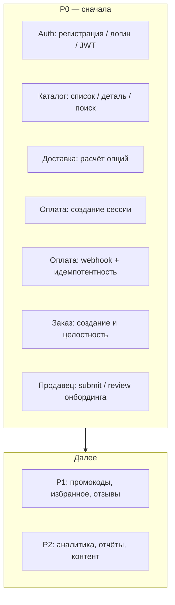
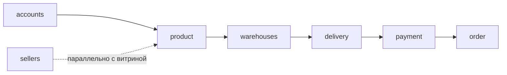
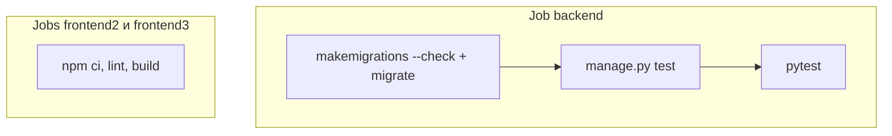

# 08. Testing Strategy

Краткая стратегия тестирования для монорепозитория Reli.one (Django + DRF backend, React/Vite frontend). Код не описывает обязательную реализацию — это целевой план и приоритеты.

## Definition of Done для этого документа

- Перечислены приоритеты и критические сценарии, согласованные с P0.
- Разделены уровни unit / integration (API).
- Указаны порядок покрытия apps, моки, фикстуры, локальный запуск и CI.
- Учтено **фактическое** состояние: backend использует `django.test` / `APITestCase` / `APIClient` и **pytest-django** (тот же тестовый набор можно гнать и через `manage.py test`, и через `pytest`); осмысленные тесты есть в `accounts`, `sellers`, `payment`, `order`, `product`, `delivery`, `promocode`; `backend/pytest.ini` и `backend/conftest.py` есть; `warehouses/tests.py` пока пустой; в активном frontend (`Frontend3`) нет скрипта тестов в `package.json`.

---

## Текущее состояние (снимок)

| Область | Состояние |
|---------|-----------|
| Backend | Покрытие P0-цепочки расширено: `payment` (webhook, checkout), `order` (базовые доменные тесты), `product` (каталог API), `delivery` (shipping options с моками перевозчиков), `sellers` — `tests.py`: валидация онбординга, **submit/approve/reject** на сервисах; `test_onboarding_stabilization.py`: форма **state/review**, замена документа company, warehouse/return; **`test_onboarding_completeness.py`**: ветки **`compute_completeness`** / **`compute_next_step`** / **`compute_documents_summary_and_missing`** (отдельной матрицы стран в коде нет — см. **[Seller onboarding flow](./seller-onboarding-flow.md)**); **пробелы:** assert **`OnboardingAuditLog`**, при необходимости полные REST-цепочки по странам — см. **[Task 008](./tasks/008-seller-onboarding-stabilization/task.md)**. `accounts`, `promocode` (модель/сигналы). См. **Task 002** (DONE). |
| Frontend | Тестовый раннер не подключён. |
| Инфра | `pytest-django` в зависимостях; `pytest.ini` указывает `DJANGO_SETTINGS_MODULE`. При отсутствии переменных Postgres в окружении — SQLite `:memory:` (как в `settings`). Локально при загруженном `envs/database.env` может подключаться Postgres — для быстрых прогонов без БД задайте пустые `DB_NAME`, `DB_HOST` и т.д. |
| CI | `.github/workflows/ci.yml`: `makemigrations --check`, `migrate`, **`python manage.py test`**, затем **`pytest`**, плюс сборки фронтов. |
| Ручной Stripe e2e (локально) | Процедура и **зафиксированный результат smoke-прогона** (Orders/Invoice/письма/идемпотентность webhook, только local e2e, не prod): [`docs/testing/stripe-e2e-checklist.md`](testing/stripe-e2e-checklist.md) → раздел *Verification evidence*. |
| Ручной PayPal e2e (локально, sandbox) | Чеклист Postman + ngrok: [`docs/testing/paypal-e2e-checklist.md`](testing/paypal-e2e-checklist.md); раздел *Verification evidence — latest local smoke result* фиксирует пройденный sandbox-smoke **без** сырых id/payload в git (детали чисел — локально или в тикете). |

---

## Пирамида и приоритеты P0



**Рекомендация по skills:** на этапах внедрения pytest, фабрик, CI и babysit-цикла полезно искать готовые skills командой `/find-skills` (например: pytest-django, factory_boy, настройка pipeline). Подбор — по контексту этапа, не обязателен ко всем задачам.

---

## 1. Какие тесты нужны в первую очередь

1. **API / integration** по цепочке «покупатель»: auth → каталог → корзина/чекаут (через оплату и webhook) → заказы.
2. **Unit** там, где много чистой логики без I/O: сплит посылок, таблицы тарифов Packeta/DPD/GLS, валидации онбординга, расчёты сумм.
3. **Контрактные проверки** ответов ключевых view (коды, форма `couriers.*` для доставки, структура сессии оплаты) — чтобы не ломать фронт и интеграции.

Регрессии по P0 закрывать раньше, чем расширять покрытие второстепенных apps.

---

## 2. Критические бизнес-сценарии (покрыть явно)

| Сценарий | Что проверить |
|----------|----------------|
| Регистрация / логин | Создание пользователя, уникальность email/телефона, ошибки валидации; выдача / обновление JWT (refresh, blacklist при необходимости). |
| Каталог | Листинг с фильтрами/пагинацией, карточка товара, поиск (в т.ч. пустой результат и границы). |
| Расчёт доставки | `SellerShippingOptionsView`: валидация входа, агрегация по перевозчикам, частичный фейл одного курьера (остальные OK), соответствие правилам сплита/веса. |
| Создание платёжной сессии | Stripe / PayPal: валидация групп, CZ-origin SKU, сохранение метаданных, мок вызовов внешнего API. |
| Webhook + идемпотентность | Повтор одного и того же события не создаёт дубликаты заказов/платежей; корректный ответ при уже обработанной сессии (см. описание в OpenAPI `payment/views`). |
| Создание заказа | После успешной оплаты (или прямой сценарий создания, если есть): статусы, строки заказа, связь с продавцом и доставкой. |
| Онбординг продавца | Submit с валидными данными; review-слой (статусы, права); негативные кейсы валидации (пример — `validate_before_submit`, держатель счёта для компании); HTTP **state/review** и замена документов — см. `test_onboarding_stabilization.py`; дальнейшее покрытие — **Task 008** (completeness/страны/audit). |

---

## 3. Порядок покрытия Django apps (первыми)

Учитывая граф зависимостей и P0:



1. **accounts** — база для всех сценариев с аутентификацией.
2. **product** (+ при необходимости **supplier**) — данные для поиска/детали.
3. **warehouses** — привязка складов к вариантам (важно для CZ-origin и доставки).
4. **delivery** — расчёты и публичные/продавец-эндпоинты.
5. **payment** — сессии и webhooks (максимальный риск денег и дубликатов).
6. **order** — итоговая модель после оплаты и ручных потоков.
7. **sellers** — онбординг: валидация, API, переходы **submit / approve / reject** (покрыто).

Остальные apps: **promocode** — базовые тесты есть; промокоды **не** в текущем продуктовом roadmap и **не** блокируют **[Task 003](./tasks/003-payment-refactor/task.md)** cleanup (**Deferred** в её `task.md`); при возврате фичи — отдельная верификация и **002 Extended** по необходимости. **[Task 010](./tasks/010-devops-infrastructure/task.md)** промокоды в scope не включает. **warehouses** — тесты склада / конкурентности — **Task 009**; **резерв до оплаты** — **Task 013** (future). **Расширенный order lifecycle** (переходы статусов продавцом, отмена, parcel) — **Task 012**. **favorites**, **reviews** — после стабилизации P0.

---

## 4. Что оставить на уровне unit

- **delivery**: чистые функции в `services/local_rates.py`, `shipping_split.py`, `dpd_rates.py`, `gls_rates.py` — входные структуры `items`, границы веса/габаритов, агрегация посылок.
- **sellers**: сервисы наподобие `get_expected_company_account_holder`, `validate_before_submit` (уже есть unit-примеры).
- **payment**: разбор/нормализация payload-ов, валидация групп (`SessionInputSerializer` / `GroupSerializer`, checkout-сервисы), вспомогательные функции без HTTP.
- **order**: расчёты итогов по позициям (например сервисы детализации заказа продавца), если логика изолирована от ORM или через лёгкие объекты.
- **serializers**: кастомная валидация полей там, где она нетривиальна.

Критерий: тест быстрый, без реального Postgres/Redis/HTTP при желании (мок только точечно).

---

## 5. Что делать integration / API тестами

- Полный запрос-ответ через `APIClient` / `APITestCase`: эндпоинты **accounts** (register, login, token).
- **product**: list, detail, search-параметры.
- **delivery**: POST расчёта с преднастроенными вариантами и складами (без вызова внешних API, если они проброшены — мок).
- **payment**: создание сессии (Stripe/PayPal) с моком SDK/HTTP; webhooks с поддельной подписью или bypass только в тестовом режиме (предпочтительно патч `construct_event` / `verify_webhook`).
- **order**: создание и чтение заказа в связке с платежом (или фикстура «оплаченная сессия»).
- **sellers**: цепочка шагов онбординга, submit, админский/операторский review.

Использовать реальные миграции и БД тестового слоя (SQLite in-memory или отдельная БД в CI).

---

## 6. Внешние интеграции: мокать

| Интеграция | Зачем |
|------------|--------|
| **Stripe** | `checkout.Session.create`, `Webhook.construct_event`, при необходимости retrieve session. |
| **PayPal** | OAuth token, создание order, `verify-webhook-signature`. |
| **HTTP к гео/маршрутизации DPD** (если не локальная заглушка) | Детерминированные ответы ZIP/normalize. |
| **Email / уведомления** | Не слать реальные письма в CI; патч задач/celery/email backend. |
| **Cloudinary** | Загрузки медиа в сценариях с картинками — стаб или dummy storage. |

Кэш (например PayPal token) — использовать `cache.clear()` или локальный dummy cache в тестах.

---

## 7. Factories / fixtures

Рекомендуемый стек: **`pytest-django`** (уже в проекте) + по желанию **factory_boy** для массовой генерации объектов. Сейчас часть сценариев использует **фикстуры в `backend/conftest.py`** и `setUpTestData` в `TestCase`. Минимальный набор фабрик (целевой):

- `CustomUser` (роли customer / seller / staff).
- `SellerProfile` и связанные сущности онбординга.
- `Product` / `ProductVariant` (SKU, вес, связь с продуктом, VAT).
- `Warehouse` (country=CZ для happy-path оплаты/доставки).
- Записи тарифов **delivery** (`ShippingRate` и аналоги — по фактическим моделям).
- `StripeMetadata` / `PayPalMetadata` с JSON групп для прогона webhook.
- Завершённый **Order** + `OrderProduct` для чтения кабинета.

Общие **fixtures**: аутентифицированный клиент по ролям; минимальная «витрина» из 2–3 SKU и одного продавца.

---

## 8. Локальный запуск

Из каталога `backend` (активировано venv с зависимостями проекта):

```bash
# все тесты (Django runner)
DB_NAME= DB_HOST= SECRET_KEY=<достаточно-длинный-ключ-для-JWT> DEBUG=1 python manage.py test

# все тесты (pytest; эквивалентный набор)
DB_NAME= DB_HOST= SECRET_KEY=<...> DEBUG=1 pytest --ignore=.venv

# один app
python manage.py test order sellers

# один класс/тест (пример)
python manage.py test sellers.tests.CompanyAccountHolderValidationTests
```

Если в окружении не заданы `DB_NAME` / `NAME` для default БД, в `settings` включается SQLite in-memory. Если подхватывается `envs/database.env` с Postgres — для прогона без живой БД обнулите `DB_NAME`, `DB_HOST` (и при необходимости остальные `DB_*`) в командной строке, как в примерах выше. Для проверки ближе к продакшену — задать `DB_*` на локальную БД и прогнать миграции.

**Frontend (`Frontend3`):** после подключения Vitest/Jest команды добавить в `package.json`; до этого — ручной и E2E позже.

### Локальный e2e-контур (Docker, Postman, Stripe test)

Для ручной проверки цепочки оплаты и webhook с изолированной БД, **Mailpit** и Swagger см. отдельный гайд: [`docs/testing/e2e-local-contour.md`](./testing/e2e-local-contour.md). Файл compose: `docker-compose.e2e.yml` (не путать с production `docker-compose.yml` и не путать с pytest-стеком `docker-compose.test.yml`).

Пошаговый **manual checklist** по Stripe (JWT, `create-stripe-payment`, webhook, админка, Mailpit, идемпотентность, логи): [`docs/testing/stripe-e2e-checklist.md`](./testing/stripe-e2e-checklist.md).

> **Skills:** при первой настройке pytest + маркеров — `/find-skills`.

---

## 9. CI: что должно запускаться

Минимум для merge:

1. **Backend:** `python manage.py test` **и** `pytest` с окружением без продакшен-секретов (в CI по умолчанию SQLite после `migrate` — без `DB_*` в job).
2. **Lint** для **eslint** фронтов (`Frontend2`, `Frontend3`: `npm run lint`).
3. Порог **coverage** по apps P0 — опционально (политика команды / усиление CI **вне обязательного scope [Task 010](./tasks/010-devops-infrastructure/task.md) DevOps**).

Не запускать в CI реальные webhook к Stripe/PayPal; не использовать продакшен ключи.



> **Skills:** стабильный PR и починка CI по комментариям — см. `/find-skills` (например babysit/skill про цикл «тесты — правки»).

---

## Этапы внедрения (кратко)

| Этап | Действия | Skills (подобрать через `/find-skills`) |
|------|-----------|----------------------------------------|
| 0 | CI: `manage.py test` + `pytest` + lint FE (см. workflow) | CI, babysit |
| 1 | P0 backend: `accounts`, `product`, `delivery`, `payment`, `order` (базовый домен), `sellers` — **Task 002 DONE (Core)**; Extended: **Task 009** (warehouse), **012** (order lifecycle extended), атомика/продукт **`promocode`** — **не DevOps/Task 010** (см. **003 / backlog**); infra/e2e/runbooks локально и в CI — см. **[Task 010 — DevOps](./tasks/010-devops-infrastructure/task.md)** |
| 2 | Unit-пакет для `delivery/services/*` и критичных валидаторов | — |
| 3 | Подключить frontend unit (Vitest + RTL) для auth и checkout-форм | — |
| 4 | Поздний слой: E2E (Playwright) для 1–2 happy-path | E2E skill при наличии |

---

## Связанные документы

- `docs/testing/e2e-local-contour.md` — локальный Docker e2e-контур (Postgres e2e, Mailpit, ручная проверка API / Stripe webhook).
- `docs/testing/stripe-e2e-checklist.md` — ручной чеклист Stripe payment flow в e2e (Postman, идемпотентность, логи).
- `docs/tasks/002-testing-foundation/task.md` — **DONE (Testing Foundation Complete)**; Core vs Extended; Extended → Task 009 (warehouse), Task 012 (order lifecycle); **промокоды / атомика — не смешивать с [Task 010 DevOps](./tasks/010-devops-infrastructure/task.md)**.
- `docs/tasks/003-payment-refactor/task.md` — платежный контур; **closure repo-scope** и таблица evidence — `docs/tasks/004-order-consistency/task.md` → [Final DoD table](./tasks/004-order-consistency/task.md#final-dod-table).
- [`docs/seller-onboarding-flow.md`](./seller-onboarding-flow.md) — onboarding sellers: статусы, completeness, эндпоинты (рядом с тестами `sellers/test_onboarding_completeness.py`).
- `docs/09-architecture-debt.md` — замечания по текущему объёму тестов и tooling.
- `docs/02-user-flows.md`, `docs/01-business-domains.md` — сценарии для расширения P1/P2.

---

## Актуальное состояние (обновление)

**Task 002 (Testing Foundation)** закрыт по **Core**: в репозитории есть `backend/pytest.ini`, `backend/conftest.py`, в `requirements.txt` — `pytest-django`; регрессии по Stripe webhook (идемпотентность), базовому домену `order`, онбордингу продавца (submit / approve / reject), каталогу, доставке с моками провайдеров; CI выполняет `manage.py test` и `pytest`.

**Extended** (официальный перенос из Definition of Done Task 002):

| Тема | Задача |
|------|--------|
| Конкурентность склада / `decrease_stock` | **Task 009** |
| Атомарность `PromoCode.increment_used_count` | **не Task 010** (DevOps); **003 / продуктовый backlog / 002 Extended** |
| Расширенный order lifecycle (статусы, отмена, parcel и т.д.) | **Task 012** |

**Task 011** (`order-product-received-at-timezone`) — только исправление naive datetime для `OrderProduct.received_at`; **не** заменяет Task 012.

**Заметки по запуску:** короткий `SECRET_KEY` даёт предупреждения PyJWT о длине HMAC-ключа — для чистого вывода используйте ключ ≥ 32 символов. Фразы в `docs/09-architecture-debt.md` вроде «нет pytest» считать устаревшими; источник правды по тестам — этот документ и `docs/tasks/002-testing-foundation/task.md`.

---

## Снимок на 2026-05-05 (синхронизация с репозиторием)

- **Оценка объёма backend-тестов:** порядка **80+** тестов при полном прогоне (`manage.py test` / `pytest` без `--ignore=.venv` из каталога `backend`).
- **Переменные БД:** в CI backend-job **нет** `DB_*` → после `migrate` используется ветка SQLite из `settings`. Локально при загрузке `envs/database.env` нужно обнулять `DB_NAME` и `DB_HOST` (и при необходимости остальные `DB_*`) для такого же режима, либо поднимать Postgres.
- **Дублирование раннеров в CI:** выполняются и `python manage.py test`, и `pytest` — один и тот же набор тестов, два способа поймать регрессии раннера/плагинов.
- **Покрытие (coverage):** порог в CI не зафиксирован; при введении порога — отдельное решение (не смешивать с **scope [010 DevOps](./tasks/010-devops-infrastructure/task.md)**).
- **Frontend:** `Frontend3` по-прежнему без unit-скрипта в `package.json`; только lint/build в CI.
- **Следующие документы для правок при изменении тестов:** этот файл, `docs/testing/e2e-local-contour.md`, `docs/testing/stripe-e2e-checklist.md`, `docs/seller-onboarding-flow.md`, `docs/tasks/002-testing-foundation/task.md`, `docs/tasks/003-payment-refactor/task.md`, `docs/tasks/004-order-consistency/task.md`, `docs/tasks/008-seller-onboarding-stabilization/task.md`, `docs/tasks/009-db-model-improvements/task.md`, `docs/tasks/010-devops-infrastructure/task.md`, `docs/tasks/012-order-lifecycle-extended-tests/task.md`.
