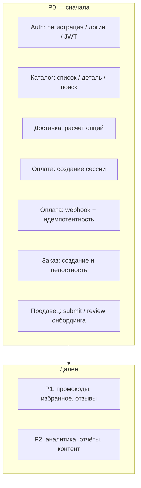
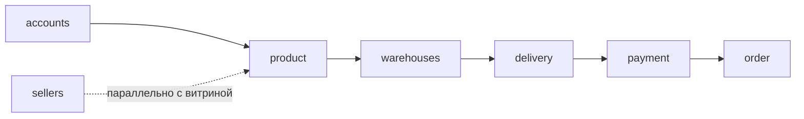
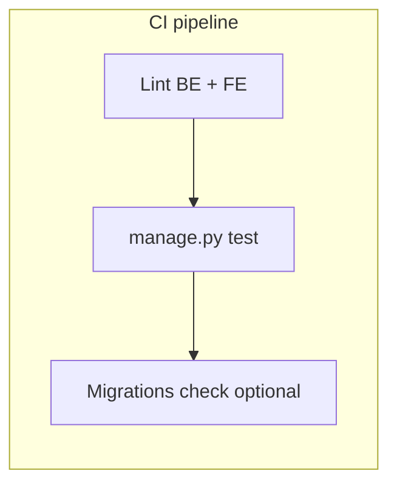

# 08. Testing Strategy

Краткая стратегия тестирования для монорепозитория Reli.one (Django + DRF backend, React/Vite frontend). Код не описывает обязательную реализацию — это целевой план и приоритеты.

## Definition of Done для этого документа

- Перечислены приоритеты и критические сценарии, согласованные с P0.
- Разделены уровни unit / integration (API).
- Указаны порядок покрытия apps, моки, фикстуры, локальный запуск и CI.
- Учтено **фактическое** состояние: backend использует `django.test` / `APITestCase` / `APIClient`; осмысленные тесты есть в `accounts`, `sellers`; у многих apps файлы `tests.py` пустые; `pytest.ini` нет; в активном frontend (`Frontend3`) нет скрипта тестов в `package.json`.

---

## Текущее состояние (снимок)

| Область | Состояние |
|---------|-----------|
| Backend | Точечные тесты: регистрация покупателя (`accounts`), валидация онбординга и API-блок персональных данных (`sellers`). |
| Frontend | Тестовый раннер не подключён. |
| Инфра | При отсутствии переменных БД в `settings` включается SQLite `:memory:` — удобно для быстрых прогонов без Postgres. |
| CI | Автоматический прогон тестов в pipeline нужно зафиксировать как целевое требование (см. раздел CI). |

---

## Пирамида и приоритеты P0



**Рекомендация по skills:** на этапах внедрения pytest, фабрик, CI и babysit-цикла полезно искать готовые skills командой `/find-skills` (например: pytest-django, factory_boy, настройка pipeline). Подбор — по контексту этапа, не обязателен ко всем задачам.

---

## 1. Какие тесты нужны в первую очередь

1. **API / integration** по цепочке «покупатель»: auth → каталог → корзина/чекаут (через оплату и webhook) → заказы.
2. **Unit** там, где много чистой логики без I/O: сплит посылок, таблицы тарифов Packeta/DPD/GLS, валидации онбординга, расчёты сумм.
3. **Контрактные проверки** ответов ключевых view (коды, форма `couriers.*` для доставки, структура сессии оплаты) — чтобы не ломать фронт и интеграции.

Регрессии по P0 закрывать раньше, чем расширять покрытие второстепенных apps.

---

## 2. Критические бизнес-сценарии (покрыть явно)

| Сценарий | Что проверить |
|----------|----------------|
| Регистрация / логин | Создание пользователя, уникальность email/телефона, ошибки валидации; выдача / обновление JWT (refresh, blacklist при необходимости). |
| Каталог | Листинг с фильтрами/пагинацией, карточка товара, поиск (в т.ч. пустой результат и границы). |
| Расчёт доставки | `SellerShippingOptionsView`: валидация входа, агрегация по перевозчикам, частичный фейл одного курьера (остальные OK), соответствие правилам сплита/веса. |
| Создание платёжной сессии | Stripe / PayPal: валидация групп, CZ-origin SKU, сохранение метаданных, мок вызовов внешнего API. |
| Webhook + идемпотентность | Повтор одного и того же события не создаёт дубликаты заказов/платежей; корректный ответ при уже обработанной сессии (см. описание в OpenAPI `payment/views`). |
| Создание заказа | После успешной оплаты (или прямой сценарий создания, если есть): статусы, строки заказа, связь с продавцом и доставкой. |
| Онбординг продавца | Submit с валидными данными; review-слой (статусы, права); негативные кейсы валидации (пример — `validate_before_submit`, держатель счёта для компании). |

---

## 3. Порядок покрытия Django apps (первыми)

Учитывая граф зависимостей и P0:



1. **accounts** — база для всех сценариев с аутентификацией.
2. **product** (+ при необходимости **supplier**) — данные для поиска/детали.
3. **warehouses** — привязка складов к вариантам (важно для CZ-origin и доставки).
4. **delivery** — расчёты и публичные/продавец-эндпоинты.
5. **payment** — сессии и webhooks (максимальный риск денег и дубликатов).
6. **order** — итоговая модель после оплаты и ручных потоков.
7. **sellers** — онбординг submit/review (уже частично покрыт — расширять).

Остальные apps (**promocode**, **favorites**, **reviews**, …) — после стабилизации P0.

---

## 4. Что оставить на уровне unit

- **delivery**: чистые функции в `services/local_rates.py`, `shipping_split.py`, `dpd_rates.py`, `gls_rates.py` — входные структуры `items`, границы веса/габаритов, агрегация посылок.
- **sellers**: сервисы наподобие `get_expected_company_account_holder`, `validate_before_submit` (уже есть unit-примеры).
- **payment**: разбор/нормализация payload-ов, валидация групп (`PaymentSessionValidator`), вспомогательные функции без HTTP.
- **order**: расчёты итогов по позициям (например сервисы детализации заказа продавца), если логика изолирована от ORM или через лёгкие объекты.
- **serializers**: кастомная валидация полей там, где она нетривиальна.

Критерий: тест быстрый, без реального Postgres/Redis/HTTP при желании (мок только точечно).

---

## 5. Что делать integration / API тестами

- Полный запрос-ответ через `APIClient` / `APITestCase`: эндпоинты **accounts** (register, login, token).
- **product**: list, detail, search-параметры.
- **delivery**: POST расчёта с преднастроенными вариантами и складами (без вызова внешних API, если они проброшены — мок).
- **payment**: создание сессии (Stripe/PayPal) с моком SDK/HTTP; webhooks с поддельной подписью или bypass только в тестовом режиме (предпочтительно патч `construct_event` / `verify_webhook`).
- **order**: создание и чтение заказа в связке с платежом (или фикстура «оплаченная сессия»).
- **sellers**: цепочка шагов онбординга, submit, админский/операторский review.

Использовать реальные миграции и БД тестового слоя (SQLite in-memory или отдельная БД в CI).

---

## 6. Внешние интеграции: мокать

| Интеграция | Зачем |
|------------|--------|
| **Stripe** | `checkout.Session.create`, `Webhook.construct_event`, при необходимости retrieve session. |
| **PayPal** | OAuth token, создание order, `verify-webhook-signature`. |
| **HTTP к гео/маршрутизации DPD** (если не локальная заглушка) | Детерминированные ответы ZIP/normalize. |
| **Email / уведомления** | Не слать реальные письма в CI; патч задач/celery/email backend. |
| **Cloudinary** | Загрузки медиа в сценариях с картинками — стаб или dummy storage. |

Кэш (например PayPal token) — использовать `cache.clear()` или локальный dummy cache в тестах.

---

## 7. Factories / fixtures

Рекомендуемый стек: **factory_boy** (+ при желании `pytest-django`, если перейдёте на pytest). Минимальный набор фабрик:

- `CustomUser` (роли customer / seller / staff).
- `SellerProfile` и связанные сущности онбординга.
- `Product` / `ProductVariant` (SKU, вес, связь с продуктом, VAT).
- `Warehouse` (country=CZ для happy-path оплаты/доставки).
- Записи тарифов **delivery** (`ShippingRate` и аналоги — по фактическим моделям).
- `StripeMetadata` / `PayPalMetadata` с JSON групп для прогона webhook.
- Завершённый **Order** + `OrderProduct` для чтения кабинета.

Общие **fixtures**: аутентифицированный клиент по ролям; минимальная «витрина» из 2–3 SKU и одного продавца.

---

## 8. Локальный запуск

Из каталога `backend` (активировано venv с зависимостями проекта):

```bash
# все тесты
python manage.py test

# один app
python manage.py test accounts sellers delivery payment order product

# один класс/тест (пример)
python manage.py test sellers.tests.CompanyAccountHolderValidationTests
```

Без заданных переменных Postgres в окружении тесты используют SQLite in-memory (см. `backend/settings.py`). Для проверки ближе к продакшену — задать `DB_*` на локальную пустую БД и прогнать миграции.

**Frontend (`Frontend3`):** после подключения Vitest/Jest команды добавить в `package.json`; до этого — ручной и E2E позже.

> **Skills:** при первой настройке pytest + маркеров — `/find-skills`.

---

## 9. CI: что должно запускаться

Минимум для merge:

1. **Backend:** `python manage.py test` с окружением без продакшен-секретов (in-memory SQLite или сервис Postgres в job).
2. **Lint** для backend (ruff/flake8/pep8 — что принят в проекте) и **eslint** для `Frontend3` (`npm run lint`).
3. Опционально порог **coverage** по apps P0 (нарастающим итогом).

Не запускать в CI реальные webhook к Stripe/PayPal; не использовать продакшен ключи.



> **Skills:** стабильный PR и починка CI по комментариям — см. `/find-skills` (например babysit/skill про цикл «тесты — правки»).

---

## Этапы внедрения (кратко)

| Этап | Действия | Skills (подобрать через `/find-skills`) |
|------|-----------|----------------------------------------|
| 0 | Зафиксировать CI job с `manage.py test` + lint | CI, babysit |
| 1 | Дотянуть P0 API-тесты в `accounts`, `product`, `delivery`, `payment`, `order` | pytest-django, factory |
| 2 | Unit-пакет для `delivery/services/*` и критичных валидаторов | — |
| 3 | Подключить frontend unit (Vitest + RTL) для auth и checkout-форм | — |
| 4 | Поздний слой: E2E (Playwright) для 1–2 happy-path | E2E skill при наличии |

---

## Связанные документы

- `docs/09-architecture-debt.md` — замечания по текущему объёму тестов и tooling.
- `docs/02-user-flows.md`, `docs/01-business-domains.md` — сценарии для расширения P1/P2.
