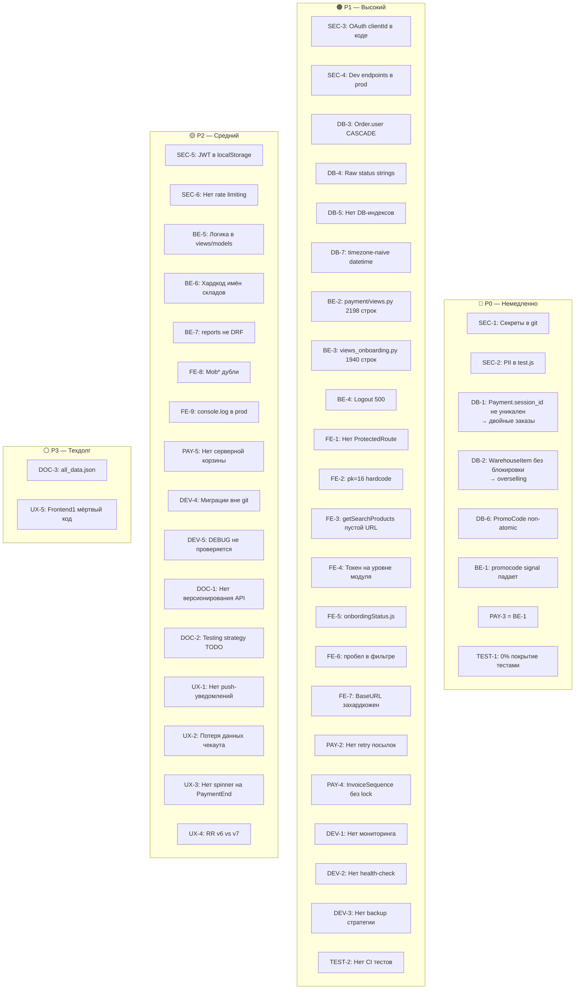
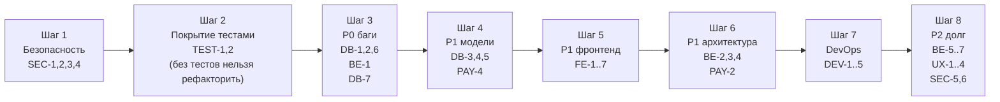

# 09. Architecture Debt

> Архитектурный технический долг на основе анализа кода и документации.
> Источники: `03-backend-architecture.md`, `04-frontend-architecture.md`, `05-database-model.md`, реальный код.

**Приоритеты:** `P0` — критично (поломан функционал / угроза данным) · `P1` — высокий · `P2` — средний · `P3` — техдолг

> **Совет по инструментарию.** Перед реализацией каждого блока рекомендуется выполнить `/find-skills` —
> в репозитории могут быть готовые skill-файлы для рефакторинга сервисов, написания тестов,
> настройки CI, GDPR-анонимизации и т.д.

---

## Содержание

1. [Security](#1-security)
2. [Database Model](#2-database-model)
3. [Backend Architecture](#3-backend-architecture)
4. [Frontend Architecture](#4-frontend-architecture)
5. [Payment / Order / Delivery Lifecycle](#5-payment--order--delivery-lifecycle)
6. [Testing](#6-testing)
7. [Deployment / DevOps](#7-deployment--devops)
8. [Documentation](#8-documentation)
9. [UX / Product Issues](#9-ux--product-issues)
10. [Сводная карта приоритетов](#10-сводная-карта-приоритетов)

---

## 1. Security

### SEC-1: Секреты в git-истории `P0`

**Описание:** TLS-ключ `solopharma.shop`, учётные данные из `redux/index.js`, пароль PostgreSQL из `envs/database.env` — всё было зафиксировано в коммитах. Файлы удалены из HEAD, но история не очищена.

**Риск:** Любой, кто клонирует репозиторий, может извлечь секреты через `git log -p`.

**Файлы:** `backend/backend/www.solopharma.shop.key`, `envs/database.env`, `envs/backend.env`, `Frontend/Frontend3/src/redux/index.js`

**Business impact:** Компрометация PostgreSQL, домена, аккаунта → полный доступ к данным покупателей и продавцов.

**Technical impact:** Необходимы `git filter-repo` + force push + ротация всех скомпрометированных учётных данных.

**Рекомендация:**
```bash
pip install git-filter-repo
git filter-repo --path envs/database.env --invert-paths
git filter-repo --path envs/backend.env --invert-paths
git filter-repo --path backend/backend/www.solopharma.shop.key --invert-paths
# После — согласовать force push с командой, fresh clone всем
```
Сменить пароли PostgreSQL, Stripe, Google OAuth, SMTP.

**Без миграций:** Да · **Тесты нужны:** Нет (инфраструктурная задача)

---

### SEC-2: PII в исходном коде фронтенда `P0`

**Описание:** `Frontend/Frontend3/src/code/test.js` содержит реальные имя, email, телефон, адрес покупателя и Stripe `session_id` в закомментированном коде.

**Риск:** Нарушение GDPR Art. 5 (data minimisation) + утечка при любом публичном доступе к репозиторию.

**Файлы:** `Frontend/Frontend3/src/code/test.js`

**Business impact:** Регуляторный штраф до 4% годового оборота (GDPR Art. 83).

**Technical impact:** Низкий — файл можно просто удалить.

**Рекомендация:** Удалить файл и очистить из git-истории вместе с SEC-1.

**Без миграций:** Да · **Тесты нужны:** Нет

---

### SEC-3: Google OAuth `clientId` захардкожен в исходнике `P1`

**Описание:** `GoogleOAuthProvider clientId="..."` прописан прямо в `Frontend/Frontend3/src/main.jsx`.

**Риск:** При утечке репозитория OAuth-приложение скомпрометировано; смена `clientId` требует правки кода и деплоя.

**Файлы:** `Frontend/Frontend3/src/main.jsx`

**Business impact:** Возможны фишинговые OAuth-приложения от имени reli.one.

**Technical impact:** Вынос в `VITE_GOOGLE_CLIENT_ID` — изменение в одном файле.

**Рекомендация:** `VITE_GOOGLE_CLIENT_ID=...` в `.env`, `clientId={import.meta.env.VITE_GOOGLE_CLIENT_ID}` в коде. Добавить `.env.example`.

**Без миграций:** Да · **Тесты нужны:** Нет

---

### SEC-4: Dev-эндпоинты доставки доступны в продакшне `P1`

**Описание:** `delivery/api/dev_views.py` (`DevShipMyGLS`, `DevShipDPD`, `DevDpdPrintByShipment`) зарегистрированы в `delivery/urls.py` без `DEBUG`-guard.

**Риск:** Внешний вызов создаст реальное отправление в системе провайдера без заказа.

**Файлы:** `backend/delivery/urls.py`, `backend/delivery/api/dev_views.py`

**Business impact:** Непредвиденные расходы на курьерские услуги; подделка отправлений.

**Technical impact:** Добавить `if settings.DEBUG:` вокруг регистрации маршрутов.

**Рекомендация:**
```python
# delivery/urls.py
if settings.DEBUG:
    urlpatterns += [path("dev/...", DevShipMyGLS.as_view()), ...]
```

**Без миграций:** Да · **Тесты нужны:** Нет

---

### SEC-5: JWT хранится в `localStorage` `P2`

**Описание:** `localStorage['token'] = JSON.stringify({access, refresh})` — доступен любому JS на странице (XSS).

**Риск:** XSS-атака → угон сессии; `refresh`-токен долгоживущий.

**Файлы:** `Frontend/Frontend3/src/api/auth.js`, все axios-методы

**Business impact:** Угон аккаунтов покупателей и продавцов при XSS-уязвимости в любом компоненте.

**Technical impact:** Переход на `httpOnly cookie` требует изменений в Django (cookie-based JWT) и всех axios-запросах.

**Рекомендация:** Краткосрочно — добавить строгий CSP-заголовок через nginx. Долгосрочно — `httpOnly` cookie + DRF `SessionAuthentication` или `simplejwt` cookie-режим.

**Без миграций:** Да · **Тесты нужны:** Да (auth flow)

---

### SEC-6: Нет rate limiting на API `P2`

**Описание:** Ни nginx-конфигурация, ни DRF throttling не ограничивают частоту запросов. OTP-эндпоинты (`/email/otp/resend/`, `/check-otp-password-reset/`) открыты для brute-force.

**Риск:** Перебор OTP-кодов (4-значный `IntegerField` — 10 000 вариантов); email-спам через форму обратной связи.

**Файлы:** `backend/backend/settings.py`, `backend/accounts/views.py`

**Business impact:** Захват аккаунтов, репутационный ущерб от спама.

**Technical impact:** `DEFAULT_THROTTLE_CLASSES` + `DEFAULT_THROTTLE_RATES` в DRF settings; `limit_req` в nginx.

**Рекомендация:**
```python
REST_FRAMEWORK = {
    "DEFAULT_THROTTLE_CLASSES": ["rest_framework.throttling.AnonRateThrottle"],
    "DEFAULT_THROTTLE_RATES": {"anon": "20/min"},
}
```

**Без миграций:** Да · **Тесты нужны:** Нет (конфигурация)

> 💡 `/find-skills` — может быть skill для настройки DRF throttling.

---

## 2. Database Model

### DB-1: `Payment.session_id` не уникален → дублирование заказов `P0`

**Описание:** Stripe может доставить `checkout.session.completed` дважды. `Payment.session_id` — `CharField` без `unique=True`. Webhook создаёт новый `Payment` + `Order` при каждой доставке события.

**Риск:** Двойной заказ, двойное списание промокода, двойное создание посылок.

**Файлы:** `backend/payment/models.py`, `backend/payment/views.py`

**Business impact:** Финансовые потери, дублирование отправлений, недовольство покупателей.

**Technical impact:** Миграция `unique=True` на `session_id` + `get_or_create` в webhook.

**Рекомендация:**
```python
# payment/models.py
session_id = models.CharField(max_length=100, unique=True)

# payment/views.py (webhook handler)
payment, created = Payment.objects.get_or_create(session_id=session_id, defaults={...})
if not created:
    return Response(status=200)  # idempotent
```

**Без миграций:** Нет (нужна миграция `unique=True`) · **Тесты нужны:** Да (дублирующий webhook)

---

### DB-2: `WarehouseItem` — нет резервирования, нет блокировки `P0`

**Описание:** `decrease_stock` в `warehouses/services.py` читает и обновляет `quantity_in_stock` без `select_for_update()`. Нет поля `reserved_quantity` — между созданием платёжной сессии и webhook-ом товар может быть продан снова.

**Риск:** Overselling: `quantity_in_stock` уходит в минус при параллельных заказах.

**Файлы:** `backend/warehouses/services.py`, `backend/warehouses/models.py`

**Business impact:** Продажа несуществующего товара → невозможность отгрузки → возврат + репутационный ущерб.

**Technical impact:** Добавить `reserved_quantity` (миграция), `select_for_update()` в `decrease_stock`.

**Рекомендация:**
```python
# warehouses/services.py
def decrease_stock(variant_id, qty):
    item = WarehouseItem.objects.select_for_update().get(product_variant_id=variant_id)
    if item.quantity_in_stock < qty:
        raise InsufficientStockError()
    item.quantity_in_stock -= qty
    item.save(update_fields=["quantity_in_stock"])
```

**Без миграций:** Нет (нужен `reserved_quantity`) · **Тесты нужны:** Да (concurrent webhook test)

---

### DB-3: `Order.user` — CASCADE вместо SET_NULL `P1`

**Описание:** `Order.user = FK(CASCADE)` — при удалении покупателя физически удаляются все его заказы, что нарушает требование хранить финансовые данные 10 лет (GDPR + бухгалтерское право ЧР/СК).

**Файлы:** `backend/order/models.py`

**Business impact:** Уничтожение налоговых документов → регуляторный штраф.

**Technical impact:** Миграция `on_delete=SET_NULL, null=True`.

**Рекомендация:** `on_delete=models.SET_NULL, null=True` + `UserDeletionService` (анонимизация contact-полей в Order вместо удаления строки).

**Без миграций:** Нет · **Тесты нужны:** Да (deletion flow)

---

### DB-4: `OrderStatus` / `DeliveryType` / `DeliveryStatus` — raw strings `P1`

**Описание:** Статусы хранятся как `CharField` в отдельных lookup-таблицах без `unique=True` и без `TextChoices`. Проверки вида `order_status.name == 'Closed'` разбросаны по 4+ файлам.

**Файлы:** `backend/order/models.py`, `backend/reviews/permissions.py`, `backend/order/seller_views.py`

**Business impact:** Опечатка в одном месте ломает переходы статусов или доступ к отзывам незаметно.

**Technical impact:** Добавить `unique=True` на `name`; создать константы или `TextChoices`; централизовать сравнения.

**Рекомендация:** Краткосрочно — добавить `unique=True` + файл `backend/order/constants.py` с `ORDER_STATUS_CLOSED = "Closed"`. Долгосрочно — `TextChoices`.

**Без миграций:** Нет (для unique) · **Тесты нужны:** Да (status transition tests)

---

### DB-5: Нет критичных DB-индексов `P1`

**Описание:** Отсутствуют индексы на часто фильтруемых полях.

| Модель | Поле | Используется в |
|--------|------|---------------|
| `BaseProduct` | `status`, `seller_id` | Каталог, кабинет продавца |
| `Order` | `user_id`, `order_status_id`, `order_date` | Список заказов |
| `OrderProduct` | `seller_profile_id`, `status` | Кабинет продавца |
| `CustomUser` | `role` | `limit_choices_to`, managers |
| `OnboardingAuditLog` | `application_id`, `created_at` | ✅ Уже есть |

**Business impact:** Деградация производительности при росте данных; медленный каталог.

**Technical impact:** Django миграции с `Meta.indexes`.

**Рекомендация:**
```python
class Meta:
    indexes = [
        models.Index(fields=["status", "seller_id"]),  # BaseProduct
        models.Index(fields=["user_id", "order_status_id"]),  # Order
    ]
```

**Без миграций:** Нет · **Тесты нужны:** Нет (производительность)

---

### DB-6: `PromoCode.increment_used_count` — не атомарный `P0`

**Описание:** `self.used_count += 1; self.save()` — при параллельных webhook-ах два процесса читают одно значение и оба инкрементируют до `N+1` вместо `N+2`.

**Файлы:** `backend/promocode/models.py`

**Business impact:** Промокод используется больше `max_usage` раз → убыток от незапланированных скидок.

**Technical impact:** Однострочное исправление через `F`-выражение.

**Рекомендация:**
```python
def increment_used_count(self):
    PromoCode.objects.filter(pk=self.pk).update(used_count=F("used_count") + 1)
```

**Без миграций:** Да · **Тесты нужны:** Да (concurrent increment test)

---

### DB-7: `OrderProduct.received_at` — timezone-naive datetime `P1`

**Описание:** `self.received_at = datetime.now()` в `OrderProduct.save()` создаёт naive datetime при UTC-настройках Django (`USE_TZ=True`).

**Файлы:** `backend/order/models.py`

**Business impact:** Некорректные временные метки в инвойсах и отчётах.

**Technical impact:** Замена одной строки.

**Рекомендация:** `from django.utils import timezone; self.received_at = timezone.now()`

**Без миграций:** Да · **Тесты нужны:** Нет

---

## 3. Backend Architecture

### BE-1: `promocode/signal.py` гарантированно падает `P0`

**Описание:** Три независимые ошибки делают `PromoCode` полностью нерабочим:
1. `PromoCode.ValidationError` — такого класса нет → `AttributeError`
2. `instance.duration_in_months` — поля нет в модели → `AttributeError` при первом `post_save`
3. `settings.STRIPE_SECRET_KEY_TEST` — в `settings.py` нет такой переменной → `AttributeError`

**Файлы:** `backend/promocode/signal.py`, `backend/promocode/models.py`, `backend/backend/settings.py`

**Business impact:** Любое сохранение `PromoCode` через Admin или API вызывает 500; промокоды не работают.

**Technical impact:** Исправить три места; добавить тесты перед исправлением.

**Рекомендация:** Временно — отключить сигнал (`apps.py: signal import в try/except`). Затем — переписать, вынести Stripe-sync в сервис, убрать из сигнала.

**Без миграций:** Да · **Тесты нужны:** Да (написать до исправления, чтобы зафиксировать ожидаемое поведение)

---

### BE-2: `payment/views.py` — 2 198 строк, нарушение SRP `P1`

**Описание:** Один файл содержит: создание Stripe/PayPal сессий, обработку webhook, создание Order + OrderProduct, генерацию посылок, PDF-инвойс, email-уведомления, расчёт промокода.

**Файлы:** `backend/payment/views.py`

**Business impact:** Любое изменение затрагивает весь критический путь покупки; баги трудно изолировать.

**Technical impact:** Рефакторинг в сервисный слой (`payment/services/`); высокий риск регрессий без тестов.

**Рекомендация:**
```
payment/
├── views.py           ← только HTTP-слой (thin controllers)
└── services/
    ├── stripe_service.py    ← создание сессий
    ├── order_factory.py     ← Order + OrderProduct из метаданных
    ├── invoice_service.py   ← PDF + Invoice
    └── notification.py      ← email
```

**Без миграций:** Да · **Тесты нужны:** Да (написать integration-тесты webhook ДО рефакторинга)

> 💡 `/find-skills` — может быть skill для декомпозиции Django views / service layer pattern.

---

### BE-3: `sellers/views_onboarding.py` — 1 940 строк `P1`

**Описание:** Монолит с ветвлениями по `seller_type` и стране (CZ/SK vs другие), сложными условиями completeness, логикой ревью администратора.

**Файлы:** `backend/sellers/views_onboarding.py`, `backend/sellers/services_onboarding.py`

**Business impact:** Изменение одного шага онбординга рискует сломать другие; невозможно быстро добавить новую страну.

**Technical impact:** Декомпозиция по принципу step-handler; Country-стратегии.

**Рекомендация:** Краткосрочно — покрыть тестами текущее поведение. Долгосрочно — выделить `steps/`, `country_rules/`.

**Без миграций:** Да · **Тесты нужны:** Да (написать ДО рефакторинга)

---

### BE-4: `CustomLogoutView` — 500 при невалидном refresh-токене `P1`

**Описание:** `RefreshToken(refresh_token)` вызывается без `try/except TokenError`. Невалидный токен вызывает необработанное исключение → 500.

**Файлы:** `backend/accounts/views.py`

**Business impact:** Клиент не может выйти из системы при инвалидном токене → UX-блокировка.

**Technical impact:** Добавить `try/except` вокруг `RefreshToken(...)`.

**Рекомендация:**
```python
try:
    token = RefreshToken(refresh_token)
    token.blacklist()
except TokenError:
    pass  # токен уже невалиден — считаем логаут успешным
return Response(status=205)
```

**Без миграций:** Да · **Тесты нужны:** Да

---

### BE-5: Бизнес-логика размазана по views/models/signals `P2`

**Описание:** Логика OTP-блокировок — в `accounts/views.py`; логика цены — в `BaseProduct.min_price_with_acquiring`, `ProductVariant.price_with_acquiring`, `FavoriteProductListAPIView`; проверка отзыва — в `permissions.py` + `serializers.py`.

**Файлы:** `backend/accounts/views.py`, `backend/product/models.py`, `backend/favorites/views.py`, `backend/reviews/permissions.py`

**Business impact:** При изменении бизнес-правила (например, ставки эквайринга 1.04→1.05) нужно менять в 3 местах — легко пропустить.

**Technical impact:** Выделить `product/services/pricing.py`, `accounts/services/otp_service.py`.

**Рекомендация:** Вынести коэффициент `ACQUIRING_RATE = Decimal("1.04")` в `backend/settings.py` или `product/constants.py`.

**Без миграций:** Да · **Тесты нужны:** Да (юнит-тесты сервисов)

---

### BE-6: `analytics` — захардкожены имена складов `P2`

**Описание:** `Warehouse.objects.get(name="Vendor warehouse")` / `"Reli warehouse"` в `analytics/services.py`. При переименовании склада в Django Admin — `DoesNotExist`.

**Файлы:** `backend/analytics/services.py`

**Business impact:** Аналитика продавца перестаёт работать при изменении данных в справочнике.

**Technical impact:** Добавить `warehouse_type` поле к `Warehouse` или использовать `Warehouse.objects.get(pk=settings.VENDOR_WAREHOUSE_ID)`.

**Рекомендация:** Краткосрочно — `try/except DoesNotExist` с дефолтным значением. Долгосрочно — `warehouse_type = CharField(choices=...)`.

**Без миграций:** Да (краткосрочно) · **Тесты нужны:** Нет

---

### BE-7: `reports` app — не DRF, нет обработки ошибок `P2`

**Описание:** `generate_report` возвращает `render(request, template)` — HTML в JSON API-проекте. `Supplier.DoesNotExist` не обработан → 500.

**Файлы:** `backend/reports/views.py`

**Business impact:** Нет (внутренний инструмент). Но при 500 поставщик не получает отчёт.

**Technical impact:** Добавить `try/except`; или переписать как DRF view с PDF-response.

**Рекомендация:** Добавить `try/except ObjectDoesNotExist: return Response({"detail": "..."}, 404)`.

**Без миграций:** Да · **Тесты нужны:** Нет

---

## 4. Frontend Architecture

### FE-1: Нет `ProtectedRoute` `P1`

**Описание:** Страницы `/seller/*` и авторизованные страницы покупателя (`/my_orders`, `/liked`) открываются без проверки аутентификации. Защита работает только через 401 от API — пользователь видит пустые страницы или ошибки.

**Файлы:** `Frontend/Frontend3/src/main.jsx`

**Business impact:** Продавец без верификации может видеть интерфейс кабинета; UX-проблема для неавторизованных.

**Technical impact:** Добавить `<ProtectedRoute>` компонент с проверкой `localStorage['token']` и редиректом.

**Рекомендация:**
```jsx
const ProtectedRoute = ({ children, roles }) => {
  const token = JSON.parse(localStorage.getItem("token") || "null");
  if (!token?.access) return <Navigate to="/seller/login" />;
  return children;
};
```

**Без миграций:** Да · **Тесты нужны:** Нет (UI-изменение)

---

### FE-2: Хардкод `?pk=16` в `getDetalOrders` `P1`

**Описание:** `src/api/orders.js` содержит `get("/orders/{id}/?pk=16")` — хардкод primary key, не относящегося к текущему пользователю.

**Файлы:** `Frontend/Frontend3/src/api/orders.js`

**Business impact:** Покупатели видят чужой заказ (#16) при открытии деталей — утечка данных.

**Technical impact:** Заменить `pk=16` на параметр из аргумента функции.

**Рекомендация:** `get(\`/orders/${id}/\`)` — передавать `id` как аргумент.

**Без миграций:** Да · **Тесты нужны:** Нет

---

### FE-3: `getSearchProducts` → `get("")` — возвращает HTML `P1`

**Описание:** `src/api/productsApi.js`: `getSearchProducts` вызывает `axios.get("")` — пустой URL → запрос идёт на корень, возвращает HTML.

**Файлы:** `Frontend/Frontend3/src/api/productsApi.js`

**Business impact:** Поиск не работает — пустой URL возвращает не JSON, а HTML страницы.

**Technical impact:** Исправить на `/products/search/?q=${query}`.

**Без миграций:** Да · **Тесты нужны:** Нет

---

### FE-4: Токен читается при инициализации модуля `P1`

**Описание:** `productsSlice.js` (строки 6-7) и `commentApi.js` парсят `localStorage.getItem("token")` на верхнем уровне модуля. После логина без перезагрузки страницы токен не обновляется → стабильные 401.

**Файлы:** `Frontend/Frontend3/src/redux/productsSlice.js`, `Frontend/Frontend3/src/api/commentApi.js`

**Business impact:** Покупатель залогинился → переходит к товару → отзывы не загружаются (401).

**Technical impact:** Читать токен внутри функции, не на уровне модуля.

**Рекомендация:**
```js
// Было: const token = JSON.parse(localStorage.getItem("token"))  // верхний уровень
// Стало:
const getToken = () => JSON.parse(localStorage.getItem("token") || "null");

// Внутри запроса:
headers: { Authorization: `Bearer ${getToken()?.access}` }
```

**Без миграций:** Да · **Тесты нужны:** Нет

---

### FE-5: `onbordingStatus.js` — неправильный эндпоинт `P1`

**Описание:** Файл вызывает `POST /accounts/password/reset/confirmation/` с пустым телом для «получения статуса онбординга» — это эндпоинт сброса пароля, не статуса.

**Файлы:** `Frontend/Frontend3/src/api/seller/onbordingStatus.js`

**Business impact:** Страница статуса онбординга продавца не загружает данные.

**Technical impact:** Заменить вызов на `GET /sellers/onboarding/state/`.

**Без миграций:** Да · **Тесты нужны:** Нет

---

### FE-6: Пробел в `?status=not_closed ` `P1`

**Описание:** `src/api/orders.js`: `?status=not_closed ` — trailing пробел в query string.

**Файлы:** `Frontend/Frontend3/src/api/orders.js`

**Business impact:** Фильтр «текущие заказы» может не работать → пустой список.

**Technical impact:** Убрать пробел. Однострочное исправление.

**Без миграций:** Да · **Тесты нужны:** Нет

---

### FE-7: `BaseURL` захардкожен, нет `.env` `P1`

**Описание:** `BaseURL = "" || "https://reli.one/api"` в коде. Переключение на staging требует правки исходников.

**Файлы:** `Frontend/Frontend3/src/api/*.js`

**Business impact:** Нельзя тестировать на staging без отдельного билда с изменёнными файлами.

**Technical impact:** `VITE_API_URL` в `.env` + `.env.example`.

**Рекомендация:** `const BaseURL = import.meta.env.VITE_API_URL || "https://reli.one/api"`

**Без миграций:** Да · **Тесты нужны:** Нет

---

### FE-8: Мобильные страницы — дублирование вместо адаптивного CSS `P2`

**Описание:** `MobLoginPage`, `MobBasketPage`, `MobCategoryPage` — отдельные компоненты с дублированной логикой десктопных страниц.

**Файлы:** `Frontend/Frontend3/src/pages/Mob*/`

**Business impact:** При изменении логики нужно менять в двух местах — регрессии.

**Technical impact:** CSS media queries + единые компоненты.

**Без миграций:** Да · **Тесты нужны:** Нет

---

### FE-9: `console.log` в production-коде `P2`

**Описание:** `console.log` / `console.error` в `auth.js`, `payment.js`, `banner.js`, `newOrderSlice.js`, `paymentSlice.js` — возможная утечка токенов, session_id, адресов в DevTools.

**Файлы:** Множество `src/api/*.js`, `src/redux/*.js`

**Рекомендация:** ESLint rule `no-console: warn` + убрать существующие вызовы.

**Без миграций:** Да · **Тесты нужны:** Нет

---

## 5. Payment / Order / Delivery Lifecycle

### PAY-1: Нет idempotency в webhook-обработчике `P0`

> Дублирует DB-1. Смотри раздел [DB-1](#db-1-paymentsession_id-не-уникален--дублирование-заказов-p0).

---

### PAY-2: Нет retry при ошибке генерации посылок `P1`

**Описание:** Если Packeta/DPD/GLS недоступны в момент webhook, `generate_parcels_for_order` бросает исключение. В зависимости от обработки: либо транзакция откатится (заказ не создан), либо заказ создан, но без посылок.

**Файлы:** `backend/payment/views.py`, `backend/delivery/utils.py`

**Business impact:** Заказ существует в БД, но посылки не созданы — продавец не может сформировать отгрузку.

**Technical impact:** Добавить Celery task с retry для `generate_parcels_for_order` после commit транзакции.

**Рекомендация:**
```python
# После transaction.atomic() — не внутри
transaction.on_commit(lambda: generate_parcels_task.apply_async(args=[order.id]))
```

**Без миграций:** Да · **Тесты нужны:** Да (webhook + провайдер недоступен)

> 💡 `/find-skills` — может быть skill для настройки Celery retry pattern.

---

### PAY-3: `PromoCode` Stripe sync полностью сломан `P0`

> Дублирует BE-1. Смотри [BE-1](#be-1-promocodesignalpy--гарантированно-падает-p0).

---

### PAY-4: `InvoiceSequence` без `select_for_update` `P1`

**Описание:** Атомарная нумерация инвойсов через `InvoiceSequence.last_number` — без `select_for_update()` при инкременте возможно присвоение одного номера двум инвойсам при параллельных webhook-ах.

**Файлы:** `backend/order/services/invoice_numbers.py`

**Business impact:** Дублирующиеся номера инвойсов — нарушение бухгалтерского учёта.

**Technical impact:** Добавить `.select_for_update()` при чтении `InvoiceSequence`.

**Рекомендация:**
```python
with transaction.atomic():
    seq = InvoiceSequence.objects.select_for_update().get(series=year)
    seq.last_number += 1
    seq.save()
```

**Без миграций:** Да · **Тесты нужны:** Да (concurrent invoice creation test)

---

### PAY-5: Корзина только в Redux / localStorage `P2`

**Описание:** Нет серверной корзины. Очистка `localStorage`, смена браузера, вход с другого устройства → потеря корзины.

**Файлы:** `Frontend/Frontend3/src/redux/basketSlice.js`

**Business impact:** Потеря конверсии при переключении устройств.

**Technical impact:** Требует нового бэкенд-эндпоинта (`/cart/`) и синхронизации с Redux.

**Без миграций:** Нет (нужна модель `Cart`) · **Тесты нужны:** Да

---

## 6. Testing

### TEST-1: Покрытие тестами ≈ 0% `P0`

**Описание:** Backend: найден только `backend/sellers/tests.py` (~109 строк). Frontend: нет ни одного теста. Нет `pytest.ini`, нет CI-запуска тестов.

**Файлы:** Весь проект

**Business impact:** Любой рефакторинг критического пути (payment webhook, order creation) — высокий риск незамеченных регрессий.

**Technical impact:** Нет safety net для исправления P0/P1 проблем выше.

**Рекомендация:** Начать с integration-тестов критического пути:

```
Приоритет тестирования:
1. payment/webhook (idempotency, order creation)
2. accounts (registration, OTP, login)
3. order (lifecycle transitions)
4. warehouses (decrease_stock concurrency)
5. promocode (increment_used_count)
```

Стек: `pytest-django`, `factory-boy`, `freezegun`, `responses` (mock HTTP).

**Без миграций:** Да · **Тесты нужны:** — (это и есть задача)

> 💡 `/find-skills` — может быть skill для настройки pytest-django + factory_boy.

---

### TEST-2: Нет CI-запуска тестов `P1`

**Описание:** GitHub Actions / GitLab CI не настроены для автоматического запуска тестов при push.

**Business impact:** PR может сломать продакшн, если тесты не запущены вручную.

**Рекомендация:** Минимальный GitHub Actions workflow:
```yaml
jobs:
  test:
    runs-on: ubuntu-latest
    steps:
      - uses: actions/checkout@v4
      - run: pip install -r requirements.txt
      - run: pytest backend/ --tb=short
```

**Без миграций:** Да · **Тесты нужны:** Нет (инфраструктура)

---

## 7. Deployment / DevOps

### DEV-1: Нет мониторинга и алертинга `P1`

**Описание:** Нет Sentry, Prometheus, Grafana, CloudWatch. Инциденты (падение webhook, 500 в payment) обнаруживаются только по жалобам пользователей.

**Business impact:** Потеря заказов незаметна в real-time.

**Рекомендация:** Минимально — Sentry для Django (`sentry-sdk`) + Sentry для React. Добавить `SENTRY_DSN` в `backend.env`.

**Без миграций:** Да · **Тесты нужны:** Нет

> 💡 `/find-skills` — может быть skill для настройки Sentry в Django/React.

---

### DEV-2: Нет health-check эндпоинта `P1`

**Описание:** Load balancer / docker не имеет эндпоинта для проверки готовности сервиса.

**Файлы:** `backend/backend/urls.py`

**Рекомендация:**
```python
path("health/", lambda r: JsonResponse({"status": "ok"}), name="health"),
```

**Без миграций:** Да · **Тесты нужны:** Нет

---

### DEV-3: Нет стратегии backup БД и медиа `P1`

**Описание:** Не описан процесс резервного копирования PostgreSQL и Cloudinary/S3-медиа.

**Business impact:** Потеря данных при сбое — финансовые записи, KYC-документы.

**Рекомендация:** `pg_dump` через cron / managed DB backup + Cloudinary backup policy. Описать в `docs/07-deployment.md`.

**Без миграций:** Да · **Тесты нужны:** Нет

---

### DEV-4: Миграции исключены из git `P2`

**Описание:** `.gitignore: */migrations` — история изменений схемы БД не версионируется.

**Business impact:** Восстановление чистой БД без `all_data.json` невозможно; нет diff миграций в PR.

**Рекомендация:** Включить миграции в git. Добавить `makemigrations --check` в CI.

**Без миграций:** Да · **Тесты нужны:** Нет

---

### DEV-5: `DEBUG` не проверяется как `False` в продакшне `P2`

**Описание:** `settings.py` читает `DEBUG = env.bool("DEBUG", default=False)` — это нормально. Но нет `assert not DEBUG` при запуске gunicorn, и нет автоматической проверки в CI.

**Риск:** Если `.env` содержит `DEBUG=True` в проде — traceback видны в API-ответах.

**Рекомендация:** Добавить в `settings.py`:
```python
if not DEBUG:
    assert not DEBUG, "DEBUG must be False in production"
# или проверку при запуске gunicorn через WSGI
```

**Без миграций:** Да · **Тесты нужны:** Нет

---

## 8. Documentation

### DOC-1: Нет версионирования API `P2`

**Описание:** Все эндпоинты без `/api/v1/` префикса. Любое ломающее изменение затрагивает всех клиентов (Frontend3, Frontend2, мобильные приложения в будущем).

**Рекомендация:** DRF `DEFAULT_VERSIONING_CLASS = NamespaceVersioning` или URL-prefix `/api/v1/`. Вводить постепенно через новые URL, не ломая старые.

**Без миграций:** Да · **Тесты нужны:** Нет

---

### DOC-2: `08-testing-strategy.md` — полностью TODO `P2`

**Описание:** Документ по стратегии тестирования не заполнен.

**Рекомендация:** Заполнить после реализации TEST-1 — описать стек, фикстуры, запуск.

---

### DOC-3: `all_data.json` — назначение не документировано `P3`

**Описание:** `backend/fixtures/all_data.json` — непонятно, когда применяется, что содержит, актуален ли.

**Рекомендация:** Добавить README в папку fixtures или раздел в `07-deployment.md`.

---

## 9. UX / Product Issues

### UX-1: Нет уведомлений об изменении статуса заказа/онбординга `P2`

**Описание:** Продавец узнаёт о статусе онбординга только зайдя на страницу. Покупатель — только через email (если он отправляется корректно).

**Business impact:** Низкая вовлечённость продавцов; потеря сделок из-за задержки реакции.

**Рекомендация:** Push-уведомления (web push) или хотя бы email-триггеры при смене `OnboardingStatus` и `OrderStatus`.

**Без миграций:** Да · **Тесты нужны:** Нет

---

### UX-2: Состояние чекаута в Redux persist — потеря данных при перезагрузке `P2`

**Описание:** `payment.pageSection` (текущий шаг) персистится, но данные формы (контакты, адрес) не восстанавливаются полностью при перезагрузке на `/payment`.

**Файлы:** `Frontend/Frontend3/src/redux/paymentSlice.js`

**Business impact:** Пользователь теряет введённые данные при случайной перезагрузке → отказ от покупки.

**Рекомендация:** Персистировать данные формы или при монтировании страницы редиректить на шаг 1 если форма неполна.

---

### UX-3: Нет индикатора загрузки на `PaymentEnd` `P2`

**Описание:** Страница `/payment_end` выполняет polling `getDataFromSessionId`, но нет spinner/skeleton — пользователь видит пустой экран.

**Файлы:** `Frontend/Frontend3/src/pages/PaymentEnd.jsx`

**Business impact:** Неопределённость после оплаты → пользователь закрывает страницу, думая, что оплата не прошла.

---

### UX-4: Два React Router с несовместимыми мажорными версиями `P2`

**Описание:** Frontend2 — RR v7, Frontend3 — RR v6. Компоненты и утилиты несовместимы между проектами.

**Файлы:** `Frontend/Frontend2/package.json`, `Frontend/Frontend3/package.json`

**Рекомендация:** Обновить Frontend3 до RR v7 (breaking changes задокументированы) или зафиксировать политику «не шарить роутинг-компоненты».

---

### UX-5: `Frontend/Frontend1/` — мёртвый код? `P3`

**Описание:** Неясное назначение директории `Frontend/Frontend1/`. Возможно устаревший прототип.

**Рекомендация:** Проверить историю git, удалить если не используется.

---

## 10. Сводная карта приоритетов



### Рекомендуемый порядок исправления



> **Важно:** Шаг 2 (тесты) должен предшествовать Шагу 6 (рефакторинг payment/onboarding).
> Без тестов рефакторинг этих монолитов — неприемлемый риск.

> 💡 Перед началом каждого шага выполните `/find-skills` — это может существенно ускорить реализацию.
