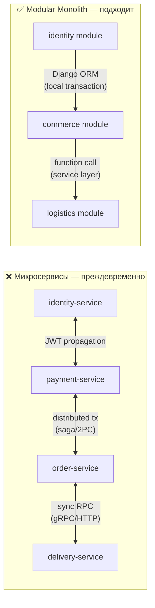
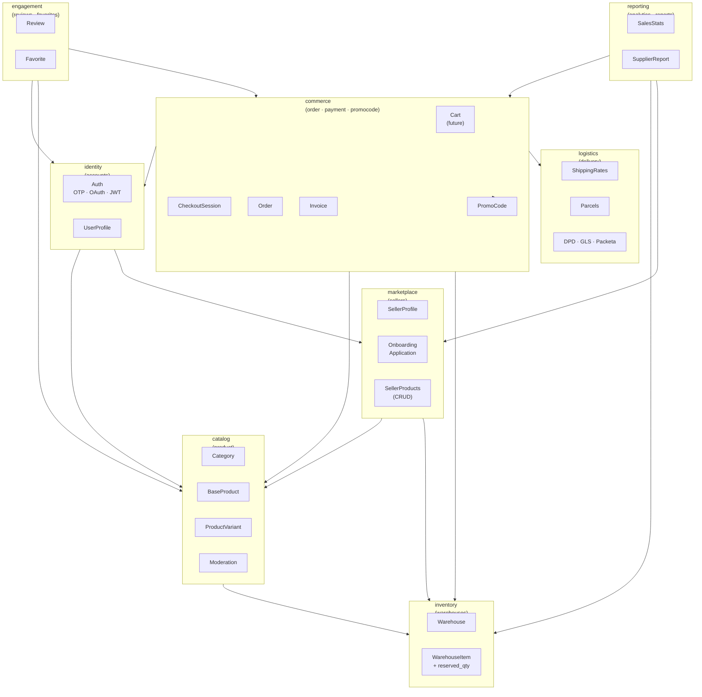
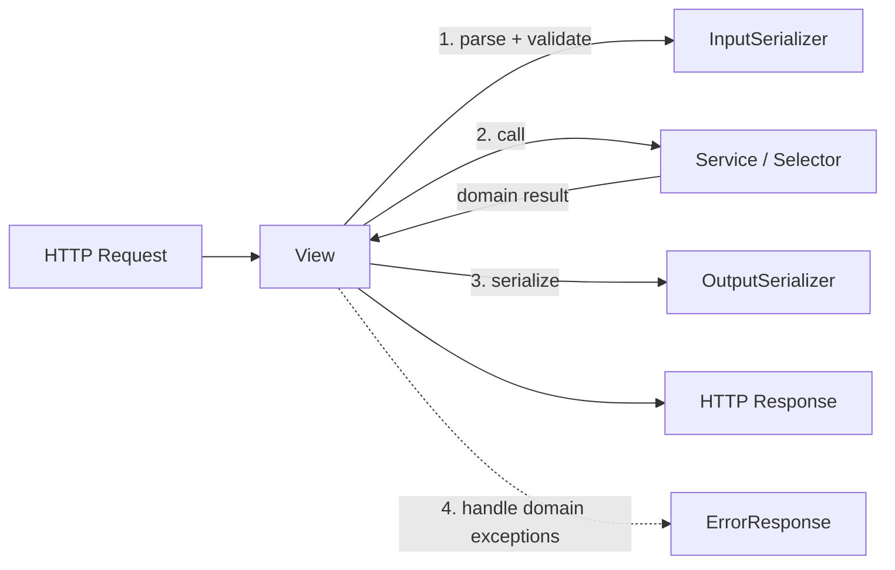
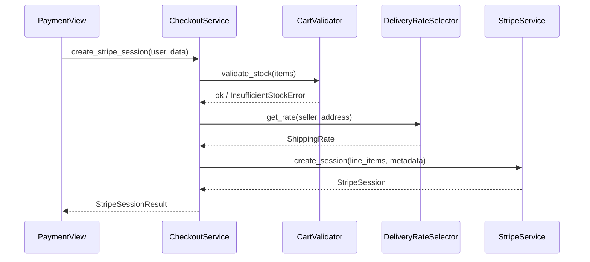
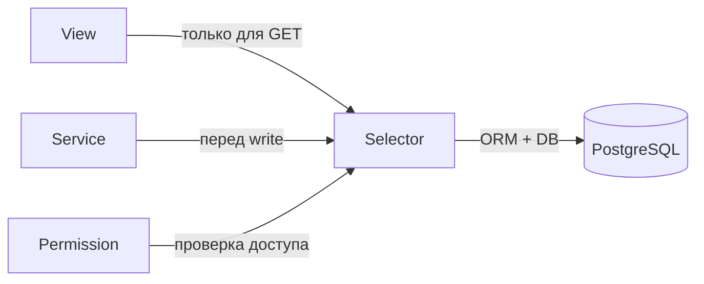
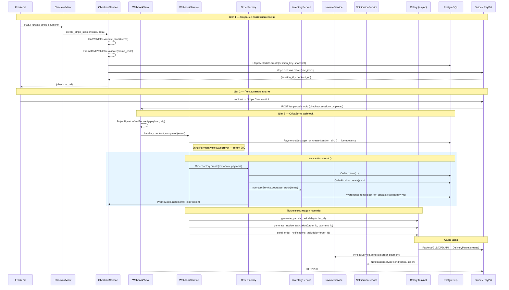
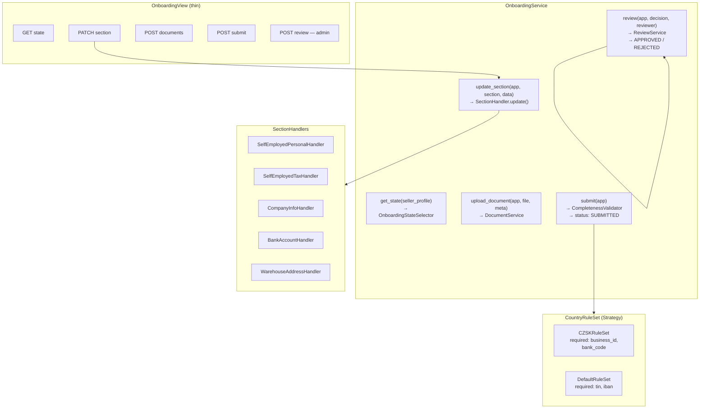
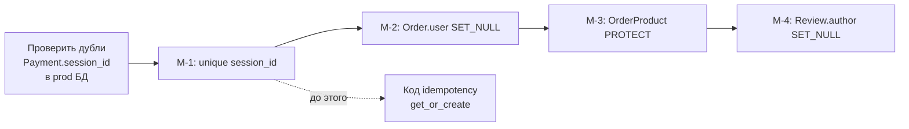
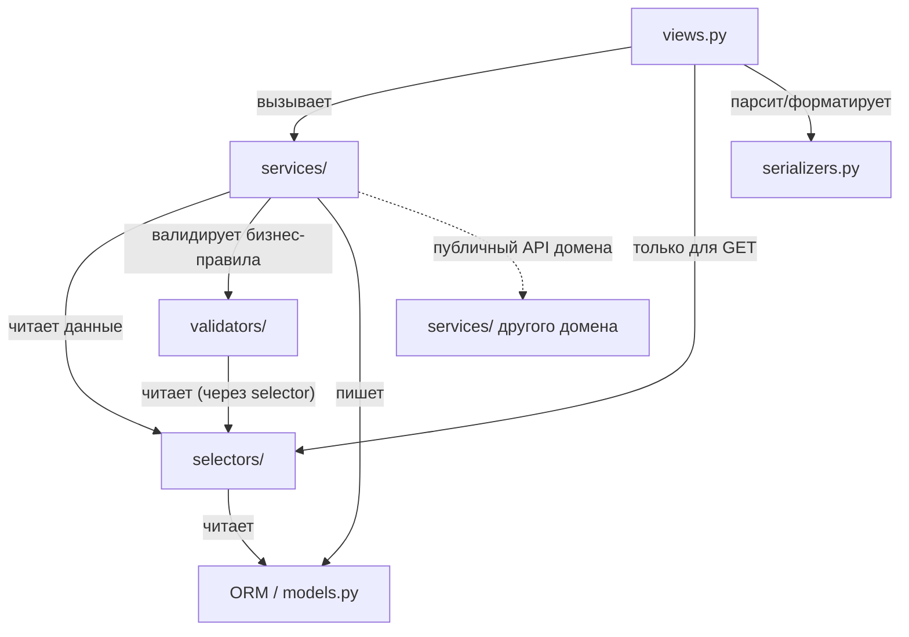

# 11. Target Backend Architecture — Modular Monolith

> Целевая архитектура backend на основе анализа текущего кода.
> Источники: `03-backend-architecture.md`, `09-architecture-debt.md`, реальные сервисы и views.

---

## Содержание

1. [Почему Modular Monolith, а не микросервисы](#1-почему-modular-monolith-а-не-микросервисы)
2. [Целевые границы доменов](#2-целевые-границы-доменов)
3. [Логика во views](#3-логика-во-views)
4. [Логика в serializers](#4-логика-в-serializers)
5. [Логика в services](#5-логика-в-services)
6. [Логика в selectors](#6-логика-в-selectors)
7. [Логика в validators](#7-логика-в-validators)
8. [Checkout / Order / Payment / Delivery pipeline](#8-checkout--order--payment--delivery-pipeline)
9. [Seller Onboarding pipeline](#9-seller-onboarding-pipeline)
10. [Изменения без смены API](#10-изменения-без-смены-api)
11. [Изменения, требующие миграций](#11-изменения-требующие-миграций)
12. [Что отложить](#12-что-отложить)

---

## 1. Почему Modular Monolith, а не микросервисы

### Текущий контекст

| Параметр | Значение |
|---------|---------|
| Backend | ~17 600 строк Python, 1 Django-процесс |
| Команда | Малая (< 5 разработчиков) |
| БД | Одна PostgreSQL, данные жёстко связаны FK |
| Трафик | Нет признаков bottleneck отдельных сервисов |
| Внешние зависимости | Stripe, PayPal, 3 курьерских провайдера, Cloudinary |

### Почему не микросервисы сейчас



**Причины:**

1. **Данные жёстко связаны.** `Order` → `Payment` → `Invoice` → `DeliveryParcel` → `OrderProduct` → `ProductVariant` — всё в одной транзакции. В микросервисах потребуется Saga + компенсационные транзакции.

2. **Команда маленькая.** Оверхед на DevOps (K8s, service mesh, distributed tracing) > выигрыш от изоляции.

3. **Нет независимо масштабируемых узких мест.** Gunicorn 4 workers справляется; узкое место — БД и внешние API, а не CPU/память отдельных сервисов.

4. **Модульный монолит решает главную проблему** — запутанность логики в 2000-строчных views — **без операционной сложности** микросервисов.

5. **Путь к микросервисам сохранён.** Чёткие границы доменов и service-layer позволят выделить любой модуль в отдельный процесс позже, если понадобится.

---

## 2. Целевые границы доменов

### Карта доменов



### Правила взаимодействия между доменами

| Правило | Описание |
|---------|---------|
| **Нет прямых импортов моделей между несмежными доменами** | `commerce` не импортирует `SellerProfile` напрямую — только через `marketplace.selectors` |
| **Публичный API домена = services + selectors** | Другие домены вызывают только публичные функции, не ORM напрямую |
| **Единственный поток зависимостей** | `commerce` → `inventory`, но не наоборот |
| **События через сигналы или callbacks — только для side effects** | `post_save` на `Review` для пересчёта рейтинга — нормально; оркестрация webhook — только через service |

---

## 3. Логика во views

### Принцип: thin controller

**View отвечает только за HTTP-слой.** Ни одной строчки бизнес-логики.



**Что делает view:**
1. Аутентификация / авторизация (через `permissions_classes`)
2. Десериализация и валидация входных данных (`InputSerializer.is_valid(raise_exception=True)`)
3. Вызов **одного** сервиса или селектора
4. Сериализация результата
5. Перехват доменных исключений → HTTP-коды

**Чего view не делает:**
- Не содержит `if seller_type == "company":` логики
- Не вызывает ORM напрямую (`Model.objects.filter(...)`)
- Не формирует PDF, не отправляет email
- Не содержит бизнес-валидаций (`if promo.used_count >= promo.max_usage:`)

### Целевой вид view

```python
# commerce/views.py
class CreateStripePaymentView(APIView):
    permission_classes = [IsAuthenticated]

    def post(self, request):
        serializer = CreateCheckoutSessionSerializer(data=request.data)
        serializer.is_valid(raise_exception=True)

        try:
            result = CheckoutService.create_stripe_session(
                user=request.user,
                validated_data=serializer.validated_data,
            )
        except InsufficientStockError as e:
            return Response({"detail": str(e)}, status=409)
        except InvalidPromoCodeError as e:
            return Response({"detail": str(e)}, status=400)

        return Response(CheckoutSessionOutputSerializer(result).data)
```

**Текущее состояние vs цель:**

| Файл | Сейчас | Цель |
|------|--------|------|
| `payment/views.py` | ~2 198 строк, оркестрирует всё | ~200 строк, только HTTP |
| `sellers/views_onboarding.py` | ~1 940 строк, ветвления по типу/стране | ~300 строк, делегирует в step-handlers |
| `accounts/views.py` | ~1 109 строк, OTP логика внутри | ~200 строк |

---

## 4. Логика в serializers

### Разделение Input / Output

**Не использовать один сериализатор для чтения и записи.** Это разные контракты.

```python
# Плохо — один сериализатор на всё:
class OrderSerializer(ModelSerializer):  # и читает, и записывает

# Хорошо:
class CreateOrderInputSerializer(Serializer):   # только валидация входа
class OrderDetailOutputSerializer(Serializer):  # только представление
class OrderListOutputSerializer(Serializer):    # компактное для списков
```

**Что делает Input Serializer:**
- Валидирует типы и форматы полей
- Проверяет обязательность полей
- Конвертирует данные в Python-типы
- **Не** проверяет бизнес-правила (наличие на складе, действительность промокода — это validator/service)

**Что делает Output Serializer:**
- Форматирует данные для ответа
- Добавляет вычисляемые поля (через `SerializerMethodField`)
- **Не** делает дополнительных запросов к БД без `select_related`/`prefetch_related`

**Нет бизнес-логики в `validate_*` методах:**
```python
# Плохо — бизнес-логика в сериализаторе:
def validate_promo_code(self, value):
    promo = PromoCode.objects.get(code=value)
    if promo.used_count >= promo.max_usage:  # ← бизнес-правило
        raise ValidationError("Limit reached")

# Хорошо — только формат:
def validate_promo_code(self, value):
    if not re.match(r'^[A-Z0-9]{4,20}$', value):
        raise ValidationError("Invalid promo code format")
    return value
# Бизнес-проверку делает PromoCodeValidator в service-слое
```

---

## 5. Логика в services

### Принципы

- **Один публичный метод = одна бизнес-операция** (create, confirm, submit, approve)
- **Транзакционность**: все write-операции в `@transaction.atomic`
- **Без HTTP-зависимостей**: не знает о `request`, `Response`, статус-кодах
- **Возвращает доменные объекты**, а не словари или HTTP-ответы
- **Бросает доменные исключения** (`InsufficientStockError`, `InvalidPromoCodeError`), не `ValidationError` из DRF

### Структура сервисного слоя

```
app/
└── services/
    ├── __init__.py          # экспортирует публичный API
    ├── create_*.py          # write-операции по типу
    ├── update_*.py
    └── delete_*.py
```

### Что живёт в services

```python
# commerce/services/checkout_service.py
class CheckoutService:

    @staticmethod
    @transaction.atomic
    def create_stripe_session(user: CustomUser, validated_data: dict) -> StripeSessionResult:
        # 1. Validate business rules
        CartValidator.validate_stock(validated_data["items"])
        promo = PromoCodeValidator.validate_and_get(validated_data.get("promo_code"))

        # 2. Calculate delivery
        rate = DeliveryRateSelector.get_rate(
            seller_id=validated_data["seller_id"],
            address=validated_data["address"],
        )

        # 3. Persist metadata snapshot
        metadata = StripeMetadata.objects.create(
            session_key=generate_session_key(),
            custom_data=build_cart_snapshot(validated_data, rate, promo),
        )

        # 4. Call external API (outside atomic if possible)
        session = stripe.checkout.Session.create(...)

        return StripeSessionResult(checkout_url=session.url, session_id=session.id)
```

### Межсервисное взаимодействие



**Запрещено между сервисами:**
- Прямой импорт view другого домена
- Прямой ORM-запрос к чужим моделям (только через selector)
- HTTP-запросы к другому модулю (это уже микросервис)

---

## 6. Логика в selectors

### Принципы

Selector — **read-only функция**. Единственное место, где формируется сложный ORM-запрос.

- Принимает фильтры, возвращает `QuerySet` или конкретный объект
- Никаких side effects, никаких `save()`, `create()`
- Оптимизирован: `select_related`, `prefetch_related`, `only()`
- Используется и в views, и в services

### Примеры

```python
# catalog/selectors/product_selectors.py

def get_approved_products_for_category(
    category_id: int,
    filters: dict,
    ordering: str = "-id",
) -> QuerySet[BaseProduct]:
    return (
        BaseProduct.objects
        .filter(
            category__in=get_category_descendants(category_id),
            status=ProductStatus.APPROVED,
            is_active=True,
            **filters,
        )
        .select_related("seller", "category")
        .prefetch_related("variants", "images")
        .order_by(ordering)
    )


# commerce/selectors/order_selectors.py

def get_seller_orders(
    seller_profile_id: int,
    status: str | None = None,
    courier_service_id: int | None = None,
    date_from: date | None = None,
    date_to: date | None = None,
) -> QuerySet[Order]:
    qs = (
        Order.objects
        .filter(order_products__seller_profile_id=seller_profile_id)
        .distinct()
        .select_related("order_status", "courier_service", "delivery_address")
        .prefetch_related("order_products")
    )
    if status:
        qs = qs.filter(order_status__name=status)
    if courier_service_id:
        qs = qs.filter(courier_service_id=courier_service_id)
    if date_from:
        qs = qs.filter(order_date__date__gte=date_from)
    if date_to:
        qs = qs.filter(order_date__date__lte=date_to)
    return qs
```

### Где применяется



---

## 7. Логика в validators

### Принципы

Validator — **чистая бизнес-валидация**. Не HTTP, не форматы полей.

- Принимает доменные объекты или ID
- Бросает **доменные исключения** (не DRF `ValidationError`)
- Может делать запросы к БД
- Переиспользуется в разных service-методах

### Доменные исключения

```python
# shared/exceptions.py
class DomainError(Exception):
    """Базовый класс для всех доменных исключений."""

class InsufficientStockError(DomainError): ...
class InvalidPromoCodeError(DomainError): ...
class OnboardingNotCompleteError(DomainError): ...
class OrderAlreadyConfirmedError(DomainError): ...
class CannotReviewError(DomainError): ...
```

### Примеры validators

```python
# inventory/validators.py
class CartValidator:
    @staticmethod
    def validate_stock(items: list[dict]) -> None:
        """Raises InsufficientStockError если хоть одна позиция недоступна."""
        for item in items:
            stock = WarehouseItemSelector.get_available_qty(
                variant_id=item["sku"],
                warehouse_id=item.get("warehouse_id"),
            )
            if stock < item["quantity"]:
                raise InsufficientStockError(
                    f"SKU {item['sku']}: available {stock}, requested {item['quantity']}"
                )


# commerce/validators/promo_validators.py
class PromoCodeValidator:
    @staticmethod
    def validate_and_get(code: str | None) -> PromoCode | None:
        if not code:
            return None
        try:
            promo = PromoCode.objects.get(code=code)
        except PromoCode.DoesNotExist:
            raise InvalidPromoCodeError(f"Promo code '{code}' not found")
        now = timezone.now()
        if not (promo.valid_from <= now <= promo.valid_until):
            raise InvalidPromoCodeError("Promo code expired")
        if promo.max_usage and promo.used_count >= promo.max_usage:
            raise InvalidPromoCodeError("Promo code usage limit reached")
        return promo


# engagement/validators/review_validators.py
class ReviewValidator:
    @staticmethod
    def can_create(user: CustomUser, variant: ProductVariant) -> None:
        has_closed_order = OrderProduct.objects.filter(
            order__user=user,
            product=variant,
            order__order_status__name=ORDER_STATUS_CLOSED,
        ).exists()
        if not has_closed_order:
            raise CannotReviewError("User has no closed order with this product")
        if Review.objects.filter(author=user, product_variant=variant).exists():
            raise CannotReviewError("Review already exists")
```

---

## 8. Checkout / Order / Payment / Delivery Pipeline

### Целевая схема потока



### Структура модулей commerce

```
backend/
├── commerce/                    ← (сейчас разбито на order + payment + promocode)
│   ├── models/
│   │   ├── order.py
│   │   ├── payment.py
│   │   └── invoice.py
│   ├── services/
│   │   ├── checkout_service.py   ← создание сессий
│   │   ├── webhook_service.py    ← обработка webhook (idempotency, dispatch)
│   │   ├── order_factory.py      ← Order + OrderProduct из метаданных
│   │   ├── inventory_service.py  ← decrease_stock с блокировкой
│   │   ├── invoice_service.py    ← PDF + InvoiceSequence
│   │   └── promo_service.py      ← atomic increment
│   ├── selectors/
│   │   ├── order_selectors.py
│   │   └── payment_selectors.py
│   ├── validators/
│   │   ├── cart_validator.py
│   │   └── promo_validator.py
│   ├── tasks.py                  ← Celery tasks (parcels, invoice, email)
│   └── views.py                  ← thin HTTP layer
```

### Задачи Celery (post-commit)

```python
# commerce/tasks.py
@shared_task(bind=True, max_retries=3, default_retry_delay=60)
def generate_parcels_task(self, order_id: int):
    try:
        order = Order.objects.get(pk=order_id)
        ParcelGenerationService.generate(order)
    except ProviderUnavailableError as exc:
        raise self.retry(exc=exc)

@shared_task(bind=True, max_retries=3)
def generate_invoice_task(self, order_id: int, payment_id: int): ...

@shared_task
def send_order_notifications_task(order_id: int): ...
```

> 💡 `/find-skills` — перед внедрением Celery, поищи skill для настройки Celery + Django + Redis.

---

## 9. Seller Onboarding Pipeline

### Паттерн: Step Handler + Country Strategy

**Проблема сейчас:** `views_onboarding.py` (~1940 строк) содержит все ветвления по типу заявки и стране.

**Решение:** каждый шаг — отдельный handler; стране-специфичные правила — отдельная стратегия.



### Структура модуля marketplace/onboarding

```
backend/sellers/
├── services/
│   ├── onboarding/
│   │   ├── __init__.py
│   │   ├── state_service.py         ← get_state, rebuild progress
│   │   ├── section_handlers.py      ← SelfEmployed*, Company*, Bank*, Address*
│   │   ├── document_service.py      ← upload, replace, validate type
│   │   ├── submit_service.py        ← completeness check + status transition
│   │   ├── review_service.py        ← approve/reject + audit log + notification
│   │   └── country_rules.py         ← CZSKRuleSet, DefaultRuleSet
│   └── seller_product_service.py    ← CRUD товаров продавца
```

### Completeness Validator

```python
# sellers/services/onboarding/submit_service.py
class OnboardingCompletenessValidator:
    """Проверяет готовность заявки к отправке."""

    def validate(self, application: SellerOnboardingApplication) -> None:
        rules = CountryRuleSetFactory.get(application)
        missing = rules.get_missing_sections(application)
        if missing:
            raise OnboardingNotCompleteError(
                f"Missing sections: {', '.join(missing)}"
            )

class CountryRuleSetFactory:
    @staticmethod
    def get(app: SellerOnboardingApplication) -> CountryRuleSet:
        country = app.get_effective_country()
        if country in ("CZ", "SK"):
            return CZSKRuleSet()
        return DefaultRuleSet()
```

### Celery задача уведомления о статусе

```python
# sellers/tasks.py
@shared_task
def notify_seller_onboarding_status(application_id: int, status: str):
    app = SellerOnboardingApplication.objects.get(pk=application_id)
    NotificationService.send_onboarding_status(app, status)
```

> 💡 `/find-skills` — перед рефакторингом `views_onboarding.py`, выполни `/find-skills` для поиска паттерна step-handler или state machine.

---

## 10. Изменения без смены API

Следующие улучшения не требуют изменения контракта API (URL, методы, структура ответа).

```mermaid
graph LR
    subgraph NO_API["Без изменения API"]
        N1["Перенос логики из views в services"]
        N2["Добавить select_related/prefetch_related\nв selectors"]
        N3["Добавить DB-индексы"]
        N4["Исправить timezone.now()"]
        N5["Добавить идемпотентность webhook\n(unique session_id)"]
        N6["Перенести Celery tasks\n(parcels, invoice, email)"]
        N7["Добавить select_for_update\nв decrease_stock"]
        N8["Исправить PromoCode.increment\n→ F-expression"]
        N9["Добавить rate limiting\n(throttling)"]
        N10["Отключить dev-эндпоинты\nв production"]
        N11["Вынести коэффициент 1.04\nв settings.ACQUIRING_RATE"]
        N12["Добавить try/except\nв CustomLogoutView"]
    end
```



**Ключевое правило:** пока View получает те же входные данные и возвращает тот же JSON — фронтенд не затронут.

---

## 11. Изменения, требующие миграций

Изменения схемы БД — требуют Django-миграций и координации с деплоем.

| # | Изменение | Модель | Обратима? |
|---|-----------|--------|----------|
| M-1 | `Payment.session_id` → `unique=True` | `payment.Payment` | Нет (data check нужен) |
| M-2 | `Order.user` → `SET_NULL, null=True` | `order.Order` | Нет |
| M-3 | `OrderProduct.product` → `PROTECT` | `order.OrderProduct` | Да |
| M-4 | `Review.author` → `SET_NULL, null=True` | `reviews.Review` | Нет |
| M-5 | `CustomUser.deleted_at`, `is_anonymized` | `accounts.CustomUser` | Да (additive) |
| M-6 | `WarehouseItem.reserved_quantity` | `warehouses.WarehouseItem` | Да (additive) |
| M-7 | `SellerProfile.deactivated_at`, `kyc_retain_until` | `sellers.SellerProfile` | Да (additive) |
| M-8 | Индексы на `BaseProduct`, `Order`, `OrderProduct` | Несколько | Да |
| M-9 | `OTP.value` → `CharField` (было `IntegerField`) | `accounts.OTP` | Нет (data migration) |
| M-10 | `OrderStatus.unique=True` на `name` | `order.OrderStatus` | Нет (дубли нужно убрать сначала) |
| M-11 | `DataDeletionRecord` (новая модель) | новая | Да (additive) |

**Порядок применения M-1..M-4 (критичные, не обратимы):**



---

## 12. Что отложить

Изменения с высокой стоимостью и низким текущим ROI. Реализовывать после стабилизации критических проблем.

| # | Изменение | Причина откладывания |
|---|-----------|---------------------|
| D-1 | Серверная корзина (`Cart` модель) | Требует нового домена + миграции + синхронизации с Redux; сейчас работает |
| D-2 | Версионирование API (`/api/v1/`) | Большой объём изменений в URLs; фронтенд нужно обновлять синхронно |
| D-3 | JWT → httpOnly Cookie | Требует изменений в Django auth + все axios-interceptors |
| D-4 | GraphQL | Не обоснован текущей нагрузкой |
| D-5 | Разделение Frontend2 и Frontend3 в монорепо | Инфраструктурная задача без UX-выгоды сейчас |
| D-6 | Отдельный сервис для поиска (Elasticsearch) | ORM-поиск достаточен при текущем объёме |
| D-7 | Event-driven через Kafka/RabbitMQ | Celery Redis достаточен на текущем масштабе |
| D-8 | WebSocket для real-time статусов заказа | Polling раз в N секунд достаточен |

---

## Итоговый внутренний layout целевого приложения

```
backend/
├── shared/                      ← общие утилиты без бизнес-логики
│   ├── exceptions.py            ← DomainError, InsufficientStockError, ...
│   ├── pagination.py
│   └── permissions.py           ← IsSellerActive, IsOwner, ...
│
├── identity/  (=accounts)
│   ├── services/
│   │   ├── auth_service.py      ← registration, login, logout
│   │   └── otp_service.py       ← create, verify, rate-limit
│   ├── selectors/
│   │   └── user_selectors.py
│   └── validators/
│       └── otp_validator.py
│
├── catalog/  (=product)
│   ├── services/
│   │   └── moderation_service.py
│   ├── selectors/
│   │   └── product_selectors.py  ← единственное место сложных ORM-запросов
│   └── validators/
│       └── product_validator.py
│
├── inventory/  (=warehouses)
│   ├── services/
│   │   └── stock_service.py      ← decrease + reserve, с select_for_update
│   └── selectors/
│       └── stock_selectors.py
│
├── marketplace/  (=sellers)
│   ├── services/
│   │   ├── seller_product_service.py
│   │   └── onboarding/           ← step-handlers, country rules
│   └── selectors/
│       └── seller_selectors.py
│
├── commerce/  (=order + payment + promocode)
│   ├── services/
│   │   ├── checkout_service.py
│   │   ├── webhook_service.py
│   │   ├── order_factory.py
│   │   ├── invoice_service.py
│   │   └── promo_service.py
│   ├── selectors/
│   │   └── order_selectors.py
│   ├── validators/
│   │   ├── cart_validator.py
│   │   └── promo_validator.py
│   └── tasks.py                  ← Celery: parcels, invoice, notifications
│
├── logistics/  (=delivery)
│   ├── services/
│   │   ├── rate_calculator.py    ← единая точка расчёта тарифа
│   │   ├── parcel_service.py     ← create parcels (вынесен из utils.py)
│   │   └── providers/            ← DPD, GLS, Packeta adapters
│   └── selectors/
│       └── rate_selectors.py
│
└── engagement/  (=reviews + favorites)
    ├── services/
    │   └── review_service.py
    ├── selectors/
    │   └── review_selectors.py
    └── validators/
        └── review_validator.py   ← единственное место проверки "can_review"
```

### Граф зависимостей слоёв



> **Важно:** `views` → `services` только через публичный API модуля (`from commerce.services import CheckoutService`), никогда напрямую к ORM другого домена.

> 💡 Перед началом рефакторинга любого крупного модуля выполни `/find-skills` —
> могут быть готовые skill-файлы для service layer, selector pattern, Celery setup.
