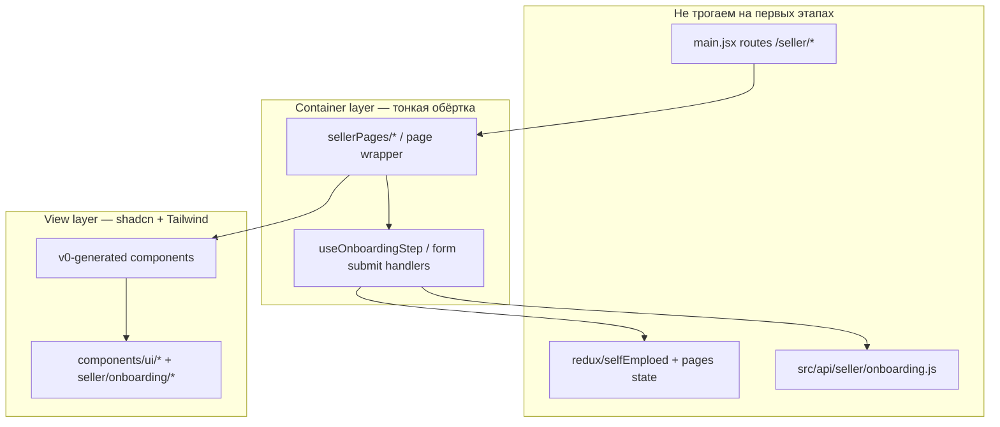

# План миграции Frontend3 на Tailwind + shadcn/ui (v0)

Документ фиксирует **стратегию и порядок работ** по переходу UI-слоя `Frontend/Frontend3` с MUI + SCSS на **React + Tailwind + shadcn/ui**, с использованием **v0** и Cursor-агентов как ускорителей генерации presentational-компонентов.

**Пилотная зона:** seller onboarding (`/seller/login` … `/seller/verified-analyt`) — **миграция завершена (FE-021, 2026-05-28)**.

**Почему onboarding первым (осознанное отклонение от «статичных страниц сначала»):**

- зона уже стабилизирована на backend (Task 008) и частично покрыта тестами (FE-003, FE-010, FE-011);
- onboarding — изолированный layout и набор форм с понятным API-контрактом ([seller-onboarding-flow.md](../seller-onboarding-flow.md));
- успешный пилот даёт design system и паттерн «container + shadcn view» для остального магазина.

**Что не меняем без отдельного согласования:**

- REST API `/api/sellers/onboarding/*` и форматы ответов;
- Redux-слайсы и persist-ключи (на первых этапах);
- маршруты и URL в `main.jsx`;
- бизнес-правила валидации submit (они на backend).

---

## Принципы миграции

| Принцип | Смысл |
|---------|--------|
| **Strangler, не rewrite** | Новый UI подключается рядом со старым; MUI удаляется только после зелёных тестов в зоне. |
| **Container / View** | Redux, API, навигация — в существующих или тонких container-компонентах; v0 генерирует только **dumb** view. |
| **Tests first in risky zones** | Перед заменой экрана — RTL/e2e-якорь на текущее поведение или расширение существующего. |
| **One PR — one slice** | Один маршрут или одна группа форм за PR; CI `frontend3` + `e2e_frontend3` зелёные. |
| **v0 = UI only** | Запрет в промптах: API, Redux, localStorage, routing, payment logic. |

---

## Архитектура целевого слоя



**Целевая структура каталогов (после пилота):**

```
Frontend/Frontend3/src/
├── components/ui/              # shadcn primitives
├── components/seller/onboarding/   # переиспользуемые блоки онбординга
├── features/seller-onboarding/     # containers + hooks (опционально, FE-016)
└── sellerPages/                    # тонкие page-обёртки (маршруты не меняем)
```

---

## Карта маршрутов пилота

**Всего: 17 маршрутов** (9 entry/auth — FE-018, 2 data — FE-019, 6 review/status — FE-020).

| Path | Page | Компоненты (основные) | Задача |
|------|------|------------------------|--------|
| `/seller/login` | `SellerLogin` | `LoginForm` | FE-018 |
| `/seller/reset` | `SellerReset` | `ResetForm` | FE-018 |
| `/seller/successfully-reset` | `SellerSuccessfullyReset` | static confirmation | FE-018 |
| `/seller/verify-email` | `SellerVerifyEmail` | `VerifyForm` | FE-018 |
| `/seller/create-password` | `SellerCreateNewPass` | `CreatePassForm` | FE-018 |
| `/seller/create-account` | `SellerCreateAccount` | `CreateForm` | FE-018 |
| `/seller/create-verify` | `CreateVerifyEmail` | `VerifyEmail` | FE-018 |
| `/seller/seller-type` | `SellerType` | `SellerTypeContent` | FE-018 |
| `/seller/application-sub` | `ApplicationSubmited` | `ApplicationSubmited` | FE-018 |
| `/seller/seller-info` | `SellerInformation` | personal/tax/address/bank/warehouse/return | FE-019 |
| `/seller/seller-company` | `SellerCompanyInfo` | company/representative/address blocks | FE-019 |
| `/seller/seller-review` | `ReviewInfoPage` | review blocks + submit | FE-020 |
| `/seller/seller-review-company` | `SellerReviewCompany` | company review + submit | FE-020 |
| `/seller/finish-verification` | `FinishVerificationPage` | status UI | FE-020 |
| `/seller/action-required` | `ActionRequiredPage` | status UI | FE-020 |
| `/seller/under-review` | `UnderReviewPage` | status UI | FE-020 |
| `/seller/verified-analyt` | `VerifiedAnalyt` | post-approve UI | FE-020 |

**Вне пилота (следующие волны):** `/seller/seller-home`, goods, orders, checkout, catalog.

---

## Роли ИИ-агентов

| Агент | Ответственность | Артефакт |
|-------|-----------------|----------|
| **Audit** | Карта компонентов, MUI/SCSS usage, props contracts | `FE-016` inventory |
| **Test** | RTL/e2e до/после миграции экрана | `*.test.jsx`, матрица |
| **Design-system** | Tailwind tokens, shadcn init, `components/ui` | `FE-015`, `FE-017` |
| **v0** | Presentational JSX по промпту-шаблону | PR только view-файлы |
| **Integration** | Подключение view к container, i18n keys | PR без смены API |
| **Review** | Регрессии, секреты, лишние fetch | чеклист PR |
| **QA** | `npm run test`, `build`, `test:e2e` | CI green |

**Шаблон промпта для v0** (копировать в задачу агента):

```text
Build a presentational React component using Tailwind CSS and shadcn/ui.

Constraints:
- No API calls, no Redux, no react-router, no localStorage.
- All data and errors via props; actions via callback props.
- Match existing i18n keys from props (do not hardcode Czech/Slovak copy).
- Use components from @/components/ui only.
- Accessible labels, focus states, mobile-first layout.
- Return TypeScript-free JSX (.jsx) for this repo.

Component: [NAME]
Props: [LIST]
Reference behavior: [link to old component path]
```

---

## Фазы и задачи

| ID | Задача | Priority | Зависимости |
|----|--------|----------|-------------|
| **FE-015** | [Tailwind + shadcn foundation](./tasks/015-shadcn-ui-foundation/task.md) | P0 | FE-006 Done |
| **FE-016** | [Onboarding audit & test gates](./tasks/016-seller-onboarding-migration-audit/task.md) | P0 | FE-015 |
| **FE-017** | [Onboarding layout shell & form primitives](./tasks/017-seller-onboarding-layout-shell/task.md) | P1 | FE-016 |
| **FE-018** | [Auth & entry steps UI](./tasks/018-seller-onboarding-auth-entry-ui/task.md) | P1 | FE-017 |
| **FE-019** | [Data collection steps UI](./tasks/019-seller-onboarding-data-steps-ui/task.md) | P0 | FE-018 |
| **FE-020** | [Review, submit & status UI](./tasks/020-seller-onboarding-review-status-ui/task.md) | P0 | FE-019 |
| **FE-021** | [Validation & MUI cleanup in onboarding zone](./tasks/021-seller-onboarding-migration-validation/task.md) | P1 | FE-020 |

**Рекомендуемый порядок PR внутри FE-018–FE-020:** см. таблицы в каждой задаче (снизу риска → выше).

---

## Гейты качества (Definition of Ready / Done для каждого экрана)

**Ready (начать миграцию экрана):**

- [ ] Экран есть в inventory FE-016 с перечислением props/state/API.
- [ ] Есть RTL или e2e-якорь **или** явная запись «якорь добавляется в этом же PR».
- [ ] shadcn-компоненты из FE-015/FE-017 уже в main.

**Done (экран считается migrated):**

- [ ] View рендерится через shadcn/Tailwind; MUI не импортируется в этом экране.
- [ ] `npm run test` и `npm run build` зелёные.
- [ ] Затронутые e2e (`seller-onboarding.spec.js`, при необходимости fullstack) зелёные.
- [ ] i18n keys не сломаны (тесты с `renderWithProviders`).
- [ ] Нет изменений тел/URL API-запросов.

---

## Риски

| Риск | Митигация |
|------|-----------|
| v0 «перепишет» submit/logic | Жёсткий container/view; code review только integration PR |
| Два UI-стека (MUI + shadcn) раздувают bundle | Удалять MUI из зоны в FE-021; lazy pages уже есть |
| Formik + MUI DatePicker завязаны на `@mui/x-date-pickers` | FE-017: shadcn calendar/popover или временно оставить date picker в container |
| Документ upload (multipart) | FE-019: не менять `UploadInp` API-контракт, только UI |
| Full-stack e2e FS-001 ломается из-за селекторов | Предпочитать `data-testid` при миграции; обновить spec в том же PR |
| Tailwind preflight vs `src/index.css` globals | FE-015: **`preflight: false`** на старте; включение preflight — отдельный PR |
| shadcn по умолчанию создаёт `.tsx` | FE-015: `components.json` **`tsx: false`**, DoD «no new .tsx» |

---

## Связанные документы

- [04. Frontend architecture](../04-frontend-architecture.md)
- [Seller onboarding flow](../seller-onboarding-flow.md)
- [refactoring-readiness-plan.md](./refactoring-readiness-plan.md)
- [test-matrix.md](./test-matrix.md)
- [seller-onboarding-ui-inventory.md](./seller-onboarding-ui-inventory.md)
- [tasks/README.md](./tasks/README.md) — реестр FE-015–FE-021

---

## Wave 2 — следующая волна (не в пилоте)

Пилот seller onboarding **завершён** (FE-021, 2026-05-28). Паттерн для Wave 2: **container (API/Redux) + shadcn view**, тесты до/в том же PR, без смены API.

| Область | Priority | Rationale | E2E / test baseline |
|---------|----------|-----------|---------------------|
| **Catalog / Search** | P1 | Высокий трафик, ниже business-risk чем payment | FE-004 RTL, `smoke.spec.js`, SearchPage |
| **Basket** | P0 | Зависит от checkout; shared `basketSlice` | FE-005, `checkout.spec.js` |
| **Checkout / Payment** | P0 | Последний — max e2e уже есть | FE-009, FS-002/FS-003 |
| **Seller cabinet** (orders, goods, home) | P2 | После закрепления onboarding pattern | FE-005 seller orders RTL |

**Не входит в Wave 2 без отдельной задачи:** Frontend2, удаление MUI из всего Frontend3, Redux refactor.

**Рекомендуемый порядок Wave 2:** Catalog/Search → Basket → Checkout/Payment → Seller cabinet.

---

*Создано: май 2026.*

*Обновлено 2026-05-28: пилот onboarding **Done** (FE-015–FE-021); Wave 2 backlog; 17 routes migrated.*
