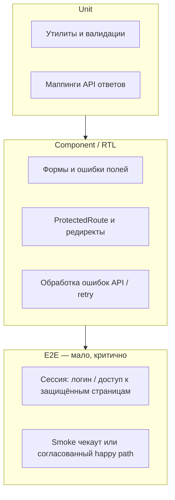

# План тестирования фронтенда (Reli.one)

Документ задаёт **цели** и **стек** для **`Frontend/Frontend3`** и **`Frontend/Frontend2`**. Фактические версии скриптов, путей к тестам, ограничений CI (в т.ч. ESLint на Frontend2) — в **[README ./README.md](./README.md)** (раздел *Снимок кодовой базы*) и в **[test-matrix.md](./test-matrix.md)**.

Общая стратегия репозитория (backend + снимок по фронту): **[08. Testing strategy](../08-testing-strategy.md)**. Архитектура UI: **[04. Frontend architecture](../04-frontend-architecture.md)**.

---

## 1. Контекст

- Оба фронта: **Vite + React 18**.
- **`Frontend3`:** `npm run test`, `npm run test:e2e` (Playwright), хелпер **`src/test/test-utils.jsx`**, job **`e2e_frontend3`** — см. **[08-testing-strategy.md](../08-testing-strategy.md)** и **[test-matrix.md](./test-matrix.md)**.
- **`Frontend2`:** `npm run test` / `npm run test:watch` (Vitest smoke) — см. **[test-matrix.md](./test-matrix.md)**.
- Backend P0 уже покрывается API/интеграционными тестами; фронт дополняет это **проверкой UI-поведения**, **регрессиями форм и маршрутизации** и **узким слоем e2e** по критичным сценариям.

---

## 2. Цели (Definition of Done для направления)

1. **Предсказуемые регрессии**: изменения в формах, роутинге, работе с токеном и обработке ошибок API не проходят без падающего или нового теста там, где зафиксировано поведение.
2. **Пирамида**: много **быстрых** unit/компонентных тестов; **мало** стабильных e2e на самые дорогие по риску цепочки.
3. **Два приложения**: общие **договорённости** (имена файлов, хелпер рендера, моки HTTP) и возможность **пилота на Frontend3**, затем **паритет для Frontend2** где уместно.
4. **CI**: команды `test` (и при внедрении e2e — отдельный job или расписание) выполняются в pipeline без ручных шагов.
5. **Без флаков**: ожидания через Testing Library / Playwright best practices; сеть и внешние виджеты изолированы.

Метрика «% покрытия» **не является** целью сама по себе; приоритет — **матрица критичных сценариев** и якорные тесты.

---

## 3. Уровни покрытия

| Уровень | Назначение | Типичные объекты |
|--------|------------|------------------|
| **Unit** | Чистая логика без DOM | Форматирование, маппинг DTO→view-model, валидации, утилиты |
| **Компонент / интеграция (DOM)** | Поведение в браузерной среме (jsdom) | Формы (Formik/Yup), условный рендер, связка с Redux/контекстом при моках API |
| **E2E** | Полный путь пользователя | Логин, защищённые маршруты, ключевой чекаут (по согласованному контуру данных) |

Опционально позже: **контрактные проверки** фронта против OpenAPI/схем бэка, если появится единый pipeline генерации клиента.

---

## 4. Целевой стек (согласовано)

| Компонент | Назначение |
|-----------|------------|
| **Vitest** | Раннер, совместимый с Vite |
| **@testing-library/react** + **@testing-library/user-event** | Тесты с точки зрения пользователя |
| **jsdom** | Среда для компонентных тестов |
| **Playwright** | E2E (альтернатива обсуждаема, по умолчанию Playwright) |
| **MSW** (по решению в задаче) | Единые HTTP-моки в тестах и при необходимости в dev |

**Sentry**, **Google/Facebook login**, плееры и прочие внешние SDK — **заглушки** в unit/DOM-тестах; в e2e — по политике окружения (моки gateway или тестовые ключи без секретов в репозитории).

---

## 5. Пирамида и приоритеты P0 (фронт)

**Frontend3** (Redux, persist, сложнее состояние): акцент на **интеграционных RTL-тестах** с общим хелпером `renderWithProviders` (или аналог).

**Frontend2** (лендинг): акцент на **юнитах** для форм/утилит и **узком e2e-smoke** (ключевые CTA, базовая навигация).

Согласование с доменными P0 бэка: см. раздел «Критические бизнес-сценарии» в **[08. Testing strategy](../08-testing-strategy.md)** — фронт покрывает **отображение и действия пользователя**, а не дублирует webhook/идемпотентность на бэке.

---

## 6. Моки и изоляция

1. **HTTP**: предпочтительно один подход на проект (MSW или согласованный `vi.mock` слоя API) — детали в задаче по фундаменту.
2. **Время и локаль**: `dayjs` и **i18next** — фиксированные locale/timezone в тестах, где влияют на ассерты.
3. **Роутер**: `MemoryRouter` / обёртка с начальным URL в RTL.
4. **Секреты**: не хранить реальные токены и ключи; для e2e — переменные окружения CI и документированные placeholder-значения.

---

## 7. Организация кода тестов

- Соглашения по путям (`*.test.ts(x)` рядом с модулем vs `__tests__/`) фиксируются в **задаче 001**.
- Общие хелперы: рендер с **Redux + Router + i18n** (минимально необходимый набор).
- Дублирование между Frontend2 и Frontend3: либо копия с ясным комментарием «source of truth — Frontend3», либо вынесение в общий пакет **только после** стабилизации пилота (отдельное решение).

---

## 8. CI

Фактически в **`.github/workflows/ci.yml`**:

1. **`frontend2`**: `npm ci` → **`npm run lint`** → **`npm run test`** → build.  
   **Важно:** в **Frontend2** текущий `eslint` с `--max-warnings 0` даёт **errors** по проекту — шаг **Lint** обычно **падает**, до **Test** пайплайн не доходит. Дым Vitest всё равно можно запускать локально: `npm run test` в каталоге лендинга.
2. **`frontend3`**: `npm ci` → lint → **`npm run test`** → build (у ESLint — 0 errors, есть warnings).
3. **`e2e_frontend3`**: `npm ci` → build → `npx playwright install --with-deps chromium` → **`npm run test:e2e`** (отдельный job, `CI=true`).

Локально e2e: из `Frontend/Frontend3` — `npm run build && npm run test:e2e` (Playwright поднимает `vite preview` через `webServer` в `playwright.config.js`).

---

## 9. Декомпозиция на задачи

Пошаговое внедрение описано в **[docs/frontend/tasks/README.md](./tasks/README.md)**.

| ID | Кратко |
|----|--------|
| FE-T001 | Матрица сценариев и конвенции |
| FE-T002 | Пилот: Vitest + RTL + скрипты в Frontend3 |
| FE-T003 | Якорные RTL-тесты по P0 |
| FE-T004 | Playwright: фундамент и smoke |
| FE-T005 | Frontend2, выравнивание и CI |

---

## 10. Дорожная карта до рефакторинга Frontend3

Закрытие текущих задач по тестам (в первую очередь **FE-T003**), критерии готовности к структурным изменениям и порядок малых PR описаны в **[refactoring-readiness-plan.md](./refactoring-readiness-plan.md)**.

---

## 11. История согласований

- 2026-05-14 — утверждены цели, уровни, стек (Vitest + Testing Library + Playwright), приоритеты и порядок внедрения (чат планирования).
- 2026-05-14 — внедрены матрица [test-matrix.md](./test-matrix.md), Playwright smoke, Vitest для Frontend2, job `e2e_frontend3`, правка `.gitignore` для миграций (DEV-4).
- 2026-05 — синхронизация документов `docs/frontend/*` с фактом: таблицы путей к тестам, `vite.config` (exclude `e2e/`), двойной setup Frontend3, блокировка job `frontend2` из‑за ESLint.
- 2026-05-14 — добавлен [refactoring-readiness-plan.md](./refactoring-readiness-plan.md): фазы 0–4 и фиксация изменений перед рефакторингом Frontend3.
- 2026-05-27 — добавлен [shadcn-ui-migration-plan.md](./shadcn-ui-migration-plan.md) и задачи FE-015–FE-021 (пилот: seller onboarding UI).
