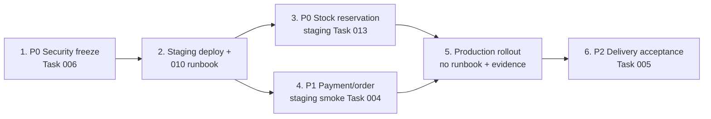

# Master ops checklist — ручные действия после закрытия кодового backlog

Практичный чеклист для команды: что выполнить **вручную на staging/production**, в каком порядке, где runbook и **где фиксировать evidence вне git**.

> **Важно:** этот репозиторий **не утверждает** выполнение production/staging шагов. Зелёный CI, закрытые `task.md` по **repo-scope** и локальные smoke в docs — **не** заменяют ops sign-off на ваших контурах. Чекбоксы ниже **не отмечать `[x]`**, пока нет evidence в тикете / secure-хранилище команды.

**Связанные задачи (repo-scope Done, ops open):** [Task 006](../tasks/006-security-hardening/task.md) · [Task 013](../tasks/013-stock-reservation/task.md) · [Task 010](../tasks/010-devops-infrastructure/task.md) · [Task 004](../tasks/004-order-consistency/task.md) · [Task 005](../tasks/005-delivery-cleanup/task.md)

---

## Что уже в репозитории vs что только manual

| Область | Уже в repo (код / docs / CI) | Только manual / ops |
|---------|------------------------------|---------------------|
| **Security (006)** | PII scrub в HEAD, throttle/CSP, runbook SEC-1 | Ротация credentials, `git filter-repo`, force-push, fresh clone |
| **Stock reservation (013)** | Модели, сервис, checkout 409, webhook, cleanup command, tests, FE-014 | `STOCK_RESERVATION_ENABLED=True`, cron, monitoring, staging/prod smoke |
| **DevOps (010)** | e2e-compose, env examples, `/health/`, backup runbook, deployment A–G, monitoring runbook | Прогон runbook на staging/prod, Sentry, алерты, регулярные prod-бэкапы |
| **Payment/order (004)** | Payment cleanup, structural Order Consistency, local/sandbox PSP smoke docs | Production/live PSP acceptance, production migration verification |
| **Delivery (005)** | Dev-gating, error isolation, retry playbook в docs | Приёмка Packeta/DPD/GLS/MyGLS в production |

---

## Рекомендуемый порядок

1. **Security freeze (P0)** — ротация секретов и (при согласовании) rewrite history **до** массовых деплоев с новыми env.
2. **Staging** — deployment runbook, health, backup drill, monitoring/Sentry smoke.
3. **Stock reservation** — сначала staging по dedicated runbook, затем prod с rollback plan.
4. **Payment/order acceptance** — sandbox/local evidence уже в docs; live PSP и migration verification — на prod-контуре.
5. **Delivery** — после стабильного payment/post-payment pipeline.

---

## P0 — Security (Task 006)

Runbook: [`docs/security-incident-response.md`](../security-incident-response.md) · Задача: [`docs/tasks/006-security-hardening/task.md`](../tasks/006-security-hardening/task.md)

| # | Действие | Runbook / задача | Evidence (вне git) |
|---|----------|------------------|---------------------|
| 1 | [ ] Согласовать freeze window: pause merge/push, назначить DRI | [SEC-1 Phase 0](../security-incident-response.md#phase-0--freeze--coordination) | Тикет: дата/время окна, DRI |
| 2 | [ ] Backup mirror репозитория до history rewrite | [SEC-1 Phase 0](../security-incident-response.md#phase-0--freeze--coordination) | Путь к mirror backup (не в git) |
| 3 | [ ] Inventory: пути секретов/PII в history | [SEC-1 Phase 1](../security-incident-response.md#phase-1--inventory) | Список путей в тикете |
| 4 | [ ] Ротация **всех** скомпрометированных credentials (DB, PSP, OAuth, SMTP, couriers, TLS) | [SEC-1 Phase 2](../security-incident-response.md#phase-2--rotate-credentials) | Vault / password manager: дата ротации по классу; **без** значений в git |
| 5 | [ ] Обновить live `envs/*.env` на staging/prod после ротации | [07-deployment.md](../07-deployment.md) § env | Sign-off ops: «env обновлены на \<среда\>» |
| 6 | [ ] `git filter-repo` + force-push (при согласовании) | [SEC-1 Phase 3–4](../security-incident-response.md#phase-3--rewrite-git-history) | SHA до/после, ссылка на PR коммуникации |
| 7 | [ ] Fresh clone для всей команды; отозвать старые deploy keys при необходимости | [SEC-1 Phase 4](../security-incident-response.md#phase-4--post-rewrite) | Чеклист «все переклонировались» |

---

## P0 — Stock reservation rollout (Task 013)

Runbook: [`docs/testing/stock-reservation-staging-rollout.md`](../testing/stock-reservation-staging-rollout.md) · Задача: [`docs/tasks/013-stock-reservation/task.md`](../tasks/013-stock-reservation/task.md) (§ OPEN ops rollout)

| # | Действие | Runbook / задача | Evidence (вне git) |
|---|----------|------------------|---------------------|
| 1 | [ ] Deploy backend с миграциями `warehouses.0002_*` на **staging** | [Rollout §1](../testing/stock-reservation-staging-rollout.md#1-deploy--migrations) · [07-deployment.md](../07-deployment.md) | Тикет: tag/commit, `migrate` OK |
| 2 | [ ] `STOCK_RESERVATION_ENABLED=True` + TTL в **staging** env; restart | [Rollout §2](../testing/stock-reservation-staging-rollout.md#2-enable-feature-flag) | Sign-off: флаг True в контейнере (без paste env в git) |
| 3 | [ ] Cron `release_expired_reservations` каждые 5 мин (или Celery beat) | [Rollout §3](../testing/stock-reservation-staging-rollout.md#3-cron--release_expired_reservations) | Cron screenshot / log path в тикете |
| 4 | [ ] Staging smoke: success checkout, 409 insufficient stock, abandoned session, webhook replay | [Rollout §4–6](../testing/stock-reservation-staging-rollout.md#4-automated-smoke-on-staging-db) · [stripe-e2e](../testing/stripe-e2e-checklist.md) · [paypal-e2e](../testing/paypal-e2e-checklist.md) | Dated smoke log; order ids **только** в тикете |
| 5 | [ ] Monitoring: HTTP 409 rate; pending/expired `StockReservation` | [monitoring-alerts.md](monitoring-alerts.md) · [Task 013 §5](../tasks/013-stock-reservation/task.md) | Dashboard/alert rule IDs |
| 6 | [ ] Production rollout (повтор §1–5) + rollback drill | [Rollout](../testing/stock-reservation-staging-rollout.md) · [07-deployment.md](../07-deployment.md) § rollback | Prod sign-off отдельным тикетом |

---

## P1 — Deploy & monitoring (Task 010)

Runbooks: [`docs/07-deployment.md`](../07-deployment.md) · [`docs/operations/monitoring-alerts.md`](monitoring-alerts.md) · [`docs/operations/database-backup-restore.md`](database-backup-restore.md) · Задача: [`docs/tasks/010-devops-infrastructure/task.md`](../tasks/010-devops-infrastructure/task.md)

| # | Действие | Runbook / задача | Evidence (вне git) |
|---|----------|------------------|---------------------|
| 1 | [ ] Staging: deployment runbook **A–G** (pre-deploy → post-deploy) | [07-deployment.md](../07-deployment.md) · [Task 010 DoD](../tasks/010-devops-infrastructure/task.md#ручные-действия-на-staging--production-не-отменяют-done-репозитория) | Dated checklist A–G в тикете |
| 2 | [ ] `python manage.py check --deploy` на staging/prod | [07-deployment.md](../07-deployment.md) | Вывод команды в тикете (без секретов) |
| 3 | [ ] `/health/` с внешнего клиента (не только localhost) | [07-deployment.md](../07-deployment.md) § Health | HTTP status + timestamp |
| 4 | [ ] Sentry staging/prod verification (backend + frontend DSN) | [07-deployment.md § Sentry](../07-deployment.md#sentry-production-verification-runbook) | Sentry project + test event id |
| 5 | [ ] Активировать правила мониторинга / uptime / алерты | [monitoring-alerts.md](monitoring-alerts.md) | Список активных правил |
| 6 | [ ] Регулярный `pg_dump` на production + **restore drill** | [database-backup-restore.md](database-backup-restore.md) | RPO/RTO заметка; дата последнего успешного restore |
| 7 | [ ] Сверка live env с `*.env.example` (без commit секретов) | [Task 010 DoD](../tasks/010-devops-infrastructure/task.md#финальный-аудит-и-таблица-dod) | Diff checklist в тикете |

---

## P1 — Payment / order acceptance (Task 004)

Runbooks: [`docs/testing/stripe-e2e-checklist.md`](../testing/stripe-e2e-checklist.md) · [`docs/testing/paypal-e2e-checklist.md`](../testing/paypal-e2e-checklist.md) · [`docs/payment-flow.md`](../payment-flow.md) · Задача: [`docs/tasks/004-order-consistency/task.md`](../tasks/004-order-consistency/task.md)

| # | Действие | Runbook / задача | Evidence (вне git) |
|---|----------|------------------|---------------------|
| 1 | [ ] Production migration verification: `0009_order_consistency` и связанные миграции применены без ошибок | [Task 004 Final DoD](../tasks/004-order-consistency/task.md#final-dod-table) | `migrate` log + schema spot-check в тикете |
| 2 | [ ] Production/live **Stripe** acceptance (checkout → webhook → order) | [stripe-e2e-checklist.md](../testing/stripe-e2e-checklist.md) — адаптировать для **live** политики команды | Dated sign-off; ids в тикете |
| 3 | [ ] Production/live **PayPal** acceptance | [paypal-e2e-checklist.md](../testing/paypal-e2e-checklist.md) | Dated sign-off; ids в тикете |
| 4 | [ ] Webhook idempotency spot-check на prod (replay без дубликата заказа) | [payment-flow.md](../payment-flow.md) · [Task 004](../tasks/004-order-consistency/task.md) | Replay log в тикете |
| 5 | [ ] Post-deploy smoke: order statuses, `received_at` timezone, reviews linkage | [Task 004 Order domain](../tasks/004-order-consistency/task.md#order-domain-final-state-and-historical-plan) | SQL/ admin screenshots в тикете |

> Local/sandbox smoke evidence уже может быть в чеклистах docs — **не** считать его production acceptance.

---

## P2 — Delivery acceptance (Task 005)

Runbooks: [`docs/payment-flow.md`](../payment-flow.md) (post-payment parcels) · [`docs/operations/monitoring-alerts.md`](monitoring-alerts.md) · Задача: [`docs/tasks/005-delivery-cleanup/task.md`](../tasks/005-delivery-cleanup/task.md#final-dod-table-task-005)

| # | Действие | Runbook / задача | Evidence (вне git) |
|---|----------|------------------|---------------------|
| 1 | [ ] Production smoke: label creation / parcel flow (happy path) | [Task 005 Final DoD](../tasks/005-delivery-cleanup/task.md#final-dod-table-task-005) · [payment-flow.md](../payment-flow.md) | Order/parcel ids в тикете |
| 2 | [ ] Приёмка **Packeta** на production | Task 005 § Production courier acceptance | Carrier sign-off |
| 3 | [ ] Приёмка **DPD** на production | то же | Carrier sign-off |
| 4 | [ ] Приёмка **GLS / MyGLS** на production | то же | Carrier sign-off |
| 5 | [ ] Алерты на сбои parcel/email по playbook | [monitoring-alerts.md](monitoring-alerts.md) | Alert fired test (controlled) |

---

## Frontend CI (после деплоя)

- [ ] Убедиться, что в пайплайне/сборке фронта для нужной среды задан **`VITE_API_URL`** (или принят согласованный fallback), чтобы post-deploy smoke не бил prod API случайно.

---

## Репозиторий (не ops)

| Шаг | Статус |
|-----|--------|
| **DEV-4:** убрать `*/migrations` из `.gitignore` | **Сделано** — миграции версионируются; см. [`09-architecture-debt`](../09-architecture-debt.md) (DEV-4). |
| Кодовый backlog FE-T003, Frontend2 CI, docs-sync 004/013/e2e | **Сделано в git** — см. [`docs/frontend/tasks/README.md`](../frontend/tasks/README.md). |

---

## Где хранить evidence (политика)

| Допустимо | Недопустимо в git |
|-----------|-------------------|
| Тикет (Linear/Jira/GitHub Issue) с датой, DRI, commit/tag | Secret keys, passwords, webhook secrets |
| Secure vault / password manager (ссылка в тикете) | Полные `envs/backend.env` / production URLs с credentials |
| Internal wiki / Google Doc (ссылка в тикете) | Raw PSP payloads с PII |
| Dated sign-off «staging OK / prod OK» | Отметка `[x]` в этом файле без реального прогона |
