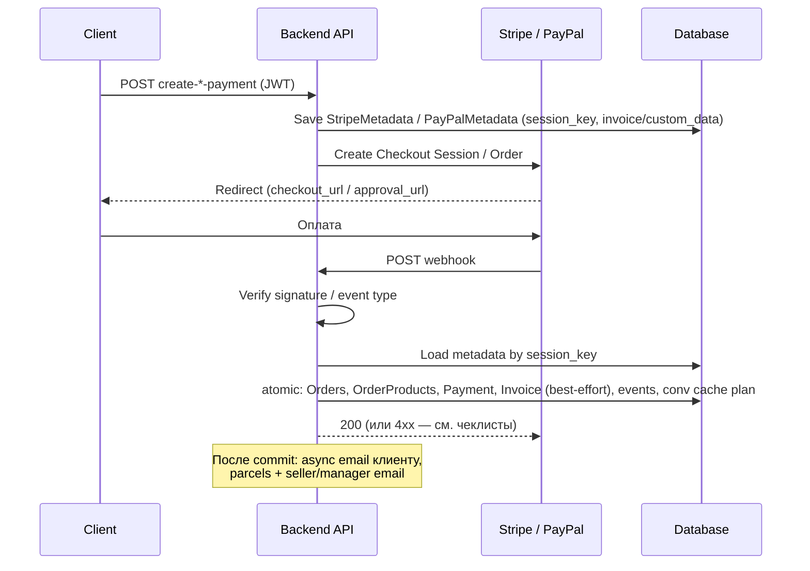

# Payment flow — архитектура и troubleshooting

Единая справка для разработчиков: как устроены **Stripe / PayPal checkout**, **метаданные**, **webhooks**, **заказы**, **инвойсы** и **асинхронные побочные эффекты**. Без production-секретов и без копирования реальных ключей в документацию.

**См. также**

| Документ | Назначение |
|----------|------------|
| [Локальный e2e-контур](testing/e2e-local-contour.md) | Docker, порты, Mailpit, базовый сценарий |
| [06 — Integrations](06-integrations.md) | Сводка env и других интеграций (Stripe/PayPal — кратко) |
| [Stripe e2e checklist](testing/stripe-e2e-checklist.md) | Ручной smoke, evidence, негативные HTTP |
| [PayPal e2e checklist](testing/paypal-e2e-checklist.md) | Sandbox smoke, негативные сценарии |
| [Task 003 — Payment refactor](tasks/003-payment-refactor/task.md) | История рефакторинга, Done/Open/Deferred |

---

## Обзор потока

Основной код: приложение **`payment`** (`backend/payment/`), оркестрация webhook — **`payment/services/webhook_processing.py`**.

---

## 1. Создание Stripe Checkout Session

- **Endpoint:** `POST /api/create-stripe-payment/` (аутентификация: JWT).
- **Вход:** `SessionInputSerializer` — email, адрес, `groups` (продавец, доставка, SKU).
- **Сервисы:** `build_stripe_checkout_context` (`services/stripe_session.py`) → расчёт доставки и строк checkout; `create_stripe_checkout_session` (`services/stripe_checkout.py`) — вызов Stripe API.
- **Результат клиенту:** `checkout_url`, `session_id` (id сессии Stripe), `session_key` (внутренний UUID).
- **Побочный эффект:** в БД сохраняется **`StripeMetadata`** с полями вроде `custom_data`, `invoice_data`, `description_data`, привязка к `session_key` и данным для восстановления после оплаты.

---

## 2. Создание PayPal order (Checkout)

- **Endpoint:** `POST /api/create-paypal-payment/` (JWT).
- **Аналогично Stripe:** `build_paypal_checkout_context` → `create_paypal_checkout_session`.
- **Результат:** `approval_url`, PayPal `order_id`, `session_key`; клиенту также отдаётся `session_id` = `session_key` для единообразия с thank-you / conversion.
- **Побочный эффект:** **`PayPalMetadata`** с тем же смыслом снимка корзины/инвойса.

---

## 3. Session metadata (смысл `session_key`)

- **`session_key`** — внутренний стабильный ключ (UUID), общий для PSP и нашей БД:
  - пишется в metadata PSP (Stripe: `metadata.session_key`; PayPal: `reference_id` в purchase unit);
  - ключ поиска строки **`StripeMetadata`** / **`PayPalMetadata`** при webhook.
- **Зачем:** webhook от PSP приходит с **session_id заказа PSP**, но «склеивание» с корзиной и пользователем идёт через сохранённые JSON в metadata-моделях.

Модели: `backend/payment/models.py` — `StripeMetadata`, `PayPalMetadata`.

---

## 4. Webhook processing

### Stripe

- **Endpoint:** `POST /api/stripe-webhook/` (без JWT; проверка подписи).
- **Обрабатываемые типы:** `checkout.session.completed`, `checkout.session.async_payment_succeeded` (остальные → **200** без тела — «не ошибка» для провайдера).
- **Сервис:** `verify_and_resolve_stripe_checkout_event` → `stripe_checkout_session_to_webhook_payment_data` → **`create_orders_and_payment`**.

### PayPal

- **Endpoint:** `POST /api/paypal-webhook/`.
- Порядок: разбор JSON → при неизвестном `event_type` → **200** `{ "status": "ignored" }` → иначе **`verify_webhook`** (PayPal API verify) → `paypal_payload_to_webhook_payment_data` → **`create_orders_and_payment`**.
- Поддерживаемые типы и ветки — см. `services/paypal_webhook.py`.

Детали HTTP-кодов и retry: раздел **Webhook: негативные сценарии и HTTP** в [stripe-e2e-checklist.md](testing/stripe-e2e-checklist.md) и [paypal-e2e-checklist.md](testing/paypal-e2e-checklist.md).

---

## 5. Идемпотентный replay

- У **`Payment`** составной уникальный ключ **`(payment_system, session_id)`**.
- Перед основной транзакцией: если платёж уже есть — возвращается результат **replay** (`is_replay=True`), обновляется conversion cache, **повторно не создаются** заказы/инвойсы/post-commit email/parcels.
- При гонке двух webhook: вставка второго `Payment` может дать **`IntegrityError`** — обрабатывается как тот же replay-путь.

Тесты: `payment/tests.py`, `payment/test_checkout_flow.py`.

---

## 6. Создание заказов

- Внутри одного **`transaction.atomic()`** на успешный webhook: для каждой группы продавца создаётся **`Order`**, **`OrderProduct`**, привязка к доставке и курьеру из metadata, затем одна запись **`Payment`** на всю сессию, события **`OrderEvent`**, план записи conversion-кэша (**`set_conv_cache_after_commit`**).
- **CZ-origin:** при нарушении (не-CZ SKU) заказ может быть создан, но генерация посылок **пропускается** (флаг `origin_blocked`).

---

## 7. Создание инвойса

- В той же транзакции **best-effort:** `prepare_invoice_data` / `generate_invoice_pdf` → модель **`Invoice`**.
- Ошибка PDF/файла **не откатывает** заказ и платёж (логируется); клиентское письмо завязано на успешное создание инвойса (см. ниже).

---

## 8. Письма: клиент, продавец, менеджеры

- После успешного **commit:** планируется **`async_send_client_email`** (если инвойс создан); затем **`async_parcels_and_seller_email`** (если не `origin_blocked`) — внутри цепочки генерации посылок и уведомлений продавцам/менеджерам.
- Реализация — **`payment/services_async.py`**, **`delivery/utils_async.py`**; в локальном e2e письма попадают в **Mailpit** (см. e2e contour).

---

## 9. Что происходит при replay

| Аспект | Поведение |
|--------|-----------|
| `Payment` / `Order` / `Invoice` | Не дублируются |
| Conversion cache (`conv:{id}`) | Обновляется / записывается для идемпотентности thank-you |
| Client email / parcels | **Не** планируются повторно для того же успешного платежа |

---

## Вне scope текущего продукта / roadmap (deferred)

Явно **не** считаются частью обязательного payment-документа для релиза:

| Тема | Примечание |
|------|------------|
| **PromoCode** | В продукте не используется; код в репозитории может существовать, но не входит в описываемый user-facing checkout flow. |
| **Stock reservation / списание остатков при оплате** | Не реализовано как обязательный трек; см. [Task 013 — stock reservation](tasks/013-stock-reservation/task.md) (design / future). |

---

## Troubleshooting

### DisallowedHeaderHost / ngrok

- **Симптом:** Django **400 DisallowedHost** при запросе через публичный URL.
- **Действие:** добавить хост туннеля в **`ALLOWED_HOSTS`** (или env, из которого он собирается) для dev/e2e; перезапустить backend. См. [e2e-local-contour.md](testing/e2e-local-contour.md).

### Invalid Stripe signature / 400 пустое тело

- **Причина:** несовпадение подписи webhook: другой **`STRIPE_WEBHOOK_ENDPOINT_SECRET`**, другой endpoint в Stripe CLI/Dashboard, устаревший `stripe listen`, или тело запроса изменено прокси.
- **Действие:** секрет из вывода `stripe listen` или из Dashboard endpoint должен **точно** совпасть с env backend; после смены env — **restart** контейнера/процесса.

### Неверный `STRIPE_WEBHOOK_ENDPOINT_SECRET`

- То же, что выше: симптомы — **400** без JSON на verify. Не путать с **`STRIPE_API_SECRET_KEY`** (это API, не webhook signing secret).

### Неверный `PAYPAL_WEBHOOK_ID`

- **Симптом:** **`verify_webhook`** возвращает false → **403** `Invalid webhook signature`.
- **Действие:** `PAYPAL_WEBHOOK_ID` должен соответствовать **той же** подписке webhook в PayPal Developer, что и публичный URL + sandbox/live режим (`PAYPAL_MODE`).

### Писем нет в Mailpit

- Проверить, что в e2e задан **email backend** на Mailpit (см. contour / `docker-compose.e2e.yml`).
- Webhook создал **инвойс?** Без инвойса клиентское письмо может быть пропущено (см. логи `payment`).
- **origin_blocked** — посылки/seller цепочка может не идти; менеджерские письма зависят от ветки async.

### Заказ не создаётся

- В логах: нет **`StripeMetadata` / `PayPalMetadata`** для `session_key` → **400** «metadata not found».
- Нет `session_key` в metadata PSP **Stripe** → **400** Missing session_key.
- **ValidationError** внутри атомарного блока → **500** Order creation failed с точки зрения view.
- Проверить БД: была ли успешна оплата и доставлен ли webhook на **тот же** backend/env.

### Дубликат webhook / replay

- Ожидаемое поведение: **второй** запрос — **200**, без новых сущностей; см. раздел «Идемпотентный replay». Если видите два заказа на одну сессию — это **аномалия** (срочно смотреть уникальность `Payment` и логи race).

---

## Переменные окружения (имена, без значений)

| Переменная | Роль |
|------------|------|
| `STRIPE_API_SECRET_KEY` | Серверный Stripe API |
| `STRIPE_API_PUBLISHABLE_KEY` | Клиент Checkout при необходимости |
| `STRIPE_WEBHOOK_ENDPOINT_SECRET` | Подпись webhook `Stripe-Signature` |
| `PAYPAL_CLIENT_ID`, `PAYPAL_CLIENT_SECRET` | OAuth PayPal |
| `PAYPAL_WEBHOOK_ID` | Идентификатор подписки webhook для verify |
| `PAYPAL_MODE` | `sandbox` / `live` (влияет на API URL) |

Полные примеры плейсхолдеров: [envs/backend.e2e.env.example](../envs/backend.e2e.env.example) (не коммитить реальные секреты).
