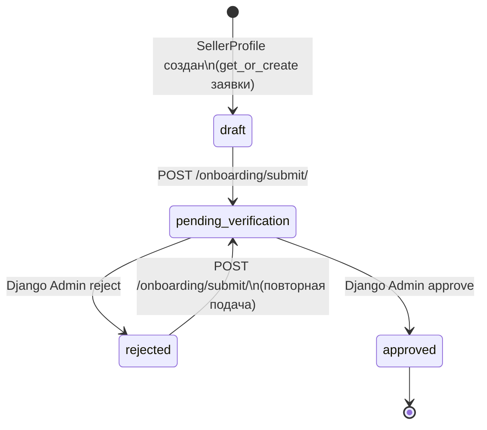
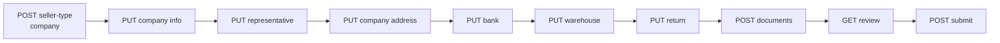
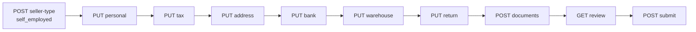

# Seller Onboarding Flow

Единое продуктово-техническое описание онбординга продавца в backend Reli.one. Документ составлен по коду (`backend/sellers/`); продуктовые формулировки сверх этого не добавлялись.

**Контракты публичного REST API онбординга** не следует менять без отдельного решения и согласования с клиентами.

**PromoCode** и **Task 013 (stock reservation)** с этим потоком **не связаны**: в сервисах онбординга нет ссылок на промокоды или резервирование остатков.

---

## 1. Purpose and Scope

**Цель документа:** описать жизненный цикл заявки `SellerOnboardingApplication`, обязательные блоки данных и документов, вычисление полноты (`compute_completeness`), валидацию submit, модерацию и аудит.

**Scope (backend):**

- REST API под префиксом `/api/sellers/onboarding/` (см. `backend/sellers/urls.py`, подключение в `backend/backend/urls.py`).
- Сервисная логика: `backend/sellers/services_onboarding.py`, аудит: `backend/sellers/services_onboarding_audit.py`.
- Модерация в **Django Admin** (approve/reject через админские вьюхи, вызывающие `approve_application` / `reject_application`).

**Вне scope этого документа:** фронтенд-шаги UI, содержимое писем, детали хранения медиа в production, непродакшеновые smoke-процедуры.

---

## 2. Application lifecycle and statuses

Модель заявки: `SellerOnboardingApplication` (`backend/sellers/models.py`). На профиль продавца создаётся одна заявка (`SellerProfile` → сигнал `ensure_onboarding_application`).

Статусы (`OnboardingStatus`):

| Значение API | Смысл |
|--------------|--------|
| `draft` | Черновик, можно редактировать блоки и документы. |
| `submitted` | Значение есть в `TextChoices` и методе `mark_submitted()`, но **текущий** сценарий API-submit его **не выставляет** (см. ниже). В БД может встретиться исторически или при ручных правках. |
| `pending_verification` | Заявка отправлена продавцом через `POST …/submit/`; ожидает решения модератора. |
| `approved` | Одобрено manager/admin; синхронизируется `SellerLegalInfo`. |
| `rejected` | Отклонено с причиной; заявка снова **редактируема** как черновик с точки зрения API (те же правила, что и для `draft`). |

Фактический переход при успешном **REST submit** (`submit_application`):

- Статус становится **`pending_verification`** (не `submitted`).
- Заполняется `submitted_at`, очищается `rejected_reason`.
- Пишется аудит-событие `review_requested`.

Редактирование блоков (`ensure_application_editable`) разрешено только при статусе **`draft`** или **`rejected`**.

Диаграмма статусов (как в коде submit + admin):

**Примечание:** значение статуса `submitted` есть в `OnboardingStatus`, но `submit_application()` выставляет **`pending_verification`**, не `submitted`.

---

## 3. Seller types

`SellerType`:

| Значение | Описание в модели |
|----------|-------------------|
| `self_employed` | Self-employed / Sole proprietor |
| `company` | Company / Legal entity |

Выбор типа: **`POST /api/sellers/onboarding/seller-type/`** с телом `{"seller_type": "…"}`. Только при редактируемой заявке (`draft` / `rejected`).

От типа зависят наборы блоков данных и требования к документам в `compute_completeness`.

---

## 4. Required data blocks

Ниже — **обязательность для полноты** по `compute_completeness` (`services_onboarding.py`). Поля могут существовать в API как опциональные, но **не входят** в булевы флаги completeness — перечислены отдельно.

### 4.1 Seller type

- Выбранное значение `SellerOnboardingApplication.seller_type` (не пустое).

### 4.2 Personal / company данные

**Self-employed** (`personal_complete`):

- Блок `SellerSelfEmployedPersonalDetails`: **обязательны** `date_of_birth`, `nationality`.
- Имя/фамилия для отображения берутся из аккаунта пользователя (`first_name` / `last_name`), не из этого блока.

**Company** (`personal_complete` — по смыслу «юридическая карточка компании»):

- `SellerCompanyInfo`: `company_name`, `legal_form`, `country_of_registration`, `tin`, `company_phone`.

### 4.3 Tax data

**Self-employed** (`tax_complete`):

- `SellerSelfEmployedTaxInfo`: `tax_country`, `tin`.
- Поля `business_id`, `vat_id` в сериализаторе есть; в **`compute_completeness` не проверяются** (могут быть нужны продукту отдельно).

**Company** (`tax_complete` — данные представителя):

- `SellerCompanyRepresentative`: `first_name`, `last_name`, `role`, `date_of_birth`, `nationality`.

### 4.4 Addresses (юридический / самозанятый)

**Self-employed** (`address_complete`):

- `SellerSelfEmployedAddress`: `street`, `city`, `zip_code`, `country`.

**Company** (`address_complete`):

- `SellerCompanyAddress`: `street`, `city`, `zip_code`, `country`.

Поля `proof_document_issue_date` в адресных моделях **не** входят в условие completeness в коде.

### 4.5 Bank details

Общий блок `SellerBankAccount` (`bank_complete`): заполнены **все** `iban`, `swift_bic`, `account_holder`.

Дополнительно `bank_code`, `local_account_number` — в модели с комментарием про CZ/SK; **не** требуются функцией `compute_completeness`.

### 4.6 Warehouse address

`SellerWarehouseAddress`: `street`, `city`, `zip_code`, `country`, `contact_phone`.

### 4.7 Return address

`SellerReturnAddress`:

- Если `same_as_warehouse == True`: достаточно выполненности склада (`warehouse_complete`).
- Если `same_as_warehouse == False`: нужны `street`, `city`, `zip_code`, `country`, `contact_phone`.
- При отдельном адресе возврата дополнительно требуется документ proof_of_address для scope `return_address` (см. раздел 6).

### 4.8 Documents

Требования зависят от типа продавца (см. раздел 6). Загрузка: **`POST`** (и список **`GET`**) `/api/sellers/onboarding/documents/`. Уникальность строки документа: `(application, doc_type, scope, side)`.

---

## 5. Country-specific rules (факт по коду)

В **`compute_completeness` и `validate_before_submit` нет ветвления** вида «если страна CZ / SK / иная ЕС → другой набор полей». Условия используют только заполненность полей и тип продавца.

Ниже — что можно честно сказать по модели и сериализаторам:

### 5.1 CZ

- В примерах OpenAPI и модели встречаются поля, типичные для CZ (ICO-подобный `business_id`, `bank_code` / `local_account_number`).
- Для **полноты заявки** по текущему коду достаточно универсальных правил раздела 4; **ни `business_id`, ни банковские локальные поля не обязательны** в `compute_completeness`.

### 5.2 SK

- Отдельной логики для SK в сервисах онбординга **не найдено**; те же правила, что и для других ISO-кодов страны в полях адреса/налога.

### 5.3 Other EU countries

- Страны вводятся как **ISO 3166-1 alpha-2** (`CharField(max_length=2)`) в соответствующих полях.
- Специальных правил «EU vs non-EU» в `compute_completeness` **нет** (поля `imports_to_eu`, `eori_number` у компании в completeness **не** участвуют).

Если продукт требует различать страны сильнее кода, это нужно закладывать отдельными задачами и тестами — **не как уже реализованное поведение**.

---

## 6. compute_completeness overview

Функция: `compute_completeness(app) -> Completeness` в `services_onboarding.py`.

### 6.1 Progress percentage

В ответе backend для state/review **нет числового процента прогресса**. Есть набор булевых флагов по блокам и агрегат **`is_submittable`** (все флаги истинны).

Процент «для UI» при необходимости может быть выведен на клиенте из числа выполненных блоков — **это не часть текущего контракта API**.

### 6.2 Flags (блоки)

| Поле `Completeness` | Смысл |
|---------------------|--------|
| `seller_type_selected` | Выбран `seller_type`. |
| `personal_complete` | См. §4.2. |
| `tax_complete` | См. §4.3. |
| `address_complete` | См. §4.4. |
| `bank_complete` | См. §4.5. |
| `warehouse_complete` | См. §4.6. |
| `return_complete` | См. §4.7. |
| `documents_complete` | См. ниже. |

### 6.3 Documents completeness

**Self-employed:**

- `identity_document` для scope `self_employed_personal`: либо односторонний набор (`side` null или `front`), либо **обе** стороны `front`+`back` (удостоверение).
- `proof_of_address` для `self_employed_address` — односторонний.
- `proof_of_address` для `warehouse_address` — односторонний.
- Если возвратный адрес не совпадает со складом — ещё `proof_of_address` для `return_address`.

**Company:**

- `registration_certificate` для scope `company_info` — односторонний.
- `proof_of_address` для `company_address`, `warehouse_address`, и при необходимости `return_address` — как у самозанятого.
- В коде явно: identity-документ представителя компании в completeness **не требуется** (см. комментарий в `compute_documents_summary_and_missing`).

### 6.4 missing items

`GET /api/sellers/onboarding/state/` дополнительно возвращает:

- `documents_summary` — нормализованные требования и счётчики загрузок;
- `documents_missing` — список невыполненных требований с правилами (`identity_document`, `single_sided`, стороны).

Логика требований **должна совпадать** с `compute_completeness` (заявлено в комментариях к `compute_documents_summary_and_missing`).

### 6.5 is_submittable

Свойство `Completeness.is_submittable`: все перечисленные флаги блоков истинны.

В **`GET state`** также вычисляются:

- `can_submit` = заявка редактируема **и** `is_submittable`;
- `next_step` — строковый подсказочный шаг из `compute_next_step` (порядок: `seller_type` → `personal` → `tax` → `address` → `bank` → `warehouse` → `return` → `documents` → `review`).

В **`GET review`** на верхнем уровне есть `is_submittable`; вложенный объект `completeness` **без** поля `is_submittable` (как в `build_seller_onboarding_review_response`).

---

## 7. Submit validation

Две ступени:

1. **`validate_before_submit`** — детальные ошибки по полям (IBAN/SWIFT regex, держатель счёта, склады/возврат, словарь `completeness` при неполноте).
2. **`submit_application`** — проверка статуса (`draft`/`rejected`), вызов `validate_before_submit`, смена статуса на `pending_verification`, аудит.

Проверки **держателя счёта** (`validate_before_submit`):

- **Self-employed:** точное совпадение с `"first_name last_name"` профиля пользователя (после strip).
- **Company:** нормализованное сравнение с `get_expected_company_account_holder(company_name, legal_form)` (из тестов видно правило про legal form в скобках).

IBAN/SWIFT: символы после удаления пробелов, регистр для проверки IBAN — upper; паттерны `IBAN_RE`, `SWIFT_RE` в `services_onboarding.py`.

---

## 8. Review workflow

### 8.1 Продавец (REST)

- **`GET /api/sellers/onboarding/review/`** — только чтение агрегированных данных для самопроверки перед submit; **не** модерирует.

### 8.2 Модератор (Django Admin)

Одобрение и отклонение выполняются через **админку** (`approve_application` / `reject_application`):

- Роль ревьюера: **manager** или **admin** (`UserRole`).
- **Approve:** статус `approved`, заполняются `reviewed_by`, `reviewed_at`; вызываются `sync_legal_info_from_application` и аудит `moderation_approved`.
- **Reject:** статус `rejected`, причина обязательна; аудит `moderation_rejected`; отправка email продавцу (`send_mail`, `fail_silently=True`).

Админские шаблоны и условия отображения кнопок завязаны на статусы `submitted` **или** `pending_verification` в части мест — это позволяет обрабатывать и старые строки со статусом `submitted`.

---

## 9. Audit log (`OnboardingAuditLog`)

Модель: `backend/sellers/models.py`. Запись через `log_onboarding_event` (`services_onboarding_audit.py`).

**Не пишется**, если включён флаг отключения аудита в потоке (каскадное удаление и др.) — см. `audit_context.disable_audit`.

Типы событий (`OnboardingEventType`), используемые в коде:

| Событие | Когда |
|---------|--------|
| `section_updated` | Сигналы `pre_save` на блоках секций — изменённые поля в `payload`. |
| `document_uploaded` / `document_replaced` | `post_save` на `SellerDocument`. |
| `document_deleted` | `post_delete` на `SellerDocument`. |
| `review_requested` | Успешный `submit_application` (после прохождения guard и `validate_before_submit`). При ошибке валидации или недопустимом статусе запись **не** создаётся. |
| `moderation_approved` / `moderation_rejected` | Успешный admin approve/reject (`approve_application` / `reject_application`). При ошибке guard (роль, пустая причина отказа) запись **не** создаётся. |

Метод **`validate_before_submit`** аудит в БД **не** записывает.

Регрессии по строкам журнала и сервисному аудиту — см. **`backend/sellers/test_onboarding_audit.py`**.

В записи хранятся `actor_type`, ссылка на `actor`, `actor_snapshot` (id/email/role/is_active), JSON `payload`.

---

## 10. API endpoints table

Базовый путь: **`/api/sellers/`** + пути из таблицы. Аутентификация: продавец (`IsSeller`). Методы — как реализовано в `views_onboarding.py`.

| Method | Path | Name (route) | Назначение |
|--------|------|----------------|------------|
| GET | `onboarding/state/` | `seller-onboarding-state` | Статус заявки, completeness, документы, `next_step`. |
| POST | `onboarding/seller-type/` | `seller-onboarding-set-type` | Установить `seller_type`. |
| GET / PUT | `onboarding/self-employed/personal/` | `seller-onboarding-se-personal` | Персональные данные OSVČ. |
| GET / PUT | `onboarding/self-employed/tax/` | `seller-onboarding-se-tax` | Налоговые данные OSVČ. |
| GET / PUT | `onboarding/self-employed/address/` | `seller-onboarding-se-address` | Адрес OSVČ. |
| GET / PUT | `onboarding/company/info/` | `seller-onboarding-company-info` | Реквизиты компании. |
| GET / PUT | `onboarding/company/representative/` | `seller-onboarding-company-rep` | Представитель. |
| GET / PUT | `onboarding/company/address/` | `seller-onboarding-company-address` | Юридический адрес компании. |
| GET / PUT | `onboarding/bank/` | `seller-onboarding-bank` | Банковский счёт. |
| GET / PUT | `onboarding/warehouse/` | `seller-onboarding-warehouse` | Адрес склада. |
| GET / PUT | `onboarding/return/` | `seller-onboarding-return` | Адрес возврата. |
| GET / POST | `onboarding/documents/` | `seller-onboarding-documents` | Список / загрузка (single или batch multipart). |
| GET | `onboarding/review/` | `seller-onboarding-review` | Обзор перед submit. |
| POST | `onboarding/submit/` | `seller-onboarding-submit` | Отправка на модерацию. |

Ограничения загрузки файлов (из констант во views): MIME `image/jpeg`, `image/png`, `application/pdf`; до **10 MB** на файл; до **5** файлов в batch — детали в OpenAPI-описании view.

---

## 11. Mermaid diagrams

### 11.1 Status lifecycle

См. раздел 2 (основная диаграмма).

### 11.2 Company flow (логический порядок шагов)

### 11.3 Self-employed flow

Порядок **не жёстко проверяется** сервером как state machine (кроме редактируемости заявки и валидаций сериализаторов); `next_step` задаёт рекомендуемую последовательность для UI.

---

## 12. Common validation failures

Без исчерпывающего списка всех DRF-ошибок — типичные случаи из кода:

- Редактирование не в `draft`/`rejected` → `{"detail": "Only draft/rejected applications can be edited."}`.
- Submit из недопустимого статуса → ошибка с `detail` о допустимых статусах.
- Неполная заявка на submit → объект `completeness` с булевыми флагами в ошибке.
- Невалидный IBAN/SWIFT или пустой держатель → ключи `iban` / `swift_bic` / `account_holder`.
- Несовпадение держателя с ФИО (OSVČ) или с ожидаемым названием компании (company).
- Неполный warehouse или return (включая список `missing_fields` для возврата).
- Документы: неверный `scope` для `doc_type`, запрет `back` для passport, отсутствие `side` для id_card/driving_license, лимиты batch и MIME/размер — см. `SellerDocumentCreateSerializer` и докстринги view.

---

## 13. Related code files

| Область | Путь |
|---------|------|
| URLs | `backend/sellers/urls.py`, `backend/backend/urls.py` |
| Views | `backend/sellers/views_onboarding.py`; вынесено: `onboarding/steps/state.py`, `seller_type.py`, `self_employed.py`, `company.py`, **`bank.py`**, `onboarding/review/review.py`, `onboarding/review/submit.py` |
| Serializers | `backend/sellers/serializers_onboarding.py` |
| Сервисы | `backend/sellers/services_onboarding.py` |
| Аудит | `backend/sellers/services_onboarding_audit.py`, `backend/sellers/audit_context.py` |
| Модели | `backend/sellers/models.py` |
| Сигналы / аудит секций | `backend/sellers/signals.py` |
| Права | `backend/sellers/permissions_onboarding.py` |
| Базовый audit view | `backend/sellers/drf_hooks.py` |
| Админ-модерация | `backend/sellers/admin.py` |

---

## 14. Related tests

| Файл | Что покрывает (кратко) |
|------|-------------------------|
| `backend/sellers/tests.py` | Держатель счёта компании, OSVČ personal API; сервисные `submit_application` / `approve_application` / `reject_application` (часто с `@patch` аудита / почты). |
| `backend/sellers/test_onboarding_stabilization.py` | Форма ответа state, HTTP state/review, замена документа company, warehouse/return. |
| `backend/sellers/test_onboarding_completeness.py` | `compute_completeness`, `compute_next_step`, `compute_documents_summary_and_missing`. |
| `backend/sellers/test_onboarding_audit.py` | Реальные строки `OnboardingAuditLog`: `log_onboarding_event`, submit/approve/reject без мока аудита; отрицательные guard/validation. |
| `backend/sellers/test_onboarding_api_happy_path.py` | Полные REST-цепочки company и self-employed (multipart документы, state/review, submit); негативы; контрольный ISO **DE** в payload. |

## 15. Related documents

- [Task 008 — Seller Onboarding Stabilization](./tasks/008-seller-onboarding-stabilization/task.md)
- [Testing strategy](./08-testing-strategy.md) — раздел про `sellers` и пробелы покрытия
- [User flows](./02-user-flows.md) — пользовательское описание API онбординга (проверять соответствие методов PATCH vs PUT при изменениях клиента)
- [Architecture debt](./09-architecture-debt.md) — BE-3 (объём `views_onboarding.py`)

---

*Последнее обновление документа: по состоянию кода репозитория на момент составления (май 2026).*
