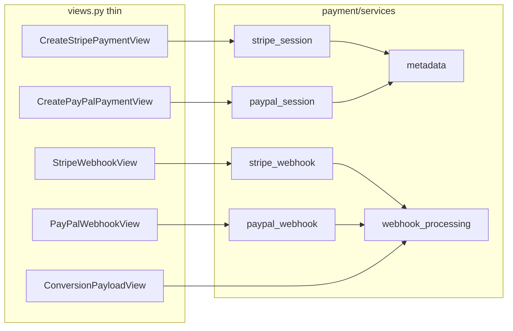

# План подготовки Task 003 — Payment Refactor (только документ)

Документ фиксирует анализ [backend/payment/views.py](../../../backend/payment/views.py) и пошаговый план декомпозиции для Task 003 **без изменения кода** в рамках этой подготовки.

---

## 0. Контекст файла

- Файл: [backend/payment/views.py](../../../backend/payment/views.py) (~1699 строк).
- Уже вынесено в сервисы (вне `views.py`, но по цепочке checkout/webhook): [backend/payment/services/stripe_checkout.py](../../../backend/payment/services/stripe_checkout.py), [backend/payment/services/paypal_checkout.py](../../../backend/payment/services/paypal_checkout.py), [backend/payment/services/webhook_processing.py](../../../backend/payment/services/webhook_processing.py) (`create_orders_and_payment`, `WebhookPaymentData`).
- URL-маршруты: [backend/payment/urls.py](../../../backend/payment/urls.py).

---

## 1. Логические блоки в `payment/views.py`

### 1.1 Модульный «хвост»: константы, кэш, хелперы, промо, валидация групп

**Строки (ориентир):** ~64–88 (константы Stripe/PayPal, `CHANNEL_MAP`, `DELIVERY_MODES_GLS`), ~90–191 (`_D`, `increment_promo_usage`, `apply_promo_code`, `_get_courier_code`, `_check_cz_origin_for_groups`, `create_order_event`), **класс** `PaymentSessionValidator` ~193–232.

| Аспект | Содержание |
|--------|------------|
| **Вход** | Глобальные `settings`; для хелперов — `groups`, `variant_map`, `promo_code`, `basket_items`. |
| **Выход** | `Response` (ошибки), `Decimal`, side-effect на `PromoCode` для `increment_promo_usage`; `PaymentSessionValidator.validate_groups` → `None` или `Response(400)`. |
| **Зависимости** | `delivery.*` (resolve country, validators), `product`, `promocode`, `order.OrderEvent`, `rest_framework`. |
| **Риски** | `increment_promo_usage` / `apply_promo_code` — зона Task 003 (гонки `used_count`); смешение HTTP-уровня (`Response`) внутри «сервисных» хелперов усложняет вынос. |

---

### 1.2 Блок: Stripe session (`CreateStripePaymentView`)

**Строки (ориентир):** класс ~440–805, метод `post`: ~443–805.

| Аспект | Содержание |
|--------|------------|
| **Вход** | `request.user`, `request.data` → `SessionInputSerializer`; группы с SKU, адреса, курьеры. |
| **Выход** | JSON: `checkout_url`, `session_id`, `session_key`; ошибки 400/500; побочный эффект: **`StripeMetadata.objects.create`** в `transaction.atomic`, затем **`create_stripe_checkout_session`** из [payment/services](../../../backend/payment/services/__init__.py). |
| **Зависимости** | `ProductVariant`, расчёт доставки (Packeta / DPD / GLS), `ZipCodeValidator`, `next_invoice_identifiers`, Stripe SDK через сервис. |
| **Риски** | Длинная ветвление по курьерам; рассинхрон суммы Stripe vs `description_data.gross_total`; orphan `StripeMetadata` если Stripe.create упал после commit метаданных (текущий порядок: metadata в atomic, затем try/except вне atomic для Stripe — см. ~749–805). |

---

### 1.3 Блок: PayPal session (`CreatePayPalPaymentView`)

**Строки (ориентир):** класс ~1080–1440, `post` с ~1083.

| Аспект | Содержание |
|--------|------------|
| **Вход** | Аналогично Stripe: `SessionInputSerializer`, группы, адреса. |
| **Выход** | `approval_url`, `order_id`, `session_key`, `session_id`; **`PayPalMetadata.objects.create`** в atomic; **`create_paypal_checkout_session`**. |
| **Зависимости** | Те же delivery/product/invoice helpers; [PayPalMixin](../../../backend/payment/mixins.py) (не в `views.py`, но связь). |
| **Риски** | Дублирование логики с Stripe (расхождение при правках только в одной ветке); те же риски metadata vs внешний API. |

---

### 1.4 Блок: Webhook HTTP (Stripe + PayPal)

**Stripe:** `StripeWebhookView` ~835–917. **PayPal:** `PayPalWebhookView` ~1460–1601 (+ вспомогательные `_paypal_api_get` / `_paypal_api_capture` ~1464–1482).

| Аспект | Содержание |
|--------|------------|
| **Вход** | Raw body, заголовки подписи; JSON PayPal. |
| **Выход** | HTTP 200/400/403/500; вызов **`create_orders_and_payment(WebhookPaymentData)`**; сообщения об idempotent replay. |
| **Зависимости** | `stripe.Webhook.construct_event`, `PayPalMixin.verify_webhook`, загрузка **`StripeMetadata` / `PayPalMetadata`**, PayPal REST для capture/order details. |
| **Риски** | Подпись, частичные payload; PayPal: несколько `event_type` и ветки capture; расхождение `amount` vs metadata. |

---

### 1.5 Блок: Metadata (подготовка и чтение)

**Запись:** внутри `CreateStripePaymentView` (~749–769) и `CreatePayPalPaymentView` (~1383–1404) — структуры `custom_data`, `invoice_data`, `description_data`. **Чтение:** в обоих webhook’ах перед сборкой `WebhookPaymentData`.

| Аспект | Содержание |
|--------|------------|
| **Вход** | Нормализованные `groups`, пользователь, invoice ids, totals. |
| **Выход** | Строки БД в `StripeMetadata` / `PayPalMetadata`; webhook читает по `session_key`. |
| **Зависимости** | `next_invoice_identifiers`, модели metadata, согласованность с фронтом (`session_key` vs `session_id` для conversion — см. Task 003 / OpenAPI). |
| **Риски** | Несовместимость формата JSON в metadata при рефакторинге; двойной источник правды для totals (группы vs `description_data`). |

---

### 1.6 Блок: Order creation (в рамках `views.py`)

В `views.py` **нет** полной реализации создания заказа — только делегирование в **`create_orders_and_payment`** ([webhook_processing.py](../../../backend/payment/services/webhook_processing.py)): Stripe ~904–905, PayPal ~1589–1590. Вспомогательно: **`ConversionPayloadView`** (~1655–1699) и **`get_orders_by_payment_session_id`** — чтение результата после webhook.

| Аспект | Содержание |
|--------|------------|
| **Вход** | `WebhookPaymentData`. |
| **Выход** | `WebhookProcessingResult` (orders, `is_replay`, …); кэш conversion. |
| **Зависимости** | Весь оркестратор в `webhook_processing` (order, payment, invoice, warehouse, async email/parcels). |
| **Риски** | Task 003 явно трогает модели/идемпотентность/инвойсы — изменения могут затронуть не только `views.py`, но и `webhook_processing.py`; контракт webhook нельзя менять без задачи. |

---

### 1.7 Дополнительно: Conversion / analytics edge

**`ConversionPayloadView`** ~1655–1699 — кэш `conv`, fallback по `get_orders_by_payment_session_id`.

| Риски | Гонка «фронт раньше webhook» (уже заложено `ready: false`); несогласованность `session_id` Stripe vs internal key для PayPal. |

---

## 2. Пошаговый план декомпозиции (после Task 003 Iteration 2+)

### Step 1 — Stripe extraction

| Поле | Содержание |
|------|------------|
| **Файлы** | Новый модуль, напр. `payment/services/stripe_session.py` (или `checkout_stripe.py`); урезать [views.py](../../../backend/payment/views.py) `CreateStripePaymentView.post` до тонкого слоя. |
| **Функции вынести** | Логику построения `line_items`, цикла по `groups`, вызовов DPD/GLS/Packeta, валидаций ZIP/телефона, подготовки payload для `StripeMetadata` → одна или несколько чистых функций/класса «build stripe checkout context». |
| **Тесты** | [payment/test_checkout_flow.py](../../../backend/payment/test_checkout_flow.py): `CreateStripeSessionTests`, `DpdBranchTests`, `StripeWebhookFlowTests`; [payment/tests.py](../../../backend/payment/tests.py) (checkout + webhook). |
| **Риски** | Регрессии по суммам и line items; OpenAPI примеры в `@extend_schema` должны остаться синхронны. |
| **Что может сломаться** | CZ-origin, DPD-only ветки, нормализация ZIP, ответ 500 при Stripe API. |

---

### Step 2 — PayPal extraction

| Поле | Содержание |
|------|------------|
| **Файлы** | Новый `payment/services/paypal_session.py`; тонкий `CreatePayPalPaymentView`. |
| **Функции** | Параллель Step 1: общая часть «расчёт групп + доставка» желательно **один общий модуль** (иначе дублирование останется). |
| **Тесты** | Unit: [payment/tests.py](../../../backend/payment/tests.py) для `create_paypal_checkout_session`; **пробел:** мало интеграционных тестов именно на `CreatePayPalPaymentView` в `test_checkout_flow.py` — добавить до/после выноса (в рамках Task 003 Iteration 2). |
| **Риски** | Расхождение с Stripe после общего рефактора; PayPal-specific поля (`reference_id`). |
| **Что может сломаться** | Redirect URLs, `purchase_units`, capture flow в webhook. |

---

### Step 3 — Metadata isolation

| Поле | Содержание |
|------|------------|
| **Файлы** | `payment/services/metadata.py` или `checkout_metadata.py`; модели остаются в [models.py](../../../backend/payment/models.py). |
| **Функции** | `build_custom_data(...)`, `build_invoice_data(...)`, `build_description_data(...)`, `save_stripe_metadata_atomic` / `save_paypal_metadata_atomic`. |
| **Тесты** | Косвенно webhook + create session; при выносе — unit на сериализацию dict без БД или с тестовой БД. |
| **Риски** | Любое изменение ключей JSON ломает webhook restore. |
| **Что может сломаться** | Фронт, повторная оплата, отладка «нет metadata». |

---

### Step 4 — Webhook isolation

| Поле | Содержание |
|------|------------|
| **Файлы** | `payment/services/stripe_webhook.py`, `payment/services/paypal_webhook.py` (parse + verify + `WebhookPaymentData`); views — dispatch только. |
| **Функции** | `parse_stripe_checkout_event`, `verify_and_extract_stripe_session`; PayPal: `route_paypal_event`, `extract_payment_context`, существующие API calls. |
| **Тесты** | Те же `StripeWebhookFlowTests` + мок `construct_event`; для PayPal — расширить покрытие сценариев `event_type`. |
| **Риски** | Смена кодов ответа (400 vs 403) — контракт для Stripe/PayPal retry. |
| **Что может сломаться** | Idempotency, подпись, порядок capture vs COMPLETED. |

---

### Step 5 — Order creation separation

| Поле | Содержание |
|------|------------|
| **Файлы** | В основном [webhook_processing.py](../../../backend/payment/services/webhook_processing.py) (не `views.py`); при необходимости `payment/services/order_from_payment.py`. |
| **Функции** | Разбить `create_orders_and_payment` на этапы: idempotency check → create Payment → orders → invoice → async side-effects (см. Task 003 DoD: `F()`, locks). |
| **Тесты** | `payment/tests.py` + интеграционные webhook; Task 009 для склада. |
| **Риски** | Транзакции, дубликаты `session_id`, инвойсы, промокод. |
| **Что может сломаться** | Всё критичное в домене order/payment/warehouse. |

---

## 3. Связь шагов с Task 003 (из [task.md](./task.md))

- Миграции `Payment.session_id`, `PromoCode` `F()`, `InvoiceSequence` lock — **не только вынос из views**, но и правки в `webhook_processing` / models.
- Декомпозиция `views.py` — Steps 1–4; Step 5 — сервис оркестрации заказа.

---

## 4. Safe execution rules

1. **Не начинать вынос без зелёных тестов** из Task 002: полный прогон `payment` + затронутые `order` тесты.
2. **Один вертикальный срез за PR:** например только Step 1 (Stripe session) без смешивания с миграциями `unique=True`, если нет отдельного согласования.
3. **Контракты API:** тела запросов/ответов webhook и create-session **не менять** без явной задачи (см. ограничения Task 003).
4. **OpenAPI / drf-spectacular:** переносить `@extend_schema` вместе с view или дублировать ссылки на сериализаторы — не оставлять «пустые» описания.
5. **Поведение ошибок:** сохранять те же HTTP-коды и формы `{"error": ...}` / `{"origin": ...}` где они зафиксированы фронтом.
6. **Идемпотентность и порядок транзакций:** не менять порядок «сначала проверка существующего Payment, затем create» без отдельного анализа.
7. **Секреты и логи:** не логировать полные payload платежей, PII, сырые подписи; правило из workspace security.
8. **После каждого шага:** `pytest payment/` и `python manage.py test payment`; при затронутом `webhook_processing` — также smoke по `order.tests` при необходимости.
9. **PayPalMixin / urls:** при переносе webhook не ломать импорты и имена URL (`urls.py`).

---

## 5. Ссылка на исходную задачу

Полный scope, миграции и DoD: [task.md](./task.md).
