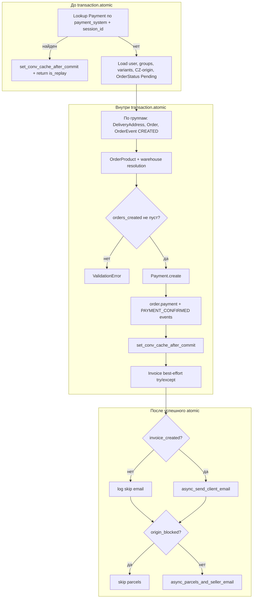

# Task 003 — Step 5: Order creation separation

**Статус реализации:** ✅ **Завершено** (behavior-preserving decomposition, 2026-05-07).

**Исходный документ:** план декомпозиции и чеклисты рисков; описанная ниже логика **реализована** в `backend/payment/services/webhook_processing.py` без изменения поведения.

**Проверка:** `pytest payment/` — **60 passed** в Docker (`docker-compose.test.yml`, сервис `backend_test`, PostgreSQL). Поведение replay / atomic / post-commit совпадает с эталоном (code review: OK).

**Контекст:** `create_orders_and_payment` и связанные типы в `webhook_processing.py`. Цель Step 5 — **безопасная декомпозиция** с сохранением идемпотентности, одной транзакции checkout и side-effects после коммита.

**Реализованные подшаги:**

| Подшаг | Функция / тип | Назначение |
|--------|---------------|------------|
| **5.1** | `_replay_if_payment_exists` | Pre-atomic: lookup Payment, conv cache при replay |
| **5.2** | `_prepare_order_creation_context`, `PreparedOrderCreationContext` | Pre-atomic: user, groups, variants, CZ-origin, Pending, root_country |
| **5.3** | `_persist_checkout_in_atomic`, `PersistCheckoutResult` | Один `transaction.atomic()`: заказы, Payment, события, conv cache, invoice best-effort |
| **5.4** | `_schedule_post_commit_side_effects` | После commit: client email, parcels/seller |

**Исходная сигнатура (без изменений):** `create_orders_and_payment(data: WebhookPaymentData) -> WebhookProcessingResult | None`

---

## 1. Карта текущего потока (кратко)

---

## 2. Idempotency

| Аспект | Сейчас | Риск при декомпозиции |
|--------|--------|------------------------|
| Ключ | `Payment.objects.filter(payment_system=..., session_id=...).first()` **до** `atomic()` | Перенос проверки внутрь `atomic` без `select_for_update` не меняет семантику, но и не устраняет гонку двух параллельных вебхуков. |
| Replay | `set_conv_cache_after_commit(conv_cache_id, existing.amount_total, existing.currency)` + `WebhookProcessingResult(orders=[], is_replay=True)` | Callback **должен** регистрироваться в той же «логической» точке: после подтверждения, что платёж уже есть. Сейчас при replay **нет** активной `atomic()` — `on_commit` при отсутствии открытой транзакции выполняется **сразу** (Django): это текущее поведение, сохранять. |
| Будущее | В Task 003 заявлен `unique=True` на `Payment.session_id` | После миграции второй параллельный вставщик получит `IntegrityError`; понадобится **явная** ветка «считаем replay» или повторный read (отдельная подзадача, не смешивать с чистым рефакторингом без изменения контракта). |

**Рекомендация (реализовано):** вынесено в `_replay_if_payment_exists(data, source) -> WebhookProcessingResult | None`.

---

## 3. Payment creation

| Аспект | Сейчас | Заметки |
|--------|--------|---------|
| Момент | Один `Payment.objects.create` **после** всех `Order` / `OrderProduct` | Порядок **нельзя** менять без анализа `prepare_invoice_data`, который ищет `Payment` по `session_id` в той же транзакции. |
| Поля | `payment_system`, `session_id`, `session_key`, `customer_id`, `payment_intent_id`, `payment_method`, `amount_total`, `currency`, `customer_email` | Контракт с метаданными и вебхуками сохранить. |
| Связь с заказами | Цикл `order.payment = payment; save(update_fields=["payment"])` + `OrderEvent` с `PAYMENT_CONFIRMED` | Логично выделить `_attach_payment_to_orders(orders, payment, data)` без изменения полей `meta`. |

---

## 4. Order creation

| Аспект | Сейчас | Заметки |
|--------|--------|---------|
| Цикл | По `invoice_data["groups"]` | Каждая группа → один `Order`. |
| Валидация | `DeliveryType` / `CourierService` отсутствие → `ValidationError` | Исключение глотает внешний `try` → `return None` (как сейчас для «неожиданного» пути — см. раздел 10). |
| Поля заказа | `total_amount=data.amount` на **каждый** заказ (текущая бизнес-логика) | Не «улучшать» при рефакторинге. |
| События | `OrderEvent.Type.ORDER_CREATED` сразу после `Order.objects.create` | Оставить порядок событиёв неизменным. |

Выделение: `_build_order_for_group(group_idx, group, data, user, vmap, pending_status, root_country) -> Order` или один генератор, возвращающий список заказов — на усмотрение ревью, главное **не менять** ветвления адреса и числовых полей.

---

## 5. OrderProduct creation

| Аспект | Сейчас | Заметки |
|--------|--------|---------|
| SKU | `vmap` из предзагруженных `ProductVariant` | Отсутствие варианта → `ValidationError`. |
| Склад | `WarehouseItem.objects.filter(product_variant=variant, quantity_in_stock__gte=qty).first()` → `warehouse` или `Warehouse.objects.first()` | Только **чтение** остатков; **списания в этой функции нет**. |
| Поля | `product_price=variant.price_with_acquiring`, `delivery_cost=0`, статус `AWAITING_SHIPMENT` | Без изменений. |

**Важно:** `warehouses.services.decrease_stock` в кодовой базе **нигде не вызывается**; уменьшение остатков в вебхуке сейчас **не выполняется**. Декомпозиция не должна «добавлять» списание задним числом.

---

## 6. Invoice creation

| Аспект | Сейчас | Заметки |
|--------|--------|---------|
| Расположение | В конце `atomic()`, после Payment и `set_conv_cache_after_commit` | `prepare_invoice_data(data.session_id)` читает `Payment` и `Order` по `session_id` — они должны быть **закоммичены видимы в транзакции** (в пределах одного `atomic()` это выполняется). |
| Устойчивость | `try/except Exception` — ошибки логируются, `invoice_created=False` | Не-ORM исключения не откатывают заказ. |
| Риск | ORM/БД ошибки при `Invoice.objects.create` **помечают транзакцию** failed | Текущий комментарий в коде корректен; «исправление» потребовало бы savepoint или вынесения инвойса за пределы внешнего atomic — это **изменение поведения**, вне Step 5 без отдельного решения. |

**Рекомендация:** оформить блок как `_try_create_invoice_for_payment(data, payment) -> bool`, внутри тот же `try/except`, без изменения сигнатур публичных сервисов инвойса.

---

## 7. PromoCode increment

**Факт:** в `create_orders_and_payment` **нет** вызова промокода. Функция `increment_promo_usage` в `payment/views.py` объявлена, но **по репозиторию вызовов нет** — счётчик промо в потоке вебхука сейчас **не инкрементируется** здесь.

**Для Step 5:** в плане декомпозиции явно зафиксировать «вне скоупа текущей функции». Если в следующих итерациях Task 003 промо переносят в оркестратор оплаты, нужно:

- одна транзакция с заказом/платежом **или** идемпотентный ключ использования промо по `session_id`;
- использовать `F()`-обновление (уже в scope Task 003 для модели).

---

## 8. Warehouse stock changes

**Факт:** только выбор строки `WarehouseItem` с достаточным `quantity_in_stock` (или fallback склад). Записи остатков **нет**.

Декомпозиция: хелпер `_resolve_warehouse_for_lineitem(variant, qty) -> Warehouse` без побочных эффектов.

---

## 9. Async parcels / email

| Вызов | Механизм | Когда относительно коммита |
|--------|----------|----------------------------|
| `set_conv_cache_after_commit` | `transaction.on_commit` | Регистрация **внутри** `atomic`; выполнение при успешном commit блока. |
| `async_send_client_email` | внутри — снова `on_commit` → executor | Вызывается **после** выхода из `with transaction.atomic()`; активной транзакции уже нет → callback выполняется **немедленно**, письмо ставится в пул. |
| `async_parcels_and_seller_email` | то же | Как выше. |

**Запрет при рефакторинге:** не вызывать эти функции внутри `atomic()` без явного аудита — сейчас они **после** блока (кроме conv cache, который только регистрируется внутри). Перенос клиентского email внутрь atomic **изменит** момент постановки задачи (хуже: письмо до реального commit).

**Условия:**

- Клиентское письмо: только если `invoice_created`.
- Посылки + seller + manager: только если **не** `origin_blocked`.

---

## 10. Transaction boundaries

| Блок | Граница |
|------|---------|
| Pre-flight idempotency, user, groups, variants | Вне `atomic` (как сейчас). |
| Orders + OrderProducts + Payment + события + регистрация conv cache + попытка Invoice | Один `transaction.atomic()` (как сейчас). |
| Post-commit async | После успешного выхода из `atomic`, до `return`. |

**Исключения:**

- `ValidationError` внутри `atomic` → перехват, лог warning, `return None`.
- Прочие `Exception` → log exception, `return None`.
- При replay до `atomic` — без транзакции заказа вообще.

Декомпозиция не должна размывать один внешний `atomic` на несколько **последовательных** commit без отдельного ADR (нарушит атомарность «все группы + один платёж»).

---

## 11. Replay behavior (сводка)

| Сценарий | Ожидаемое поведение (сохранить) |
|----------|----------------------------------|
| Повторный вебхук с тем же `(payment_system, session_id)` | Пустой список заказов, `is_replay=True`, conv cache обновлён суммой/валютой существующего платежа. |
| Stripe vs PayPal `conv_cache_id` | Stripe: `session_id` checkout; PayPal: `session_key` — уже в `data`. |
| HTTP-ответ views | Определяется Step 4 / текущими views; сервис по-прежнему не знает про HTTP. |

---

## 12. Conv cache

| Параметр | Значение |
|----------|----------|
| Бэкенд | `caches["conv"]` |
| TTL | 24 ч (`_CONV_CACHE_TTL`) |
| Ключ | `conv:{conv_cache_id}` |
| Payload | `ready`, `transaction_id`, `value`, `currency` |

**Идемпотентный replay** и **успешное первичное создание** оба вызывают `set_conv_cache_after_commit` с разными суммами (replay — из БД). При рефакторинге оба call-site должны остаться либо общей функцией `schedule_conv_cache_for_session(...)`, либо прямым вызовом существующей публичной утилиты.

---

## 13. Реализованная декомпозиция (`webhook_processing.py`)

Фактическая структура совпадает с планом ниже; вместо «`PreparedContext`» используется имя **`PreparedOrderCreationContext`**, возврат из atomic — **`PersistCheckoutResult`** (dataclass с `orders_created`, `payment`, `invoice_created`).

1. **`_replay_if_payment_exists(data, source)`** — только lookup + conv cache + `is_replay`.
2. **`_prepare_order_creation_context(data, source) -> PreparedOrderCreationContext | None`** — user, groups, `vmap`, `origin_blocked`, `not_cz`, `pending_status`, `root_country`.
3. **`_persist_checkout_in_atomic(data, ctx, source) -> PersistCheckoutResult | None`** — один `with transaction.atomic():` … (как в п. 1 карты потока).
4. **`_schedule_post_commit_side_effects(data, orders_created, invoice_created, origin_blocked, not_cz, source)`** — email и parcels/seller.
5. **`create_orders_and_payment`** — оркестратор: replay → prepare → persist → side-effects → `WebhookProcessingResult`.

**Приватные хелперы** `_build_delivery_address`, `_payment_event_meta` — без изменения сигнатур.

---

## 13a. Исходный план декомпозиции (архив формулировок)

Структура файла `webhook_processing.py` (или `webhook_processing/` пакет, если раздуется):

1. **`_replay_if_payment_exists(data, source) -> WebhookProcessingResult | None`**  
   - Только lookup + conv cache + `is_replay`.  
   - `None` означает «продолжаем».

2. **`_prepare_order_creation_context(data, source) -> PreparedOrderCreationContext | None`**  
   - User, groups, `vmap`, `origin_blocked`, `not_cz`, `pending_status`, `root_country`.  
   - Ранние `return None` с теми же логами, что сейчас.

3. **`_persist_checkout_in_atomic(data, ctx, source) -> PersistCheckoutResult | None`**  
   - Один `with transaction.atomic():`  
   - Внутри: цикл групп (адрес, заказ, продукты), проверка непустого списка, создание Payment, линковка, `set_conv_cache_after_commit`, invoice best-effort.  
   - Возврат: `PersistCheckoutResult(orders_created, payment, invoice_created)`.

4. **`_schedule_post_commit_side_effects(data, orders_created, invoice_created, origin_blocked, not_cz, source)`**  
   - Условия `invoice_created` и `origin_blocked`; вызовы `async_send_client_email` / `async_parcels_and_seller_email`.

5. **`create_orders_and_payment`**  
   - Тонкий оркестратор: replay → prepare → persist → side-effects → `WebhookProcessingResult`.

**Приватные хелперы** `_build_delivery_address`, `_payment_event_meta` — без изменения сигнатур.

---

## 14. Тесты / регрессия

**Фактически после Step 5.1–5.4:** `pytest payment/` — **60 passed** (Docker + PostgreSQL, `docker-compose.test.yml`).

Опора на:

- `payment/tests.py` — кейсы `create_orders_and_payment`, idempotent replay, ранние выходы.  
- `payment/test_checkout_flow.py` — интеграционные вебхук-цепочки на PostgreSQL.

Добавлять тесты **не обязательно в рамках одного только Step 5-плана**, но любой PR с нарезкой функции должен прогонять полный набор `payment/`.

---

## 15. Явно не входит в Step 5 (чтобы не «починить заодно»)

- Уникальный индекс `Payment.session_id` и обработка `IntegrityError`.  
- Списание склада, инкремент промокода.  
- Вынос инвойса в отдельную транзакцию / savepoint.  
- Замена `ThreadPoolExecutor` на Celery.  
- Изменение HTTP-ответов webhook.

---

## 16. Definition of Done — Step 5

- [x] Поведение идемпотентности, порядок записей в БД, conv cache и async-хуки **совпадает** с эталоном до рефакторинга (тесты + code review).  
- [x] Нет новых публичных **HTTP/API** контрактов для Stripe/PayPal views; сигнатура `create_orders_and_payment` и типы `WebhookPaymentData` / `WebhookProcessingResult` **не менялись**.  
- [x] Крупные куски снабжены короткими docstring «граница транзакции / side-effect».  
- [x] Регрессия: **`pytest payment/` — 60 passed** (Docker/PostgreSQL, `docker-compose.test.yml`).
