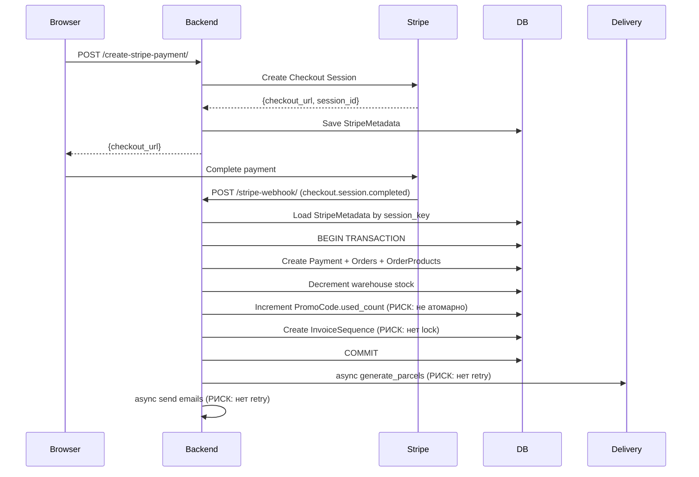

# Task 003 — Payment Refactor

**Priority:** P0/P1  
**Complexity:** High  
**Status:** In Progress — Iteration 4 (Steps 1–4 + Step 3.1 done; **Step 5:** план готов — [step-5-order-creation-plan.md](./step-5-order-creation-plan.md); **реализация Step 5 не начата**)

## Цель

Устранить P0 проблемы надёжности payment flow (дублирование заказов, неатомарный счётчик промокода, гонки инвойсов) и подготовить архитектуру для безопасной поддержки.

## Контекст

Payment flow — самая критическая часть системы. Сейчас в ней:
- `Payment.session_id` не уникален → дублирование заказов при повторной доставке webhook (DB-1)
- `PromoCode.increment_used_count` — `self.used_count += 1; self.save()` без `F()` → гонка при параллельных webhook'ах (DB-6)
- `InvoiceSequence` без `select_for_update` → дублирующиеся номера инвойсов (PAY-4)
- `payment/views.py` — исторически до рефактора порядка **~2198** строк (BE-2); **после Steps 1–4 фактически ≈ 973 строки** (актуально на 2026-05-07)
- Фоновые задачи (посылки, email) через `ThreadPoolExecutor` без retry → потеря при падении процесса (PAY-2)

Этот рефакторинг **нельзя начинать до завершения Task 002** (regression tests должны быть написаны первыми).

## Scope (область)

- Добавление `unique=True` на `Payment.session_id` + миграция
- Исправление `PromoCode.increment_used_count` через `F()`-выражение
- Добавление `select_for_update` в `InvoiceSequence`
- Декомпозиция `payment/views.py` в сервисный слой `payment/services/`
- Оценка и план перехода с `ThreadPoolExecutor` на Celery (реализация опционально)

## Не входит в задачу

- Изменение Stripe/PayPal API endpoint URL
- Изменение request/response контрактов webhook-ов
- Реализация серверной корзины (PAY-5)
- Frontend изменения

## Зависимости

- **Task 002 (testing-foundation)** — ОБЯЗАТЕЛЬНО завершить перед Iteration 3
- Task 001 (system-stabilization) — желательно завершить

## Риски

- Миграция `unique=True` на `session_id`: если в БД уже есть дубли — миграция упадёт → нужно проверить данные перед применением
- Декомпозиция `views.py` без тестов — неприемлемый риск → строгий запрет Iteration 3 без Iteration 2
- `ThreadPoolExecutor` → Celery — требует инфраструктурных изменений (Redis, Celery worker)

## Definition of Done

- [ ] `Payment.session_id` имеет `unique=True` (миграция применена)
- [ ] Повторная доставка Stripe/PayPal webhook не создаёт второй заказ
- [ ] `PromoCode.increment_used_count` использует `F()` выражение
- [ ] `InvoiceSequence` использует `select_for_update()` внутри `transaction.atomic()`
- [ ] `payment/views.py` разбит на сервисы в `payment/services/`
- [ ] Все существующие тесты payment проходят
- [ ] Написаны новые тесты для идемпотентности

---

# Iterations

## Iteration 1 — Analysis

### Цель
Полностью понять текущий payment flow и выявить все точки риска.

### Действия
- Прочитать `backend/payment/views.py` (особенно `StripeWebhookView`, `PayPalWebhookView`, `create_orders_and_payment`)
- Прочитать `backend/payment/services/webhook_processing.py`
- Прочитать `backend/payment/services/stripe_checkout.py`, `paypal_checkout.py`
- Прочитать `backend/payment/models.py` — `Payment`, `StripeMetadata`, `PayPalMetadata`
- Прочитать `backend/promocode/models.py` — `increment_used_count`
- Прочитать `backend/order/services/invoice_numbers.py`
- Прочитать `backend/delivery/utils_async.py` — `async_parcels_and_seller_email`

### Output
- Диаграмма текущего payment flow (Mermaid)
- Список всех мест без транзакционности
- Список всех мест без идемпотентности
- Оценка сложности каждого исправления

### Mermaid-схема (draft)


### Статус
- [ ] Analysis complete

---

## Iteration 2 — Tests

### Цель
Зафиксировать текущее поведение через тесты (до любых изменений кода).

### Тесты для написания

**Idempotency (обязательно до правки DB-1):**
```python
# payment/tests_webhook_idempotency.py

class StripeWebhookIdempotencyTest(TestCase):
    @patch("stripe.Webhook.construct_event")
    def test_duplicate_webhook_creates_one_order(self, mock_event):
        # Отправить webhook дважды с одним session_id
        # assert Order.objects.count() == 1
        # assert Payment.objects.count() == 1

    @patch("stripe.Webhook.construct_event")
    def test_duplicate_webhook_returns_200_both_times(self, mock_event):
        # Оба запроса возвращают 200 (идемпотентность)
```

**PromoCode increment (обязательно до правки DB-6):**
```python
# promocode/tests_concurrent.py

class PromoCodeConcurrentTest(TestCase):
    def test_concurrent_increment_does_not_exceed_max_usage(self):
        # Запустить 10 параллельных increment при max_usage=5
        # assert PromoCode.used_count <= 5
```

**InvoiceSequence (до правки PAY-4):**
```python
# order/tests_invoice.py

class InvoiceSequenceTest(TestCase):
    def test_concurrent_invoice_creation_produces_unique_numbers(self):
        # Параллельно создать 5 инвойсов
        # assert len(invoice_numbers) == len(set(invoice_numbers))
```

### Моки необходимые
- `stripe.Webhook.construct_event` → mock valid event
- `paypal.webhooks.verify_webhook_signature` → mock True
- `generate_parcels_for_order` → mock (не тестируем delivery в этой задаче)
- `send_seller_emails_by_session` → mock

### Статус
- [ ] Tests written and passing

---

## Iteration 3 — Atomic Fixes

### Цель
Исправить P0 проблемы атомарности и идемпотентности.

### Что менять

**1. `payment/models.py` — уникальный session_id:**

```python
# ДО:
session_id = models.CharField(max_length=255)

# ПОСЛЕ:
session_id = models.CharField(max_length=255, unique=True)
```

**Migration strategy:**
1. Сначала проверить дубли: `SELECT session_id, COUNT(*) FROM payment_payment GROUP BY session_id HAVING COUNT(*) > 1`
2. Если дубли есть — удалить вручную перед применением миграции
3. Применить миграцию `unique=True`
4. Обновить код в `webhook_processing.py` на `get_or_create`

**2. `promocode/models.py` — атомарный increment:**

```python
# ДО:
def increment_used_count(self):
    self.used_count += 1
    self.save()

# ПОСЛЕ:
from django.db.models import F

def increment_used_count(self):
    PromoCode.objects.filter(pk=self.pk).update(used_count=F("used_count") + 1)
    self.refresh_from_db(fields=["used_count"])
```

**3. `order/services/invoice_numbers.py` — select_for_update:**

```python
# ПОСЛЕ:
def get_next_invoice_number(year: int) -> int:
    with transaction.atomic():
        seq = InvoiceSequence.objects.select_for_update().get_or_create(series=year)[0]
        seq.last_number += 1
        seq.save(update_fields=["last_number"])
        return seq.last_number
```

**4. `payment/services/webhook_processing.py` — idempotency check:**

```python
# В начале create_orders_and_payment:
payment, created = Payment.objects.get_or_create(
    session_id=session_id,
    defaults={...}
)
if not created:
    logger.info(f"Duplicate webhook for session {session_id}, skipping")
    return payment
```

### Ограничения
- Не менять API-контракты webhook endpoint
- Не менять структуру `StripeMetadata` / `PayPalMetadata`

### Затрагиваемые файлы
| Файл | Изменение |
|------|-----------|
| `backend/payment/models.py` | `unique=True` на session_id |
| `backend/promocode/models.py` | `F()` в increment_used_count |
| `backend/order/services/invoice_numbers.py` | `select_for_update` |
| `backend/payment/services/webhook_processing.py` | `get_or_create` idempotency |
| `backend/payment/migrations/XXXX_payment_session_unique.py` | новая миграция |

### Статус
- [ ] Atomic fixes applied

---

## Iteration 4 — Service Layer Decomposition

### Цель
Декомпозировать `payment/views.py` (исторически ~2198 строк; **сейчас ≈ 973**) в сервисный слой.

### Целевая структура

```
backend/payment/
├── views.py                    ← только HTTP (thin controller)
├── services/
│   ├── __init__.py
│   ├── stripe_checkout.py      ← создание Stripe сессии (уже есть)
│   ├── paypal_checkout.py      ← создание PayPal сессии (уже есть)
│   ├── webhook_processing.py   ← orchestration (уже есть)
│   ├── order_factory.py        ← NEW: создание Order + OrderProduct из метаданных
│   ├── invoice_service.py      ← NEW: PDF генерация + Invoice model
│   └── notification.py         ← NEW: email уведомления (seller/buyer/manager)
```

### Правила декомпозиции
- Каждый шаг = отдельный сервис с clear interface
- `views.py` вызывает только сервисы, не бизнес-логику напрямую
- Не менять сигнатуры публичных методов (backward compatible)

### Ограничения
- Не менять поведение — только переносить код
- После каждого переноса запускать полный набор тестов payment
- Делать маленькими шагами: 1 сервис = 1 PR

### Прогресс

| Шаг | Статус | Файлы |
|-----|--------|-------|
| Step 1 — Stripe session extraction | ✅ Done (2026-05-06) | `services/stripe_session.py`, `views.py`, тесты в `payment/tests.py` |
| Step 2 — PayPal session extraction | ✅ Done (2026-05-06) | `services/paypal_session.py`, `services/checkout_shared.py`, `views.py`, `payment/tests.py`, отчёт `step-2-paypal-plan.md` |
| Step 3 — Metadata isolation | ✅ Done (2026-05-06) | `services/checkout_metadata.py`, `stripe_session.py` / `paypal_session.py`, тесты `TestCheckoutMetadataBuilders` в `payment/tests.py`; план: [step-3-metadata-plan.md](./step-3-metadata-plan.md) |
| Step 3.1 — CZ-origin shared cleanup | ✅ Done (2026-05-06) | Общая `check_cz_origin_for_checkout` в `services/checkout_shared.py`; вызовы из `stripe_session.py` и `paypal_session.py` |
| Step 4 — Webhook isolation | ✅ Done (2026-05-07) | `services/stripe_webhook.py`, `services/paypal_webhook.py`, `views.py`, OpenAPI уточнение для PayPal `ignored`; план: [step-4-webhook-plan.md](./step-4-webhook-plan.md) |
| Step 5 — Order creation separation | 📋 **Plan done** · ⬜ **Execution not started** | План: [step-5-order-creation-plan.md](./step-5-order-creation-plan.md). **Scope:** только декомпозиция `create_orders_and_payment` без изменения поведения. **Вне scope Step 5:** `unique` на `Payment.session_id`, `PromoCode` + `F()`, `decrease_stock`, перестройка транзакций инвойса, Celery — см. раздел «Step 5 — план и границы» ниже. |

#### Step 1 — итоги

- `build_stripe_checkout_context` вынесен в `payment/services/stripe_session.py`
- `CreateStripePaymentView.post` сведён к десериализации + вызову сервиса + Response
- API контракт сохранён (все HTTP-коды и форматы ответа идентичны оригиналу)
- Orphan metadata risk (метаданные сохранены, внешний API упал) **сохранён намеренно** — устраняется отдельной задачей
- Webhook и order creation не трогались

#### Step 2 — итоги

- `build_paypal_checkout_context` вынесен в `payment/services/paypal_session.py`
- Общие `_D`, `_CHANNEL_MAP`, базовый `CheckoutSessionBuildError` — в `payment/services/checkout_shared.py` (Stripe/PayPal используют один источник)
- `CreatePayPalPaymentView.post` сведён к тонкому HTTP-слою
- **Code review Step 2:** пройден; критических замечаний нет
- **`payment/tests.py`:** **34/34 passed**
- Отчёт: [step-2-paypal-plan.md](./step-2-paypal-plan.md)

#### Step 3 — итоги (metadata isolation)

- Билдеры metadata и согласованное использование в checkout — `payment/services/checkout_metadata.py`; контексты Stripe/PayPal записывают метаданные через общий слой.
- **Тесты:** `TestCheckoutMetadataBuilders` в `payment/tests.py`.
- План: [step-3-metadata-plan.md](./step-3-metadata-plan.md).

#### Step 3.1 — итоги (CZ-origin shared cleanup)

- Единая проверка CZ-origin для checkout: **`check_cz_origin_for_checkout`** в `payment/services/checkout_shared.py`.
- `build_stripe_checkout_context` и `build_paypal_checkout_context` используют общую функцию (не дублируют логику в двух файлах).

После Step 1 в отчётах фигурировало **23/23** по stripe-срезу; после Step 2 полный прогон `payment/tests.py` = **34/34**; после Step 4 — расширенный набор (см. актуальный `pytest payment/tests.py`).

#### Step 4 — итоги (webhook isolation)

- **Stripe:** верификация события и сборка `WebhookPaymentData` вынесены в [`payment/services/stripe_webhook.py`](../../../backend/payment/services/stripe_webhook.py); `StripeWebhookView` остаётся тонким HTTP-слоем + `create_orders_and_payment`.
- **PayPal:** разбор JSON, whitelist `event_type`, извлечение полей (в т.ч. capture/order API) и сборка `WebhookPaymentData` вынесены в [`payment/services/paypal_webhook.py`](../../../backend/payment/services/paypal_webhook.py); `PayPalWebhookView` вызывает `PayPalMixin.verify_webhook` без изменения реализации verify.
- **HTTP-контракты webhook’ов** (статусы, тела ответов, тексты ошибок) **сохранены**; различие Stripe vs PayPal при idempotent replay **сохранено** (Stripe — пустой 200; PayPal — 200 JSON с числом заказов, в т.ч. `"0 order(s)..."`).
- **Идемпотентность** по-прежнему в `create_orders_and_payment`; поведение повторных webhook не менялось.
- **Code review Step 4:** пройден; критических регрессий по контракту не выявлено.
- **Документация:** в `@extend_schema` для PayPal webhook зафиксировано фактическое поведение для неподдерживаемых `event_type` — **200** `{"status": "ignored"}` (не 400).

#### Step 5 — план и границы

- **План создан:** [step-5-order-creation-plan.md](./step-5-order-creation-plan.md).
- **Реализация (execution):** не начата.
- **Scope Step 5:** только **декомпозиция** `create_orders_and_payment` в `payment/services/webhook_processing.py` (приватные хелперы и/или тонкий оркестратор), **с сохранением текущего поведения** и без изменения публичных контрактов (`WebhookPaymentData`, `WebhookProcessingResult`, HTTP-слой).

**Явно вне scope Step 5** (отдельные задачи / итерации; не смешивать с декомпозицией без явного решения):

- уникальность `Payment.session_id` (`unique=True`, миграция, обработка гонок / `IntegrityError`);
- атомарный инкремент промокода (`PromoCode` + `F()` и связанная оркестрация в вебхуке);
- списание склада (`warehouses.services.decrease_stock` или аналог в потоке оплаты);
- перепроектирование границ транзакций для инвойса (savepoint, вынос за пределы внешнего `atomic` и т.п.);
- замена `ThreadPoolExecutor` на Celery (инфраструктура, retry-модель).

### Follow-up (вне scope Steps 1–4 / Step 5)

- **PayPal webhook branch coverage:** расширить unit-тесты — `CHECKOUT.ORDER.APPROVED` / `CHECKOUT.ORDER.COMPLETED`, ошибки capture и смежные ветки.
- **Fragile PayPal payload/API errors:** хрупкие ветки (битый payload, необработанные HTTP/исключения от PayPal API) — отдельная задача с явным маппированием в HTTP.
- **`views.py` import / dead-code cleanup:** чистка импортов и остаточного «шума» без изменения бизнес-поведения — отдельным PR.
- **Integration tests:** стабильный прогон `payment/test_checkout_flow.py` и полный `pytest payment/` на PostgreSQL — см. `docker-compose.test.yml` и `docs/testing/postgres-integration-tests.md`.

### Статус (целевая структура Iteration 4+ / после Step 5)

*Отдельные файлы ниже **не обязательны** в рамках Step 5: по плану Step 5 достаточно декомпозиции внутри `webhook_processing.py`. Вынос в отдельные модули — по последующим шагам.*

- [ ] `order_factory.py` extracted (опционально, после Step 5)
- [ ] `invoice_service.py` extracted (опционально)
- [ ] `notification.py` extracted (опционально)
- [ ] `views.py` cleaned up (dead-code / импорты)

---

## Iteration 5 — Validation

### Тесты для запуска
```bash
pytest backend/payment/ -v
pytest backend/promocode/ -v
pytest backend/order/tests_invoice.py -v
```

### Сценарии для проверки
- [ ] Stripe webhook дважды → 1 заказ в БД
- [ ] PayPal webhook дважды → 1 заказ в БД
- [ ] PromoCode при max_usage → не превышает лимит
- [ ] Два параллельных инвойса → разные номера
- [ ] Все существующие тесты `payment/tests.py` проходят

### Статус
- [ ] Validation complete

---

## Привязка к коду

| Тип | Файлы |
|-----|-------|
| **Backend** | `payment/models.py`, `payment/views.py` (**≈973 строки** после Steps 1–4), `payment/services/webhook_processing.py`, `payment/services/checkout_metadata.py`, `payment/services/checkout_shared.py`, `payment/services/stripe_webhook.py`, `payment/services/paypal_webhook.py`, `promocode/models.py`, `order/services/invoice_numbers.py` |
| **Модели** | `Payment` (unique session_id), `PromoCode` (increment method), `InvoiceSequence` |
| **API** | `POST /stripe-webhook/`, `POST /paypal-webhook/` (контракты не меняются) |
| **Интеграции** | Stripe Webhook SDK, PayPal Webhook SDK |

## Связанные проблемы из docs/09-architecture-debt.md

- DB-1: `Payment.session_id` не уникален P0
- DB-6: `PromoCode.increment_used_count` неатомарный P0
- PAY-4: `InvoiceSequence` без `select_for_update` P1
- PAY-2: Нет retry при ошибке генерации посылок P1
- BE-2: `payment/views.py` было ~2198 строк → **≈ 973** после Steps 1–4 (остаётся техдолг: Step 5, cleanup)
