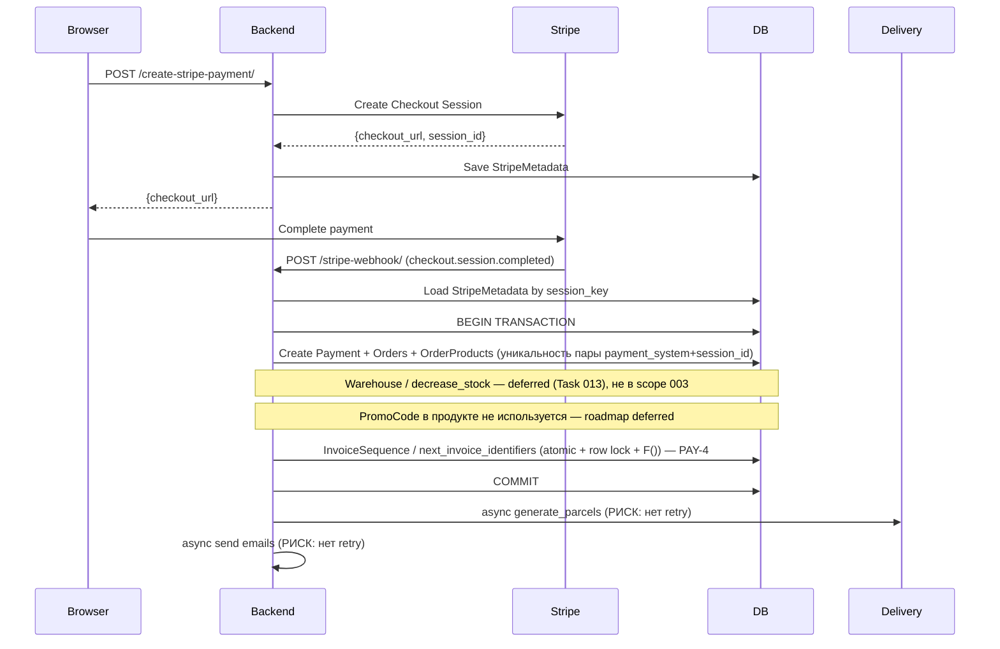
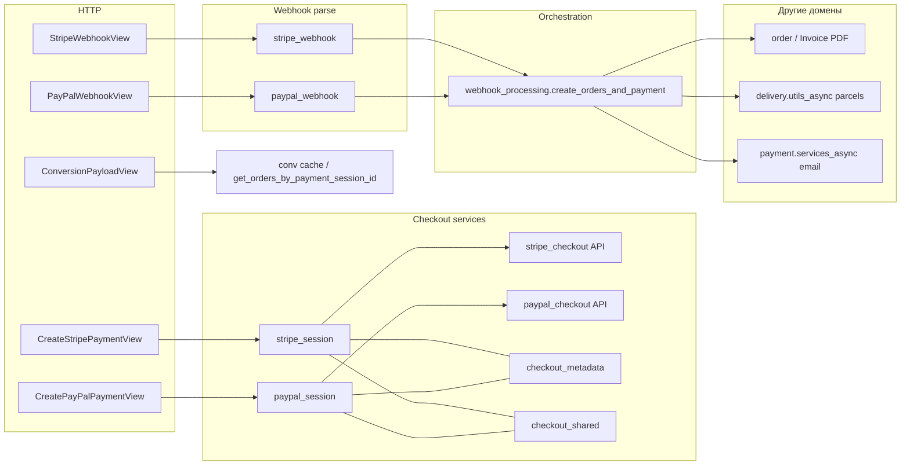

# Task 003 — Payment Refactor

**Priority:** P0/P1  
**Complexity:** High  

> **Навигация по номерам:** в `docs/tasks/` **Task 004** — *Order Consistency* (домен заказа). Текущий документ — **payment flow / cleanup** в коде и доках.

**Status:** **P0 / ядро платежей — DONE (репозиторий).** Атомарность, идемпотентность webhook, декомпозиция Steps 1–5, локальные e2e smoke Stripe/PayPal задокументированы (см. **Done** ниже). **Payment cleanup / polish — OPEN** (структура сервисов, ошибки webhook, логирование, негативные тесты, финальный аудит документации) — см. **Open**. Промокоды и склад в цепочке оплаты — **вне текущего product roadmap** задачи, не блокеры **003** — см. **Deferred**.

**Регрессия backend (Docker PostgreSQL, `backend_test`; счётчики могут меняться с ростом suite):**
```bash
docker compose -f docker-compose.test.yml run --rm backend_test \
  pytest payment/ order/tests.py --tb=no --disable-warnings
```
Опционально полная ветка с `promocode/` — только если трогаете код промокодов (в продукте сейчас **не используются**; не входит в scope cleanup **003**).

## Цель

Устранить P0-риски надёжности payment flow (дублирование заказов по платежу, гонки инвойсов PAY-4) и выделить сервисный слой для безопасной поддержки. **Промокоды и списание складских остатков** в рамках текущего roadmap **не** являются целями этой задачи — см. **Deferred**.

## Контекст

Payment flow — критичный контур. **Фактическое состояние (май 2026):**
- ~~`Payment`: дубль по парам `(payment_system, session_id)`~~ — **`UniqueConstraint` + `IntegrityError` → replay** в `webhook_processing` (DB-1)
- **PAY-4:** в `order/services/invoice_numbers.py` — `transaction.atomic`, `select_for_update()`, `F()`; регрессия `order/tests.py` (`NextInvoiceIdentifiersTests`, `NextInvoiceIdentifiersConcurrencyTests`)
- **Создание сессии (Stripe/PayPal):** вынесено в `services/stripe_session.py`, `paypal_session.py`, общие `checkout_shared.py`, `checkout_metadata.py` — стабильный thin HTTP в `views`
- **Webhooks:** разбор и верификация — `services/stripe_webhook.py`, `services/paypal_webhook.py`; оркестрация — `webhook_processing.py`
- **Локальный e2e (не production):** успешные smoke Stripe и PayPal в Docker e2e; заказ, инвойс, письма (Mailpit), повтор webhook без дублей — evidence: [`docs/testing/stripe-e2e-checklist.md`](../../testing/stripe-e2e-checklist.md), [`docs/testing/paypal-e2e-checklist.md`](../../testing/paypal-e2e-checklist.md). **Это не приёмка production.**
- `payment/views.py` — после декомпозиции порядка **≈ 973** строки (снимок 2026-05); BE-2 по объёму смягчён, финальный аудит структуры — в **Open**
- **PAY-2:** фоновые посылки/email через `ThreadPoolExecutor` без retry — **Deferred** (Celery/очередь)

**Task 002** как предпосылка для исторического P0-рефакторинга — выполнена по Core; регрессии по `payment/` поддерживать при доработках из **Open**.

## Scope (область) — актуальный

- ~~`Payment`: уникальность~~ — **`UniqueConstraint(payment_system, session_id)`** + обработка replay
- ~~Декомпозиция Steps 1–5~~ — checkout / webhook / order creation в сервисах; см. таблицу прогресса
- ~~Идемпотентность webhook, инвойс после оплаты~~ — автотесты + зафиксированный локальный e2e smoke (чеклисты выше)
- **Остаётся в работе (cleanup):** финальный аудит модулей `payment/services/*`, обработка ошибок webhook, выровненное логирование, документация метаданных/сессии, негативные webhook-тесты при пробелах — детализация в **Open**

**Явно не входит в scope Task 003 (текущий roadmap):** промокоды в продукте; резерв/списание остатков и складской учёт в цепочке оплаты (**Task 013** / future). См. **Deferred**.

## Не входит в задачу

- Изменение Stripe/PayPal API endpoint URL
- Изменение request/response контрактов webhook-ов
- Реализация серверной корзины (PAY-5)
- Frontend изменения

## Зависимости

- **Task 002 (testing-foundation)** — ОБЯЗАТЕЛЬНО завершить перед Iteration 3
- Task 001 (system-stabilization) — желательно завершить

## Риски

- Миграция `UniqueConstraint(payment_system, session_id)`: при дубликатах пара в БД миграция упадёт → проверить `GROUP BY payment_system, session_id` перед выкладкой
- Декомпозиция `views.py` без тестов — неприемлемый риск → строгий запрет Iteration 3 без Iteration 2
- `ThreadPoolExecutor` → Celery — требует инфраструктурных изменений (Redis, Celery worker)

## Done / Open / Deferred

### Done (репозиторий; не подразумевает production payment acceptance)

- [x] **DB-1 / `Payment`:** составной уникальный ключ `(payment_system, session_id)`; конфликт insert → replay (`IntegrityError` / `_replay_if_payment_exists`)
- [x] **Идемпотентность / replay:** повторный webhook не создаёт второй `Payment`/`Order`; регрессия `TestCreateOrdersIntegrityReplayCheckout` и др. в `payment/`
- [x] **PAY-4:** `next_invoice_identifiers()` — atomic + row lock + `F()`; тесты в `order/tests.py`
- [x] **Создание платёжной сессии:** стабилизировано в сервисах (Stripe/PayPal + shared metadata); thin controllers в `views`
- [x] **Обработка webhook:** стабилизирована (`stripe_webhook`, `paypal_webhook`, `webhook_processing`); HTTP-контракты не менялись в рамках рефакторинга
- [x] **Локальный e2e smoke Stripe/PayPal:** пройден; evidence в [`stripe-e2e-checklist.md`](../../testing/stripe-e2e-checklist.md) и [`paypal-e2e-checklist.md`](../../testing/paypal-e2e-checklist.md) — **только sandbox/local Docker, не production**
- [x] **Инвойс и письма:** на e2e контуре проверены создание счёта и письма клиенту/продавцу/менеджерам через **Mailpit** (см. те же чеклисты)
- [x] **Декомпозиция Steps 1–5** — по таблице прогресса ниже

### Open (payment-specific хвосты Task 003)

- [ ] **Структура `payment/services/*`:** финальный проход / audit границ модулей и публичных точек входа (без смены бизнес-поведения)
- [ ] **Error handling webhook:** частично задокументировано (таблицы HTTP / retry в [`stripe-e2e-checklist.md`](../../testing/stripe-e2e-checklist.md), [`paypal-e2e-checklist.md`](../../testing/paypal-e2e-checklist.md)). **Остаётся:** по желанию — явное маппирование проброса `requests` из PayPal `api_get` в тело ответа (сейчас может уйти необработанное исключение — см. тест `test_build_capture_completed_api_get_propagates_http_error`).
- [ ] **Логирование:** единые уровни/сообщения по ключевым веткам checkout + webhook; **сделано (2026-05):** `payment.mixins` debug не пишет значение `paypal-transmission-sig`.
- [ ] **Документация:** описание жизненного цикла `session_key` / метаданных / связи с PSP session — для разработчиков (можно `docs/` или OpenAPI notes)
- [x] **Негативные webhook-тесты (HTTP + verify):** `TestStripeWebhookViewHttp`, расширены `TestPayPalWebhookViewHttp`, `TestStripeWebhookService.test_verify_value_error_*`; матрица в testing checklists. **Follow-up:** ветки `PAYMENT.CAPTURE.COMPLETED` при сбое `api_get` — см. тест выше; расширять по веткам без смены контракта.
- [ ] **Финальный audit:** сверка этого `task.md` с кодом после закрытия пунктов выше

### Deferred (вне текущего roadmap Task 003; не блокеры closure P0-ядра)

| Тема | Примечание |
|------|------------|
| **PromoCode / DB-6 в продукте** | Промокоды **не используются** в продукте; доработки конкурентности/продукта — отдельно при возврате фичи |
| **Stock reservation / `decrease_stock` / warehouse quantity** | **Task 013** / future; не входит в обязательный scope **003** |
| **Celery вместо ThreadPoolExecutor** | PAY-2: инфраструктура, retry для посылок/email |
| **Fragile PayPal errors** | Хрупкие ветки payload/API — явные HTTP-ответы; пересекается с **Open** |
| **views cleanup** | Импорты, dead code в `views.py` без смены поведения |
| **`OrderProduct.received_at` naive datetime** | **Task 011** |
| **Опциональный вынос** | `order_factory.py` / `invoice_service.py` / `notification.py` из `webhook_processing` — по желанию |

---

# Iterations

## Iteration 1 — Analysis

### Цель
Полностью понять текущий payment flow и выявить все точки риска.

### Действия
- Прочитать `backend/payment/views.py` (особенно `StripeWebhookView`, `PayPalWebhookView`, `create_orders_and_payment`)
- Прочитать `backend/payment/services/webhook_processing.py`
- Прочитать `backend/payment/services/stripe_checkout.py`, `paypal_checkout.py`
- Прочитать `backend/payment/models.py` — `Payment`, `StripeMetadata`, `PayPalMetadata`
- *(Опционально / вне roadmap)* `backend/promocode/models.py` — только если снова включают промокоды в продукт
- Прочитать `backend/order/services/invoice_numbers.py`
- Прочитать `backend/delivery/utils_async.py` — `async_parcels_and_seller_email`

### Output
- Диаграмма текущего payment flow (Mermaid)
- Список всех мест без транзакционности
- Список всех мест без идемпотентности
- Оценка сложности каждого исправления

### Mermaid-схема (draft)


### Статус
- [x] Analysis complete (по итогам реализации и ревью)

---

## Iteration 2 — Tests

### Цель
Зафиксировать текущее поведение через тесты (до любых изменений кода).

### Тесты для написания

**Idempotency (обязательно до правки DB-1):**
```python
# payment/tests_webhook_idempotency.py

class StripeWebhookIdempotencyTest(TestCase):
    @patch("stripe.Webhook.construct_event")
    def test_duplicate_webhook_creates_one_order(self, mock_event):
        # Отправить webhook дважды с одним session_id
        # assert Order.objects.count() == 1
        # assert Payment.objects.count() == 1

    @patch("stripe.Webhook.construct_event")
    def test_duplicate_webhook_returns_200_both_times(self, mock_event):
        # Оба запроса возвращают 200 (идемпотентность)
```

**PromoCode / DB-6:** не входит в текущий roadmap **003** (промокоды в продукте не используются). Исторические тесты остаются в `promocode/` при необходимости полного прогона репозитория.

**InvoiceSequence / PAY-4 (регрессия, код уже целевой):**
- `order/tests.py` — `NextInvoiceIdentifiersTests` (последовательные вызовы: уникальность, префикс года, ширина суффикса)
- `order/tests.py` — `NextInvoiceIdentifiersConcurrencyTests` (`TransactionTestCase`, параллельные вызовы `next_invoice_identifiers`)

### Моки необходимые
- `stripe.Webhook.construct_event` → mock valid event
- `paypal.webhooks.verify_webhook_signature` → mock True
- `generate_parcels_for_order` → mock (не тестируем delivery в этой задаче)
- `send_seller_emails_by_session` → mock

### Статус
- [x] Ключевые регрессии по `payment/` и PAY-4 в `order/tests.py`; промокоды — вне scope roadmap **003**

---

## Iteration 3 — Atomic Fixes

### Цель
Исправить P0 проблемы атомарности и идемпотентности.

### Что менять

**1. `payment/models.py` (итог по факту):** ~~черновик «unique только session_id» ниже устарел~~ — в проде **`UniqueConstraint(payment_system, session_id)`** + см. миграция `0004_…`.

```python
# УСТАРЕЛО — черновик:
# session_id = models.CharField(max_length=255, unique=True)
```

**Migration strategy:**
1. Сначала проверить дубли по паре: `GROUP BY payment_system, session_id HAVING COUNT(*) > 1`
2. Устранить дубли перед `AddConstraint`
3. Применить миграцию `payment.0004_payment_system_session_id_uniq`  

Подробнее: [payment-unique-constraint-plan.md](./payment-unique-constraint-plan.md).

**2. `promocode/models.py` (исторически; вне scope roadmap **003**):** атомарный increment **уже внедрён** (`F()`). Промокоды в продукте **не используются** — дальнейшая работа по DB-6 как продуктовому риску — **Deferred**.

```python
# Справочно — целевой паттерн (в репозитории уже применён):
from django.db.models import F

def increment_used_count(self):
    PromoCode.objects.filter(pk=self.pk).update(used_count=F("used_count") + 1)
    self.refresh_from_db(fields=["used_count"])
```

**3. `order/services/invoice_numbers.py` — PAY-4:** правка **не требуется** — уже `transaction.atomic`, `select_for_update().get_or_create(...)`, инкремент через `F("last_number") + 1`. Менять только при смене бизнес-правил или по результатам регрессии.

**4. `payment/services/webhook_processing.py` — idempotency:** фактически — `_replay_if_payment_exists` + `UniqueConstraint` + ветка `IntegrityError` → replay (не `get_or_create` из черновика ниже).

```python
# УСТАРЕЛО (черновик Iteration 3):
# payment, created = Payment.objects.get_or_create(session_id=..., defaults={...})
```

### Ограничения (Iteration 3)
- Не менять API-контракты webhook endpoint
- Не менять структуру `StripeMetadata` / `PayPalMetadata`

### Затрагиваемые файлы
| Файл | Изменение |
|------|-----------|
| `backend/payment/models.py` | `UniqueConstraint(payment_system, session_id)` + обработка в `webhook_processing` |
| `backend/promocode/models.py` | `F()` в increment — *в репозитории; продуктовый трек промокодов — **Deferred*** |
| `backend/order/services/invoice_numbers.py` | PAY-4: уже atomic + `select_for_update` + `F()`; регрессия в `order/tests.py` |
| `backend/payment/services/webhook_processing.py` | `_replay_if_payment_exists` + `IntegrityError` → `_CONCURRENT_PAYMENT_REPLAY` / replay semantics |
| `backend/payment/migrations/0004_payment_system_session_id_uniq.py` | `UniqueConstraint(payment_system, session_id)` |

### Статус
- [x] Atomic fixes applied

## Iteration 4 — Service Layer Decomposition

### Цель
Декомпозировать `payment/views.py` (исторически ~2198 строк; **сейчас ≈ 973**) в сервисный слой.

### Целевая структура

```
backend/payment/
├── views.py                    ← только HTTP (thin controller)
├── services/
│   ├── __init__.py
│   ├── stripe_checkout.py      ← создание Stripe сессии (уже есть)
│   ├── paypal_checkout.py      ← создание PayPal сессии (уже есть)
│   ├── webhook_processing.py   ← orchestration (уже есть)
│   ├── order_factory.py        ← NEW: создание Order + OrderProduct из метаданных
│   ├── invoice_service.py      ← NEW: PDF генерация + Invoice model
│   └── notification.py         ← NEW: email уведомления (seller/buyer/manager)
```

### Правила декомпозиции
- Каждый шаг = отдельный сервис с clear interface
- `views.py` вызывает только сервисы, не бизнес-логику напрямую
- Не менять сигнатуры публичных методов (backward compatible)

### Ограничения
- Не менять поведение — только переносить код
- После каждого переноса запускать полный набор тестов payment
- Делать маленькими шагами: 1 сервис = 1 PR

### Прогресс

| Шаг | Статус | Файлы |
|-----|--------|-------|
| Step 1 — Stripe session extraction | ✅ Done (2026-05-06) | `services/stripe_session.py`, `views.py`, тесты в `payment/tests.py` |
| Step 2 — PayPal session extraction | ✅ Done (2026-05-06) | `services/paypal_session.py`, `services/checkout_shared.py`, `views.py`, `payment/tests.py`, отчёт `step-2-paypal-plan.md` |
| Step 3 — Metadata isolation | ✅ Done (2026-05-06) | `services/checkout_metadata.py`, `stripe_session.py` / `paypal_session.py`, тесты `TestCheckoutMetadataBuilders` в `payment/tests.py`; план: [step-3-metadata-plan.md](./step-3-metadata-plan.md) |
| Step 3.1 — CZ-origin shared cleanup | ✅ Done (2026-05-06) | Общая `check_cz_origin_for_checkout` в `services/checkout_shared.py`; вызовы из `stripe_session.py` и `paypal_session.py` |
| Step 4 — Webhook isolation | ✅ Done (2026-05-07) | `services/stripe_webhook.py`, `services/paypal_webhook.py`, `views.py`, OpenAPI уточнение для PayPal `ignored`; план: [step-4-webhook-plan.md](./step-4-webhook-plan.md) |
| Step 5 — Order creation separation | ✅ **Done** (2026-05-07) | Декомпозиция в `webhook_processing.py`: 5.1 `_replay_if_payment_exists`, … **Тесты:** см. актуальный счётчик в шапке задачи. **Пост Step 5:** составной unique на `Payment`, `PromoCode` + `F()`, `IntegrityError` replay — см. текущий DoD. |

#### Step 1 — итоги

- `build_stripe_checkout_context` вынесен в `payment/services/stripe_session.py`
- `CreateStripePaymentView.post` сведён к десериализации + вызову сервиса + Response
- API контракт сохранён (все HTTP-коды и форматы ответа идентичны оригиналу)
- Orphan metadata risk (метаданные сохранены, внешний API упал) **сохранён намеренно** — устраняется отдельной задачей
- Webhook и order creation не трогались

#### Step 2 — итоги

- `build_paypal_checkout_context` вынесен в `payment/services/paypal_session.py`
- Общие `_D`, `_CHANNEL_MAP`, базовый `CheckoutSessionBuildError` — в `payment/services/checkout_shared.py` (Stripe/PayPal используют один источник)
- `CreatePayPalPaymentView.post` сведён к тонкому HTTP-слою
- **Code review Step 2:** пройден; критических замечаний нет
- **`payment/tests.py`:** **34/34 passed**
- Отчёт: [step-2-paypal-plan.md](./step-2-paypal-plan.md)

#### Step 3 — итоги (metadata isolation)

- Билдеры metadata и согласованное использование в checkout — `payment/services/checkout_metadata.py`; контексты Stripe/PayPal записывают метаданные через общий слой.
- **Тесты:** `TestCheckoutMetadataBuilders` в `payment/tests.py`.
- План: [step-3-metadata-plan.md](./step-3-metadata-plan.md).

#### Step 3.1 — итоги (CZ-origin shared cleanup)

- Единая проверка CZ-origin для checkout: **`check_cz_origin_for_checkout`** в `payment/services/checkout_shared.py`.
- `build_stripe_checkout_context` и `build_paypal_checkout_context` используют общую функцию (не дублируют логику в двух файлах).

После Step 1 в отчётах фигурировало **23/23** по stripe-срезу; после Step 2 полный прогон `payment/tests.py` = **34/34**; после Step 4 — расширенный набор (см. актуальный `pytest payment/tests.py`).

#### Step 4 — итоги (webhook isolation)

- **Stripe:** верификация события и сборка `WebhookPaymentData` вынесены в [`payment/services/stripe_webhook.py`](../../../backend/payment/services/stripe_webhook.py); `StripeWebhookView` остаётся тонким HTTP-слоем + `create_orders_and_payment`.
- **PayPal:** разбор JSON, whitelist `event_type`, извлечение полей (в т.ч. capture/order API) и сборка `WebhookPaymentData` вынесены в [`payment/services/paypal_webhook.py`](../../../backend/payment/services/paypal_webhook.py); `PayPalWebhookView` вызывает `PayPalMixin.verify_webhook` без изменения реализации verify.
- **HTTP-контракты webhook’ов** (статусы, тела ответов, тексты ошибок) **сохранены**; различие Stripe vs PayPal при idempotent replay **сохранено** (Stripe — пустой 200; PayPal — 200 JSON с числом заказов, в т.ч. `"0 order(s)..."`).
- **Идемпотентность** по-прежнему в `create_orders_and_payment`; поведение повторных webhook не менялось.
- **Code review Step 4:** пройден; критических регрессий по контракту не выявлено.
- **Документация:** в `@extend_schema` для PayPal webhook зафиксировано фактическое поведение для неподдерживаемых `event_type` — **200** `{"status": "ignored"}` (не 400).

#### Step 5 — итоги (order creation decomposition, behavior-preserving)

- **Step 5.1** ✅ `_replay_if_payment_exists` — pre-atomic idempotency / replay + conv cache.
- **Step 5.2** ✅ `_prepare_order_creation_context` + `PreparedOrderCreationContext` — user, groups, variants, CZ-origin, `Pending`, `root_country` до `atomic`.
- **Step 5.3** ✅ `_persist_checkout_in_atomic` + `PersistCheckoutResult` — один `transaction.atomic()`, прежний порядок Order → OrderProduct → Payment → события → `set_conv_cache_after_commit` → invoice best-effort; те же `ValidationError` / `Exception` и логи.
- **Step 5.4** ✅ `_schedule_post_commit_side_effects` — после успешного commit: client email, затем parcels/seller (те же условия и аргументы async).
- **`create_orders_and_payment`:** тонкий оркестратор; публичные контракты для views (`WebhookPaymentData`, `WebhookProcessingResult`, сигнатура функции) **не менялись**.
- **Регрессия:** см. команду pytest в шапке задачи (`payment/` + `order/tests.py`).

#### Step 5 — план и границы (исторический scope)

- **План:** [step-5-order-creation-plan.md](./step-5-order-creation-plan.md).
- **Реализация:** завершена (5.1–5.4); **поведение не изменялось** (code review: OK).
- **Scope Step 5:** только **декомпозиция** `create_orders_and_payment` в `payment/services/webhook_processing.py`, **без изменения публичных прикладных контрактов** (`WebhookPaymentData`, `WebhookProcessingResult`, HTTP-слой).

**Явно вне scope Step 5 и текущего roadmap Task 003:**

- ~~уникальность `Payment`…~~ ✅ (сделано после Step 5)
- ~~атомарный инкремент промокода в модели…~~ ✅ (*в репозитории есть `F()`; продуктовые промокоды — **Deferred***)
- **Списание склада / reservation** (`warehouses.services.decrease_stock` или аналог в потоке оплаты) — **Deferred**, **Task 013** / future (**не** хвост **003**)
- перепроектирование границ транзакций для инвойса (savepoint, вынос за пределы внешнего `atomic` и т.п.) — по отдельному решению
- замена `ThreadPoolExecutor` на Celery (инфраструктура, retry-модель)

### Follow-up вне Task 003 (расшифровка)

Сводка дублирует блок **Deferred** и пункты **Open** выше. Детали для backlog:

- **PayPal webhook branch coverage:** расширить unit-тесты — `CHECKOUT.ORDER.APPROVED` / `CHECKOUT.ORDER.COMPLETED`, ошибки capture и смежные ветки.
- **Fragile PayPal payload/API errors:** хрупкие ветки (битый payload, необработанные HTTP/исключения от PayPal API) — отдельная задача с явным маппированием в HTTP.
- **`views.py` import / dead-code cleanup:** чистка импортов и остаточного «шума» без изменения бизнес-поведения — отдельным PR.
- **Integration tests:** стабильный прогон `payment/test_checkout_flow.py` и полный `pytest payment/` на PostgreSQL — см. `docker-compose.test.yml` и `docs/testing/postgres-integration-tests.md`.

### Статус (целевая структура Iteration 4+ / после Step 5)

*Отдельные файлы ниже **не обязательны** в рамках Step 5: по плану Step 5 достаточно декомпозиции внутри `webhook_processing.py`. Вынос в отдельные модули — по последующим шагам.*

- [ ] `order_factory.py` extracted (опционально, после Step 5)
- [ ] `invoice_service.py` extracted (опционально)
- [ ] `notification.py` extracted (опционально)
- [ ] `views.py` cleaned up (dead-code / импорты)

---

## Iteration 5 — Validation

### Тесты для запуска
```bash
docker compose -f docker-compose.test.yml run --rm backend_test \
  pytest payment/ order/tests.py -v --tb=short
```

### Сценарии для проверки
- [x] Автоматические регрессии `payment/` + PAY-4 в `order/tests.py`
- [x] Ручной **локальный** e2e smoke Stripe + PayPal (Docker e2e, sandbox/test keys, Mailpit): идемпотентность повторного webhook, инвойс, письма — **evidence** в [`stripe-e2e-checklist.md`](../../testing/stripe-e2e-checklist.md) (*Verification evidence*) и [`paypal-e2e-checklist.md`](../../testing/paypal-e2e-checklist.md) (*latest local smoke result*). **Не production.**

### Статус
- [x] Validation complete для P0-ядра и документированного e2e smoke; **production payment acceptance** — отдельно и **не** утверждается этим файлом

---

## Аудит структуры payment app (2026-05-11)

Краткая карта потока (границы слоёв без смены контрактов):



**Выводы аудита**

| Область | Оценка |
|---------|--------|
| **views** | Create*-views — тонкие (serializer → `build_*_context` → `create_*_checkout_session`). Webhook-views — verify/parse в `*_webhook`, затем `create_orders_and_payment`. ConversionPayload — кэш + фолбэк через `get_orders_by_payment_session_id`. |
| **Stripe vs PayPal session** | Общая логика — `checkout_shared` (`_CHANNEL_MAP`, `check_cz_origin_for_checkout`, базовая ошибка); различия — только в `stripe_session` / `paypal_session` и вызовах PSP API — **опасного дублирования нет**. |
| **webhook_processing** | Зона ответственности: pre-flight + `_replay_if_payment_exists`, один `atomic` (заказы, `OrderProduct`, `Payment`, `OrderEvent`, conv cache, best-effort `Invoice`), post-commit `async_send_client_email` + `async_parcels_and_seller_email`. Назначение склада на строку заказа (`WarehouseItem` lookup) — **не** списание остатков; бизнес доставки не менялась. |
| **Идемпотентность** | Повтор webhook → replay без второго `Payment`; `IntegrityError` → replay; **side effects post-commit не планируются** при replay (как в docstring `create_orders_and_payment`). |
| **Метаданные** | `WebhookPaymentData` + `StripeMetadata` / `PayPalMetadata` в моделях; билдеры в `checkout_metadata`. |
| **Мёртвый код (устранён 2026-05-11)** | В `views.py` удалены неиспользуемые импорты, дубликат CZ-проверки (`check_cz_origin` уже в `checkout_shared`), мёртвые `PaymentSessionValidator` / promo-хелперы / `create_order_event`, неиспользуемые константы модулей. Размер `views.py` **≈775 строк**. |
| **Логирование** | Webhook: префиксы вида `[StripeWebhook]` / idempotent replay; checkout — session_key / user id; при необходимости дальнейшая унификация — см. **Open** выше. |

---

## Привязка к коду

| Тип | Файлы |
|-----|-------|
| **Backend** | `payment/models.py`, `payment/views.py` (**≈775 строк** после cleanup 2026-05-11), `payment/services/webhook_processing.py`, `payment/services/checkout_metadata.py`, `payment/services/checkout_shared.py`, `payment/services/stripe_webhook.py`, `payment/services/paypal_webhook.py`, `order/services/invoice_numbers.py` |
| **Модели** | `Payment` (`UniqueConstraint` на `payment_system` + `session_id`), `InvoiceSequence`; `PromoCode` — вне roadmap **003** |
| **API** | `POST /stripe-webhook/`, `POST /paypal-webhook/` (контракты не меняются) |
| **Интеграции** | Stripe Webhook SDK, PayPal Webhook SDK |

## Связанные проблемы из docs/09-architecture-debt.md

- DB-1: ~~`Payment.session_id` не уникален~~ — **закрыто** составным `UniqueConstraint` + `IntegrityError` → replay
- DB-6: в коде **исправлено** (`F()` + тесты в `promocode/`); **продуктовый** трек промокодов — **Deferred** (фича не используется)
- PAY-4: ~~`InvoiceSequence` без `select_for_update`~~ — **снято в коде** (`invoice_numbers.py`); приоритет — **регрессионные тесты** (добавлены в `order/tests.py`)
- PAY-2: Нет retry при ошибке генерации посылок P1
- BE-2: `payment/views.py` исторически ~2198 строк → **≈775** после выноса сервисов и cleanup мёртвого кода (2026-05); **Step 5** — декомпозиция `create_orders_and_payment` в `webhook_processing.py` **завершена**; опциональный вынос в отдельные модули (`order_factory` и т.д.) — техдолг
