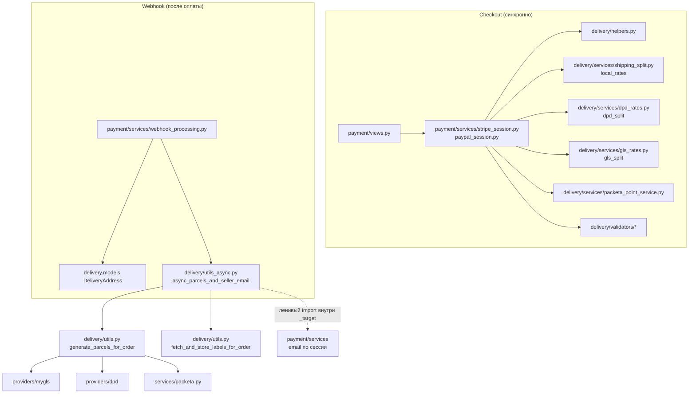
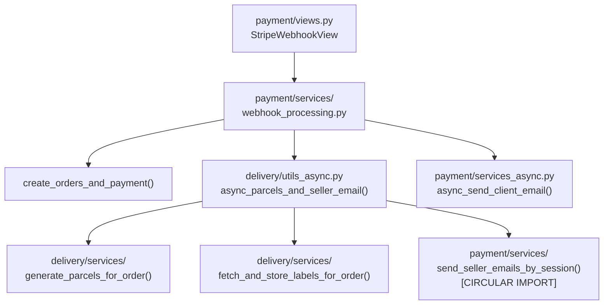

# Task 005 — Delivery Cleanup

**Priority:** P1  
**Complexity:** Medium  
**Status:** Pending

## Анализ (2026-05-11)

### Карта зависимостей (payment / order / delivery)



- **Цикл импорта:** на уровне модулей — `utils_async` не импортирует `payment` при загрузке; вызов `payment.services` только внутри фоновой функции после коммита.
- **Инконсистентность БД ↔ курьер:** `generate_parcels_for_order` — один большой `atomic` с HTTP к курьеру внутри. Успех API для посылки N и падение на N+1 может оставить активные отгрузки у провайдера без строк в БД (или откат БД при уже созданной посылке — зависит от точки сбоя). Нужны отдельная задача: укоротить транзакции, retry, идемпотентные client_reference.

### Частично закрыто кодом (2026-05-11)

- Dev-маршруты `/api/delivery/dev/*` регистрируются только при `DEBUG` или `ENABLE_DELIVERY_DEV_ENDPOINTS`.
- В `async_parcels_and_seller_email` ошибка на одном `order_id` не останавливает остальные; письма по-прежнему после цикла.
- Удалён неиспользуемый импорт `Thread` в `utils_async.py`.

### Open (всё ещё по Task 005)

- Retry/backoff для вызовов курьеров; очередь (Celery); мониторинг.
- Разрыв циклической **архитектурной** связи (вынести уведомления в общий слой).
- Явные тесты webhook при падении `generate_parcels_for_order` (заказ уже создан).

## Цель

Сделать delivery flow надёжным: убрать dev-эндпоинты из production, добавить retry для генерации посылок, устранить цикличные зависимости в `utils_async.py`.

## Контекст

Delivery domain имеет следующие проблемы:
- Dev-эндпоинты (`DevShipMyGLS`, `DevShipDPD` и др.): **с 2026-05-11** регистрируются только при `DEBUG` или `ENABLE_DELIVERY_DEV_ENDPOINTS`; ранее были доступны при любом `DEBUG=False` (SEC-4).
- `async_parcels_and_seller_email` использует `ThreadPoolExecutor` без retry у провайдеров → при падении Packeta/DPD/GLS заказ уже создан, посылки может не быть (PAY-2); **с 2026-05-11** сбой на одном заказе в батче не блокирует остальные `order_ids`.
- `delivery/utils_async.py` использует ленивые импорты для разрыва циклических зависимостей при загрузке модулей → архитектурный запах `payment.services` ↔ webhook ↔ `utils_async`.
- ~~Неиспользуемый импорт `Thread`~~ — удалён (2026-05-11).

## Scope (область)

- Добавление `if settings.DEBUG:` guard в `delivery/urls.py`
- Планирование и оценка перехода с `ThreadPoolExecutor` на Celery (или добавление retry через `transaction.on_commit` + exception handling)
- Устранение циклической зависимости между `payment.services` и `delivery.utils_async`
- Очистка неиспользуемых импортов в `utils_async.py`
- Добавление error handling в `async_parcels_and_seller_email`

## Не входит в задачу

- Изменение логики расчёта стоимости доставки
- Изменение провайдеров (Packeta, DPD, GLS)
- Изменение модели `DeliveryParcel`
- Полная реализация Celery (только план)

## Зависимости

- Task 002 (testing-foundation) — нужны тесты delivery перед правками
- Task 003 (payment-refactor) — декомпозиция payment/views.py упростит разрыв цикличных зависимостей

## Риски

- Исправление `utils_async.py` может затронуть `payment/services/webhook_processing.py` который вызывает `async_parcels_and_seller_email` → нужна координация с Task 003
- Добавление Celery требует инфраструктурных изменений → в рамках этой задачи только план + временный fallback

## Definition of Done

- [ ] Dev-эндпоинты delivery недоступны в production
- [ ] `utils_async.py` не содержит неиспользуемых импортов
- [ ] При ошибке генерации посылки — исключение логируется и заказ НЕ откатывается
- [ ] Циклические зависимости между delivery и payment задокументированы с планом устранения
- [ ] Написан тест: webhook успешен даже если генерация посылки падает

---

# Iterations

## Iteration 1 — Analysis

### Цель
Понять текущую архитектуру delivery flow и выявить все зависимости.

### Действия
- Прочитать `backend/delivery/utils_async.py` (изменённый файл)
- Прочитать `backend/delivery/urls.py` — найти dev-endpoints
- Прочитать `backend/delivery/api/dev_views.py`
- Прочитать `backend/payment/services/webhook_processing.py` — как вызывается `async_parcels_and_seller_email`
- Прочитать `backend/delivery/services/` — `generate_parcels_for_order`, `fetch_and_store_labels_for_order`

### Output

Диаграмма зависимостей:


- Список всех зарегистрированных URL в `delivery/urls.py`
- Оценка: нужен Celery или достаточно улучшенного error handling

### Статус
- [ ] Analysis complete

---

## Iteration 2 — Tests

### Цель
Написать тесты, фиксирующие поведение при ошибке провайдера доставки.

### Тесты для написания

```python
# backend/delivery/tests_async.py

class AsyncParcelsErrorHandlingTest(TestCase):
    @patch("delivery.services.generate_parcels_for_order", side_effect=Exception("Packeta unavailable"))
    @patch("payment.services.webhook_processing.create_orders_and_payment")
    def test_parcel_generation_failure_does_not_rollback_order(self, mock_create, mock_generate):
        # Payment и Order созданы успешно
        # generate_parcels_for_order падает
        # Order в БД существует (не откатился)
        # Ошибка залогирована

    @patch("delivery.services.generate_parcels_for_order", side_effect=Exception("DPD timeout"))
    def test_parcel_generation_failure_is_logged(self, mock_generate):
        # logger.error вызван с правильным сообщением

class DevEndpointAccessTest(TestCase):
    def test_dev_ship_endpoint_not_accessible_in_production(self):
        # При DEBUG=False: GET /delivery/dev/... → 404
```

### Статус
- [ ] Tests written

---

## Iteration 3 — Fix

### Цель
Применить исправления.

### Что менять

**1. `backend/delivery/urls.py` — DEBUG guard:**

```python
from django.conf import settings

urlpatterns = [
    # ... основные URL
]

if settings.DEBUG:
    from .api.dev_views import DevShipMyGLS, DevShipDPD, DevDpdPrintByShipment
    urlpatterns += [
        path("dev/ship-mygls/", DevShipMyGLS.as_view()),
        path("dev/ship-dpd/", DevShipDPD.as_view()),
        path("dev/dpd-print/", DevDpdPrintByShipment.as_view()),
    ]
```

**2. `backend/delivery/utils_async.py` — error handling:**

```python
import logging
logger = logging.getLogger(__name__)

def async_parcels_and_seller_email(order_ids, session_id):
    def _target():
        for order_id in order_ids:
            try:
                generate_parcels_for_order(order_id)
                fetch_and_store_labels_for_order(order_id)
            except Exception as exc:
                logger.error(
                    "Failed to generate parcels for order %s: %s",
                    order_id, exc, exc_info=True
                )
                # Не re-raise — заказ уже создан, продолжаем с email
        try:
            from payment.services import send_seller_emails_by_session, send_merged_manager_email_from_session
            send_seller_emails_by_session(session_id)
            send_merged_manager_email_from_session(session_id)
        except Exception as exc:
            logger.error("Failed to send seller emails for session %s: %s", session_id, exc, exc_info=True)

    transaction.on_commit(lambda: executor.submit(_target))
```

**3. Убрать неиспользуемый импорт:**

```python
# Удалить: from threading import Thread
```

**4. Документирование циклической зависимости:**

Добавить в `delivery/utils_async.py` comment с планом устранения:
```python
# TODO (task-005): Циклическая зависимость payment <-> delivery.
# Plan: вынести send_seller_emails в отдельный notification.py модуль
# который импортируется обоими пакетами без circular dependency.
```

### Затрагиваемые файлы
| Файл | Изменение |
|------|-----------|
| `backend/delivery/urls.py` | DEBUG guard |
| `backend/delivery/utils_async.py` | error handling, убрать Thread |

### Статус
- [ ] DEBUG guard applied
- [ ] Error handling improved
- [ ] Unused import removed

---

## Iteration 4 — Celery Plan (документация)

### Цель
Задокументировать план перехода с ThreadPoolExecutor на Celery для future task.

### Создать `docs/tasks/005-delivery-cleanup/celery-plan.md`:

```markdown
# Plan: Celery для фоновых задач delivery

## Текущее состояние
ThreadPoolExecutor — нет retry, нет мониторинга, нет гарантии доставки

## Целевое состояние
Celery + Redis broker

## Задачи для Celery
- generate_parcels_for_order(order_id) — retry 3x, backoff 60s
- fetch_and_store_labels_for_order(order_id) — retry 3x
- send_seller_emails_by_session(session_id) — retry 2x
- send_client_email(order_id) — retry 2x

## Migration steps
1. Добавить celery в requirements.txt
2. Настроить CELERY_BROKER_URL = Redis
3. Создать celery.py в backend/backend/
4. Конвертировать функции в @shared_task
5. Обновить utils_async.py → вызов через .delay()
6. Добавить flower для мониторинга
```

### Статус
- [ ] Celery plan documented

---

## Iteration 5 — Validation

### Тесты для запуска
```bash
pytest backend/delivery/ -v
```

### Сценарии для проверки
- [ ] `curl -X GET https://reli.one/api/delivery/dev/ship-mygls/` → 404 в production
- [ ] Webhook при недоступном Packeta → заказ создаётся, ошибка в логах
- [ ] `from delivery.utils_async import async_parcels_and_seller_email` — нет предупреждений

### Статус
- [ ] Validation complete

---

## Привязка к коду

| Тип | Файлы |
|-----|-------|
| **Backend** | `delivery/urls.py`, `delivery/utils_async.py`, `delivery/api/dev_views.py` |
| **Модели** | Не меняются |
| **API** | Dev endpoints скрыты в production |
| **Интеграции** | Packeta, DPD, GLS (поведение не меняется, только error handling) |

## Связанные проблемы из docs/09-architecture-debt.md

- SEC-4: Dev-эндпоинты доставки доступны в продакшне P1
- PAY-2: Нет retry при ошибке генерации посылок P1
