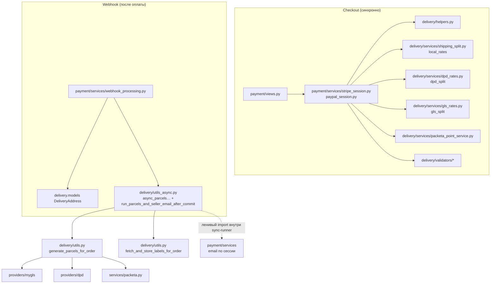

# Task 005 — Delivery Cleanup

**Priority:** P1  
**Complexity:** Medium  
**Status:** **DONE (repo-scope)** — цели задачи по репозиторию выполнены (см. [Final DoD table](#final-dod-table-task-005)).  
**Pending (ops / вне git):** ручная приёмка интеграций с перевозчиками (**Packeta, DPD, GLS, MyGLS** и др.) в **production** этим документом **не утверждается** — только регламент команды и реальные проверки на ваших контурах. **Celery**, **automatic in-code retry** и **идемпотентность на стороне перевозчика в коде** — не реализованы; см. [Deferred](#deferred--future).

## Инварианты roadmap (май 2026)

- **PromoCode** — вне scope Task 005 и **не** блокирует эту задачу.
- **Stock reservation / Task 013** — вне текущего roadmap и **не** блокирует Task 005.
- **Полноценная очередь Celery** (broker, workers, мониторинг задач) — **не** входит в обязательный scope; см. [Deferred](#deferred--future).
- **Production-интеграции курьеров** (Packeta, DPD, GLS, MyGLS и т.д.) **не** считаются полностью приёмочно проверенными этим документом: поведение в бою опирается на логи, существующие тесты и ручные сценарии; отдельный «green light» по всем перевозчикам **не** заявлен.

## Продуктовый контекст

- **Checkout (синхронно):** `payment` при создании сессии использует `delivery` (helpers, rates, split, валидаторы) для расчёта доставки в составе оплаты.
- **После оплаты:** в `on_commit` планируется фоновая цепочка **генерации посылок и ярлыков** и писем продавцу/менеджеру (`async_parcels_and_seller_email` и смежный код в `payment`).

---

## Анализ — карта зависимостей (payment / order / delivery)

- **Цикл импорта:** на уровне модулей `utils_async` не тянет `payment` при загрузке; вызов `payment.services` — внутри `run_parcels_and_seller_email_after_commit` (после commit, из потока пула).
- **БД ↔ курьер:** `generate_parcels_for_order` по-прежнему сочетает транзакционность и HTTP к перевозчику; полное согласование отказов (короткие транзакции, идемпотентность, retry на уровне провайдера) — **Deferred**, не обязательный объём текущего cleanup.

---

## Done (зафиксировано в репозитории)

| Тема | Суть |
|------|------|
| Dev courier endpoints | Маршруты `delivery` dev-tooling регистрируются только если `DEBUG` **или** `ENABLE_DELIVERY_DEV_ENDPOINTS` (`delivery/dev_access.py`, `delivery/urls.py`). |
| Тест политики dev-доступа | `delivery/test_dev_access.py` — три режима флагов. |
| Изоляция ошибок по заказу | В `async_parcels_and_seller_email` сбой на одном `order_id` не блокирует остальные; отдельные `try/except` на продавца/менеджера. |
| Импорты | Неиспользуемый `Thread` в `utils_async` удалён ранее. |
| Dependency map | Диаграмма выше + комментарий в коде про долгосрочный выход на очередь/слой уведомлений. |
| Monitoring notes | Сводка по логам и алертам для courier/delivery — [`docs/operations/monitoring-alerts.md`](../../operations/monitoring-alerts.md). |
| Troubleshooting (baseline) | Раздел «Посылки после оплаты» в [`docs/payment-flow.md`](../../payment-flow.md) — логи, dev-gating, `origin_blocked`, оговорка про приёмку перевозчиков. |
| **Retry / follow-up (O1)** | Зафиксированная **операционная** стратегия (без автоматического retry в коде и без Celery): см. [§ O1](#o1--retry--follow-up-операционная-стратегия) и раздел **[Operational playbook: parcel retry and follow-up](../../payment-flow.md#operational-playbook-parcel-retry-and-follow-up)** в `payment-flow.md`. |
| Автотесты сбоев parcel flow (O2) | [`backend/delivery/test_async_parcels_errors.py`](../../../backend/delivery/test_async_parcels_errors.py): падение `generate_parcels_for_order` / `fetch_and_store_labels_for_order`, отдельные сбои seller/manager email, отсутствие проброса исключений наружу; wiring `async_parcels_and_seller_email` через синхронный вызов `executor` + `on_commit` в тесте. Без реальных HTTP к перевозчикам (всё через `unittest.mock`). |

**Зависимости от других задач:** Task **003** и **010** по репозиторию закрыты в объёме, релевантном оплате/DevOps; **005** на них **не** завязан через PromoCode или склад.

---

## O1 — Retry / follow-up (операционная стратегия)

**Статус:** зафиксировано в документации (без изменений backend-кода). Автоматический retry в процессе webhook или фоновой задаче **не** реализован и **не** входит в текущий релизный минимум.

**Кратко**

1. **Типовые причины:** таймауты и обрывы сети при HTTP к перевозчику; **5xx** и временная недоступность API; **4xx** из‑за невалидного/устаревшего payload или конфигурации; проблемы **аутентификации/токенов** у провайдера (истёкший ключ, неверный env).
2. **Текущее поведение кода:** после успешного commit webhook **`Order` / `Payment` / инвойс (best-effort) уже в БД**; цепочка `run_parcels_and_seller_email_after_commit` (`delivery/utils_async.py`) вызывает `generate_parcels_for_order` и `fetch_and_store_labels_for_order` (`delivery/utils.py`) в фоне; при исключении — **`logger.exception`** с префиксом **`[PARCELS]`** (и при необходимости **`[PARCELS→SELLER]`** / **`[PARCELS→MANAGER]`** для почты); **исключение наружу не пробрасывается**, повторной постановки задачи **нет**.
3. **Операционный процесс:** детально — в [`docs/payment-flow.md`](../../payment-flow.md) → **[Operational playbook: parcel retry and follow-up](../../payment-flow.md#operational-playbook-parcel-retry-and-follow-up)**; краткий чеклист и алерты — в [`docs/operations/monitoring-alerts.md`](../../operations/monitoring-alerts.md).
4. **Будущие инструменты (только рекомендации, не реализованы):** `manage.py` команда «перезапуск генерации посылок по `order_id` / `session_key`»; **admin action** на заказе; защищённый **внутренний endpoint** под ролью staff; позже — **очередь (Celery)** с ретраями и DLQ — см. [Deferred](#deferred--future).
5. **Не обязательно для текущего релиза:** любой автоматический retry, Celery, идемпотентные client_reference на стороне провайдера, укорочение транзакций в `generate_parcels_for_order` — остаётся в [Deferred](#deferred--future).

---

## Deferred / Future

- **O3 (опционально, не блокирует закрытие Task 005):** отдельный standalone operations-runbook **не** требуется — расширенный playbook в [`payment-flow.md`](../../payment-flow.md) и перекрёстные ссылки в [`monitoring-alerts.md`](../../operations/monitoring-alerts.md).
- **Celery (или аналог)** с broker, ретраями задач и наблюдаемостью вместо `ThreadPoolExecutor` — отдельная инфраструктурная инициатива; **не реализовано**.
- **Укорочение транзакций** и **идемпотентные client_reference** при создании посылок у провайдера — снижение рассинхрона БД ↔ курьер.
- **Архитектурный слой уведомлений** вместо ленивого импорта `payment.services` из `delivery` — может пересечься с polish **003**; не входил в закрытие **005**.
- **Крупный rewrite** курьерских клиентских API — вне scope.
- **Опционально (не O2):** один интеграционный тест полного webhook `create_orders_and_payment` + сохранённый `Order` при падении фоновой генерации посылок — если понадобится доказательство именно на уровне HTTP webhook (сейчас покрыто синхронным runner и wiring-тестом).
- **Автоматический retry и продуктовый tooling** (management command, admin action, внутренний retry endpoint, Celery) — см. рекомендации в [O1](#o1--retry--follow-up-операционная-стратегия); внедрение только по отдельному решению.

---

## Scope границы (напоминание)

- **В scope:** поведение post-payment parcel generation, безопасность dev-tooling, изоляция ошибок, документация и тесты на отказы, операционная стратегия retry/follow-up.
- **Вне scope:** пересчёт тарифов доставки в checkout, смена провайдеров, изменение модели `DeliveryParcel`, промокоды, складской резерв.

---

## Final DoD table (Task 005)

**Кратко (repo-scope):** dev-endpoints закрыты флагами и покрыты тестами; сбои parcel/labels/email изолированы и покрыты тестами; retry/follow-up задокументирован в `payment-flow.md`; мониторинг ссылается на playbook; регрессия pytest зафиксирована в таблице ниже; приёмка перевозчиков в **production** — только **manual/pending (ops)**.

Финальный аудит **repo-scope**: ниже — что считается закрытым в репозитории, где evidence и что остаётся **вне git** (ops / manual).

| Item | Status | Evidence | Remaining action |
|------|--------|----------|------------------|
| Dev courier endpoints gated | **Done** | `delivery/dev_access.py`, `delivery/urls.py`; тесты `delivery/test_dev_access.py` | **Ops:** на каждом контуре убедиться `DEBUG=False`, `ENABLE_DELIVERY_DEV_ENDPOINTS` не включён случайно; при желании — ручной запрос к `…/api/delivery/dev/…` → ожидание отсутствия маршрута |
| Async parcel / labels / email failures isolated | **Done** | `delivery/utils_async.py` (`run_parcels_and_seller_email_after_commit`); `delivery/test_async_parcels_errors.py` | — |
| Retry / follow-up playbook (операционный) | **Done** | [§ O1](#o1--retry--follow-up-операционная-стратегия); [`payment-flow.md` — Operational playbook](../../payment-flow.md#operational-playbook-parcel-retry-and-follow-up) | **Ops:** при инцидентах следовать playbook; **не** ожидать automatic retry в коде |
| Monitoring / logs связаны с playbook | **Done** | [`monitoring-alerts.md`](../../operations/monitoring-alerts.md) (таблица симптомов + § Parcel generation); обратные ссылки на `payment-flow.md` | **Ops:** настроить алерты по proposal в том же runbook (вне scope **005**) |
| Карта зависимостей delivery ↔ payment | **Done** | Диаграмма выше в этом `task.md` | — |
| Regression gate (pytest) | **Done** (зафиксировано при закрытии O2 / финализации) | Последний зелёный прогон (май 2026): `docker compose -f docker-compose.test.yml run --rm backend_test pytest delivery/ -q`; то же для `pytest payment/ -q` и `pytest -q` из корня backend в контейнере | **Политика команды:** повторять перед релизом / в CI при изменениях в `delivery`/`payment` |
| Production courier acceptance (Packeta, DPD, GLS, …) | **Not claimed** | — | **Manual / ops pending:** приёмка перевозчиков в **production** этим репозиторием **не утверждается**; только регламент и реальные проверки на ваших контурах |
| Celery / automatic in-code retry / courier idempotency в коде | **Deferred** | См. [Deferred / Future](#deferred--future) | Отдельные задачи по решению продукта; **не** часть **005** |

**Явно не заявляется:** полная production-проверка GLS/DPD/Packeta/MyGLS; реализация Celery; реализация automatic retry; изменения PromoCode или Task 013.

---

## Исторические итерации (ссылочно)

Использовались для первоначального плана; реализация dev-gating и error isolation соответствует **Done** выше, а не обязательно старым фрагментам кода в ранних версиях этого файла.

### Iteration 1 — Analysis

- [x] Analysis complete (диаграмма, файлы перечислены в карте зависимостей).

### Iteration 2 — Tests

- [x] Политика dev URL — `delivery/test_dev_access.py`.
- [x] Сбои parcel/labels/email — `delivery/test_async_parcels_errors.py` (O2).

Ранее планировался пример с webhook целиком; реализовано через **`run_parcels_and_seller_email_after_commit`** и моки (`generate_parcels_for_order`, `fetch_and_store_labels_for_order`, `payment.services.*`), плюс тест wiring для `async_parcels_and_seller_email`.

### Retry / follow-up (O1)

- [x] Операционный playbook и рекомендации по будущему tooling — [`payment-flow.md`](../../payment-flow.md), [`monitoring-alerts.md`](../../operations/monitoring-alerts.md), § [O1](#o1--retry--follow-up-операционная-стратегия) в этом файле.

### Iteration 3 — Fix (первая волна)

- [x] Dev gating — `dev_access.include_dev_courier_tooling`.
- [x] Error handling — `utils_async.async_parcels_and_seller_email`.
- [x] Unused import removed.

### Iteration 4 — Celery

**Отложено** (Deferred). При появлении решения о внедрении очереди — отдельная задача.

### Iteration 5 — Validation

- [x] Прогон `pytest delivery/` (включая O2).
- [x] Прогон `pytest payment/` и полный `pytest` backend через `docker-compose.test.yml` (май 2026).
- [x] Ручная проверка dev-маршрутов на контуре — перенесена в колонку **Remaining action** финальной [таблицы DoD](#final-dod-table-task-005) (ops).

---

## Привязка к коду

| Тип | Файлы |
|-----|-------|
| **Backend** | `delivery/dev_access.py`, `delivery/urls.py`, `delivery/utils_async.py`, `delivery/api/dev_views.py`, `payment/services/webhook_processing.py`, `payment/services_async.py` |
| **Модели** | Не менялись в рамках первой волны |
| **Интеграции** | Packeta, DPD, GLS — без заявления о полной production-приёмке |

## Связанные заметки из docs/09-architecture-debt.md

- SEC-4: dev-эндпоинты доставки — **смягчено** gating (остаётся дисциплина env на prod).
- PAY-2: retry при ошибке генерации посылок — изоляция ошибок + **операционный playbook (O1)** в документации; **автоматический** retry и очередь — [Deferred](#deferred--future).
