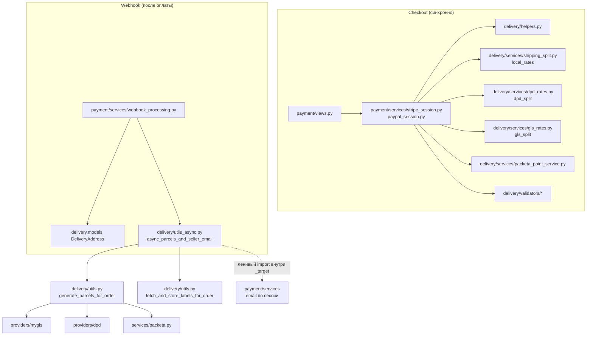

# Task 005 — Delivery Cleanup

**Priority:** P1  
**Complexity:** Medium  
**Status:** In progress — первая волна (dev-gating, изоляция ошибок по заказу, baseline troubleshooting в `payment-flow`) закрыта; открыты O1–O4 см. ниже.

## Инварианты roadmap (май 2026)

- **PromoCode** — вне scope Task 005 и **не** блокирует эту задачу.
- **Stock reservation / Task 013** — вне текущего roadmap и **не** блокирует Task 005.
- **Полноценная очередь Celery** (broker, workers, мониторинг задач) — **не** входит в обязательный scope; см. [Deferred](#deferred--future).
- **Production-интеграции курьеров** (Packeta, DPD, GLS, MyGLS и т.д.) **не** считаются полностью приёмочно проверенными этим документом: поведение в бою опирается на логи, существующие тесты и ручные сценарии; отдельный «green light» по всем перевозчикам **не** заявлен.

## Продуктовый контекст

- **Checkout (синхронно):** `payment` при создании сессии использует `delivery` (helpers, rates, split, валидаторы) для расчёта доставки в составе оплаты.
- **После оплаты:** в `on_commit` планируется фоновая цепочка **генерации посылок и ярлыков** и писем продавцу/менеджеру (`async_parcels_and_seller_email` и смежный код в `payment`).

---

## Анализ — карта зависимостей (payment / order / delivery)



- **Цикл импорта:** на уровне модулей `utils_async` не тянет `payment` при загрузке; вызов `payment.services` — внутри фоновой функции после коммита (см. комментарий в `delivery/utils_async.py`).
- **БД ↔ курьер:** `generate_parcels_for_order` по-прежнему сочетает транзакционность и HTTP к перевозчику; полное согласование отказов (короткие транзакции, идемпотентность, retry на уровне провайдера) — **Deferred**, не обязательный объём текущего cleanup.

---

## Done (зафиксировано в репозитории)

| Тема | Суть |
|------|------|
| Dev courier endpoints | Маршруты `delivery` dev-tooling регистрируются только если `DEBUG` **или** `ENABLE_DELIVERY_DEV_ENDPOINTS` (`delivery/dev_access.py`, `delivery/urls.py`). |
| Тест политики dev-доступа | `delivery/test_dev_access.py` — три режима флагов. |
| Изоляция ошибок по заказу | В `async_parcels_and_seller_email` сбой на одном `order_id` не блокирует остальные; отдельные `try/except` на продавца/менеджера. |
| Импорты | Неиспользуемый `Thread` в `utils_async` удалён ранее. |
| Dependency map | Диаграмма выше + комментарий в коде про долгосрочный выход на очередь/слой уведомлений. |
| Monitoring notes | Сводка по логам и алертам для courier/delivery — [`docs/operations/monitoring-alerts.md`](../../operations/monitoring-alerts.md). |
| Troubleshooting (baseline) | Раздел «Посылки после оплаты» в [`docs/payment-flow.md`](../../payment-flow.md) — логи, dev-gating, `origin_blocked`, оговорка про приёмку перевозчиков. |

**Зависимости от других задач:** Task **003** и **010** по репозиторию закрыты в объёме, релевантном оплате/DevOps; **005** на них **не** завязан через PromoCode или склад.

---

## Open (оставшийся scope Task 005)

| # | Пункт |
|---|--------|
| O1 | **Retry / follow-up:** операционная стратегия (что делать при падении провайдера после оплаты: повтор, ручной триггер, тикет) и при необходимости — узкая реализация **без** обязательной полной Celery-инфраструктуры (отдельное решение в коде по согласованию). |
| O2 | **Тесты на сбои delivery:** явное покрытие пути «заказ создан, `generate_parcels_for_order` падает» — заказ в БД, webhook не считается провалом для создания заказа; логирование (см. направление в историческом Iteration 2 ниже). |
| O3 | **Документация troubleshooting (опционально):** расширение baseline из [`docs/payment-flow.md`](../../payment-flow.md) в отдельный operations-runbook, если понадобится больше регламентов для поддержки. |
| O4 | **Финальный аудит:** пройти [Definition of Done](#definition-of-done) ниже и зафиксировать статус в этом файле. |

---

## Deferred / Future

- **Celery (или аналог)** с broker, ретраями задач и наблюдаемостью вместо `ThreadPoolExecutor` — отдельная инфраструктурная инициатива, не блокер текущего cleanup.
- **Укорочение транзакций** и **идемпотентные client_reference** при создании посылок у провайдера — снижение рассинхрона БД ↔ курьер.
- **Архитектурный слой уведомлений** вместо ленивого импорта `payment.services` из `delivery` — может пересечься с polish **003**, но не является входным условием для O1–O4.
- **Крупный rewrite** курьерских клиентских API — вне scope.

---

## Scope границы (напоминание)

- **В scope:** поведение post-payment parcel generation, безопасность dev-tooling, изоляция ошибок, документация и тесты на отказы, операционная стратегия retry/follow-up.
- **Вне scope:** пересчёт тарифов доставки в checkout, смена провайдеров, изменение модели `DeliveryParcel`, промокоды, складской резерв.

---

## Definition of Done

### Закрыто

- [x] Dev-эндпоинты курьеров недоступны в типичном production (`DEBUG=False`, флаг выключен).
- [x] В фоновой генерации посылок ошибка по одному заказу не блокирует остальные в батче.
- [x] Карта зависимостей и ссылка на мониторинг логов.

### Остаётся

- [ ] Задокументирована и согласована **стратегия retry/follow-up** для провалов генерации посылок (см. O1).
- [ ] Есть **автотест(ы)** на устойчивость webhook/order к падению генерации посылок (см. O2).
- [x] В **`docs/payment-flow.md`** есть **baseline manual troubleshooting** по parcel-flow (расширение — опционально, O3).
- [ ] **Финальный аудит** по чеклисту Task 005 выполнен и статус в шапке обновлён (см. O4).

---

## Исторические итерации (ссылочно)

Использовались для первоначального плана; реализация dev-gating и error isolation соответствует **Done** выше, а не обязательно старым фрагментам кода в ранних версиях этого файла.

### Iteration 1 — Analysis

- [x] Analysis complete (диаграмма, файлы перечислены в карте зависимостей).

### Iteration 2 — Tests

- [x] Политика dev URL — `delivery/test_dev_access.py`.
- [ ] Тесты сценария «падение `generate_parcels_for_order` после успешного создания заказа» — **Open** (O2).

Направление для O2 (без требования дословного копирования):

```python
# Например: backend/delivery/tests_async.py или рядом с webhook lifecycle

# patch generate_parcels_for_order → Exception
# убедиться: Order существует, ошибка залогирована / webhook не откатывает заказ
```

### Iteration 3 — Fix (первая волна)

- [x] Dev gating — `dev_access.include_dev_courier_tooling`.
- [x] Error handling — `utils_async.async_parcels_and_seller_email`.
- [x] Unused import removed.

### Iteration 4 — Celery

**Отложено.** При появлении решения о внедрении очереди — вынести в отдельную задачу или appendix (не блокирует закрытие O1–O4 по текущему scope).

### Iteration 5 — Validation

- [ ] Полный прогон pytest по `delivery` и целевые тесты из O2.
- [ ] Ручная проверка: при выключенном dev-доступе маршруты `…/dev/…` не резолвятся.

---

## Привязка к коду

| Тип | Файлы |
|-----|-------|
| **Backend** | `delivery/dev_access.py`, `delivery/urls.py`, `delivery/utils_async.py`, `delivery/api/dev_views.py`, `payment/services/webhook_processing.py`, `payment/services_async.py` |
| **Модели** | Не менялись в рамках первой волны |
| **Интеграции** | Packeta, DPD, GLS — без заявления о полной production-приёмке |

## Связанные заметки из docs/09-architecture-debt.md

- SEC-4: dev-эндпоинты доставки — **смягчено** gating (остаётся дисциплина env на prod).
- PAY-2: retry при ошибке генерации посылок — частично смягчено изоляцией ошибок; **полное** решение — в O1 / Deferred (очередь).
