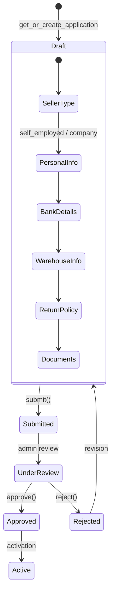

# Task 008 — Seller Onboarding Stabilization

**Priority:** P1  
**Complexity:** High  
**Status:** Pending

## Цель

Стабилизировать seller onboarding: покрыть тестами текущее поведение, задокументировать логику страны-специфичных шагов, и безопасно декомпозировать 1940-строчный монолит `views_onboarding.py`.

## Контекст

Seller onboarding — критическая бизнес-функция. Текущее состояние:
- `views_onboarding.py` — 1940 строк с ветвлениями по `seller_type` (Self-employed/Company) и стране (CZ/SK vs другие)
- `services_onboarding.py` — большой сервисный файл, логика completeness, IBAN/SWIFT валидация, модерация
- Тесты: только ~4 кейса на validation (company account holder, self-employed)
- Файлы отмечены как изменённые в git status → нужно понять что именно изменилось
- Нет документации о том, какие шаги обязательны для какого seller_type/страны

## Scope (область)

- Анализ и документация текущего onboarding flow
- Написание regression тестов для всех шагов
- Декомпозиция `views_onboarding.py` в step-handlers
- Документация `docs/seller-onboarding-flow.md`

## Не входит в задачу

- Изменение бизнес-правил онбординга
- Добавление новых стран
- Изменение API-контрактов онбординга
- Изменение моделей `SellerOnboardingApplication`

## Зависимости

- **Task 002 (testing-foundation)** — нужна инфраструктура pytest + factory-boy

## Риски

- Код с ветвлениями по стране сложно тестировать → нужны тесты для CZ и SK отдельно
- `compute_completeness` — сложная логика, лёгко сломать при рефакторинге → обязательные тесты перед правкой
- `views_onboarding.py` изменён (git status) → нужно прочитать diff перед тестами

## Definition of Done

- [ ] Задокументирован полный onboarding flow (Mermaid диаграмма)
- [ ] Написаны тесты для каждого шага (submit, self-employed, company, bank, warehouse, return, documents)
- [ ] `compute_completeness` покрыт тестами
- [ ] `views_onboarding.py` декомпозирован в step-handlers (если тесты написаны)
- [ ] `docs/seller-onboarding-flow.md` создан

---

# Iterations

## Iteration 1 — Analysis

### Цель
Полностью понять текущий onboarding flow и зафиксировать все ветвления.

### Действия
- Прочитать `backend/sellers/views_onboarding.py` — все 14 классов
- Прочитать `backend/sellers/services_onboarding.py` — `compute_completeness`, `ensure_application_editable`, модерация
- Прочитать `backend/sellers/serializers_onboarding.py` — блоки данных
- Прочитать `backend/sellers/tests.py` — что уже покрыто
- Понять `git diff` для изменённых файлов (sellers/*)

### Output

**Диаграмма onboarding flow:**


**Ветвления по seller_type:**
| Шаг | Self-employed | Company |
|-----|--------------|---------|
| seller-type | ✓ | ✓ |
| self-employed block | ✓ | — |
| company block | — | ✓ |
| bank details | ✓ | ✓ |
| warehouse | ✓ | ✓ |
| return policy | ✓ | ✓ |
| documents | ✓ | ✓ |

**Ветвления по стране (CZ/SK vs другие):**
- Необходимо задокументировать при анализе кода

### Статус
- [ ] Analysis complete
- [ ] Flow documented

---

## Iteration 2 — Tests

### Цель
Написать regression-тесты для всех шагов onboarding перед любым рефакторингом.

### Тесты для написания

**Основной flow:**
```python
# backend/sellers/tests_onboarding_flow.py

class OnboardingStateTest(TestCase):
    def test_new_seller_has_draft_application(self):
        # GET /sellers/onboarding/state/ → {"status": "draft"}

    def test_application_cannot_be_edited_after_submission(self):
        # ensure_application_editable → ValidationError после submit

class SellerTypeTest(TestCase):
    def test_set_seller_type_self_employed(self):
        # PUT /sellers/onboarding/seller-type/ {"type": "self_employed"}
        # → 200, тип сохранён

    def test_set_seller_type_company(self):
        # PUT /sellers/onboarding/seller-type/ {"type": "company"}

class SelfEmployedBlockTest(TestCase):
    def test_save_self_employed_personal_data(self):
        # PUT /sellers/onboarding/self-employed/ {...}

    def test_self_employed_personal_data_required_fields(self):
        # PUT с пустым телом → 400 с ошибками полей

class CompanyBlockTest(TestCase):
    def test_save_company_data(self):
        # PUT /sellers/onboarding/company/ {...}

    def test_company_account_holder_validation_cz_sk(self):
        # Существующий тест - перенести/расширить

class BankDetailsTest(TestCase):
    def test_valid_iban_accepted(self):
        ...

    def test_invalid_iban_rejected(self):
        # IBAN неправильный → 400

    def test_valid_swift_accepted(self):
        ...

class CompletenessTest(TestCase):
    def test_incomplete_application_cannot_be_submitted(self):
        # compute_completeness < 100 → submit → ValidationError

    def test_complete_application_can_be_submitted(self):
        # Все шаги заполнены → submit → 200
```

### Моки необходимые
- Email сервис при submit
- Admin notification при submit

### Статус
- [ ] Tests written

---

## Iteration 3 — Refactor (только если тесты написаны)

### Цель
Декомпозировать `views_onboarding.py` в step-handlers.

### Целевая структура

```
backend/sellers/
├── views_onboarding.py          ← только HTTP routing (thin)
└── onboarding/
    ├── __init__.py
    ├── steps/
    │   ├── __init__.py
    │   ├── state.py             ← OnboardingStateView
    │   ├── seller_type.py       ← SellerTypeView
    │   ├── self_employed.py     ← SelfEmployedBlockView
    │   ├── company.py           ← CompanyBlockView
    │   ├── bank.py              ← BankDetailsView
    │   ├── warehouse.py         ← WarehouseView
    │   ├── return_policy.py     ← ReturnPolicyView
    │   └── documents.py         ← DocumentsView
    └── review/
        ├── submit.py            ← SubmitView
        └── review.py            ← ReviewView (admin)
```

### Правила рефакторинга
- Только перенос кода, не изменение логики
- После каждого переноса запускать полный набор тестов onboarding
- Сохранить полную backward compatibility URL-маршрутов

### Ограничения
- Не менять API-контракты
- Не менять serializers

### Статус
- [ ] Steps extracted (только после написания тестов)

---

## Iteration 4 — Documentation

### Цель
Задокументировать onboarding flow для продуктовой и технической команды.

### Создать `docs/seller-onboarding-flow.md`:

```markdown
# Seller Onboarding Flow

## Статусы заявки
...

## Шаги по seller_type
...

## Требования по стране (CZ/SK)
...

## Валидации
- IBAN
- SWIFT
- Документы

## API endpoints
...

## compute_completeness логика
...
```

### Статус
- [ ] Documentation created

---

## Iteration 5 — Validation

### Тесты для запуска
```bash
pytest backend/sellers/ -v
```

### Сценарии для ручной проверки
- [ ] Регистрация нового продавца → создаётся draft application
- [ ] Заполнение self-employed данных → сохраняется корректно
- [ ] Попытка submit без заполнения всех шагов → ошибка
- [ ] Полное заполнение → submit → статус "submitted"
- [ ] Редактирование после submit → ошибка

### Статус
- [ ] Validation complete

---

## Привязка к коду

| Тип | Файлы |
|-----|-------|
| **Backend** | `sellers/views_onboarding.py`, `sellers/services_onboarding.py`, `sellers/serializers_onboarding.py` |
| **Новые файлы** | `sellers/onboarding/steps/*.py` (при рефакторинге) |
| **Тесты** | `sellers/tests_onboarding_flow.py` |
| **Модели** | `SellerOnboardingApplication`, `SellerDocument`, блоки onboarding |
| **API** | Не меняются контракты |

## Связанные проблемы из docs/09-architecture-debt.md

- BE-3: `sellers/views_onboarding.py` 1940 строк P1
