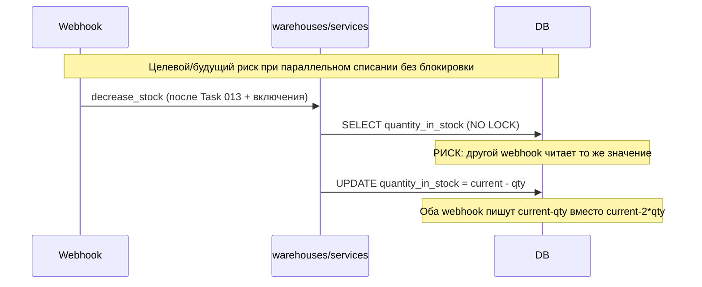

# Task 009 — DB Model Improvements

**Priority:** P0/P1  
**Complexity:** Medium  
**Status:** In Progress — **Step 1 (baseline audit)** выполнен; правки кода / миграции — начиная с Iteration 2.

> **Состояние склада (актуализация 2026-05-11):** сейчас create payment session **не проверяет** `WarehouseItem.quantity_in_stock`; webhook **не вызывает** `decrease_stock` (функция в коде есть, но ни одного вызова по проекту — списание отключено). Поведение склада при оплате и целевой end-to-end flow описаны в **[Task 013 — Stock Reservation](../013-stock-reservation/task.md)**. **В рамках Task 009 webhook не должен начинать вызывать `decrease_stock`:** включение списания возможно только после резерва/проверок по Task 013 и отдельному решению.

> **Аудит Step 1 (2026-05-13):** см. раздел [Current baseline (Step 1 audit)](#current-baseline-step-1-audit) ниже.

## Цель

Устранить технические риски вокруг складских моделей и цен, **в части склада** подготовить низкоуровневые примитивы (блокировка строки при списании и т.д.), не подменяя ими отдельную задачу **013** по резервированию до оплаты. Исправить бизнес-логику аналитики и привести часть моделей в соответствие с требованиями надёжности.

## Контекст

- **DB-2 (P0 — при возврате списания):** когда `decrease_stock` снова станет частью боевого flow, необходимо `select_for_update()` на строке `WarehouseItem`, иначе при параллельных подтверждениях `quantity_in_stock` может уйти в неконсистентное состояние. **Сейчас** списание в webhook выключено, поэтому риск именно «двойного списания в webhook» **не активен**, но остаётся **product risk** см. Task 013 (оплата без учёта остатка).
- **BE-6 (P2):** `analytics/services.py` использует `Warehouse.objects.get(name="Vendor warehouse")` → при переименовании склада в Admin аналитика перестаёт работать
- **BE-5 (P2):** Бизнес-логика цены (`price_with_acquiring`, `ACQUIRING_RATE = 1.04`) разбросана по `product/models.py`, `favorites/views.py` — при изменении ставки нужно менять в нескольких местах

## Scope (область)

- Добавление `select_for_update()` в `warehouses/services.py`
- Добавление `reserved_quantity` поля на `WarehouseItem` (с migration plan)
- Исправление `analytics/services.py` — использование константы или `warehouse_type` поля
- Централизация `ACQUIRING_RATE` в `settings.py` или `product/constants.py`
- Вынос логики расчёта цены в `product/services/pricing.py`

## Не входит в задачу

- Изменение API-контрактов
- Добавление серверной корзины (PAY-5)
- Изменение логики расчёта доставки

## Зависимости

- **Task 002 (testing-foundation)** — Core завершён; конкурентные тесты склада (`decrease_stock`) входят в эту задачу (Extended из 002)
- **Task 013 (stock-reservation)** — **блокирующая задача** для безопасного повторного включения списания: сначала проверка и резерв на create payment session, затем атомарное подтверждение в webhook
- Task 003 (payment-refactor) — те же точки интеграции (session + webhook), должны быть согласованы с Task 013; **реального вызова** `decrease_stock` из webhook в текущем коде нет

## Риски

- Добавление `reserved_quantity` требует migration + backfill данными → нужна migration strategy
- `select_for_update()` изменяет поведение под нагрузкой → тест на конкурентность обязателен
- Изменение `price_with_acquiring` в models.py может сломать сериализаторы, которые на это полагаются

## Definition of Done

- [ ] `warehouses/services.py` использует `select_for_update()` в `decrease_stock`
- [ ] Написан конкурентный тест для `decrease_stock`
- [ ] `analytics/services.py` не падает при переименовании склада
- [ ] `ACQUIRING_RATE` централизован в одном месте
- [ ] Все существующие тесты product/warehouse проходят

---

# Iterations

## Iteration 1 — Analysis

### Цель
Понять текущую логику warehouse и аналитики.

### Действия
- Прочитать `backend/warehouses/services.py` — `decrease_stock` (**`increase_stock` в репозитории нет**)
- Прочитать `backend/warehouses/models.py` — `Warehouse`, `WarehouseItem`
- Прочитать `backend/analytics/services.py` — `get_stats_for_two_warehouses`
- Прочитать `backend/product/models.py` — `price_with_acquiring`, `min_price_with_acquiring`
- Прочитать `backend/favorites/views.py` — как используется цена
- Найти все места с `1.04` или `ACQUIRING` / acquiring multiplier

### Output
- Схема warehouse flow и список вызовов — см. [Current baseline](#current-baseline-step-1-audit)

<a id="current-baseline-step-1-audit"></a>

## Current baseline (Step 1 audit)

**Проверенные файлы:** `backend/warehouses/services.py`, `backend/warehouses/models.py`, `backend/analytics/services.py`, `backend/analytics/views.py`, `backend/product/models.py`, `backend/favorites/views.py`, `backend/product/views.py`; точечный поиск по `backend/` — `decrease_stock`, `get_stats_for_two_warehouses`, `1.04` / `ACQUIRING`.

### Warehouse

| Вопрос | Факт (текущий код) |
|--------|---------------------|
| `decrease_stock` | Один запрос `WarehouseItem.objects.get(warehouse, product_variant)`; без `transaction.atomic`, без `select_for_update`. |
| `increase_stock` | **Отсутствует** в `warehouses/services.py`. |
| Исключения | Обрабатывается только `WarehouseItem.DoesNotExist` (warning + return). Недостаточный остаток: **не exception**, а `warning` + **early return без изменения** поля. |
| Недостаточный остаток | Списание **не выполняется**; остаток не меняется. |
| Уход в минус | При **однопоточном** проходе — нет (проверка `quantity_in_stock < quantity` до вычитания). **`PositiveIntegerField`** на модели также блокирует отрицательные значения при сохранении, но при гонке возможна **логическая перепродажа** (два потока читают одно значение и оба списывают). |
| Вызовы `decrease_stock` | **Только определение** в `warehouses/services.py`; **импортов/вызовов по проекту нет** (`grep` по `backend/`). |
| Webhook / payment | **`decrease_stock` в `backend/payment/` не используется.** Поведение согласуется с примечанием в `decrease_stock` (списание из webhook отключено). |

**Риски warehouse:** при будущем включении списания без `select_for_update` и без идемпотентности возможны гонки и перепродажа; сейчас функция «мёртвая», риск **не проявляется в production**, но код **не готов** к боевому параллельному webhook.

### Analytics

| Вопрос | Факт |
|--------|------|
| Хардкод имён | `get_stats_for_two_warehouses`: `Warehouse.objects.get(name="Vendor warehouse")` и `name="Reli warehouse"`. |
| Переименование / отсутствие склада | `Warehouse.DoesNotExist` всплывает в `SellerWarehouseStatsView.get` как общий `except Exception` → **HTTP 500** и лог «An error occurred...», не явный пустой ответ. |
| Безопасный MVP | **try/except `DoesNotExist` + пустая/нулевая статистика** (или 404 по продуктовой политике) — быстрее, чем ждать миграцию `warehouse_type`; **долгосрочно** — поле типа склада / stable slug (отдельная задача миграции). |

**Риски analytics:** хрупкость к данным в Admin (имена складов — контракт без enforcement).

### Pricing (acquiring ≈ 4% → множитель `1.04`)

| Место | Что сделано |
|-------|-------------|
| `product/models.py` | `Decimal("1.04")` в `BaseProduct.min_price_with_acquiring`, `ProductVariant.price_without_vat`, `ProductVariant.price_with_acquiring`. |
| `product/views.py` | Константа **`ACQUIRING_MULTIPLIER = Decimal("1.04")`** в `build_public_products_queryset` (`final_min_price`). |
| `favorites/views.py` | `Decimal('1.04')` в annotate `annotated_min_price_with_acquiring`. |
| Потребители `price_with_acquiring` | `@property` на варианте; `product/serializers.py` (`source=price_with_acquiring`); `payment/services/stripe_session.py`, `paypal_session.py`, `webhook_processing.py` (цена строки); `product/admin.py`, `generate_gmc_feed.py`; тесты payment/order. |
| Дублирование | Одна и та же бизнес-ставка **зашита строкой `1.04` / локальной константой** в models, views, favorites — смена ставки требует правок в нескольких файлах. |
| Куда централизовать | **`product/constants.py`** предпочтительнее `settings.py`: ставка относится к домену ценообразования товара, не к инфраструктуре; `settings` уместен только если ставка задаётся из env per deployment (обсудить с продуктом). |

### `reserved_quantity` (`WarehouseItem`)

| Вопрос | Факт |
|--------|------|
| Поле в модели | **Нет**; только `quantity_in_stock` (`PositiveIntegerField`, default 0). |
| Миграция | Для поля потребуется **новая миграция** при решении добавлять. |
| Добавить поле сейчас без использования | Технически возможно (default 0, без записи в runtime) — **низкий** риск при отсутствии логики; но лишняя схема без Task 013 может вводить в заблуждение. |
| Риски до Task 013 | Дублирование «полускладской» схемы без единого flow резерва; любая запись в `reserved_quantity` до согласованного дизайна с **013** опасна. |

### Список рисков (сводка)

1. **Warehouse:** будущее списание без блокировок и без 013 — перепродажа / рассинхрон.  
2. **Analytics:** зависимость от фиксированных имён складов → 500 при несоответствии данных.  
3. **Pricing:** расхождение ставки при правке не во всех местах → цены витрина/checkout/инвойс.  
4. **`reserved_quantity`:** преждевременная бизнес-логика без 013.

### Предлагаемый план Step 2+ (без выполнения в Step 1)

1. **Iteration 2:** тесты по текущему контракту `decrease_stock` (в т.ч. конкурентный сценарий — заготовка под `select_for_update`); тесты analytics на отсутствие 500 при отсутствии склада.  
2. **Iteration 3:** `transaction.atomic` + `select_for_update` на `WarehouseItem`, явная ошибка при недостаточном остатке (по согласованному контракту); **не** подключать вызов из webhook.  
3. **Iteration 4:** безопасный analytics + `product/constants.py` (или сервис цены) для acquiring; пройти favorites / models / views.  
4. **Iteration 5:** полный pytest по затронутым apps; **`reserved_quantity`** — отдельно, после плана 013 (миграция + семантика).



### Статус
- [x] Analysis complete (Step 1 — 2026-05-13)

---

## Iteration 2 — Tests

### Цель
Написать тесты до правки warehouse логики.

### Тесты для написания

```python
# backend/warehouses/tests_stock.py

class WarehouseStockTest(TestCase):
    def test_decrease_stock_reduces_quantity(self):
        # item.quantity_in_stock = 10
        # decrease_stock(variant_id, 3)
        # item.quantity_in_stock == 7

    def test_decrease_stock_raises_on_insufficient_stock(self):
        # quantity_in_stock = 2
        # decrease_stock(variant_id, 5) → raises InsufficientStockError (или ValidationError)

    def test_decrease_stock_does_not_go_negative(self):
        # После ошибки quantity_in_stock не изменился

class WarehouseStockConcurrencyTest(TransactionTestCase):
    """Использовать TransactionTestCase для реального тестирования блокировок"""

    def test_concurrent_decrease_stock_does_not_oversell(self):
        # Параллельно два потока уменьшают stock на 8 при quantity=10
        # Один должен упасть
        # Итоговый stock = 2 (не -6)

class AnalyticsServiceTest(TestCase):
    def test_warehouse_stats_with_renamed_warehouse(self):
        # Переименовать "Vendor warehouse" → "New Name"
        # analytics не падает (DoesNotExist → default/empty response)
```

### Статус
- [ ] Tests written

---

## Iteration 3 — Fix: Warehouse Locking

### Цель
Добавить `select_for_update()` и базовую защиту от overselling.

### Что менять

**`backend/warehouses/services.py`:**
```python
from django.db import transaction

def decrease_stock(variant_id: int, qty: int) -> None:
    """Уменьшить остаток. Атомарно. Бросает InsufficientStockError если недостаточно."""
    with transaction.atomic():
        item = WarehouseItem.objects.select_for_update().get(
            product_variant_id=variant_id
        )
        if item.quantity_in_stock < qty:
            raise InsufficientStockError(
                f"Insufficient stock for variant {variant_id}: "
                f"available={item.quantity_in_stock}, requested={qty}"
            )
        item.quantity_in_stock -= qty
        item.save(update_fields=["quantity_in_stock"])
```

**Добавить `InsufficientStockError`** в `backend/warehouses/exceptions.py` (новый файл):
```python
class InsufficientStockError(Exception):
    pass
```

### Migration Plan для `reserved_quantity` (следующий шаг)

**Phase 1:** Добавить поле (nullable, default=0):
```python
reserved_quantity = models.PositiveIntegerField(default=0)
```

**Phase 2:** В **create payment session** вводится резерв (детальный flow — **[Task 013](../013-stock-reservation/task.md)**).

**Phase 3:** В `webhook_processing` подтверждение резервов / освобождение при отмене (Task 013); `decrease_stock` или её преемник — только в связке с идемпотентностью.

Реализация Phase 2-3 отнесена к **Task 013** и не должна дублироваться здесь как «готовая система складов».

### Статус
- [ ] select_for_update added
- [ ] InsufficientStockError created

---

## Iteration 4 — Analytics & Pricing Fix

### Цель
Исправить хрупкую зависимость аналитики от имён складов и централизовать acquiring rate.

### Analytics fix

**`backend/analytics/services.py`:**
```python
# ДО:
vendor_wh = Warehouse.objects.get(name="Vendor warehouse")
reli_wh = Warehouse.objects.get(name="Reli warehouse")

# ПОСЛЕ: безопасный вариант с try/except
try:
    vendor_wh = Warehouse.objects.get(name="Vendor warehouse")
except Warehouse.DoesNotExist:
    logger.warning("Vendor warehouse not found")
    return empty_stats_response()

# Долгосрочно: добавить warehouse_type поле (отдельная migration-задача)
# warehouse_type = CharField(choices=[("vendor", "Vendor"), ("reli", "Reli")])
```

### Pricing centralization

**`backend/product/constants.py`** (новый файл):
```python
from decimal import Decimal

ACQUIRING_RATE = Decimal("1.04")  # Ставка эквайринга
```

**`backend/product/models.py`** — обновить:
```python
from .constants import ACQUIRING_RATE

class ProductVariant(models.Model):
    @property
    def price_with_acquiring(self):
        return self.price * ACQUIRING_RATE
```

**`backend/favorites/views.py`** — обновить аналогично.

### Затрагиваемые файлы
| Файл | Изменение |
|------|-----------|
| `backend/warehouses/services.py` | select_for_update |
| `backend/warehouses/exceptions.py` | новый файл |
| `backend/analytics/services.py` | try/except |
| `backend/product/constants.py` | новый файл |
| `backend/product/models.py` | использование ACQUIRING_RATE |
| `backend/favorites/views.py` | использование ACQUIRING_RATE |

### Статус
- [ ] Analytics fixed
- [ ] Pricing centralized

---

## Iteration 5 — Validation

### Тесты для запуска
```bash
pytest backend/warehouses/ -v
pytest backend/analytics/ -v
pytest backend/product/ -v
```

### Сценарии для проверки
- [ ] При параллельных webhook-ах stock не уходит в минус
- [ ] Переименовать склад в Admin → аналитика возвращает пустой ответ, не 500
- [ ] `price_with_acquiring` возвращает корректную цену с acquiring rate
- [ ] Инвойс-цены совпадают с расчётными

### Статус
- [ ] Validation complete

---

## Привязка к коду

| Тип | Файлы |
|-----|-------|
| **Backend** | `warehouses/services.py`, `analytics/services.py`, `product/models.py`, `favorites/views.py` |
| **Новые файлы** | `warehouses/exceptions.py`, `product/constants.py` |
| **Модели** | `WarehouseItem` (без миграций на этом этапе) |
| **API** | Не меняются |
| **Интеграции** | Нет |

## Связанные проблемы из docs/09-architecture-debt.md

- DB-2: `WarehouseItem` без блокировки → overselling P0
- BE-5: Бизнес-логика разбросана по views/models P2
- BE-6: Хардкод имён складов в analytics P2
