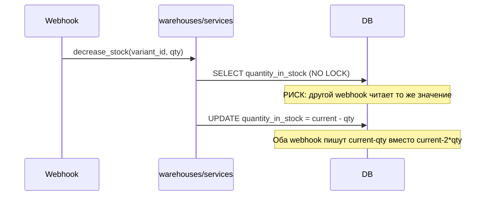

# Task 009 — DB Model Improvements

**Priority:** P0/P1  
**Complexity:** Medium  
**Status:** Pending

## Цель

Устранить критический риск overselling (warehouse без блокировки), исправить бизнес-логику аналитики и привести модели базы данных в соответствие с требованиями надёжности.

## Контекст

- **DB-2 (P0):** `WarehouseItem.decrease_stock` без `select_for_update()` → при параллельных webhook-ах `quantity_in_stock` уходит в минус → overselling
- **BE-6 (P2):** `analytics/services.py` использует `Warehouse.objects.get(name="Vendor warehouse")` → при переименовании склада в Admin аналитика перестаёт работать
- **BE-5 (P2):** Бизнес-логика цены (`price_with_acquiring`, `ACQUIRING_RATE = 1.04`) разбросана по `product/models.py`, `favorites/views.py` — при изменении ставки нужно менять в нескольких местах

## Scope (область)

- Добавление `select_for_update()` в `warehouses/services.py`
- Добавление `reserved_quantity` поля на `WarehouseItem` (с migration plan)
- Исправление `analytics/services.py` — использование константы или `warehouse_type` поля
- Централизация `ACQUIRING_RATE` в `settings.py` или `product/constants.py`
- Вынос логики расчёта цены в `product/services/pricing.py`

## Не входит в задачу

- Изменение API-контрактов
- Добавление серверной корзины (PAY-5)
- Изменение логики расчёта доставки

## Зависимости

- **Task 002 (testing-foundation)** — Core завершён; конкурентные тесты склада (`decrease_stock`) входят в эту задачу (Extended из 002)
- Task 003 (payment-refactor) — webhook processing использует warehouse.decrease_stock

## Риски

- Добавление `reserved_quantity` требует migration + backfill данными → нужна migration strategy
- `select_for_update()` изменяет поведение под нагрузкой → тест на конкурентность обязателен
- Изменение `price_with_acquiring` в models.py может сломать сериализаторы, которые на это полагаются

## Definition of Done

- [ ] `warehouses/services.py` использует `select_for_update()` в `decrease_stock`
- [ ] Написан конкурентный тест для `decrease_stock`
- [ ] `analytics/services.py` не падает при переименовании склада
- [ ] `ACQUIRING_RATE` централизован в одном месте
- [ ] Все существующие тесты product/warehouse проходят

---

# Iterations

## Iteration 1 — Analysis

### Цель
Понять текущую логику warehouse и аналитики.

### Действия
- Прочитать `backend/warehouses/services.py` — `decrease_stock`, `increase_stock`
- Прочитать `backend/warehouses/models.py` — `Warehouse`, `WarehouseItem`
- Прочитать `backend/analytics/services.py` — `get_stats_for_two_warehouses`
- Прочитать `backend/product/models.py` — `price_with_acquiring`, `min_price_with_acquiring`
- Прочитать `backend/favorites/views.py` — как используется цена
- Найти все места с `1.04` или `ACQUIRING_RATE`

### Output
- Схема warehouse flow (когда вызывается decrease_stock)
- Список всех мест с hardcoded acquiring rate
- Migration plan для `reserved_quantity`



### Статус
- [ ] Analysis complete

---

## Iteration 2 — Tests

### Цель
Написать тесты до правки warehouse логики.

### Тесты для написания

```python
# backend/warehouses/tests_stock.py

class WarehouseStockTest(TestCase):
    def test_decrease_stock_reduces_quantity(self):
        # item.quantity_in_stock = 10
        # decrease_stock(variant_id, 3)
        # item.quantity_in_stock == 7

    def test_decrease_stock_raises_on_insufficient_stock(self):
        # quantity_in_stock = 2
        # decrease_stock(variant_id, 5) → raises InsufficientStockError (или ValidationError)

    def test_decrease_stock_does_not_go_negative(self):
        # После ошибки quantity_in_stock не изменился

class WarehouseStockConcurrencyTest(TransactionTestCase):
    """Использовать TransactionTestCase для реального тестирования блокировок"""

    def test_concurrent_decrease_stock_does_not_oversell(self):
        # Параллельно два потока уменьшают stock на 8 при quantity=10
        # Один должен упасть
        # Итоговый stock = 2 (не -6)

class AnalyticsServiceTest(TestCase):
    def test_warehouse_stats_with_renamed_warehouse(self):
        # Переименовать "Vendor warehouse" → "New Name"
        # analytics не падает (DoesNotExist → default/empty response)
```

### Статус
- [ ] Tests written

---

## Iteration 3 — Fix: Warehouse Locking

### Цель
Добавить `select_for_update()` и базовую защиту от overselling.

### Что менять

**`backend/warehouses/services.py`:**
```python
from django.db import transaction

def decrease_stock(variant_id: int, qty: int) -> None:
    """Уменьшить остаток. Атомарно. Бросает InsufficientStockError если недостаточно."""
    with transaction.atomic():
        item = WarehouseItem.objects.select_for_update().get(
            product_variant_id=variant_id
        )
        if item.quantity_in_stock < qty:
            raise InsufficientStockError(
                f"Insufficient stock for variant {variant_id}: "
                f"available={item.quantity_in_stock}, requested={qty}"
            )
        item.quantity_in_stock -= qty
        item.save(update_fields=["quantity_in_stock"])
```

**Добавить `InsufficientStockError`** в `backend/warehouses/exceptions.py` (новый файл):
```python
class InsufficientStockError(Exception):
    pass
```

### Migration Plan для `reserved_quantity` (следующий шаг)

**Phase 1:** Добавить поле (nullable, default=0):
```python
reserved_quantity = models.PositiveIntegerField(default=0)
```

**Phase 2:** В `create_checkout_session` вызывать `reserve_stock()` вместо `decrease_stock()`

**Phase 3:** В `webhook_processing` подтверждать резерв или освобождать при неоплате

Реализация Phase 2-3 — в отдельной задаче.

### Статус
- [ ] select_for_update added
- [ ] InsufficientStockError created

---

## Iteration 4 — Analytics & Pricing Fix

### Цель
Исправить хрупкую зависимость аналитики от имён складов и централизовать acquiring rate.

### Analytics fix

**`backend/analytics/services.py`:**
```python
# ДО:
vendor_wh = Warehouse.objects.get(name="Vendor warehouse")
reli_wh = Warehouse.objects.get(name="Reli warehouse")

# ПОСЛЕ: безопасный вариант с try/except
try:
    vendor_wh = Warehouse.objects.get(name="Vendor warehouse")
except Warehouse.DoesNotExist:
    logger.warning("Vendor warehouse not found")
    return empty_stats_response()

# Долгосрочно: добавить warehouse_type поле (отдельная migration-задача)
# warehouse_type = CharField(choices=[("vendor", "Vendor"), ("reli", "Reli")])
```

### Pricing centralization

**`backend/product/constants.py`** (новый файл):
```python
from decimal import Decimal

ACQUIRING_RATE = Decimal("1.04")  # Ставка эквайринга
```

**`backend/product/models.py`** — обновить:
```python
from .constants import ACQUIRING_RATE

class ProductVariant(models.Model):
    @property
    def price_with_acquiring(self):
        return self.price * ACQUIRING_RATE
```

**`backend/favorites/views.py`** — обновить аналогично.

### Затрагиваемые файлы
| Файл | Изменение |
|------|-----------|
| `backend/warehouses/services.py` | select_for_update |
| `backend/warehouses/exceptions.py` | новый файл |
| `backend/analytics/services.py` | try/except |
| `backend/product/constants.py` | новый файл |
| `backend/product/models.py` | использование ACQUIRING_RATE |
| `backend/favorites/views.py` | использование ACQUIRING_RATE |

### Статус
- [ ] Analytics fixed
- [ ] Pricing centralized

---

## Iteration 5 — Validation

### Тесты для запуска
```bash
pytest backend/warehouses/ -v
pytest backend/analytics/ -v
pytest backend/product/ -v
```

### Сценарии для проверки
- [ ] При параллельных webhook-ах stock не уходит в минус
- [ ] Переименовать склад в Admin → аналитика возвращает пустой ответ, не 500
- [ ] `price_with_acquiring` возвращает корректную цену с acquiring rate
- [ ] Инвойс-цены совпадают с расчётными

### Статус
- [ ] Validation complete

---

## Привязка к коду

| Тип | Файлы |
|-----|-------|
| **Backend** | `warehouses/services.py`, `analytics/services.py`, `product/models.py`, `favorites/views.py` |
| **Новые файлы** | `warehouses/exceptions.py`, `product/constants.py` |
| **Модели** | `WarehouseItem` (без миграций на этом этапе) |
| **API** | Не меняются |
| **Интеграции** | Нет |

## Связанные проблемы из docs/09-architecture-debt.md

- DB-2: `WarehouseItem` без блокировки → overselling P0
- BE-5: Бизнес-логика разбросана по views/models P2
- BE-6: Хардкод имён складов в analytics P2
