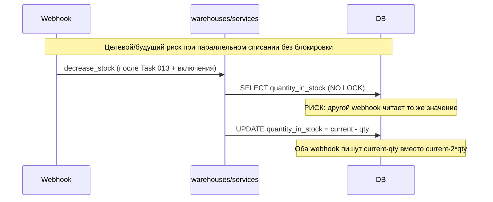

# Task 009 — DB Model Improvements

**Priority:** P0/P1  
**Complexity:** Medium  
**Status:** Завершена по scope Task 009 — **Iteration 5 (pre-commit)** пройден; **`reserved_quantity` / включение списания в webhook / стабильный тип склада** — вне задачи (**[Task 013](../013-stock-reservation/task.md)** миграция `warehouse_type` отдельно).

> **Состояние склада (актуализация 2026-05-11):** сейчас create payment session **не проверяет** `WarehouseItem.quantity_in_stock`; webhook **не вызывает** `decrease_stock` (функция в коде есть, но ни одного вызова по проекту — списание отключено). Поведение склада при оплате и целевой end-to-end flow описаны в **[Task 013 — Stock Reservation](../013-stock-reservation/task.md)**. **В рамках Task 009 webhook не должен начинать вызывать `decrease_stock`:** включение списания возможно только после резерва/проверок по Task 013 и отдельному решению.
> **Аудит Step 1 (2026-05-13):** см. раздел [Current baseline (Step 1 audit)](#current-baseline-step-1-audit) ниже.  
> **Аудит Step 2 (2026-05-14):** baseline-тесты `decrease_stock` и analytics-сервиса; по Step 3 тест на нехватку остатка и concurrency обновлены/включены на PostgreSQL — см. [Iteration 2](#iteration-2--tests).  
> **Аудит Step 3 (2026-05-14):** `decrease_stock` обёрнут в `transaction.atomic()`; строка `WarehouseItem` захватывается через `select_for_update()`; при `quantity_in_stock < quantity` — `warning` + `InsufficientStockError`, поле не меняется; при отсутствии строки складской позиции — прежний noop (`warning`, без исключения). **`payment/` и webhook не изменялись**, `reserved_quantity` не добавлялся, миграций нет. Конкурентный тест: `threading.Barrier` + два потока с `connection.close()`, класс активен под PostgreSQL (`skipUnless`), в Docker test contour проходит.  
> **Аудит Step 4 (2026-05-14):** `get_stats_for_two_warehouses` не бросает `Warehouse.DoesNotExist`: склады ищутся по каноническим именам через `_warehouse_by_canonical_name`; при отсутствии/переименовании для соответствующей стороны подставляется словарь нулей (`zero_warehouse_order_stats()`), структура ответа и ключи метрик неизменны. Добавлен `backend/product/constants.py` с **`ACQUIRING_RATE`**, импорт в `product/models.py`, `product/views.py`, `favorites/views.py`; формулы и округления как при `Decimal("1.04")`. **`payment/` и webhook не трогались**; **`reserved_quantity` и stock reservation — Task 013**; миграции `warehouse_type` не делались.

## Цель

Устранить технические риски вокруг складских моделей и цен, **в части склада** подготовить низкоуровневые примитивы (блокировка строки при списании и т.д.), не подменяя ими отдельную задачу **013** по резервированию до оплаты. Исправить бизнес-логику аналитики и привести часть моделей в соответствие с требованиями надёжности.

## Контекст

- **DB-2 (P0 — при возврате списания):** когда `decrease_stock` снова станет частью боевого flow, необходимо `select_for_update()` на строке `WarehouseItem`, иначе при параллельных подтверждениях `quantity_in_stock` может уйти в неконсистентное состояние. **Сейчас** списание в webhook выключено, поэтому риск именно «двойного списания в webhook» **не активен**, но остаётся **product risk** см. Task 013 (оплата без учёта остатка).
- **BE-6 (P2):** ~~жёсткий `Warehouse.objects.get(name=…)` в analytics~~ **после Step 4:** fallback нулевой статистики; долгосрочно всё равно желательны стабильные ключи склада (**отдельная миграция**, не входит в 009).
- **BE-5 (P2):** ставка эквайринга для витрины/варианта централизована в **`product/constants.py`** (`ACQUIRING_RATE`); дубли `1.04` могут ещё встречаться вне указанных файлов (checkout/payment свойства без правок по Step 4).

## Scope (область)

- Добавление `select_for_update()` в `warehouses/services.py`
- Добавление `reserved_quantity` поля на `WarehouseItem` (с migration plan)
- Исправление `analytics/services.py` — использование константы или `warehouse_type` поля
- Централизация `ACQUIRING_RATE` в `settings.py` или `product/constants.py`
- Вынос логики расчёта цены в `product/services/pricing.py`

## Не входит в задачу

- Изменение API-контрактов
- Добавление серверной корзины (PAY-5)
- Изменение логики расчёта доставки

## Зависимости

- **Task 002 (testing-foundation)** — Core завершён; конкурентные тесты склада (`decrease_stock`) входят в эту задачу (Extended из 002)
- **Task 013 (stock-reservation)** — **блокирующая задача** для безопасного повторного включения списания: сначала проверка и резерв на create payment session, затем атомарное подтверждение в webhook
- Task 003 (payment-refactor) — те же точки интеграции (session + webhook), должны быть согласованы с Task 013; **реального вызова** `decrease_stock` из webhook в текущем коде нет

## Риски

- Добавление `reserved_quantity` требует migration + backfill данными → нужна migration strategy
- `select_for_update()` изменяет поведение под нагрузкой → тест на конкурентность обязателен
- Изменение `price_with_acquiring` в models.py может сломать сериализаторы, которые на это полагаются

## Definition of Done

- [x] `warehouses/services.py` использует `select_for_update()` в `decrease_stock` (Step 3)
- [x] Конкурентный тест для `decrease_stock`: `WarehouseStockConcurrencyTest` **активен на PostgreSQL** (Docker `backend_test`), на SQLite класс **`skipUnless`** с явным reason; сценарий 10 − 8 − 8 → итого 2, один успех + один `InsufficientStockError`.
- [x] `analytics/services.py` не падает при отсутствии/переименовании канонических складов (Step 4)
- [x] `ACQUIRING_RATE` централизован в `product/constants.py` и подключён в models + catalog/favorites views (Step 4)
- [x] Полный pytest (Docker) проходит после Step 4

---

# Iterations

## Iteration 1 — Analysis

### Цель
Понять текущую логику warehouse и аналитики.

### Действия
- Прочитать `backend/warehouses/services.py` — `decrease_stock` (**`increase_stock` в репозитории нет**)
- Прочитать `backend/warehouses/models.py` — `Warehouse`, `WarehouseItem`
- Прочитать `backend/analytics/services.py` — `get_stats_for_two_warehouses`
- Прочитать `backend/product/models.py` — `price_with_acquiring`, `min_price_with_acquiring`
- Прочитать `backend/favorites/views.py` — как используется цена
- Найти все места с `1.04` или `ACQUIRING` / acquiring multiplier

### Output
- Схема warehouse flow и список вызовов — см. [Current baseline](#current-baseline-step-1-audit)

<a id="current-baseline-step-1-audit"></a>

## Current baseline (Step 1 audit)

**Проверенные файлы:** `backend/warehouses/services.py`, `backend/warehouses/models.py`, `backend/analytics/services.py`, `backend/analytics/views.py`, `backend/product/models.py`, `backend/favorites/views.py`, `backend/product/views.py`; точечный поиск по `backend/` — `decrease_stock`, `get_stats_for_two_warehouses`, `1.04` / `ACQUIRING`.

### Warehouse

| Вопрос | Факт (текущий код) |
|--------|---------------------|
| `decrease_stock` | Один запрос `WarehouseItem.objects.get(warehouse, product_variant)`; без `transaction.atomic`, без `select_for_update`. |
| `increase_stock` | **Отсутствует** в `warehouses/services.py`. |
| Исключения | Обрабатывается только `WarehouseItem.DoesNotExist` (warning + return). Недостаточный остаток: **не exception**, а `warning` + **early return без изменения** поля. |
| Недостаточный остаток | Списание **не выполняется**; остаток не меняется. |
| Уход в минус | При **однопоточном** проходе — нет (проверка `quantity_in_stock < quantity` до вычитания). **`PositiveIntegerField`** на модели также блокирует отрицательные значения при сохранении, но при гонке возможна **логическая перепродажа** (два потока читают одно значение и оба списывают). |
| Вызовы `decrease_stock` | **Только определение** в `warehouses/services.py`; **импортов/вызовов по проекту нет** (`grep` по `backend/`). |
| Webhook / payment | **`decrease_stock` в `backend/payment/` не используется.** Поведение согласуется с примечанием в `decrease_stock` (списание из webhook отключено). |

**Риски warehouse:** при будущем включении списания без `select_for_update` и без идемпотентности возможны гонки и перепродажа; сейчас функция «мёртвая», риск **не проявляется в production**, но код **не готов** к боевому параллельному webhook.

### Analytics

| Вопрос | Факт |
|--------|------|
| Хардкод имён | `get_stats_for_two_warehouses`: `Warehouse.objects.get(name="Vendor warehouse")` и `name="Reli warehouse"`. |
| Переименование / отсутствие склада | `Warehouse.DoesNotExist` всплывает в `SellerWarehouseStatsView.get` как общий `except Exception` → **HTTP 500** и лог «An error occurred...», не явный пустой ответ. |
| Безопасный MVP | **try/except `DoesNotExist` + пустая/нулевая статистика** (или 404 по продуктовой политике) — быстрее, чем ждать миграцию `warehouse_type`; **долгосрочно** — поле типа склада / stable slug (отдельная задача миграции). |

**Риски analytics:** хрупкость к данным в Admin (имена складов — контракт без enforcement).

### Pricing (acquiring ≈ 4% → множитель `1.04`)

| Место | Что сделано |
|-------|-------------|
| `product/models.py` | `Decimal("1.04")` в `BaseProduct.min_price_with_acquiring`, `ProductVariant.price_without_vat`, `ProductVariant.price_with_acquiring`. |
| `product/views.py` | Константа **`ACQUIRING_MULTIPLIER = Decimal("1.04")`** в `build_public_products_queryset` (`final_min_price`). |
| `favorites/views.py` | `Decimal('1.04')` в annotate `annotated_min_price_with_acquiring`. |
| Потребители `price_with_acquiring` | `@property` на варианте; `product/serializers.py` (`source=price_with_acquiring`); `payment/services/stripe_session.py`, `paypal_session.py`, `webhook_processing.py` (цена строки); `product/admin.py`, `generate_gmc_feed.py`; тесты payment/order. |
| Дублирование | Одна и та же бизнес-ставка **зашита строкой `1.04` / локальной константой** в models, views, favorites — смена ставки требует правок в нескольких файлах. |
| Куда централизовать | **`product/constants.py`** предпочтительнее `settings.py`: ставка относится к домену ценообразования товара, не к инфраструктуре; `settings` уместен только если ставка задаётся из env per deployment (обсудить с продуктом). |

### `reserved_quantity` (`WarehouseItem`)

| Вопрос | Факт |
|--------|------|
| Поле в модели | **Нет**; только `quantity_in_stock` (`PositiveIntegerField`, default 0). |
| Миграция | Для поля потребуется **новая миграция** при решении добавлять. |
| Добавить поле сейчас без использования | Технически возможно (default 0, без записи в runtime) — **низкий** риск при отсутствии логики; но лишняя схема без Task 013 может вводить в заблуждение. |
| Риски до Task 013 | Дублирование «полускладской» схемы без единого flow резерва; любая запись в `reserved_quantity` до согласованного дизайна с **013** опасна. |

### Список рисков (сводка)

1. **Warehouse:** будущее списание без блокировок и без 013 — перепродажа / рассинхрон.  
2. **Analytics:** зависимость от фиксированных имён складов → 500 при несоответствии данных.  
3. **Pricing:** расхождение ставки при правке не во всех местах → цены витрина/checkout/инвойс.  
4. **`reserved_quantity`:** преждевременная бизнес-логика без 013.

### Предлагаемый план Step 2+ (без выполнения в Step 1)

1. **Iteration 2:** тесты по текущему контракту `decrease_stock` (в т.ч. конкурентный сценарий — заготовка под `select_for_update`); тесты analytics на отсутствие 500 при отсутствии склада.  
2. **Iteration 3:** `transaction.atomic` + `select_for_update` на `WarehouseItem`, явная ошибка при недостаточном остатке (по согласованному контракту); **не** подключать вызов из webhook.  
3. **Iteration 4:** безопасный analytics + `product/constants.py` (или сервис цены) для acquiring; пройти favorites / models / views.  
4. **Iteration 5:** полный pytest по затронутым apps; **`reserved_quantity`** — отдельно, после плана 013 (миграция + семантика).



### Статус
- [x] Analysis complete (Step 1 — 2026-05-13)

---

## Iteration 2 — Tests

### Цель
Написать тесты до правки warehouse логики.

### Реализовано (Step 2, 2026-05-14)

**Файл `backend/warehouses/tests_stock.py`**

| Тест | Статус |
|------|--------|
| `WarehouseStockServiceTest.test_decrease_stock_reduces_quantity` | активен — списание 3 с остатка 10 → 7 |
| `WarehouseStockServiceTest.test_decrease_stock_insufficient_stock_does_not_change_quantity` | активен — **Step 3+:** при нехватке ожидается **`InsufficientStockError`**, остаток без изменений |
| `WarehouseStockServiceTest.test_decrease_stock_missing_item_is_noop` | активен — нет `WarehouseItem` → без исключения |
| `WarehouseStockConcurrencyTest.test_concurrent_decrease_stock_documents_current_race_or_target_behavior` | **Step 3+:** активен на **PostgreSQL** (`skipUnless`), два потока + `Barrier`; локально на SQLite класс целиком пропускается |

**Файл `backend/analytics/tests.py`** *(обновлено Step 4 — см. [Iteration 4](#iteration-4--analytics--pricing-fix))*

| Тест | Статус |
|------|--------|
| `AnalyticsWarehouseStatsServiceTest.test_returns_zeros_when_canonical_warehouses_missing` | активен |
| `AnalyticsWarehouseStatsServiceTest.test_vendor_renamed_reli_bucket_uses_orders_stats` | активен |
| `AnalyticsWarehouseStatsServiceTest.test_zero_warehouse_order_stats_matches_service_shape` | активен |
| `WarehouseOrdersStatsHttpTest.test_warehouse_stats_endpoint_200_when_no_canonical_warehouses` | активен |

*(Прежние baseline-тесты Step 2 с `Warehouse.DoesNotExist` удалены после внедрения fallback.)*

**Примечание:** в `backend/pytest.ini` добавлен паттерн `tests_*.py`, чтобы собирать модули вида `tests_stock.py` (рядом с уже поддерживаемыми `test_*.py`).

### Статус
- [x] Tests written (активные + осознанно skipped см. таблицы выше)

---

## Iteration 3 — Fix: Warehouse Locking

### Цель
Добавить `select_for_update()` и базовую защиту от overselling.

### Реализовано (Step 3, 2026-05-14)

- Файл `backend/warehouses/exceptions.py` — класс `InsufficientStockError`.
- Функция **`decrease_stock(warehouse, product_variant, quantity)`** без смены сигнатуры: внутри **`transaction.atomic()`** загрузка `WarehouseItem` через **`select_for_update()`**; при отсутствии строки — warning и выход (**noop**); при недостаточном остатке — warning и **`InsufficientStockError`** без изменения поля; иначе — списание и `save(update_fields=["quantity_in_stock"])`.

### Migration Plan для `reserved_quantity` (следующий шаг)

**Phase 1:** Добавить поле (nullable, default=0):
```python
reserved_quantity = models.PositiveIntegerField(default=0)
```

**Phase 2:** В **create payment session** вводится резерв (детальный flow — **[Task 013](../013-stock-reservation/task.md)**).

**Phase 3:** В `webhook_processing` подтверждение резервов / освобождение при отмене (Task 013); `decrease_stock` или её преемник — только в связке с идемпотентностью.

Реализация Phase 2-3 отнесена к **Task 013** и не должна дублироваться здесь как «готовая система складов».

### Статус
- [x] select_for_update added
- [x] InsufficientStockError created

---

## Iteration 4 — Analytics & Pricing Fix

### Цель
Убрать 500 из-за складской аналитики при «битых» именах складов и сократить дубли ставки эквайринга на витрине.

### Реализовано (Step 4, 2026-05-14)

**Analytics (`backend/analytics/services.py`):**
- Константы `VENDOR_WAREHOUSE_NAME` / `RELI_WAREHOUSE_NAME`; `_warehouse_by_canonical_name()` возвращает `Warehouse` или `None`.
- `zero_warehouse_order_stats()` — тот же набор ключей, что у `get_warehouse_orders_stats`, со значением `0`.
- `get_stats_for_two_warehouses`: для каждой стороны либо обычный расчёт, либо копия нулевого шаблона; **`Warehouse.DoesNotExist` наружу не пробрасывается**; топ-level JSON не меняется.

**Pricing (`backend/product/constants.py`):**
- `ACQUIRING_RATE = Decimal("1.04")` — используется в `product/models.py` (`min_price_with_acquiring`, `price_without_vat`, `price_with_acquiring`), `product/views.py` (`build_public_products_queryset`), `favorites/views.py`.

**Не в scope Step 4:** `payment/` / webhook-дубли эквайринга без прямых правок по задаче; **`reserved_quantity` и резерв до оплаты — Task 013**; типизация складов через миграцию — отдельно.

### Затрагиваемые файлы
| Файл | Изменение |
|------|-----------|
| `backend/analytics/services.py` | fallback канонических имён + `zero_warehouse_order_stats()` |
| `backend/analytics/tests.py` | новые кейсы сервиса + HTTP **200** при отсутствии складов |
| `backend/product/constants.py` | `ACQUIRING_RATE` |
| `backend/product/models.py` | импорт `ACQUIRING_RATE`, замена литералов `1.04` |
| `backend/product/views.py` | `ACQUIRING_RATE` вместо локальной константы |
| `backend/favorites/views.py` | annotate через `ACQUIRING_RATE` |

### Статус
- [x] Analytics fixed
- [x] Pricing centralized (в указанном scope)

---

## Iteration 5 — Validation

### Финальный аудит (2026-05-14, pre-commit)

Проверено в рабочей копии перед коммитом:

| Проверка | Результат |
|----------|-----------|
| `decrease_stock` вызывается из `payment/` или webhook | **Нет** (`grep` по `backend/payment/`, `backend/**/webhook*.py` — вхождений `decrease_stock` нет; определение только `warehouses/services.py` + тесты) |
| `reserved_quantity` | **Не добавлялся** (поиск по `backend/` — пусто) |
| Новые миграции в рамках Task 009 | **Нет** (изменения только в перечисленных py + task.md) |
| Контракт публичных полей сериализаторов / JSON аналитики | **Прежний** (`vendor_warehouse` / `reli_warehouse`, те же ключи метрик) |
| Analytics HTTP при отсутствии canonical warehouses | **200** + тест `WarehouseOrdersStatsHttpTest` |
| `ACQUIRING_RATE` | Те же числовые значения и `quantize`/`ROUND_HALF_UP`; в `product/` и `favorites/` нет литералов `Decimal("1.04")`/`Decimal('1.04')`/ `ACQUIRING_MULTIPLIER` кроме `product/constants.py` |
| **`reserved_quantity`, резерв до оплаты, вызов списания из webhook** | По-прежнему **[Task 013 — Stock Reservation](../013-stock-reservation/task.md)** |

### Команды проверки (Docker, из корня репозитория)

```bash
docker compose -f docker-compose.test.yml run --rm backend_test python manage.py check
docker compose -f docker-compose.test.yml run --rm backend_test pytest analytics/ product/ favorites/ warehouses/ -v
docker compose -f docker-compose.test.yml run --rm backend_test pytest -q
```

**Результат последнего прогона (Iteration 5):** `manage.py check` exit 0 (0 silenced issues); targeted pytest suites и полный `-q` — exit 0, все тесты зелёные.

### Сценарии для проверки
- [x] Переименовать/удалить канонические склады в Admin → эндпоинт статистики отдаёт **200** и нулевые блоки, не 500 (Step 4)
- [x] Параллельное списание в **`decrease_stock`** (PostgreSQL): **Task 009 Step 3** — concurrency-тест; **в webhook не подключено** до Task 013
- [x] `price_with_acquiring` / annotate acquiring: регрессия покрыта тестами product/favorites при неизменных формулах
- [ ] Инвойс-цены / checkout payment (Stripe/PayPal) — **вне изменений Task 009** (`payment/` не трогался)

### Статус
- [x] Validation complete (backend Task 009; follow-up только Task 013 / отдельные задачи при необходимости)

---

## Привязка к коду

| Тип | Файлы |
|-----|-------|
| **Backend** | `warehouses/services.py`, `analytics/services.py`, `product/models.py`, `product/views.py`, `favorites/views.py` |
| **Новые файлы** | `warehouses/exceptions.py`, `product/constants.py` |
| **Модели** | `WarehouseItem` (без миграций на этом этапе) |
| **API** | Не меняются |
| **Интеграции** | Нет |

## Связанные проблемы из docs/09-architecture-debt.md

- DB-2: примитив `decrease_stock` после Task 009 Step 3 использует **`select_for_update`**; включение списания в webhook и резервы — **Task 013**.
- BE-5: часть acquiring для витрины **централизована** в `product/constants.py` (остальные модули вне scope Step 4).
- BE-6: analytics по историческим именам складов **с fallback** (Step 4); стабильный ключ склада в БД — отдельная задача.
