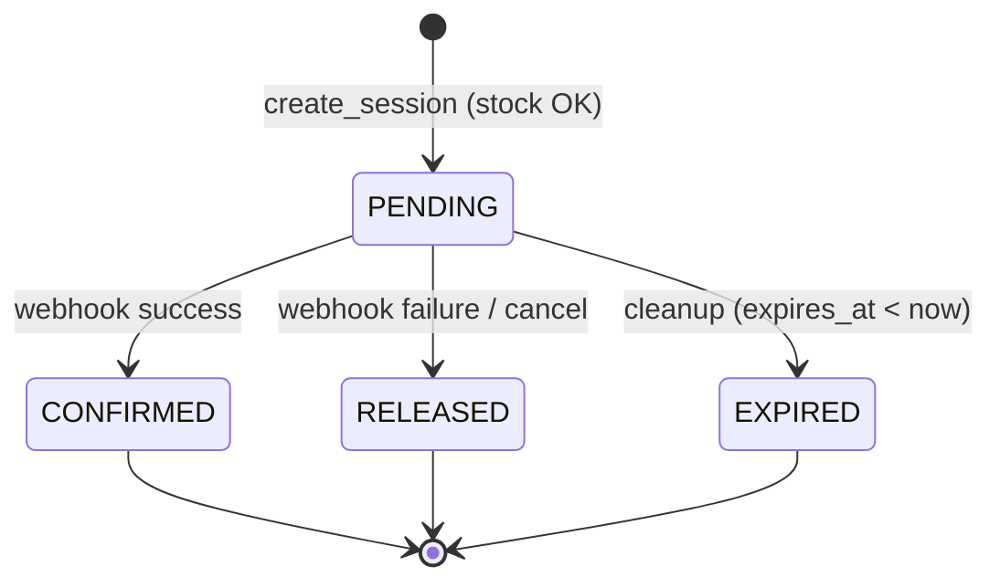

# Task 013 — Stock Reservation / Inventory Consistency

**Priority:** P0 (блокирует корректное списание в webhook)
**Complexity:** High
**Status:** Phase 3 complete (2026-05-19) — session integration under feature flag; Phase 4 (webhook) — pending

---

## Содержание

1. [Анализ текущего flow](#1-анализ-текущего-flow)
2. [Архитектурные варианты и выбор](#2-архитектурные-варианты-и-выбор)
3. [Модель данных](#3-модель-данных)
4. [Жизненный цикл резервирования](#4-жизненный-цикл-резервирования)
5. [Конкурентность и локировка](#5-конкурентность-и-локировка)
6. [Стратегия очистки](#6-стратегия-очистки)
7. [Интеграционные точки](#7-интеграционные-точки)
8. [Edge cases](#8-edge-cases)
9. [Аналитические последствия](#9-аналитические-последствия)
10. [Миграции](#10-миграции)
11. [Сервисы](#11-сервисы)
12. [Тесты](#12-тесты)
13. [Фазированный план реализации](#13-фазированный-план-реализации)
14. [Definition of Done](#14-definition-of-done)
15. [Открытые вопросы](#15-открытые-вопросы)
16. [История документа](#16-история-документа)

---

## 1. Анализ текущего flow

### 1.1 Архитектура корзины

Корзина (`basket`) существует **только на фронтенде** (Redux / localStorage).
Нет модели `Cart` на бэкенде. Итоговый payload чекаута передаётся одним запросом
в `POST /api/payment/stripe/` или `POST /api/payment/paypal/`.

Фронтенд не является источником правды и должен рассматриваться как **доверяемый только при первичной валидации**.

### 1.2 Создание платёжной сессии (Stripe/PayPal)

**Файл:** `payment/services/stripe_session.py` → `build_stripe_checkout_context()`  
**Файл:** `payment/services/paypal_session.py` → `build_paypal_checkout_context()`

Текущая последовательность:
```
POST /api/payment/stripe/
  ↓
build_stripe_checkout_context()
  1. Загрузка вариантов (select_related seller + default_warehouse)
  2. DPD-dimension check
  3. CZ-origin check (все SKU → seller.default_warehouse.country == 'CZ')
  4. Цикл по группам: ZIP/phone validate, delivery cost calc, line_items
  5. save_stripe_metadata_atomic() → StripeMetadata(session_key=uuid4, ...)
  6. return StripeCheckoutContext(session_key, line_items, ...)
  ↓
stripe.checkout.Session.create(...)  ← вызов PSP
  ↓
Response 200 {url: "https://checkout.stripe.com/..."}
```

**Что НЕ происходит:** проверка `WarehouseItem.quantity_in_stock`, создание резерва.

### 1.3 Хранение метаданных

```
StripeMetadata(session_key=<uuid>, custom_data={user_id,...}, invoice_data={groups,...})
PayPalMetadata(session_key=<uuid>, custom_data=..., invoice_data=...)
```

`session_key` — внутренний UUID, связывающий нашу БД с PSP-сессией.  
Для Stripe: `session_id` (PSP) прилетает в webhook.  
Для PayPal: `session_key` передаётся как `custom_id` и возвращается в webhook.

### 1.4 Webhook → создание заказа

**Файл:** `payment/services/webhook_processing.py` → `create_orders_and_payment()`

```
Webhook success
  ↓
_replay_if_payment_exists()  ← идемпотентный guard
  ↓
_prepare_order_creation_context()  ← загрузка user, groups, vmap
  ↓
_persist_checkout_in_atomic()
  transaction.atomic():
    for group in groups:
      Order.create(user, delivery, ...)
      for product in group:
        wh_item = WarehouseItem.filter(variant, quantity_in_stock__gte=qty).first()
        warehouse = wh_item.warehouse if wh_item else Warehouse.objects.first()  ← fallback!
        OrderProduct.create(order, warehouse, ...)
    Payment.create(session_id, ...)
    Invoice.create(best-effort)
  ↓
async: send_client_email, parcels, seller_email
```

**Проблемы текущего состояния:**
- `decrease_stock()` не вызывается — `quantity_in_stock` не уменьшается после оплаты
- `wh_item` ищется по `quantity_in_stock__gte=qty` но только для выбора склада; при отсутствии — fallback (заказ создаётся)
- Два параллельных чекаута одного товара создадут два заказа без блокировки

### 1.5 Существующая инфраструктура

```python
# warehouses/models.py
class WarehouseItem(models.Model):
    warehouse = ForeignKey(Warehouse)
    product_variant = ForeignKey(ProductVariant)
    quantity_in_stock = PositiveIntegerField(default=0)
    unique_together = ('warehouse', 'product_variant')

# warehouses/services.py
def decrease_stock(warehouse, variant, quantity):
    """Атомарное списание select_for_update(). Поднимает InsufficientStockError."""
    # Вызывается нигде в production flow (только в тестах).
```

---

## 2. Архитектурные варианты и выбор

### Вариант A — Немедленное уменьшение `quantity_in_stock` при создании сессии

```
create_session → decrease_stock() → вернуть stock при failure/expire
```

| Плюсы | Минусы |
|-------|--------|
| Минимальная модель (нет новых таблиц) | «Увеличение» stock — инверсная операция, требует отдельного сервиса |
| Понятно для аналитики | Нет аудита — непонятно, зарезервировано или продано |
| | Webhook failure → нужен `increase_stock()` с такой же блокировкой |
| | Нет TTL «из коробки» — stock уменьшен навсегда до ручного восстановления |

### Вариант B — Поле `reserved_quantity` на `WarehouseItem`

```
create_session → wi.reserved_quantity += qty (available = in_stock - reserved)
webhook success → wi.quantity_in_stock -= qty; wi.reserved_quantity -= qty
webhook failure → wi.reserved_quantity -= qty
```

| Плюсы | Минусы |
|-------|--------|
| Не нужна отдельная таблица резерваций | Нет session-level аудита резерваций |
| Простая арифметика | Нет связи reserved_quantity ↔ session_key в БД |
| Легко читается в admin | Cleanup-job не знает, какие резервы просрочены |

### Вариант C — Отдельная модель `StockReservation` + `reserved_quantity` на `WarehouseItem` ✅

```
create_session → StockReservation(session_key, PENDING, expires_at) + wi.reserved_quantity += qty
webhook success → reservation → CONFIRMED + decrease_stock()
webhook failure/expire → reservation → RELEASED + wi.reserved_quantity -= qty
cleanup → StockReservation(PENDING, expires_at < now) → EXPIRED + wi.reserved_quantity -= qty
```

| Плюсы | Минусы |
|-------|--------|
| Полный аудит per-session | Дополнительные таблицы (2) и миграция `WarehouseItem` |
| Идемпотентность по `session_key` | Чуть сложнее сервисный слой |
| TTL встроен в модель | |
| Cleanup-job работает через модель, не «угадывает» |  |
| `decrease_stock()` переиспользуется без изменений | |
| Rollback из webhook — явный, не «уменьшить обратно» | |

**Выбор: Вариант C** — единственный, дающий аудит, TTL, и чистую идемпотентность.

---

## 3. Модель данных

### 3.1 `StockReservation`

```python
# warehouses/models.py (или новый файл warehouses/reservation_models.py)

class StockReservation(models.Model):
    class Status(models.TextChoices):
        PENDING   = "pending",   "Pending"    # создан на сессии, ожидает оплаты
        CONFIRMED = "confirmed", "Confirmed"  # webhook success → stock списан
        RELEASED  = "released",  "Released"   # webhook failure/cancel → stock освобождён
        EXPIRED   = "expired",   "Expired"    # TTL истёк, cleanup-job освободил

    session_key     = models.CharField(max_length=255, unique=True, db_index=True)
    payment_system  = models.CharField(max_length=10)  # "stripe" | "paypal"
    status          = models.CharField(
        max_length=20, choices=Status.choices, default=Status.PENDING, db_index=True
    )
    expires_at      = models.DateTimeField(db_index=True)
    created_at      = models.DateTimeField(auto_now_add=True)
    confirmed_at    = models.DateTimeField(null=True, blank=True)
    released_at     = models.DateTimeField(null=True, blank=True)

    class Meta:
        indexes = [
            # cleanup query: WHERE status='pending' AND expires_at < now()
            models.Index(fields=("status", "expires_at"), name="stockres_status_expires_idx"),
        ]
```

### 3.2 `StockReservationItem`

```python
class StockReservationItem(models.Model):
    reservation   = models.ForeignKey(
        StockReservation, on_delete=models.CASCADE, related_name="items"
    )
    warehouse_item = models.ForeignKey(
        "WarehouseItem", on_delete=models.CASCADE, related_name="reservation_items"
    )
    quantity       = models.PositiveIntegerField()

    class Meta:
        unique_together = ("reservation", "warehouse_item")
```

### 3.3 Изменения в `WarehouseItem`

```python
class WarehouseItem(models.Model):
    warehouse          = ForeignKey(Warehouse, ...)
    product_variant    = ForeignKey(ProductVariant, ...)
    quantity_in_stock  = PositiveIntegerField(default=0)
    reserved_quantity  = PositiveIntegerField(default=0)  # ← новое поле

    @property
    def available_quantity(self) -> int:
        """Фактически доступно для новых резервирований."""
        return max(0, self.quantity_in_stock - self.reserved_quantity)
```

### 3.4 Связь с Payment и Order

`StockReservation.session_key` совпадает с `StripeMetadata.session_key` / `PayPalMetadata.session_key`.

```
StripeMetadata(session_key) ──> StockReservation(session_key)
                                       │
                          ┌────────────┴──────────┐
                StockReservationItem        StockReservationItem
                    │warehouse_item               │warehouse_item
                WarehouseItem                WarehouseItem
```

После webhook: `Payment.session_key` → lookup `StockReservation` → подтвердить.

---

## 4. Жизненный цикл резервирования



### Детальный sequence diagram

```mermaid
sequenceDiagram
    participant Client
    participant View as payment/views.py
    participant SessionBuilder as stripe_session.py
    participant ResSvc as StockReservationService
    participant PSP as Stripe/PayPal
    participant Webhook as webhook_processing.py
    participant WH as warehouses/services.py

    Client->>View: POST /api/payment/stripe/ {groups, qty...}
    View->>SessionBuilder: build_stripe_checkout_context(user, groups)
    Note over SessionBuilder: validate SKU, delivery, CZ-origin

    SessionBuilder->>ResSvc: create_reservation(session_key, groups, variant_map)
    Note over ResSvc: transaction.atomic()<br/>select_for_update на WarehouseItem<br/>проверить available_quantity >= qty<br/>wi.reserved_quantity += qty<br/>StockReservation(PENDING, TTL=30min)

    alt Недостаточно stock
        ResSvc-->>SessionBuilder: InsufficientStockError(sku, requested, available)
        SessionBuilder-->>View: raise StripeSessionBuildError(409)
        View-->>Client: 409 {sku: ..., requested: N, available: M}
    end

    ResSvc-->>SessionBuilder: StockReservation(session_key)
    SessionBuilder->>PSP: stripe.checkout.Session.create(...)
    PSP-->>SessionBuilder: session.url

    alt PSP call fails
        SessionBuilder->>ResSvc: release_reservation(session_key)
        SessionBuilder-->>View: raise StripeSessionBuildError(502)
    end

    SessionBuilder-->>View: StripeCheckoutContext
    View-->>Client: 200 {url: "https://checkout.stripe.com/..."}

    Note over Client: пользователь оплачивает (или бросает)

    PSP->>Webhook: POST /webhook/stripe/ {type: checkout.session.completed}
    Webhook->>Webhook: verify_signature; parse → WebhookPaymentData
    Webhook->>ResSvc: confirm_reservation(session_key)
    Note over ResSvc: transaction.atomic()<br/>select_for_update StockReservation<br/>if status != PENDING → idempotent noop<br/>for each item: decrease_stock()<br/>status → CONFIRMED

    Webhook->>Webhook: create_orders_and_payment(...)
    Webhook-->>PSP: HTTP 200

    alt Webhook failure / cancel
        PSP->>Webhook: POST {type: checkout.session.expired}
        Webhook->>ResSvc: release_reservation(session_key)
        Note over ResSvc: wi.reserved_quantity -= qty<br/>status → RELEASED
    end
```

### Правила перехода состояний

| Текущее | Событие | Действие | Новое |
|---------|---------|----------|-------|
| — | `create_session` + stock OK | `reserved_quantity += qty` | PENDING |
| — | `create_session` + insufficient | raise, noop | — |
| PENDING | webhook success | `decrease_stock()` + `reserved_quantity -= qty` | CONFIRMED |
| PENDING | webhook failure/expire/cancel | `reserved_quantity -= qty` | RELEASED |
| PENDING | `expires_at < now` (cleanup) | `reserved_quantity -= qty` | EXPIRED |
| CONFIRMED | webhook replay | idempotent noop | CONFIRMED |
| RELEASED | webhook replay | idempotent noop | RELEASED |
| EXPIRED | webhook success (late) | re-check stock → confirm or fail | CONFIRMED / err |

---

## 5. Конкурентность и локировка

### 5.1 Стратегия select_for_update

В `create_reservation()` все затронутые строки `WarehouseItem` блокируются в алфавитном порядке по `(warehouse_id, product_variant_id)`, чтобы избежать deadlock при одновременных сессиях с пересекающимися товарами:

```python
with transaction.atomic():
    wh_items = (
        WarehouseItem.objects
        .select_for_update()
        .filter(product_variant__sku__in=skus)
        .order_by("warehouse_id", "product_variant_id")  # ← deadlock prevention
    )
    for wi in wh_items:
        required_qty = sku_to_qty[wi.product_variant.sku]
        if wi.available_quantity < required_qty:
            raise InsufficientStockError(...)
        wi.reserved_quantity += required_qty
        wi.save(update_fields=["reserved_quantity"])
    # create StockReservation + StockReservationItems
```

### 5.2 Сценарий «последний экземпляр»

```
quantity_in_stock = 1, reserved_quantity = 0 → available = 1

Сессия A начинает транзакцию → select_for_update → available=1 >= 1 → OK
  (строка заблокирована)
Сессия B начинает транзакцию → select_for_update → ЖДЁТ

Сессия A коммитит: reserved_quantity = 1
Сессия B получает строку → available = 0 < 1 → InsufficientStockError → 409
```

Oversell невозможен при корректном использовании `select_for_update`.

### 5.3 `decrease_stock` в `confirm_reservation`

`confirm_reservation` вызывает существующий `decrease_stock(warehouse, variant, qty)`, который сам использует `select_for_update`. После успешного `decrease_stock`:
- `quantity_in_stock -= qty`
- `reserved_quantity -= qty` (явно, чтобы `available_quantity` не ушло в минус)

### 5.4 Идемпотентность webhook

Два webhook-события приходят для одной сессии:
```python
# confirm_reservation():
with transaction.atomic():
    reservation = StockReservation.objects.select_for_update().get(session_key=session_key)
    if reservation.status != StockReservation.Status.PENDING:
        return  # idempotent noop — уже подтверждено/отменено
    ...
```

---

## 6. Стратегия очистки

### 6.1 TTL

| PSP | Типичное время жизни сессии | Рекомендуемый TTL резерва |
|-----|---------------------------|--------------------------|
| Stripe Checkout | 30 мин (default) | **35 мин** (+5 мин запас) |
| PayPal | 3 ч (intent created) | **35 мин** (по Stripe-паритету) |

TTL = 35 минут как дефолт. Значение через settings: `STOCK_RESERVATION_TTL_MINUTES`.

### 6.2 Management command

```python
# warehouses/management/commands/release_expired_reservations.py
class Command(BaseCommand):
    help = "Release stock reservations past their TTL."

    def handle(self, *args, **options):
        cutoff = timezone.now()
        qs = (
            StockReservation.objects
            .filter(status=StockReservation.Status.PENDING, expires_at__lt=cutoff)
            .select_for_update(skip_locked=True)  # skip reservations locked by active webhook
        )
        released = 0
        for reservation in qs:
            StockReservationService.release_reservation(reservation.session_key, reason="expired")
            released += 1
        self.stdout.write(f"Released {released} expired reservation(s).")
```

### 6.3 Вызов cleanup

Вариант 1 (без Celery): cron каждые 5 минут:
```cron
*/5 * * * * python manage.py release_expired_reservations
```

Вариант 2 (с Celery): periodic task через `celery.beat`.

Вариант 3 (lazy expiry): при `create_reservation` — сначала cleanup старых PENDING для
того же `session_key` (но это не масштабируется глобально).

**Рекомендуется вариант 1** (cron) как наименее зависимый от дополнительной инфраструктуры.

---

## 7. Интеграционные точки

### 7.1 `build_stripe_checkout_context` / `build_paypal_checkout_context`

Добавляется шаг после валидации и до вызова PSP API:

```python
# stripe_session.py → build_stripe_checkout_context():
# ... существующие шаги 1-4 (validate, CZ-origin, loop groups) ...

# ШАГ 5 (новый): stock check + reservation
try:
    reservation = StockReservationService.create_reservation(
        session_key=session_key,
        payment_system="stripe",
        groups=groups,
        variant_map=variant_map,
    )
except InsufficientStockError as e:
    raise StripeSessionBuildError(
        {"stock": e.detail},  # {sku: ..., requested: N, available: M}
        http_status=409,
    )

# ШАГ 6 (существующий): save_stripe_metadata_atomic(...)
```

При ошибке PSP API (после создания резерва) — обработка в view:
```python
# payment/views.py → CreateStripePaymentView.post():
try:
    ctx = build_stripe_checkout_context(...)
    session = stripe.checkout.Session.create(...)  # PSP call
except stripe.error.StripeError:
    StockReservationService.release_reservation(ctx.session_key)  # rollback
    raise
```

### 7.2 `create_orders_and_payment` (webhook success)

```python
# webhook_processing.py → _persist_checkout_in_atomic():
with transaction.atomic():
    # ... существующий код создания Order, OrderProduct, Payment ...

    # Новое: подтвердить резерв → decrease_stock per item
    StockReservationService.confirm_reservation(data.session_key)
```

Если `session_key` не найден в `StockReservation` (legacy заказ до включения фичи):
- `confirm_reservation` делает noop с warning
- Заказ создаётся как прежде (backward compat)

### 7.3 Webhook failure / cancel / expired handlers

```python
# stripe_webhook.py — обработчик checkout.session.expired, payment_intent.payment_failed:
StockReservationService.release_reservation(session_key)
```

PayPal аналогично по событиям `PAYMENT.CAPTURE.DENIED`, `CHECKOUT.ORDER.VOIDED`.

### 7.4 Warehouse service (`decrease_stock`)

Изменений в `decrease_stock()` нет. Вызывается изнутри `confirm_reservation()` — один вызов на каждый `StockReservationItem`.

После `decrease_stock()` также обновляется `reserved_quantity`:
```python
wi = WarehouseItem.objects.select_for_update().get(...)
decrease_stock(wi.warehouse, wi.product_variant, item.quantity)  # decrements quantity_in_stock
wi.refresh_from_db()
wi.reserved_quantity = max(0, wi.reserved_quantity - item.quantity)
wi.save(update_fields=["reserved_quantity"])
```

### 7.5 Аналитика

Текущий `analytics/services.py` подсчитывает `OrderProduct` по статусам.
`StockReservation` — отдельная модель; аналитике не нужно её касаться напрямую.

Возможный будущий показатель: «резерв в ожидании» = `SUM(StockReservationItem.quantity)` где `reservation.status=PENDING` — добавить отдельным endpoint или admin-view.

---

## 8. Edge cases

### 8.1 Дублирующийся checkout-запрос (тот же пользователь, те же товары)

Каждый запрос генерирует новый `session_key` (UUID), создаёт отдельный `StockReservation`.
Два параллельных PENDING-резерва на один SKU потребуют суммарное наличие.

Если stock = 1 и пользователь создал два чекаута:
- Первый: PENDING, `reserved_quantity = 1`
- Второй: InsufficientStockError → 409

Если первый чекаут брошен, он освободится по TTL (cleanup job).

### 8.2 Webhook replay (идемпотентность)

`create_orders_and_payment` уже защищён `_replay_if_payment_exists()`.  
`confirm_reservation` добавляет второй guard по `reservation.status`:
```
CONFIRMED → noop (already done)
RELEASED → log warning (webhook arrived after we released) → noop
```
Двойного списания не будет.

### 8.3 Webhook успешной оплаты приходит после истечения TTL

Сценарий: reservation EXPIRED (cleanup), потом webhook success.

`confirm_reservation` находит reservation в статусе EXPIRED.
Рекомендуемое поведение:
```python
if reservation.status == StockReservation.Status.EXPIRED:
    # Пытаемся атомарно re-reserve + confirm
    # Если stock есть — confirm (редкий случай; лучше выполнить заказ)
    # Если stock нет — InsufficientStockError → webhook возвращает 200 (чтобы Stripe не повторял),
    #                   но Order не создаётся; нужен manual review
```

Это **бизнес-решение** — зафиксировать в config: `CONFIRM_AFTER_EXPIRY = True/False`.

### 8.4 Частичный сбой резервирования

Если при цикле по items первый SKU резервируется, а второй — нет:
- `transaction.atomic()` откатывает всё (включая `reserved_quantity += qty` для первого)
- Клиент получает 409 с деталями первого SKU с нехваткой
- Нет «частично зарезервированного» состояния

### 8.5 Конкурентные покупки последнего товара

Разобрано в [5.2](#52-сценарий-«последний-экземпляр»).
`select_for_update()` гарантирует serialized access.

### 8.6 WarehouseItem отсутствует (нет записи в БД)

Текущее поведение webhook: fallback к `Warehouse.objects.first()`.

При включённом stock-check: SKU без `WarehouseItem` означает `available_quantity = 0`.
Политика:
- **Вариант «строгий»**: InsufficientStockError → 409 (нет записи = нет товара)
- **Вариант «мягкий»**: если `WarehouseItem` не существует — skip reservation, пропустить check для этого SKU (обратная совместимость для цифровых / dropship товаров)

Рекомендуется **мягкий вариант** как начальный (phase 1), чтобы не ломать существующие заказы; переход к строгому — отдельное изменение политики.

### 8.7 Webhook `payment_intent.canceled` для уже CONFIRMED reservation

Stripe может прислать `payment_intent.canceled` после `checkout.session.completed` в редких случаях.
`release_reservation` на CONFIRMED — idempotent noop + warning log. Stock не восстанавливается.

---

## 9. Аналитические последствия

| Метрика | Изменение |
|---------|-----------|
| `quantity_in_stock` | Уменьшается только при confirm (webhook success) — не при создании сессии |
| `reserved_quantity` | Новая метрика; «ожидаемые» продажи в pipeline |
| `available_quantity` | Расчётное поле: `in_stock − reserved` |
| Abandoned carts | Можно считать по `StockReservation(RELEASED/EXPIRED)` |
| Conversion rate | Доля PENDING → CONFIRMED per day |

---

## 10. Миграции

### 10.1 Порядок

```
warehouses/migrations/XXXX_add_reserved_quantity.py
    AlterField WarehouseItem: + reserved_quantity = 0

warehouses/migrations/XXXX_stockreservation.py
    CreateModel StockReservation
    CreateModel StockReservationItem
    AddIndex    (status, expires_at)
```

Обе миграции безопасны для hot-deploy:
- `ADD COLUMN ... DEFAULT 0 NOT NULL` в Postgres выполняется мгновенно (metadata-only в pg ≥ 11)
- Индексы добавляются на пустых / малых таблицах (новые модели)

### 10.2 Нет backward-incompatible изменений

Existing code не обращается к `reserved_quantity` — добавление поля не ломает ничего.

---

## 11. Сервисы

### 11.1 `warehouses/services/reservation.py` (новый файл)

```python
"""
StockReservationService — lifecycle management for stock reservations.

Публичный API:
  create_reservation(session_key, payment_system, groups, variant_map) → StockReservation
  confirm_reservation(session_key) → None
  release_reservation(session_key, reason="") → None
"""
from __future__ import annotations

import logging
from django.db import transaction
from django.utils import timezone
from django.conf import settings

from warehouses.models import WarehouseItem, StockReservation, StockReservationItem
from warehouses.exceptions import InsufficientStockError
from warehouses.services import decrease_stock  # существующий сервис

logger = logging.getLogger(__name__)
TTL_MINUTES = getattr(settings, "STOCK_RESERVATION_TTL_MINUTES", 35)


class StockReservationService:

    @classmethod
    def create_reservation(
        cls,
        *,
        session_key: str,
        payment_system: str,
        groups: list,
        variant_map: dict,
    ) -> StockReservation:
        """
        Атомарно:
          1. Идемпотентная проверка — если reservation(session_key) существует, вернуть её.
          2. select_for_update на все WarehouseItem (упорядоченно, deadlock-safe).
          3. Проверить available_quantity >= requested_quantity для каждой позиции.
          4. Увеличить reserved_quantity.
          5. Создать StockReservation + StockReservationItems.

        Raises:
            InsufficientStockError: если хотя бы один SKU недоступен.
        """
        ...

    @classmethod
    def confirm_reservation(cls, session_key: str) -> None:
        """
        Вызывается внутри webhook success transaction.atomic().
        Идемпотентен: noop если status != PENDING.
        Вызывает decrease_stock() + decrements reserved_quantity per item.
        """
        ...

    @classmethod
    def release_reservation(cls, session_key: str, *, reason: str = "") -> None:
        """
        Вызывается при webhook failure/cancel/expire.
        Идемпотентен: noop если status in (RELEASED, EXPIRED, CONFIRMED).
        Decrements reserved_quantity per item.
        """
        ...
```

### 11.2 Изменения в `stripe_session.py` / `paypal_session.py`

Добавить вызов `StockReservationService.create_reservation()` после шага CZ-origin,
до `save_stripe_metadata_atomic()`. При исключении — пробросить как `StripeSessionBuildError(http_status=409)`.

### 11.3 Изменения в `webhook_processing.py`

Добавить `StockReservationService.confirm_reservation(data.session_key)` в транзакции `_persist_checkout_in_atomic()` перед созданием заказов.

Добавить `StockReservationService.release_reservation(session_key)` в обработчики failure/cancel событий.

### 11.4 Feature flag

```python
# settings.py
STOCK_RESERVATION_ENABLED = env.bool("STOCK_RESERVATION_ENABLED", default=False)
```

Сервис и интеграционные точки проверяют флаг:
```python
if not settings.STOCK_RESERVATION_ENABLED:
    return  # noop
```

Позволяет деплоить код и миграции без включения функциональности.

---

## 12. Тесты

### 12.1 Unit — `StockReservationService`

```
test_create_reservation_creates_pending_with_correct_expiry
test_create_reservation_idempotent_for_same_session_key
test_create_reservation_raises_insufficient_when_not_enough_stock
test_create_reservation_zero_available_after_full_reservation
test_confirm_reservation_decrements_quantity_in_stock
test_confirm_reservation_idempotent_on_already_confirmed
test_release_reservation_restores_reserved_quantity
test_release_reservation_idempotent_on_already_released
```

### 12.2 Concurrency — `TransactionTestCase`

```
test_concurrent_create_reservation_last_item_one_succeeds_one_fails
test_concurrent_confirm_reservation_idempotent_no_double_deduction
```

### 12.3 Integration — cleanup command

```
test_release_expired_releases_only_expired_pending
test_release_expired_skips_locked_rows (skip_locked)
test_release_expired_does_not_touch_confirmed_or_released
```

### 12.4 Integration — payment view (mock PSP)

```
test_create_stripe_session_returns_409_when_insufficient_stock
test_create_stripe_session_creates_reservation_on_success
test_create_stripe_session_releases_reservation_when_psp_fails
```

### 12.5 Integration — webhook

```
test_webhook_success_confirms_reservation_and_decrements_stock
test_webhook_failure_releases_reservation
test_webhook_replay_does_not_double_confirm_reservation
test_webhook_after_expiry_policy_correct
```

---

## 13. Фазированный план реализации

| Фаза | Задачи | Зависимости | Риск |
|------|--------|-------------|------|
| **Phase 1** ✅ | Модели + миграции (`StockReservation`, `StockReservationItem`, `WarehouseItem.reserved_quantity`) | Task 004 миграции применены | Низкий (только DDL) |
| **Phase 2** ✅ | `StockReservationService` (create/confirm/release) + unit + concurrency tests | Phase 1 | Средний (concurrency tests) |
| **Phase 3** ✅ | Интеграция в session builders (Stripe + PayPal) под feature flag | Phase 2 | Средний (регрессии checkout) |
| **Phase 4** | Интеграция в webhook success/failure handlers | Phase 2 | Высокий (payment-critical path) |
| **Phase 5** | Cleanup management command + cron | Phase 2 | Низкий |
| **Phase 6** | Включение feature flag в staging → prod | Phase 3–5 зелёные | Высокий (первый production deploy) |

### Rollout sequence

```
1. Deploy Phase 1 миграции (STOCK_RESERVATION_ENABLED=False)
2. Deploy Phase 2–5 кода (флаг всё ещё False) → регрессионные тесты зелёные
3. Enable в staging: STOCK_RESERVATION_ENABLED=True → ручной smoke-тест
4. Monitor 409 rate (должен быть ~0 при нормальном stock)
5. Enable в production
6. Настроить cron/Celery для release_expired_reservations
```

---

## 14. Definition of Done

- [x] `WarehouseItem.reserved_quantity` добавлен и мигрирован (Phase 1, 2026-05-19)
- [x] Модели `StockReservation`, `StockReservationItem` созданы (Phase 1, 2026-05-19)
- [x] `StockReservationService.create_reservation()` — атомарно, deadlock-safe, idempotent (Phase 2, 2026-05-19)
- [x] `StockReservationService.confirm_reservation()` — инлайн-декремент, idempotent (Phase 2, 2026-05-19)
- [x] `StockReservationService.release_reservation()` — освобождает `reserved_quantity`, idempotent (Phase 2, 2026-05-19)
- [x] Интеграция в `build_stripe_checkout_context`: 409 при нехватке stock (Phase 3, 2026-05-19)
- [x] Интеграция в `build_paypal_checkout_context`: 409 при нехватке stock (Phase 3, 2026-05-19)
- [ ] Интеграция в `create_orders_and_payment` (webhook success): confirm
- [ ] Обработчики failure/cancel/expired webhook: release
- [ ] Cleanup command `release_expired_reservations` с `skip_locked`
- [x] Feature flag `STOCK_RESERVATION_ENABLED` работает как kill-switch (Phase 3, 2026-05-19)
- [x] Unit tests: create/confirm/release + idempotency (29 unit tests, Phase 2, 2026-05-19)
- [x] Concurrency test: два сессии → только один успех на последний item (2 tests, Phase 2, 2026-05-19)
- [ ] Integration test: webhook success/failure/replay (Phase 4)
- [ ] Regression: `pytest payment/ order/ warehouses/ -q` зелёный с включённым флагом
- [x] `makemigrations --check` exit 0 (Phase 1, 2026-05-19)
- [ ] Документация ошибки 409 для фронтенда (UX: «товар только что закончился»)

---

## 15. Открытые вопросы

| Вопрос | Рекомендация |
|--------|-------------|
| Политика для WarehouseItem-отсутствующих SKU (dropship/digital) | Начать с мягкой (skip check); добавить флаг на продавца/SKU позже |
| Политика `CONFIRM_AFTER_EXPIRY` | Default: `True` (попытка re-confirm если stock есть) |
| TTL для PayPal (3ч vs 35мин) | Использовать 35 мин как минимум; расширить по необходимости |
| Синхронизация с внешним WMS | Внешняя система — master; `quantity_in_stock` синхронизируется отдельным job'ом |
| UX ошибки 409 | Фронтенд должен показать «товар закончился» с деталями по SKU |
| Несколько складов одного продавца | Phase 1: берём первый доступный WarehouseItem по `available_quantity >= qty` |
| Аудит лога резервирований для admin | Admin-view на `StockReservation` с фильтрами по статусу/дате — Phase 6 |

---

## 16. История документа

| Дата | Изменение |
|------|-----------|
| 2026-05-11 | Создан документ: зафиксирован baseline, риски, целевой flow, запрет на включение списания без резерва |
| 2026-05-18 | Полный технический дизайн: архитектурные варианты, модели данных, lifecycle, concurrency, edge cases, фазированный план, DoD |
| 2026-05-19 | Phase 1 реализована: `WarehouseItem.reserved_quantity`, `StockReservation`, `StockReservationItem`, миграция `0002_stock_reservation`. `makemigrations --check` exit 0. `pytest payment/ order/ warehouses/ -q` → 113 passed, exit 0. |
| 2026-05-19 | Phase 2 реализована: `warehouses/services/` package, `StockReservationService` (create/confirm/release), `InsufficientStockError.detail`, 31 новых тестов (29 unit + 2 concurrency). `pytest payment/ order/ warehouses/ -q` → 144 passed, exit 0. |
| 2026-05-19 | Phase 3 реализована: `STOCK_RESERVATION_ENABLED` (default False), `create_checkout_stock_reservation_if_enabled()` в `checkout_shared`, вызов из Stripe/PayPal builders после валидации и до metadata, rollback `release_reservation` при ошибке PSP во view, 8 новых тестов. `pytest payment/ warehouses/ -q` → 110 passed; `pytest payment/ order/ warehouses/ -q` → 150 passed, exit 0. |
