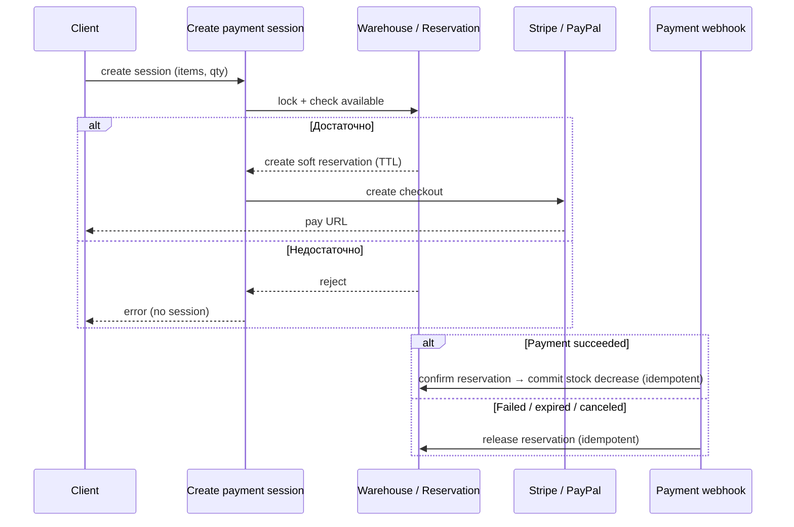

# Task 013 — Stock Reservation / Inventory Consistency

**Priority:** P0 (блокирует корректное списание в webhook)
**Complexity:** High
**Status:** Pending (документирован baseline; реализации нет)

## Связь с другими задачами

- **Task 009** ([db-model-improvements](../009-db-model-improvements/task.md)) — технические элементы склада (блокировки, возможное поле `reserved_quantity`). Реализация блокировок **не заменяет** энд-ту-энд резервирование из этой задачи.
- **Task 003** (payment-refactor) — точки входа Stripe/PayPal session + webhook должны быть согласованы с flow резервирования.

---

## Цель

Ввести согласованную модель **проверки наличия + soft reservation с TTL + подтверждение/отмена в webhook**, чтобы:

- нельзя было оплатить товар без реальной возможности исполнить заказ по складу (при активной SKU с учётом склада);
- повторное срабатывание webhook было идемпотентным относительно списания;
- отмена / истечение / неуспех оплаты освобождали резерв.

Эта задача **не утверждает**, что stock уже полностью реализован в продукте — наоборот, фиксирует пробел и целевую архитектуру.

---

## Текущее поведение (baseline на момент документа)

Ниже — фактическое состояние кода backend (без доработок в рамках этого документа).

### 1. Checkout / create payment session не проверяет `WarehouseItem.quantity_in_stock`

Эндпоинты создания сессии (Stripe/PayPal) валидируют корзину, доставку, CZ-origin, владение SKU продавцом и т.д., но **не сверяют** запрошенные количества с остатками `WarehouseItem`. Пользователь может перейти к оплате при любом состоянии остатков в БД.

### 2. Webhook успешной оплаты **не списывает** остатки

Функция `warehouses.services.decrease_stock` существует и документирует, что списание при создании заказа из webhook **отключено** (`warehouses/services.py`). По коду проекта **`decrease_stock` нигде не вызывается** (кроме определения); фактически `quantity_in_stock` после оплаты не уменьшается.

### 3. Роль `WarehouseItem` в webhook — в основном привязка склада

В `payment/services/webhook_processing.py` при создании позиций заказа выполняется поиск склада:

- если есть `WarehouseItem` с `quantity_in_stock >= quantity` для варианта — берётся **склад этого** `WarehouseItem`;
- иначе — **fallback**: `Warehouse.objects.first()` привязывается к позиции.

То есть при отсутствии или недостаточном остатке запись склада всё равно проставляется (через fallback), без блокировки оплаты. Наличие `WarehouseItem` **не является** gate для успешного создания заказа после оплаты с точки зрения минимальных остатков.

---

## Риск текущего состояния

| Риск | Описание |
|------|-----------|
| **Overselling / невыполнимые заказы** | Оплата возможна без проверки остатка; заказы создаются после оплачивания, даже когда «на бумаге» товара нет в нужном количестве. |
| **Расхождение кассы и складского учёта** | Успешный платёж не уменьшает `quantity_in_stock` — склад не отражает реальную продажу. |
| **Небезопасное включение списания в webhook** | Если снова вызывать `decrease_stock` только из webhook без резерва на этапе сессии, конкурирующие checkout-и смогут оплатить один и тот же остаток; плюс нет симметрии «отменил оплату — вернул на склад». |

**Явное правило:** включать списание остатков в webhook снова **нельзя**, пока не реализованы **проверка и резервирование** (или эквивалент с той же гарантией) на этапе **create payment session**.

---

## Целевой flow (proposal)

Идемпотентность и TTL — обязательные свойства целевой системы.

1. **Create payment session**  
   - Для каждой позиции: проверка наличия через `WarehouseItem` (или согласованная политика мульти-склад / приоритеты).  
   - При успехе: создать **soft reservation** на запрошенное количество (атомарно, с блокировкой строки склада там, где уместно).  
   - Сохранить **связь reservation ↔ payment session** (`session_key` / `session_id`), чтобы webhook знал, что подтверждать или отпускать.  
   - При нехватке: **409/400** — сессия оплаты **не создаётся** (нет сценария «успешная оплата без возможности создать исполнимый заказ» из-за отсутствия stock по выбранной политике).

2. **Reservation с TTL**  
   - Если пользователь не оплатил до истечения TTL — резерв автоматически освобождается (cron / периодическая задача / lazy expiry при следующей операции — детали реализации).  
   - TTL согласовать с типичным временем жизни Stripe/PayPal session + запас.

3. **Webhook success (оплата подтверждена)**  
   - Идемпотентно: при повторной доставке события не двойное списание (проверка по `Payment` / состоянию reservation / версии записи).  
   - Подтвердить резерв → **окончательное уменьшение** доступного количества (или перевод reserved → shipped в учётной модели).  

4. **Webhook failed / session expired / canceled**  
   - Освободить reservation, связанную с этой сессией (идемпотентно).

5. **Повторный webhook**  
   - Полностью идемпотентен относительно списания и освобождения резерва.

6. **Инвариант**  
   - **Отсутствие stock не должно приводить к успешной оплате** без возможности создать консистентный заказ по правилам бизнеса (при включённом учёте остатков для данного канала/SKU).

---

## Definition of Done (для будущей реализации)

- [ ] Поведение на этапе create session согласовано с продуктом (какие SKU требуют stock check).  
- [ ] Модель/persistence для reservation + TTL + связь с сессией оплаты.  
- [ ] Webhook success/failure/cancel/expiry освобождают или подтверждают резерв идемпотентно.  
- [ ] Тесты: гонка двух сессий на последнюю единицу, повтор webhook, истечение TTL.  
- [ ] Документация API/ошибок для фронта (нет «тихого» успеха при нуле на складе).  

---

## Открытые вопросы (для проработки перед реализацией)

- Политика при **нескольких складах** у продавца: фиксированный приоритет vs выбор по стране доставки.  
- Поведение для **digital / dropship** SKU без `WarehouseItem`.  
- Синхронизация с **внешним WMS** (если появится): кто master для quantity.  
- Точные **коды ошибок** и UX при «кто-то купил последний» между открытием корзины и оплатой.

---

## История документа

| Дата | Изменение |
|------|-----------|
| 2026-05-11 | Создан документ: зафиксирован baseline (нет проверки на session, нет списания в webhook, роль `WarehouseItem` в webhook), риски, целевой flow, запрет на включение списания без резерва. |
