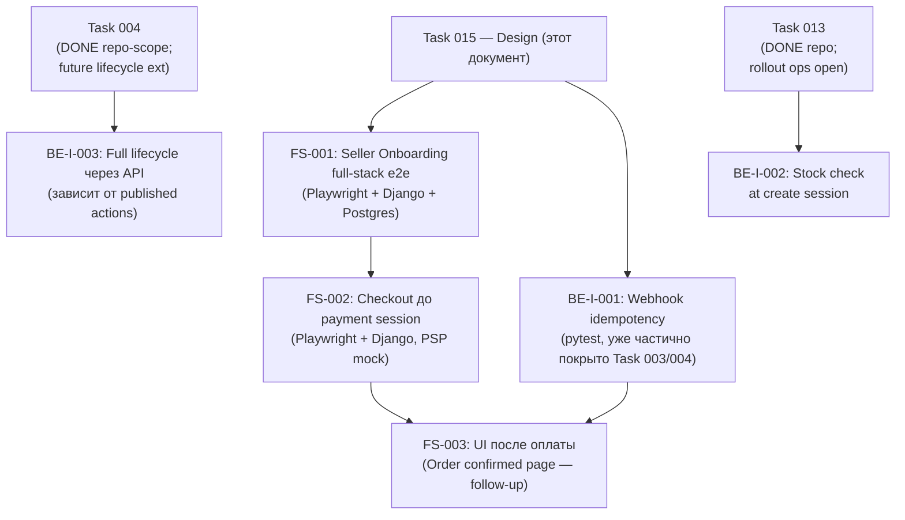

# Task 015 — Full-Stack E2E Design

**Status:** **Done (design)**; **FS-001–003 implemented** via follow-up tasks **[018](./018-full-stack-e2e-ci-implementation/task.md)** (CI job `e2e_fullstack`) and **[019](./019-e2e-catalog-fixture/task.md)** (catalog fixture). External Stripe/PayPal sandbox acceptance — **manual/ops**, не автоматизирована в CI.
**Priority:** P2  
**Complexity:** Medium  
**Type:** Design document (исходный scope) + зафиксированная реализация follow-up tasks

---

## Финальное состояние (design vs implementation)

| Слой | Статус |
|------|--------|
| **Design scope (Task 015)** | **Done** — границы уровней, candidate scenarios, mock/UI/backend-only split, non-goals |
| **FS-001** seller onboarding full-stack | **Done** — `e2e/fullstack-seller-onboarding.spec.js` |
| **FS-002** checkout до payment session | **Done** — `e2e/fullstack-checkout-payment-session.spec.js` (PSP mocked) |
| **FS-003** payment confirmation + UI | **Done** — `e2e/fullstack-payment-confirmation.spec.js` (e2e endpoints + webhook skip) |
| **CI integration** | **Done** — Task **018**: job `e2e_fullstack` в `.github/workflows/ci.yml` |
| **Catalog fixture** | **Done** — Task **019**: `e2e_categories.json` + `loaddata` в CI |
| **Optional / future** | BE-I-003 full lifecycle (новые published seller actions); FS-002b stock-at-checkout при необходимости; Tier 3 EXT Stripe/PayPal sandbox — **manual** |

**Historical note:** формальный design review PR (`Дизайн согласован с командой`) не зафиксирован отдельным артефактом; фактическая приёмка — через реализацию FS-001–003 и CI job **018**.

---

## Цель

Спроектировать **full-stack e2e стратегию**: определить границы между уровнями тестирования, выбрать candidate scenarios, обосновать приоритеты, зафиксировать, что мокать, что проверять через UI, что проверять backend-only — **до** начала реализации.

Результат задачи — документ, на который опирались при реализации full-stack e2e (FS-001–003) и CI job **018**. Сам Task 015 **не** добавляет runtime-код.

---

## Контекст

К моменту создания этой задачи (май 2026) реализованы:

- **Frontend Playwright smoke**: `e2e/smoke.spec.js` (5 тестов), `e2e/checkout.spec.js` (6), `e2e/seller-onboarding.spec.js` (4) — FE-008, FE-009, FE-010; backend не поднимается, внешние PSP не вызываются.
- **Backend unit/integration**: покрыт order lifecycle (Task 012), payment flow (Task 003/004), delivery isolation (Task 005), seller onboarding (Task 008). CI зелёный.
- **E2E Docker contour**: `docs/testing/e2e-local-contour.md` — локальный `docker-compose` с Mailpit, Postgres, Django, без Playwright UI.
- **Ручные e2e-чеклисты**: `docs/testing/stripe-e2e-checklist.md`, `docs/testing/paypal-e2e-checklist.md`.

Пробел **на момент создания** (май 2026): отсутствовал автоматизированный сценарий Playwright UI + реальный Django backend в CI.

**Закрыто follow-up tasks:** FS-001–003 specs + Task **018** (`e2e_fullstack` job) + Task **019** (catalog fixture). Лёгкий smoke job `e2e_frontend3` по-прежнему **без** backend — намеренно.

---

## Что является full-stack e2e (граница уровней)

| Уровень | Инструмент | Backend | Внешний PSP | Описание |
|---------|-----------|---------|-------------|---------|
| **Frontend Playwright (текущий)** | Playwright | Нет (заглушки / abort) | Нет | Smoke: маршруты, рендер, Redux state. FE-008–010. |
| **Backend unit/integration** | pytest / Django TestCase | Да | Нет (mock) | Логика сервисов, переходы статусов, webhook idempotency. |
| **Backend API integration** | pytest + DRF test client | Да | Нет (mock) | HTTP-контракты, authentication, serializers. |
| **Full-stack E2E** | Playwright + Django (тестовый) | **Да** | Нет (mock/sandbox) | Браузер → реальный Django → реальная БД (тестовая). Stripe/PayPal — mock или sandbox. |
| **External provider E2E** | Ручные чеклисты / sandbox | Да | **Да (sandbox)** | Stripe/PayPal sandbox; не автоматизируется в CI-контуре. |

> **Full-stack e2e** в данной задаче = Playwright управляет браузером → Django + Postgres тестовая БД обрабатывает запросы → результат проверяется через UI и/или API assertion. Stripe/PayPal **всегда мокируются** в CI-контуре.

---

## Non-goals (явные)

- **Нет реализации runtime-кода** в исходном design scope Task 015 (реализация — follow-up tasks и frontend e2e specs).
- **Нет реализации Playwright тестов** в рамках Task 015 как design-only deliverable (specs добавлены в FS-001–003 / FE-011–013).
- **Нет изменений `docker-compose`** — только документирование; если понадобится новый compose-профиль, он описывается как план в `docs/`, но не создаётся.
- **Нет интеграции с provider sandbox** (Stripe/PayPal) в рамках CI — остаётся на ручных чеклистах.
- **Нет обновления `docs/test-coverage-snapshot.md`** — снимок обновляется только при добавлении фактических тестов.
- Не меняется CI workflow, `package.json`, Django `settings.py`.

---

## Candidate scenarios

### Tier 1 — Full-stack E2E (Playwright + реальный Django)

| # | Сценарий | Описание |
|---|---------|---------|
| **FS-001** | Seller onboarding happy path | Регистрация продавца → заполнение данных → статус `pending_verification` в БД |
| **FS-002** | Checkout до payment session (без PSP) | Авторизованный пользователь → корзина → оформление → `create_stripe_session` или `create_paypal_session` вызывается (мок возвращает fake session\_id) → `Payment` создан в БД |
| **FS-003** | Webhook payment lifecycle | POST на `/payment/webhook/stripe/` или `/payment/webhook/paypal/` с тестовой подписью → заказ создан в БД → статус `Paid` |

### Tier 2 — Backend API integration (DRF test client, без браузера)

| # | Сценарий | Описание |
|---|---------|---------|
| **BE-I-001** | Webhook idempotency | Повторная доставка одного события → второй заказ не создаётся |
| **BE-I-002** | Stock check при create session | При `STOCK_RESERVATION_ENABLED=False` — fallback; при `True` — 409 при нехватке (Task 013 repo-scope; rollout ops open) |
| **BE-I-003** | Seller order actions lifecycle | Полный переход Pending → Processing → Shipped через API (актуальный коннектор к Task 012) |

### Tier 3 — External provider (ручные / sandbox, вне CI)

| # | Сценарий | Ссылка |
|---|---------|--------|
| **EXT-001** | Stripe полный checkout в sandbox | `docs/testing/stripe-e2e-checklist.md` |
| **EXT-002** | PayPal полный checkout в sandbox | `docs/testing/paypal-e2e-checklist.md` |

---

## Почему seller onboarding — первый full-stack сценарий (FS-001)

1. **Нет внешних зависимостей.** Онбординг не требует Stripe/PayPal — только Django, Postgres, Django ORM.
2. **Критичный продуктовый поток.** Без онбordinга нет продавца, нет товаров, нет продаж. Регрессия здесь дорогостоящая.
3. **Уже покрыт backend-юнитами и frontend-smoke.** Full-stack e2e замыкает оба конца цепочки: `SellerOnboardingService` + React форма в браузере.
4. **Ограниченное состояние БД.** Нужны только `User`, `Seller`, `SellerOnboardingState` — воспроизводимая фикстура.
5. **Существующий Task 008** (DONE repo-scope) зафиксировал backend-контракт; manual staging приёмка — pending ops. Full-stack e2e закрывает этот пробел автоматизацией.

---

## Почему checkout до payment session — второй (FS-002)

1. **Не требует реального PSP.** `create_stripe_session` мокируется через `unittest.mock.patch` или Playwright `route.fulfill` на backend-endpoint — fake `session_id` достаточен для проверки, что `Payment` создан.
2. **Проверяет критичную цепочку.** Cart → address form → delivery → `Payment` запись в БД — это интеграция frontend Redux state + backend serializers + Django ORM в одном тесте.
3. **Зависит только от FS-001 по части инфраструктуры** (auth, user fixture), но не по сценарию.
4. **Прокладывает путь к FS-003** (webhook lifecycle) — после FS-002 известен `session_id`, который webhook может подтвердить.
5. Не блокируется Task 013 rollout для minimal happy path; stock e2e branch **FS-002b / BE-I-002** можно добавить при необходимости (repo implementation есть; production rollout не утверждён git).

---

## Почему webhook/payment lifecycle — отдельный backend integration (BE-I-001, FS-003)

1. **Webhook не требует браузера** для проверки корректности создания заказа — достаточно DRF test client с подделанной подписью. Браузер добавляет сложность без ценности для idempotency-тестов.
2. **Уже есть coverage в backend** (Task 003/004). Полный Playwright для webhook — избыточность: риск дублирования и fragile тест из-за timing network.
3. **Stripe подпись** требует либо реального `signing_secret` (нельзя в CI без secrets), либо точного мока — проще в pytest, чем через Playwright network intercept.
4. **Исключение:** если нужно проверить **UI-отображение** результата оплаты (страница «Order confirmed»), тогда FS-003 становится полноценным full-stack сценарием с Playwright + mock webhook — это **follow-up**, не первый приоритет.

---

## Что мокировать

| Компонент | Мок-стратегия | Обоснование |
|-----------|--------------|-------------|
| Stripe `checkout.Session.create` | `unittest.mock.patch('stripe.checkout.Session.create')` | Нет реального ключа в CI |
| PayPal order create | Аналогично через patch | — |
| Stripe webhook signature | `stripe.WebhookSignature.verify_header` mock или `stripe.Webhook.construct_event` patch | CI не имеет Stripe signing secret |
| Email (Django email backend) | `django.core.mail.backends.locmem.EmailBackend` или Mailpit (уже в e2e-compose) | Без SMTP |
| Celery/async tasks | `CELERY_TASK_ALWAYS_EAGER=True` или mock | Детерминизм в тестах |
| KYC / document upload | Заглушка file fixture или skip upload step | Нет внешнего KYC-провайдера |

---

## Что проверять через UI (Playwright assertions)

- Правильный рендер страницы после перехода (заголовки, кнопки, сообщения).
- Отображение состояния после асинхронной операции (spinner → результат).
- Наличие redirect на правильный маршрут.
- UX-сообщения об ошибках (валидация форм, 4xx ответы).
- Состояние onboarding steps (seller type выбран → следующий шаг показан).

---

## Что проверять backend-only (pytest / DRF test client)

- Создание `Payment` / `Order` записей в БД с правильными полями.
- Идемпотентность: повторный webhook не создаёт дублей.
- Переходы статусов: `OrderStatus`, `SellerOnboardingState.status`.
- FK консистентность: `OrderProduct → WarehouseItem` привязка.
- Авторизация: 401/403 без токена или с чужим токеном.
- Граничные условия валидации (пустая корзина, нулевой остаток — при `STOCK_RESERVATION_ENABLED=True`, см. Task 013).

---

## Backend tasks — потенциальные blockers и follow-ups

### Task 012 follow-ups

Task 012 DONE (repo-scope): `SellerOrderActionsLifecycleTests`, `OrderStatusStringFragilityTests`. Открытое:

- [ ] Переходы через `delivered` / `closed` endpoint — нет публичных action в `SellerOrderActionsService` на момент написания. **FS-003 и BE-I-003** зависят от их появления для полного lifecycle e2e.
- [ ] `OrderStatusStringFragilityTests` фиксирует хрупкость строк — **Task 004 repo-scope закрыт** (константы, миграция `0009`); оставшийся риск — **future order lifecycle extensions** (новые публичные actions), не structural Task 004.

### Task 004 — Order Consistency (repo-scope closed)

- Structural Order Consistency **Done (repo-scope):** константы статусов, индексы, `SET_NULL`, миграция `0009_order_consistency` — см. [Task 004](../004-order-consistency/task.md).
- **OPEN (ops/manual):** production/live PSP acceptance и production migration verification.
- **Future order lifecycle extensions** (новые published actions для `delivered`/`closed`) — отдельный backlog; не блокирует FS-001 и FS-002.
- BE-I-003 / FS-003 lifecycle e2e зависят от **published seller actions**, не от незакрытого Task 004.

### Task 013 — stock/reservation/payment lifecycle

- **Repo-scope implementation Done:** reservation at checkout, webhook confirm/release, cleanup command, tests — см. [Task 013](../013-stock-reservation/task.md).
- **OPEN ops rollout:** `STOCK_RESERVATION_ENABLED=True` на staging/prod, cron, monitoring; git **не** утверждает production enablement.
- **Не блокирует** FS-001 и FS-002 minimal happy path.
- **FS-002b / BE-I-002** (stock scenarios at create session) — опциональный branch; можно писать против repo implementation с `@override_settings` / test env; production rollout evidence — ops.
- **Webhook списание** (`decrease_stock`) идёт через `confirm_reservation` в Task 013 при включённом флаге. BE-I-001 (idempotency) не зависит от rollout.

---

## Рекомендуемый порядок реализации (после утверждения дизайна)

**Приоритет реализации:**

1. **FS-001** — seller onboarding (нет внешних блокеров).
2. **BE-I-001** — webhook idempotency (нет внешних блокеров, backend уже есть).
3. **FS-002** — checkout до PSP (нет блокеров, PSP мокируется).
4. **BE-I-003** — полный order lifecycle (зависит от published seller actions; Task 004 structural — repo done).
5. **FS-002b / BE-I-002** — stock scenarios (Task 013 repo done; optional; production rollout — ops).
6. **FS-003** — UI после оплаты (follow-up, требует FS-002 + webhook mock).

---

## Инфраструктурные требования (для документирования)

Для запуска full-stack e2e (Tier 1) в CI потребуется:

| Компонент | Состояние | Действие |
|-----------|-----------|---------|
| Docker-compose с Django + Postgres | Есть (`docs/testing/e2e-local-contour.md`) | Добавить Playwright в compose или запускать Playwright хостово против поднятого контура |
| Django тестовая БД | Стандартный `--keepdb` или `pytest-django` | Конфигурация `pytest.ini` / `conftest.py` |
| Playwright в CI job | **Done (Task 018)** | Job `e2e_fullstack`: `fullstack-*.spec.js` против `docker-compose.e2e.yml` |
| Переменные окружения | `.env.test` пример | Не коммитить реальные ключи; mock Stripe key достаточен |

---

## Definition of Done (design scope)

- [x] Границы уровней тестирования зафиксированы (таблица выше).
- [x] Candidate scenarios с обоснованием приоритетов задокументированы.
- [x] Мок-стратегии описаны.
- [x] Связь с Task 004 (repo-scope closed), future order lifecycle extensions, Task 012 follow-ups, Task 013 (repo done / rollout ops) явно указана.
- [x] Non-goals явные и полные.
- [x] Рекомендуемый порядок реализации зафиксирован.
- [x] Follow-up implementation: FS-001–003 + CI **018** + fixture **019** — см. секции ниже.
- [ ] Формальный design review PR — **не зафиксирован**; historical/manual note (реализация принята через follow-up tasks).

## Реализация follow-up (Tasks 018/019)

**FS-003 реализован:** `Frontend/Frontend3/e2e/fullstack-payment-confirmation.spec.js`

| Сценарий | Файл | Статус |
|---------|------|--------|
| FS-003a — Webhook lifecycle: StripeMetadata → POST /stripe-webhook/ → Order/Payment/Invoice + conversion-payload ready | `fullstack-payment-confirmation.spec.js` | **Done** |
| FS-003b — UI /my_orders отображает заказ после webhook | `fullstack-payment-confirmation.spec.js` | **Done** |

Инфраструктурный подход:
- `STRIPE_WEBHOOK_SKIP_SIGNATURE=true` → webhook endpoint пропускает `stripe.Webhook.construct_event`
- `ENABLE_E2E_ENDPOINTS=true` → `/api/e2e/payment/setup-order-data/` + `/api/e2e/payment/create-stripe-metadata/`
- Авто-skip при недоступном бэкенде или отключённом `ENABLE_E2E_ENDPOINTS`
- `/my_orders` (MyOrdersPage + HistorySmallCard) как UI assertion point (нет dedicated confirmation page)

Документация: [`docs/frontend/tasks/013-full-stack-payment-confirmation-e2e/task.md`](../../frontend/tasks/013-full-stack-payment-confirmation-e2e/task.md)

---

## Статус реализации FS-002

**FS-002 реализован:** `Frontend/Frontend3/e2e/fullstack-checkout-payment-session.spec.js`

| Сценарий | Файл | Статус |
|---------|------|--------|
| FS-002a — API chain: validation → Packeta shipping → PSP boundary | `fullstack-checkout-payment-session.spec.js` | **Done** |
| FS-002b — UI section 3 с seeded Redux state → mocked PSP → correct payload | `fullstack-checkout-payment-session.spec.js` | **Done** |

Инфраструктурный подход:
- `request` fixture для data setup (seller + warehouse + product + customer via API)
- `seller_profile_id` добавлен в `GET /api/sellers/onboarding/state/` response (backend `services_onboarding.py`, 1 строка)
- `page.route()` mock для create-stripe-payment (fake 200 response, no real Stripe call)
- Redux state seeded в localStorage (pageSection=3 → section 3 сразу)
- Авто-skip при недоступном бэкенде

Документация: [`docs/frontend/tasks/012-full-stack-checkout-payment-session-e2e/task.md`](../../frontend/tasks/012-full-stack-checkout-payment-session-e2e/task.md)

---

## Статус реализации FS-001

**FS-001 реализован:** `Frontend/Frontend3/e2e/fullstack-seller-onboarding.spec.js`

| Сценарий | Файл | Статус |
|---------|------|--------|
| FS-001a — API chain → `pending_verification` | `fullstack-seller-onboarding.spec.js` | **Done** |
| FS-001b — UI `/seller/application-sub` с реальным бэкендом | `fullstack-seller-onboarding.spec.js` | **Done** |
| FS-001c — Выбор seller-type через UI → навигация → БД | `fullstack-seller-onboarding.spec.js` | **Done** |

Инфраструктурный подход: `page.route()` proxy (нет новых docker-compose) + JWT seeding через `addInitScript` + авто-skip при недоступном бэкенде.

---

## Связанные ссылки

- [`docs/testing/e2e-local-contour.md`](../../testing/e2e-local-contour.md) — локальный Docker e2e контур
- [`docs/testing/stripe-e2e-checklist.md`](../../testing/stripe-e2e-checklist.md) — ручной Stripe sandbox чеклист
- [`docs/testing/paypal-e2e-checklist.md`](../../testing/paypal-e2e-checklist.md) — ручной PayPal sandbox чеклист
- [`docs/tasks/012-order-lifecycle-extended-tests/task.md`](../012-order-lifecycle-extended-tests/task.md) — backend lifecycle tests
- [`docs/tasks/013-stock-reservation/task.md`](../013-stock-reservation/task.md) — stock reservation (**DONE repo-scope**; **OPEN ops rollout**)
- [`docs/tasks/004-order-consistency/task.md`](../004-order-consistency/task.md) — Order Consistency (**DONE repo-scope**; ops/manual PSP + migration verification)
- [`docs/tasks/008-seller-onboarding-stabilization/task.md`](../008-seller-onboarding-stabilization/task.md) — seller onboarding backend
- [`docs/frontend/tasks/010-seller-onboarding-e2e-smoke/task.md`](../../frontend/tasks/010-seller-onboarding-e2e-smoke/task.md) — frontend smoke (FE-010)
- [`docs/frontend/tasks/009-checkout-happy-path-e2e/task.md`](../../frontend/tasks/009-checkout-happy-path-e2e/task.md) — frontend checkout smoke (FE-009)
- [`docs/tasks/018-full-stack-e2e-ci-implementation/task.md`](./018-full-stack-e2e-ci-implementation/task.md) — CI job `e2e_fullstack`
- [`docs/tasks/019-e2e-catalog-fixture/task.md`](./019-e2e-catalog-fixture/task.md) — catalog fixture в CI
- [`docs/tasks/017-e2e-safety-ci-readiness-audit/task.md`](./017-e2e-safety-ci-readiness-audit/task.md) — safety audit; CI proposal → **018**
- [`docs/test-coverage-snapshot.md`](../../test-coverage-snapshot.md) — текущий снимок покрытия (не обновляется этой задачей)
