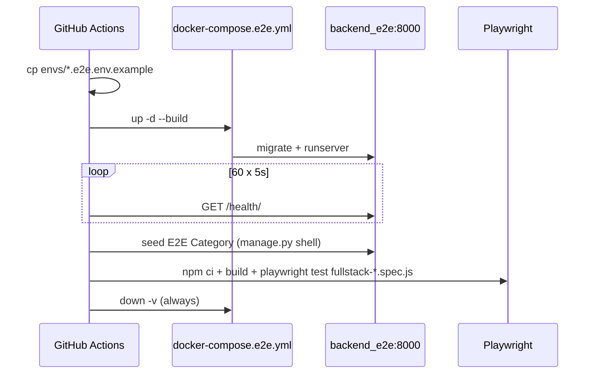

# Task 018 — Full-Stack E2E CI Implementation

**Priority:** P2  
**Complexity:** Medium  
**Type:** CI + documentation  
**Status:** **DONE** — job `e2e_fullstack` добавлен в `.github/workflows/ci.yml`

---

## Goal

Добавить отдельный GitHub Actions job для запуска full-stack Playwright E2E (FS-001, FS-002, FS-003) против реального Django backend + Postgres + Mailpit, не затрагивая лёгкий smoke job `e2e_frontend3`.

---

## Context

После Task 017 full-stack e2e был **local-only**: спеки auto-skip без backend, CI job `e2e_frontend3` поднимал только Vite preview. FS-001–FS-003 реализованы и используют `docker-compose.e2e.yml` + e2e env flags (`ENABLE_E2E_ENDPOINTS`, `STRIPE_WEBHOOK_SKIP_SIGNATURE`).

Task 017 зафиксировала CI proposal; Task 018 его реализует.

---

## Scope

- Новый job `e2e_fullstack` в `.github/workflows/ci.yml`
- Копирование `envs/*.e2e.env.example` → `envs/*.e2e.env` в CI
- `docker compose -f docker-compose.e2e.yml up -d --build`
- Retry loop на `/health/`
- Playwright: только `fullstack-*.spec.js` (7 тестов)
- Cleanup: `docker compose down -v` с `if: always()`
- Документация: task.md, README, e2e-local-contour, roadmap, test-coverage-snapshot

---

## Out of Scope

- Изменение `e2e_frontend3` (smoke / mocked e2e)
- Изменение production runtime / Stripe-PayPal integration
- Branch protection / required checks configuration
- Nightly/manual-only trigger (job запускается на push/PR как остальные jobs)

Примечание: для прохождения FS-002/FS-003 в e2e контуре потребовались минимальные правки full-stack specs (variant create API, CZ warehouse sync) и e2e-only endpoint `sync-default-warehouse` — onboarding warehouse address не выставляет `default_warehouse` до модерации.

---

## CI Design

### Job: `e2e_fullstack`

| Параметр | Значение |
|----------|----------|
| Runner | `ubuntu-latest` |
| Env | `CI=true`, `FULLSTACK_BACKEND_URL=http://localhost:8000` |
| Docker | `docker compose -f docker-compose.e2e.yml` |
| Frontend | `Frontend/Frontend3` — `npm ci`, `npm run build`, Playwright chromium |
| Specs | `fullstack-seller-onboarding`, `fullstack-checkout-payment-session`, `fullstack-payment-confirmation` |

### Поток шагов



### Отличие от `e2e_frontend3`

| | `e2e_frontend3` | `e2e_fullstack` |
|---|-----------------|-----------------|
| Backend | Нет | Django + Postgres + Mailpit |
| Specs | Все `e2e/*.spec.js` (smoke, checkout, onboarding mock) | Только `fullstack-*.spec.js` |
| Env flags | Не используются | `ENABLE_E2E_ENDPOINTS`, `STRIPE_WEBHOOK_SKIP_SIGNATURE` |
| Время | ~2–3 мин | ~8–15 мин (build backend image + migrate) |

---

## Safety Constraints

- [x] `e2e_fullstack` использует только e2e env files (`cp *.e2e.env.example`)
- [x] PSP keys пустые / fake (из `backend.e2e.env.example`)
- [x] E2E flags включаются только в e2e env (не в prod/test templates)
- [x] `/api/e2e/*` не включаются в prod env
- [x] `e2e_frontend3` остаётся lightweight (не изменён)
- [x] External provider sandbox не запускается в CI

---

## Commands

### Локальная проверка (до push)

```bash
# Validate compose file
docker compose -f docker-compose.e2e.yml config

# Полный контур (как в CI)
cp envs/database.e2e.env.example envs/database.e2e.env
cp envs/backend.e2e.env.example envs/backend.e2e.env
docker compose -f docker-compose.e2e.yml up -d --build

# Health wait (аналог CI loop)
for i in $(seq 1 60); do
  curl -sf http://localhost:8000/health/ && break
  sleep 5
done

cd Frontend/Frontend3
npm ci && npm run build
npx playwright install --with-deps chromium
FULLSTACK_BACKEND_URL=http://localhost:8000 CI=true npx playwright test \
  e2e/fullstack-seller-onboarding.spec.js \
  e2e/fullstack-checkout-payment-session.spec.js \
  e2e/fullstack-payment-confirmation.spec.js \
  --reporter=list

docker compose -f docker-compose.e2e.yml down -v
```

### CI

Job запускается автоматически на `push` и `pull_request` (workflow `CI`).

---

## Definition of Done

- [x] Создан `docs/tasks/018-full-stack-e2e-ci-implementation/task.md`
- [x] Добавлен job `e2e_fullstack` в `.github/workflows/ci.yml`
- [x] Job поднимает `docker-compose.e2e.yml`
- [x] Job ждёт `/health/` с retry loop (60 × 5s)
- [x] Job запускает FS-001 / FS-002 / FS-003 (7 тестов)
- [x] Cleanup через `docker compose down -v` + `if: always()`
- [x] `e2e_frontend3` не изменён
- [x] Docs обновлены
- [x] `docs/test-coverage-snapshot.md` обновлён (CI execution status)

---

## Validation Results

| Проверка | Результат | Примечание |
|----------|-----------|------------|
| `docker compose -f docker-compose.e2e.yml config` | **PASS** | Синтаксис compose валиден |
| Локальный прогон FS-001–003 (7 тестов) | **PASS** (7/7, ~15s) | После seed category + `sync-default-warehouse` + spec fixes |
| `e2e_frontend3` diff | **Unchanged** | Только добавлен новый job |
| Полный прогон FS-001–003 в GitHub Actions | **Pending first run** | Требует push/PR |

---

## Relation to Prior Tasks

| Task | Связь |
|------|-------|
| **015** | FS-001–003 design |
| **017** | Safety audit + CI proposal → реализовано здесь |
| **010** | E2e local contour docs |

---

## Risks / Limitations

1. **Job duration** — backend image build + migrate может занимать 8–15 мин; при flaky CI можно вынести в nightly (follow-up).
2. **Fixed container names** (`reli_backend_e2e`) — на GHA fresh VM конфликтов нет; при параллельных matrix jobs потребуется compose project name.
3. **Invoice PDF (FS-003)** — требует `backend/order/fonts/*.ttf` в volume mount; в CI backend монтируется из checkout — OK.
4. **Branch protection** — job не добавлен как required check автоматически; настраивается отдельно в GitHub settings.

---

## Follow-ups

| ID | Описание |
|----|----------|
| FU-018-01 | Кэш Docker layers для backend_e2e в CI |
| FU-018-02 | Optional/nightly trigger если job слишком медленный |
| FU-018-03 | Startup warning при e2e flags (из Task 017 FU-017-01) |
