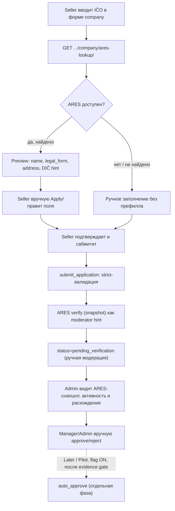

# Task 022 — ARES Onboarding Automation (CZ)

**Priority:** P1
**Complexity:** High
**Status:** **PLANNED** — реализация не начата (этот документ — план без изменений в коде).

> **Продуктовая позиция.** MVP задачи — **ARES-assisted onboarding**: lookup по `IČO` + prefill формы при сохранении **ручного онбординга и ручной модерации**. **Auto-approve не является core MVP** — это отдельная поздняя фаза / pilot под feature-flag, включаемая **только после evidence gate** (см. раздел [Evidence gate before auto-approve](#evidence-gate-before-auto-approve)).

> **Ограничения:** контракт публичного onboarding API расширяется только новым lookup-эндпоинтом; существующие контракты не меняются. ARES — вспомогательный источник prefill/hint, а не источник истины и не замена документов и ручной модерации.

**Связанные документы:** [`docs/seller-onboarding-flow.md`](../../seller-onboarding-flow.md), [`docs/06-integrations.md`](../../06-integrations.md), [Task 008 — Seller Onboarding Stabilization](../008-seller-onboarding-stabilization/task.md), [`ares-field-mapping.md`](./ares-field-mapping.md).

---

## Цель

Использовать публичный реестр **ARES CZ** по `IČO` (Company ID) для ускорения и повышения качества онбординга продавцов, разделяя работу на две фазы:

- **MVP — ARES-assisted onboarding:** lookup по IČO предзаполняет поля формы компании (название, юр. форма, адрес, опционально DIČ как hint); продавец **вручную проверяет, правит и подтверждает** данные; модерация остаётся **полностью ручной**. Дополнительно — submit-time сверка с ARES как **подсказка модератору** (moderator hint), **без** автоматического approve.
- **Later / Pilot — Auto-approve pilot (future phase):** при submit система сверяет данные с ARES и при выполнении строгих критериев авто-апрувит заявку. Включается под feature-flag, по умолчанию выключенным, **только после прохождения evidence gate**. До этого момента — не в core-поведении.

## Контекст

Сейчас онбординг полностью ручной: продавец заполняет блоки в REST-визарде, грузит документы, делает submit (`pending_verification`), затем Manager/Admin вручную approve/reject в Django Admin (`backend/sellers/admin.py`). Поле IČO хранится как `business_id` без какой-либо проверки по реестру. ARES предоставляет публичный REST API без ключа, который позволяет предзаполнять форму и показывать модератору сверку существования/активности субъекта — это снижает количество ошибок в данных и облегчает ручную модерацию, **не** заменяя её на MVP-этапе.

ARES REST (источник данных):

```
GET https://ares.gov.cz/ekonomicke-subjekty-v-be/rest/ekonomicke-subjekty/{ico}
```

Ответ JSON; ключевые поля: `obchodniJmeno` (название), `ico`, `dic` (DIČ — налоговый идентификатор, **не** подтверждение валидности VAT), `pravniForma` (код юр. формы), `sidlo` (адрес), `datumZaniku` / `seznamRegistraci` (признаки активности).

## Целевой поток



## Scope (область)

### MVP scope (ARES-assisted onboarding)

| Область | Смысл |
|---------|-------|
| **ARES client/service** | `backend/sellers/providers/ares/` — HTTP-клиент, нормализация, маппинг, кеш, ошибки |
| **Lookup endpoint** | `GET /api/sellers/onboarding/company/ares-lookup/` для prefill формы; throttle + cache |
| **Frontend lookup UI** | Кнопка «Загрузить из ARES» + preview результата + явный Apply в поля формы (поля остаются редактируемыми) + i18n |
| **Sanitized snapshot / audit / admin visibility** | Минимизированный (sanitized) снапшот результата, audit-событие `ares_lookup`, read-only ARES-панель в Admin |
| **Submit-time ARES verification (moderator hint)** | При submit — сверка с ARES и сохранение результата как **подсказки модератору**, **без** auto-approve; статус по-прежнему `pending_verification` |
| **Tests** | Backend (моки ARES) и Frontend (кнопка/preview/apply/ошибки) |
| **Docs** | `docs/06-integrations.md` (ARES), обновление `docs/seller-onboarding-flow.md` |

### Later / Pilot scope (auto-approve, future phase)

Включается **только после** [Evidence gate](#evidence-gate-before-auto-approve).

| Область | Смысл |
|---------|-------|
| **Feature-flag** | `ONBOARDING_ARES_AUTOAPPROVE_ENABLED` (default `False`; в MVP не используется) |
| **`auto_approved` field** | Поле на `SellerOnboardingApplication` — нужно только для auto-approve, добавляется в pilot-фазе |
| **`auto_approve_application()`** | Системный апрув (`reviewer=None`) с fail-closed и аудитом |
| **Автоматический approve в submit** | Ветка авто-апрува в `submit_application()` по строгим критериям |
| **Rollback / manual override** | Подтверждённый путь отката к ручной модерации |

## Не входит в задачу

- **MVP не включает auto-approve в production.** Любой автоматический approve — только pilot-фаза под флагом, default off, после evidence gate.
- Изменение существующих контрактов onboarding API (кроме нового lookup-эндпоинта).
- Авто-апрув / lookup для `self_employed` (по `SellerSelfEmployedTaxInfo.business_id`) — опциональное расширение позже.
- Замена ручной модерации: ручной путь approve/reject сохраняется полностью.
- Интеграция стороннего KYC/identity-провайдера (Sumsub/Onfido и т.п.).
- **VAT/DPH/VIES verification** — отдельная будущая интеграция; `dic` из ARES не является подтверждением валидности VAT.
- ARES **не заполняет и не подтверждает** следующие данные (вводятся и подтверждаются продавцом/документами/модератором):
  - bank account (IBAN/SWIFT/holder);
  - representative personal data (ФИО, дата рождения, роль);
  - warehouse address;
  - return address;
  - uploaded documents / proofs (identity, proof of address, registration certificate);
  - phone / email, если они не гарантированы ARES.

## Зависимости

- [Task 008 — Seller Onboarding Stabilization](../008-seller-onboarding-stabilization/task.md) — стабилизированный сервисный слой онбординга (`services_onboarding.py`, `onboarding/**`).
- Паттерн внешних интеграций проекта: `backend/delivery/providers/dpd/client.py` (client + Retry), `backend/delivery/services/cnb_service.py` + `currency_converter.py` (публичный API + кеш).

## Риски

- **Преждевременный auto-approve (ключевой риск).** Auto-approve меняет business-critical поведение онбординга. Включать **только** после [evidence gate](#evidence-gate-before-auto-approve): под флагом `ONBOARDING_ARES_AUTOAPPROVE_ENABLED` (default `False`), fail-closed (при недоступности/несовпадении ARES → ручная модерация), с полным аудитом и подтверждённым rollback. В MVP auto-approve отсутствует.
- **PII / data minimization.** Не хранить полный `raw_response` без необходимости: сохранять **sanitized**/нормализованный снапшот с минимально нужными полями; не логировать чувствительные данные; учитывать срок хранения.
- **DIČ ≠ VAT/TIN verification.** `dic` из ARES — налоговый идентификатор, **не** подтверждение валидности VAT и **не** TIN-верификация. Использовать только как optional display hint; полноценная проверка VAT (DPH/VIES) — отдельная будущая интеграция.
- **Rate limiting ARES.** ARES имеет лимиты на число запросов. Backend lookup-эндпоинт обязан иметь **throttle** (DRF throttling) и **cache** по IČO (`ARES_CACHE_SECONDS`), чтобы не упереться в лимиты и не зависеть от каждого keystroke на фронте.
- **Маппинг `pravniForma` и адресов** нужно выверить на реальных ответах ARES; маппинг адреса может быть частичным и **редактируемым пользователем**.
- **Расхождение название/держатель счёта:** существующая строгая проверка `account_holder` (company_name + legal_form) должна согласовываться с данными из ARES — иначе в pilot-фазе auto-approve будет ложно блокироваться.
- **Миграция модели** — только добавление таблицы/полей, без изменения существующих.

## Конфигурация (env)

### MVP config

```
ARES_API_BASE=https://ares.gov.cz/ekonomicke-subjekty-v-be/rest
ARES_HTTP_TIMEOUT_CONNECT=5
ARES_HTTP_TIMEOUT_READ=10
ARES_HTTP_RETRIES=2
ARES_CACHE_SECONDS=86400
```

### Later / Pilot config (not used in MVP)

```
# Включается только после evidence gate; в MVP не используется.
ONBOARDING_ARES_AUTOAPPROVE_ENABLED=false
```

Добавляется в `backend/backend/settings.py`, `envs/backend.env.example`, `envs/backend.test.env.example`.

## Маппинг ARES → модель

ARES — источник **prefill/hint**, не источник истины. Все поля остаются редактируемыми продавцом и подтверждаются ручной модерацией.

| ARES | Поле онбординга | Семантика |
|------|-----------------|-----------|
| `obchodniJmeno` | `company_name` | prefill, редактируемо |
| `ico` | `business_id` | значение, введённое продавцом; подтверждается lookup |
| `dic` | display-only DIČ hint | **Только подсказка для UI/модератора**; не доказательство валидности VAT/DPH и не auto-fill для `tin` |
| (нет) | `tin` | **не** заполнять автоматически — нет отдельного подтверждённого источника |
| `pravniForma` (код) | `legal_form` | prefill через таблицу маппинга в `mapping.py`, редактируемо |
| `sidlo` (`nazevUlice`+`cisloDomovni/cisloOrientacni`, `nazevObce`, `psc`, `kodStatu`) | company address (`street`, `city`, `zip_code`, `country`) | prefill **может быть частичным** и редактируемым пользователем |
| наличие `datumZaniku` / признаки `seznamRegistraci` | `is_active` (snapshot/hint) | для отображения модератору, не для авто-решения в MVP |

---

## Evidence gate before auto-approve

Auto-approve (Later / Pilot) включается **только** при одновременном выполнении условий ниже. До этого момента флаг `ONBOARDING_ARES_AUTOAPPROVE_ENABLED` остаётся `False`, и поведение submit — `pending_verification` (ручная модерация).

- [ ] **N реальных или staging заявок** сверены вручную (N согласовать с продуктом/комплаенс до старта pilot).
- [ ] **ARES normalized fields совпали с moderator-approved legal data** на выборке (название, юр. форма, адрес).
- [ ] **Mismatch rate ниже согласованного порога** (порог зафиксировать до включения флага).
- [ ] **ARES downtime / error behavior проверен** — при недоступности/ошибке система fail-closed уходит в ручную модерацию.
- [ ] **Admin visibility подтверждена** — модератор видит ARES-снапшот, статус активности и расхождения.
- [ ] **Rollback / manual override path подтверждён** — есть проверенный способ отключить auto-approve и вернуться к полностью ручной модерации без потери данных.

---

# Iterations

## Iteration 1 — Analysis & Design

### Цель
Зафиксировать схему данных ARES, маппинг полей, валидацию IČO и критерии (для будущего pilot) на реальных ответах реестра.

### Действия
- Зафиксировать **ARES fixture plan** для будущих моков: active company, inactive/terminated company, not found, malformed/partial address. Fixtures в Iteration 1 являются documentation/test-planning артефактами; живые вызовы ARES из кода не добавляются.
- Составить таблицу **field mapping** `pravniForma` → значения `legal_form` формы; зафиксировать частичность адреса и редактируемость всех prefilled полей.
- Описать **IČO validation** до сетевого запроса: нормализация, формат 8 цифр, checksum по весам `8,7,6,5,4,3,2`, правило ведущих нулей для коротких исторических значений.
- Зафиксировать границы prefill:
  - ARES может prefill/hint: `company_name`, `business_id`/IČO, `legal_form`, registered company address, optional DIČ display hint.
  - ARES **не** auto-fill: bank account, representative personal data, warehouse address, return address, uploads/proofs, phone/email.
  - DIČ не является доказательством VAT/DPH validity; `tin` не заполняется автоматически без отдельного подтверждённого источника.
- Описать критерии будущего auto-approve (для pilot) и пороги mismatch — как вход для evidence gate, **без** реализации auto-approve в MVP.
- Согласовать sanitized-схему снапшота (data minimization) и migration-план.

### Output
- Iteration 1 design artifact: [`ares-field-mapping.md`](./ares-field-mapping.md).
- Fixture plan для active / inactive / not found / malformed address cases; сами fixtures при добавлении позже должны быть documentation/test-planning или test mocks, не runtime code.
- IČO validation: 8 digits после нормализации; checksum `(11 - (sum(first7 * [8,7,6,5,4,3,2]) % 11)) % 10`; невалидный IČO не должен вызывать ARES.
- Field mapping decisions: ARES-assisted prefill только для company legal data и registered address; DIČ — display hint, не VAT/TIN verification; TIN не auto-fill без confirmed source.
- Auto-approve: out of MVP, deferred to Later/Pilot after evidence gate; submit remains `pending_verification` with manual moderation.

### Статус
- [x] Iteration 1 documentation/design outputs зафиксированы; runtime behavior не менялся.

---

## Iteration 2 — Backend ARES client & lookup endpoint

### Цель
Реализовать backend ARES-assisted lookup без изменения submit-логики.

### Действия
- `backend/sellers/providers/ares/`: `client.py` (`AresClient` на `requests.Session` + `urllib3 Retry`), `service.py` (`lookup_by_ico` + кеш по IČO), `mapping.py`, `errors.py` (`AresNotFound`, `AresUnavailable`, `AresInvalidIco`).
- Env-переменные `ARES_*` (MVP config) в settings и env-examples.
- View `GET /api/sellers/onboarding/company/ares-lookup/?ico=...` рядом с `sellers/onboarding/steps/company.py`; маршрут в `sellers/urls.py`; serializer ответа (нормализованные поля + `found`/`is_active`); permission `IsSeller`; **DRF throttle**; audit-событие `ares_lookup`.
- Endpoint не сохраняет данные в модели (только подсказка для формы) и возвращает sanitized-набор полей.
- Unit-тесты на моках (`patch` HTTP): успех, 404, 5xx/timeout, кеш, невалидный IČO, throttle.

### Output
- Рабочий lookup-эндпоинт с кешем и throttle.

### Статус
- [ ]

---

## Iteration 3 — Frontend assisted prefill UX

### Цель
Дать продавцу удобный ассистированный prefill с явным контролем.

### Действия
- `getAresCompanyByIco(ico)` в `Frontend/Frontend3/src/api/seller/onboarding.js`.
- Кнопка «Загрузить из ARES» рядом с `business_id` в `Frontend/Frontend3/src/Components/Seller/auth/sellerInfo/CompanyInfo/CompanyInfo.jsx`: показ **preview** результата и явный **Apply** в поля формы через `formik.setFieldValue`; поля остаются редактируемыми.
- Состояния: loading / не найдено / реестр недоступен (`ErrToast` + подсказка); поведение при частичном адресе.
- i18n в `Frontend/Frontend3/src/locales/cz/onbordingCz.json` и `Frontend/Frontend3/src/locales/en/onbordingEn.json`.
- Frontend unit-тест (мок ответа: preview, apply, ошибки).

### Output
- Ассистированный prefill с ручным подтверждением.

### Статус
- [ ]

---

## Iteration 4 — Snapshot / Audit / Admin visibility

### Цель
Сохранять sanitized-результат сверки и показывать его модератору.

### Действия
- Модель `SellerAresVerification` (OneToOne к `SellerOnboardingApplication`): `ico_queried`, `normalized` (JSON, sanitized), `is_active`, `field_matches` (JSON), `checked_at`. **Полный `raw_response` не хранить** без необходимости (data minimization); при необходимости — усечённый/sanitized слепок.
- Audit-события: `ARES_LOOKUP`, `ARES_VERIFIED`, `ARES_MISMATCH` в `OnboardingEventType`.
- Миграция — только добавление таблицы/полей. (Поле `auto_approved` **не** добавляется в MVP — переносится в pilot, Iteration 7.)
- Admin (`backend/sellers/admin.py`): read-only панель `ares_panel` (sanitized снапшот + статус активности + таблица совпадений/расхождений); ARES-события видны в audit log.

### Ограничения
- Не менять существующие модели/поля онбординга.

### Статус
- [ ]

---

## Iteration 5 — Submit-time verification as moderator hint (no auto-approve)

### Цель
Включить сверку с ARES при submit как **подсказку модератору**, без авто-решения.

### Действия
- `verify_against_ares(app)`: повторный lookup по `business_id`, сверка ключевых полей, проверка активности, сохранение sanitized-снапшота и `field_matches`.
- Вызов из `submit_application()` после `validate_before_submit`: статус по-прежнему `pending_verification`; результат сверки — только hint для модератора; fail-closed при недоступности ARES (никогда не блокирует submit и не апрувит).
- Admin: расхождения/совпадения и активность показываются в `ares_panel` и `review_snapshot`.
- Тесты: снапшот сохраняется при submit; недоступность ARES не ломает submit; статус остаётся `pending_verification`; никакого auto-approve.

### Ограничения
- **Никакого автоматического approve** на этом шаге. Поведение модерации идентично текущему ручному.

### Статус
- [ ]

---

## Iteration 6 — Validation / staging evidence gate

### Цель
Проверить MVP и собрать evidence для решения о pilot.

### Тесты
```bash
pytest sellers/ -q
docker compose -f docker-compose.test.yml run --rm backend_test pytest sellers/ -q
```

### Ручная проверка (Manual/Ops)
- [ ] Lookup по валидному IČO → preview корректен, Apply заполняет поля, поля редактируемы.
- [ ] Lookup по несуществующему IČO → понятное сообщение, ручное заполнение доступно.
- [ ] Невалидный IČO → валидируется до сетевого запроса.
- [ ] ARES недоступен → форма заполняется вручную; submit уходит в `pending_verification`.
- [ ] Submit → ARES-снапшот сохранён (sanitized), расхождения видны модератору; auto-approve отсутствует.
- [ ] Throttle/cache работают (нет всплеска запросов к ARES).

### Evidence для pilot
- [ ] Накоплены данные для [Evidence gate](#evidence-gate-before-auto-approve) (mismatch rate, downtime behavior, admin visibility, rollback).

### Статус
- [ ]

---

## Iteration 7 — Auto-approve pilot (feature-flagged, default off)

### Цель
Включить auto-approve как контролируемый pilot **только после прохождения evidence gate**.

### Предусловие
- [ ] [Evidence gate before auto-approve](#evidence-gate-before-auto-approve) пройден и зафиксирован.

### Действия
- Добавить поле `auto_approved` на `SellerOnboardingApplication` и событие `ARES_AUTO_APPROVED` (миграция — только добавление).
- Env/feature-flag `ONBOARDING_ARES_AUTOAPPROVE_ENABLED` (default `False`).
- `auto_approve_application(app)`: системный апрув (`reviewer=None`, `auto_approved=True`), переиспользование `sync_legal_info_from_application` (адаптация под `reviewer=None`), полный аудит.
- Ветка в `submit_application()`: при flag ON и выполнении строгих критериев (тип `company`; IČO найдено и активно; ключевые поля совпали; strict-валидация и документы пройдены) → auto-approve; иначе → `pending_verification`. Fail-closed при недоступности ARES.
- Подтверждённый **rollback / manual override** (отключение флага возвращает полностью ручную модерацию).
- Тесты: авто-апрув при выполнении критериев; `pending_verification` при расхождении / неактивной компании / недоступности ARES / выключенном флаге.

### Ограничения
- Поведение при выключенном флаге идентично MVP (`pending_verification`).
- Default в production — выключено; включение — отдельное ops-решение.

### Статус
- [ ]

---

## Definition of Done

### MVP DoD (ARES-assisted onboarding) — без auto-approve

- [ ] ARES client/service (`providers/ares/**`) с retry, кешем, нормализацией, маппингом и IČO-валидацией; unit-тесты на моках.
- [ ] Lookup endpoint `GET .../company/ares-lookup/` (view + url + serializer ответа), permission `IsSeller`, **throttle + cache**, audit-событие `ares_lookup`; данные не сохраняются (только prefill).
- [ ] Frontend3: кнопка «Загрузить из ARES» с preview + явным Apply, обработкой ошибок и частичного адреса; i18n cz/en; frontend-тест.
- [ ] `SellerAresVerification` (sanitized snapshot, без полного `raw_response`) + миграция (только добавление, **без** `auto_approved`); ARES-панель в Admin; события `ARES_LOOKUP`/`ARES_VERIFIED`/`ARES_MISMATCH` в `OnboardingAuditLog`.
- [ ] Submit-time `verify_against_ares()` как **moderator hint**; статус остаётся `pending_verification`; **auto-approve отсутствует**; fail-closed при недоступности ARES.
- [ ] Backend regression gate (`manage.py check`, `pytest sellers/ -q`, полный `pytest`).
- [ ] Документация: `docs/06-integrations.md` (ARES) и обновлённый `docs/seller-onboarding-flow.md`.

### Pilot DoD (auto-approve) — отдельная фаза

- [ ] [Evidence gate](#evidence-gate-before-auto-approve) пройден и задокументирован.
- [ ] Feature-flag `ONBOARDING_ARES_AUTOAPPROVE_ENABLED` (default `False`); при OFF поведение идентично MVP.
- [ ] `auto_approved` field + `auto_approve_application()` + ветка в `submit_application()` по строгим критериям.
- [ ] **Fail-closed** при недоступности/несовпадении ARES; полный **аудит** (`ARES_AUTO_APPROVED`).
- [ ] Подтверждённый **rollback / manual override** к ручной модерации.
- [ ] Тесты pilot-сценариев (approve / отказ от авто-апрува по каждому критерию).

---

## Привязка к коду

| Тип | Файлы (план) |
|-----|-------------|
| **Backend (новое)** | `sellers/providers/ares/{client,service,mapping,errors}.py` |
| **Backend (изменения, MVP)** | `sellers/services_onboarding.py` (lookup + submit-time verify hint), `sellers/onboarding/steps/company.py`, `sellers/urls.py`, `sellers/serializers_onboarding.py`, `sellers/models.py` (+ миграция: `SellerAresVerification`), `sellers/admin.py`, `backend/backend/settings.py` |
| **Backend (изменения, Pilot)** | `sellers/models.py` (+ миграция: `auto_approved`), `sellers/services_onboarding.py` (`auto_approve_application`, ветка submit), `backend/backend/settings.py` (flag) |
| **Frontend** | `Frontend/Frontend3/src/api/seller/onboarding.js`, `Frontend/Frontend3/src/Components/Seller/auth/sellerInfo/CompanyInfo/CompanyInfo.jsx`, `locales/cz/onbordingCz.json`, `locales/en/onbordingEn.json` |
| **Tests** | `sellers/test_*` (ARES client/service, lookup, submit-time hint; pilot: auto-approve), Frontend3 unit-тест |
| **Env** | `envs/backend.env.example`, `envs/backend.test.env.example` |
| **Docs** | `docs/06-integrations.md`, `docs/seller-onboarding-flow.md` |

