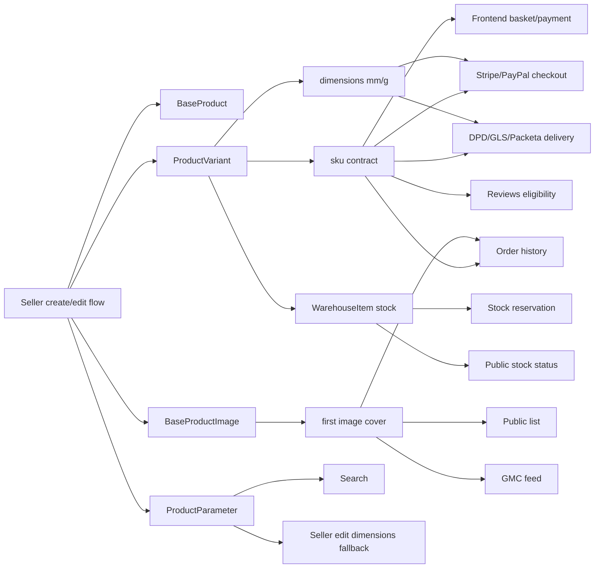

# Iteration 0 — карта зависимостей товарного каталога

**Статус:** выполнено  
**Scope:** аудит без изменений application code  
**Основание:** `iteration-0-system-audit.md`

---

## Ключевой вывод

Текущая модель каталога технически проста, но вокруг нее уже есть жесткие контракты:

- покупаемость товара зависит от `ProductVariant.sku` и строк `WarehouseItem`;
- checkout, delivery, order history, reviews и frontend basket работают на уровне `ProductVariant`, а не только `BaseProduct`;
- габариты для доставки сейчас хранятся на `ProductVariant` в `mm/g`;
- главное фото определяется как первое изображение по текущему порядку relation;
- GMC feed читает старые поля `barcode`, `article`, изображения и статический brand override;
- поиск и seller-flow завязаны на свободные `ProductParameter`.

Поэтому модернизацию нужно делать через совместимые adapters и staged migration, а не прямой заменой текущих моделей.

---

## 1. Product data model

| Область | Текущий контракт | Файлы |
| --- | --- | --- |
| Категория | `Category` — MPTT-дерево, у товара `category=SET_NULL`; товар может жить без категории после удаления категории | `backend/product/models.py` |
| Товар | `BaseProduct` содержит name, description, additional details, category, seller, barcode, article, status, moderation fields, VAT, age restriction, active flag | `backend/product/models.py` |
| Артикул | `article` обязателен в seller create serializer и валидируется как 10 цифр в модели | `backend/product/models.py`, `backend/sellers/serializers.py` |
| Характеристики | `ProductParameter` — свободная пара `name/value`, без category schema, типов, индексов facet search | `backend/product/models.py` |
| Медиа | `BaseProductImage` — только image file; нет `sort_order`, `is_main`, status, media type | `backend/product/models.py` |
| Варианты | `ProductVariant` имеет stable `sku`, price, option name/text/image, delivery dimensions in `mm/g` | `backend/product/models.py` |
| Документы | `LicenseFile` — `OneToOneField` к товару; фактически только один файл лицензии | `backend/product/models.py` |

### Инварианты

- `ProductVariant.sku` нельзя менять без отдельной миграционной стратегии.
- `ProductVariant` должен остаться главным объектом checkout/order/reviews до отдельного redesign вариантов.
- На ранних итерациях typed attributes должны быть product-level; variant-level attributes нужно проектировать отдельно.
- `article` нельзя ослаблять как обязательный контракт в том же шаге, где добавляется `seller_sku`.

---

## 2. Seller create/edit flow

| Поток | Что делает сейчас | Риск |
| --- | --- | --- |
| Создание товара | `BaseProductViewSet.perform_create` создает `BaseProduct` и проставляет seller profile | Остаток не создается, товар может быть approved, но непокупаем |
| Создание параметров | `ProductParameterViewSet.bulk_create` пишет свободные параметры | При переходе на typed attributes нужен dual-write или adapter |
| Загрузка фото | `BaseProductImageViewSet.bulk_upload` принимает пачку фото | Нет порядка и явного cover; порядок зависит от id |
| Создание вариантов | `ProductVariantViewSet.bulk_create` создает варианты с auto-generated SKU | SKU становится ключом checkout и истории заказов |
| Документы | `LicenseFileViewSet.perform_create` запрещает второй файл | Новая модель документов должна сохранить совместимость с текущим license endpoint |

Frontend create flow:

| Файл | Контракт |
| --- | --- |
| `Frontend/Frontend3/src/redux/createProdPrevSlice.js` | post product → variants → stock (обязателен) → attributes → images → license; partial success/retry по шагам |
| `Frontend/Frontend3/src/api/seller/sellerProduct.js` | API helpers для product/images/parameters/variants/license; variants отправляют `text`, опционально `image`, `weight_grams`, `width_mm`, `length_mm`, `height_mm` |
| `Frontend/Frontend3/src/Components/Seller/create/sellerCreateForm/SellerCreateForm.jsx` | UI требует images, category, typed attributes, `variantsName`, обязательный variant `text`, price, package dimensions, stock; `image` опционален |

Frontend edit flow:

| Файл | Контракт |
| --- | --- |
| `Frontend/Frontend3/src/redux/editGoodsSlice.js` | Load/save через `edit_goods`; `status: local\|server` для variants/parameters/images/license; server deletes; package dimensions mapping `package_*_kg/cm` ↔ `weight_grams`/`length_mm`/… |
| `Frontend/Frontend3/src/Components/Seller/edit/EditGoodsForm/EditGoodsForm.jsx` | UI/UX parity с `SellerCreateForm`; preview → `/seller/edit-preview/:id`; validation через `getValidateGoods(t)`, `getVisibleProductParameters`, `validateProductVariants` |
| `Frontend/Frontend3/src/Components/Seller/shared/sellerProductParameters.js` | Shared filter: dimension legacy rows (`length/width/height/weight`) скрыты в UI; visible-only validation |
| `Frontend/Frontend3/src/ui/Seller/create/createCategory/createCategoryMain/CreateCategoryMain.jsx` | Shared category picker; edit передаёт `readOnlyCategory={{ id, name }}` без чтения `edit_goods` |
| `Frontend/Frontend3/src/api/seller/editProduct.js` | API helpers для edit-flow |
| `Frontend/Frontend3/src/hook/useActionSellerEdit.js` | Hook связывает edit-form actions и Redux/API слой |

---

## 3. Stock, warehouse и покупаемость

| Элемент | Текущий контракт | Файлы |
| --- | --- | --- |
| Склад | `Warehouse` сам по себе не имеет FK на seller, но `SellerProfile` уже имеет `default_warehouse` FK и `warehouses` M2M | `backend/warehouses/models.py`, `backend/sellers/models.py` |
| Остаток | `WarehouseItem` связывает `warehouse` и `product_variant`, хранит `quantity_in_stock` и `reserved_quantity` | `backend/warehouses/models.py` |
| Доступность | `available = quantity_in_stock - reserved_quantity`; отсутствие `WarehouseItem` считается нулевым остатком | `backend/product/stock_availability.py`, `backend/warehouses/services/reservation.py` |
| Резервирование | `StockReservationService.create_reservation` группирует payload по SKU и блокирует `WarehouseItem` | `backend/warehouses/services/reservation.py` |
| Public stock | list/detail показывают stock fields, но не раскрывают `reserved_quantity` | `backend/product/serializers.py`, `backend/product/stock_availability.py` |
| Seller warehouse ownership | `SellerProfile.default_warehouse` используется как склад по умолчанию; `SellerProfile.warehouses` хранит доступные склады продавца | `backend/sellers/models.py` |

### Архитектурная проблема

Новый seller-created product не становится покупаемым автоматически, потому что seller-flow не создает `WarehouseItem`, а checkout reservation при отсутствии строки считает `available=0`. При проектировании stock path нельзя проектировать связь склада с seller с нуля: уже есть `SellerProfile.default_warehouse` и `SellerProfile.warehouses`.

Это решение нужно вынести в Iteration 1:

- определить ownership склада через существующие `default_warehouse/warehouses` или явно описать, почему нужен новый слой;
- добавить путь создания/обновления stock для seller;
- связать product creation wizard с созданием начального остатка или явно документировать старт `out_of_stock`;
- определить behavior для `default_warehouse=NULL`;
- покрыть regression tests для отсутствующего `WarehouseItem`, partial reservation и successful checkout.

---

## 4. Checkout/payment

| Зависимость | Stripe | PayPal |
| --- | --- | --- |
| Поиск вариантов | Все товары checkout ищутся по `sku` | Все товары checkout ищутся по `sku` |
| Seller ownership | Проверяется `variant.product.seller.id == seller_id` | Проверяется `variant.product.seller.id == seller_id` |
| CZ-origin | Проверяется `seller.default_warehouse.country == "CZ"`; `default_warehouse=NULL` блокирует checkout как non-CZ case | Проверяется `seller.default_warehouse.country == "CZ"`; `default_warehouse=NULL` блокирует checkout как non-CZ case |
| DPD dimensions | Требуются `weight_grams`, `length_mm`, `width_mm`, `height_mm` | Требуются `weight_grams`, `length_mm`, `width_mm`, `height_mm` |
| Delivery calculation | Передает `{sku, quantity}` в delivery services | Передает `{sku, quantity}` в delivery services |
| Reservation | Создается через `create_checkout_stock_reservation_if_enabled` после checkout validation | Аналогично |

Файлы:

- `backend/payment/services/stripe_session.py`
- `backend/payment/services/paypal_session.py`
- `backend/payment/services/checkout_shared.py`
- `backend/payment/services/webhook_processing.py`

### Инварианты

- В ранних итерациях нельзя переносить checkout dimensions с variant на product без adapter.
- Checkout payload frontend должен продолжать отправлять `sku`.
- `ProductVariant.sku` должен быть immutable с точки зрения публичных flows.

---

## 5. Delivery

| Сервис | Что читает |
| --- | --- |
| DPD rates | `variant.weight_grams`, `length_mm`, `width_mm`, `height_mm`; переводит `mm -> cm`, `g -> kg` |
| DPD split | Читает dimensions variant и упаковывает по SKU |
| GLS split | Читает dimensions variant и упаковывает по SKU |
| Generic shipping split | Читает dimensions variant по SKU |
| Local rates | Читает dimensions variant по SKU |

Файлы:

- `backend/delivery/services/dpd_rates.py`
- `backend/delivery/services/dpd_split.py`
- `backend/delivery/services/gls_split.py`
- `backend/delivery/services/shipping_split.py`
- `backend/delivery/services/local_rates.py`
- `backend/delivery/utils.py`

### Constraint для будущего UI

UI может показывать сантиметры и килограммы, но backend storage для checkout/delivery должен оставаться `mm/g` на `ProductVariant`, пока delivery/payment не переведены через явный adapter и тесты.

---

## 6. Order, reviews, favorites

| Домен | Зависимость |
| --- | --- |
| OrderProduct | `OrderProduct.product = FK(ProductVariant)`; история заказа зависит от variant |
| Order history image | Берет первое фото base product через `images.first()` |
| Reviews | `Review.product_variant = FK(ProductVariant)` |
| Rating signal | `post_save(Review)` пересчитывает `BaseProduct.rating/total_reviews` через `review.product_variant.product` |
| can_review | Проверяет купленные SKU через `OrderProduct.product__sku` |
| Favorites | `Favorite.product = FK(BaseProduct)` |

Файлы:

- `backend/order/models.py`
- `backend/order/serializers.py`
- `backend/reviews/models.py`
- `backend/product/signals.py`
- `backend/product/serializers.py`
- `backend/favorites/models.py`

### Инвариант

Нельзя удалять, пересоздавать или массово менять SKU вариантов, иначе ломаются order history, reviews eligibility, basket/payment payloads и delivery labels.

---

## 7. Public catalog API

| Endpoint/слой | Текущий контракт |
| --- | --- |
| Base queryset | Только `is_active=True`, `status=approved` для public users |
| List | Аннотирует min price, stock, rating; cover image через first image |
| Detail | Отдает parameters, license, images, variants, can_review, stock |
| Search | Ищет по name, description, product_parameters name/value, category name |
| Category products | Фильтрует только прямые товары `category=category`, не descendants |
| Filters | Сейчас только min_price, max_price, rating |

Файлы:

- `backend/product/views.py`
- `backend/product/serializers.py`
- `backend/product/filters.py`

### Риск

Если остановить запись `ProductParameter` до typed attribute search, поиск потеряет часть релевантности. Нужен dual-read/dual-write или staged index migration.

---

## 8. Главное фото и media migration

Текущие потребители главного фото:

| Потребитель | Логика |
| --- | --- |
| Public list serializer | `obj.images.first()` |
| Seller list serializer | `obj.images.first()` |
| Order history serializer | `obj.images.first()` |
| GMC feed | `product.images.order_by("id").first()` |
| Frontend create/edit | Первое загруженное фото фактически становится cover |

Файлы:

- `backend/product/serializers.py`
- `backend/sellers/serializers.py`
- `backend/order/serializers.py`
- `backend/product/management/commands/generate_gmc_feed.py`
- `Frontend/Frontend3/src/redux/createProdPrevSlice.js`

### Acceptance criteria для media migration

- При миграции `ProductMedia.is_main=True` ставится на старое изображение с минимальным `id`.
- `sort_order` старых изображений сохраняет порядок `id`.
- Старый related name `images` или совместимый adapter работает до перевода всех потребителей.
- Cover image одинаковый в list, detail, order history и GMC до/после миграции.

---

## 9. GMC feed

| Поле GMC | Источник сейчас |
| --- | --- |
| `gtin` | `BaseProduct.barcode` |
| `mpn` | `BaseProduct.article` |
| `brand` | static override по `seller_id` из `GMC_STATIC_BRANDS` |
| image | первое изображение по `id` |
| variants/items | feed эмитит один `<item>` на каждый `ProductVariant`, использует `variant.sku` и `item_group_id=product.id` |
| price | `price_with_acquiring` текущего варианта внутри цикла по variants |
| product type | путь категории через parents |
| availability | hardcoded `in stock` |
| eligibility | `status=approved`, `is_active=True`, seller allowlist |

Файлы:

- `backend/product/management/commands/generate_gmc_feed.py`
- `backend/backend/settings.py`

### Совместимость

При добавлении `Brand`, `seller_sku`, `ProductExternalIdentifier` нужен adapter:

- `gtin`: сначала external identifier, fallback `barcode`;
- `mpn`: сначала `seller_sku` или manufacturer part number, fallback `article`;
- `brand`: approved normalized brand, fallback static override;
- image: new media cover, fallback old image relation.
- item count: количество `<item>` на товар должно соответствовать количеству вариантов, `item_group_id` должен сохраняться.

---

## 10. Admin/moderation

| Область | Текущее состояние |
| --- | --- |
| Product status | `pending/approved/rejected` на `BaseProduct` |
| Moderation fields | `approved_by`, `approved_at`, `rejected_reason` есть на `BaseProduct` |
| Admin product | Inlines для images, parameters, variants, license |
| Custom approve/reject actions | В найденном `product/admin.py` не обнаружены |
| Nested resources | У media/documents/attributes пока нет отдельного moderation status |

Файлы:

- `backend/product/admin.py`
- `backend/product/models.py`

### Constraint

Если добавить status для `ProductMedia`, `ProductDocument`, `Brand`, публичные serializers должны отдавать только approved resources. Pending/rejected не должны попадать в public API и GMC.

---

## 11. Category behavior

| Вопрос | Текущее поведение |
| --- | --- |
| Product без категории | Возможен из-за `SET_NULL` |
| Product на non-leaf category | Модель не запрещает |
| Category listing | Товары только прямой категории |
| Attribute inheritance | Не реализован |
| Import template by category | Не реализован |

### Решения для Iteration 1

- определить, можно ли создавать товар в non-leaf category;
- определить наследование attribute definitions от ancestors;
- определить fallback для товаров без категории;
- добавить fixture scenarios: leaf category, parent category, category null, deleted category.

---

## 12. Frontend buyer flow

| Область | Зависимость |
| --- | --- |
| Basket | Операции по `sku`, selected variant |
| Payment | Stripe/PayPal payload отправляет `{sku, quantity}` |
| Stock guard | `canAddToBasket` ищет variant по `payload.sku` и проверяет stock fields |

Файлы:

- `Frontend/Frontend3/src/redux/basketSlice.js`
- `Frontend/Frontend3/src/redux/paymentSlice.js`
- `Frontend/Frontend3/src/utils/stockAvailability.js`

### Инвариант

Публичная карточка и basket должны продолжать получать `variants[].sku`, `is_available`, `stock_status`, price fields.

---

## Итоговая карта критических связей

---

## Следующий документ

Риски и mitigation actions вынесены в `audit-risk-register.md`. Детальные implementation tasks вынесены в `implementation-task-breakdown.md`.
