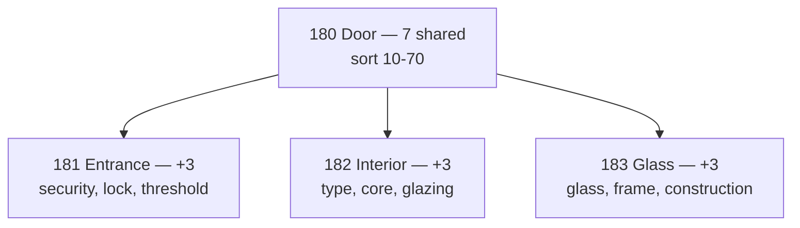

# Шпаргалка: характеристики каталога (категория Doors)

**Назначение:** быстрый справочник для добавления и расширения typed-характеристик через `CategoryAttributeDefinition` / `CategoryAttributeOption` в Django Admin.

**Scope:** категории дверей (id из e2e/prod admin):

| id | name в API | parent |
|----|------------|--------|
| 180 | Door | — |
| 181 | Entrance doors | 180 |
| 182 | Interior doors | 180 |
| 183 | Glass doors | 180 |

**Связанные документы:**

- [iteration-5-category-attributes.md](./iteration-5-category-attributes.md) — модели и API
- [iteration-1-adr-04-category-inheritance.md](./iteration-1-adr-04-category-inheritance.md) — наследование по MPTT
- [iteration-6-public-filters-facets-search.md](./iteration-6-public-filters-facets-search.md) — фильтры на витрине

---

## Модели (кратко)

| Слой | Модель | Назначение |
|------|--------|------------|
| Схема | `CategoryAttributeDefinition` | Описание поля: `code`, `data_type`, флаги |
| Опции enum | `CategoryAttributeOption` | `value` (slug) + `label` (UI) |
| Значение товара | `ProductAttributeValue` | `value_text` / `value_number` / `value_boolean` / `value_option` |
| Бренд | `Brand` → `BaseProduct.brand` | **Не** CategoryAttribute; отдельный фильтр `brand_id` |
| Legacy | `ProductParameter` | Свободный key/value; не для фильтров |

**Наследование:** атрибуты с категории **180** автоматически попадают в **181–183** (сначала родитель, затем подкатегория). Если на листе тот же `code` — определение листа **переопределяет** родительское.

**MVP-лимит:** не более **10 effective-атрибутов** на листовой товар (7 на **180** + 3 на подкатегории). Остальное — в `product_description` / `additional_details` или legacy `ProductParameter`.

**Обязательность:** `is_required=true` только у четырёх атрибутов на **180**. Все остальные — `is_required=false`.

**Применить MVP в БД:**

```bash
docker exec reli_backend_e2e python manage.py seed_doors_category_attributes
```

---

## Бренд vs производитель

| | Бренд (`Brand`) | Производитель (текст) |
|---|---|---|
| Где | `BaseProduct.brand` | Нет отдельной модели |
| Фильтр | `?brand_id=` / `?brand=` | TEXT-атрибут не даёт нормальных facets |
| Рекомендация | Использовать для витрины | Не дублировать в CategoryAttribute |

Артикул производителя — `ProductExternalIdentifier` (тип `mpn`) или fallback `BaseProduct.article`.

---

## Как добавить / расширить характеристику

### 1. Django Admin

**Путь:** Admin → **Product** → **Category attribute definitions** → Add

| Поле Admin | Правило |
|------------|---------|
| **Category** | `180` / `181` / `182` / `183` |
| **Code** | Стабильный slug (`door_width_mm`). После запуска не менять |
| **Name** | Подпись в Admin / API — **английский** (см. колонку `name` в таблицах ниже) |
| **name_ru** | Русская подпись для UI/i18n — в модели пока нет отдельного поля; использовать при локализации |
| **Data type** | `text` / `number` / `boolean` / `enum` |
| **Unit** | Для number: `mm`, `dB`, `W/m²K`, `%` |
| **Group** | Группировка в UI: «Размеры», «Материалы»… |
| **Is required** | Только 4 поля на **180** (см. ниже) |
| **Is filterable** | ✓ для фильтров листинга; ✗ для справочных text |
| **Is public** | ✓ для показа покупателю |
| **Is active** | ✓ |
| **Sort order** | Порядок в форме (меньше = выше) |
| **Validation rules** | JSON, опционально: `{"min": 400, "max": 1200}` |

Для **enum** — inline **Category attribute options**:

| Поле | Пример |
|------|--------|
| **Value** | `steel` (slug, латиница, `_`) |
| **Label** | `Steel` (отображение) |
| **Sort order** | Порядок в выпадающем списке / фильтре |

### 2. Проверка схемы

```http
GET /api/sellers/categories/{category_id}/attribute-schema/
```

Для **181** ожидается: **7** унаследованных с **180** (`is_inherited: true`, sort 10–70) + **3** атрибута **181** (sort 80–100) = **10** полей в форме.

### Порядок в effective schema

1. **180 Door** — общие (sort 10–70)
2. **181 / 182 / 183** — специфика подкатегории (sort 80–100)

`sort_order` на подкатегориях начинается с **80**, чтобы родительские поля всегда шли первыми.

---

### 3. Запись значений продавцом

```http
PUT /api/sellers/products/{product_id}/attributes/
```

```json
[
  {"attribute_definition": 10, "value_number": "900"},
  {"attribute_definition": 11, "value_number": "2100"},
  {"attribute_definition": 12, "value_option": 3},
  {"attribute_definition": 13, "value_option": 1}
]
```

`attribute_definition` — числовой `id` из attribute-schema.

### 4. Фильтры на листинге

```http
GET /api/products/categories/181/?attr[door_material]=steel
GET /api/products/categories/181/?attr[door_width_mm_min]=800&attr[door_width_mm_max]=1000
GET /api/products/categories/181/?brand_id=5
```

Facets строятся только для `is_filterable=true` и `is_public=true`.

---

## MVP: категория 180 Door (7 полей, наследуются)

> **4 required** + **3 optional**. Все подкатегории получают эти поля первыми (sort 10–70).

| sort | code | name | name_ru | type | unit | required | filterable | group |
|------|------|------|---------|------|------|:--------:|:----------:|-------|
| 10 | `door_width_mm` | Width | Ширина | number | mm | ✓ | ✓ | Dimensions |
| 20 | `door_height_mm` | Height | Высота | number | mm | ✓ | ✓ | Dimensions |
| 30 | `door_material` | Material | Материал | enum | — | ✓ | ✓ | Materials |
| 40 | `opening_type` | Opening type | Тип открывания | enum | — | ✓ | ✓ | Construction |
| 50 | `opening_direction` | Opening direction | Направление открывания | enum | — | — | ✓ | Construction |
| 60 | `color` | Color | Цвет | enum | — | — | ✓ | Materials |
| 70 | `leaf_thickness_mm` | Leaf thickness | Толщина полотна | number | mm | — | ✓ | Dimensions |

**Единицы number-атрибутов с `unit: "mm"`:**

| Слой | Поведение |
|------|-----------|
| API / БД | `value_number` хранится в **мм** (`door_width_mm`, `door_height_mm`, …); сериализация Decimal может быть `800.0000` |
| UI продавца | Ввод в **мм** напрямую ([Task 030](../../030-category-attributes-mm-input/task.md)): label `, mm`, placeholder `e.g. 800`; create `/seller/seller-create` и edit `/seller/seller-edit/:id`; passthrough в `sellerProductWizard.js` (без `cmToMm` / `mmToCm`); при load из API — `formatNumberInputValue` (`800.0000` → `800`) |
| Preview seller | Значение формы = мм → `"800 mm"` |
| Публичный каталог | `${value} ${unit}` — каноническое значение в **мм** |

### `door_material` — опции enum

| value | label |
|-------|-------|
| `steel` | Steel |
| `wood` | Wood |
| `aluminum` | Aluminum |
| `pvc` | PVC |
| `mdf` | MDF |
| `composite` | Composite |
| `glass` | Glass |

### `opening_type` — опции enum

| value | label |
|-------|-------|
| `single` | Single leaf |
| `double` | Double leaf |
| `one_and_half` | One and a half leaf |

### `opening_direction`

| value | label |
|-------|-------|
| `left` | Left (LH) |
| `right` | Right (RH) |
| `reversible` | Reversible |

### `color`

| value | label |
|-------|-------|
| `white` | White |
| `oak` | Oak |
| `walnut` | Walnut |
| `anthracite` | Anthracite |
| `black` | Black |
| `grey` | Grey |
| `beech` | Beech |
| `wenge` | Wenge |
| `custom` | Custom / RAL |

---

## MVP: 181 Entrance doors (+3 поля, итого 10)

| sort | code | name | name_ru | type | required | filterable | group |
|------|------|------|---------|------|:--------:|:----------:|-------|
| 80 | `security_class` | Security class | Класс взломостойкости | enum | — | ✓ | Security |
| 90 | `lock_type` | Lock type | Тип замка | enum | — | ✓ | Security |
| 100 | `threshold_type` | Threshold type | Тип порога | enum | — | ✓ | Construction |

### `security_class`

| value | label |
|-------|-------|
| `rc1` | RC 1 |
| `rc2` | RC 2 |
| `rc3` | RC 3 |
| `rc4` | RC 4 |

### `lock_type`

| value | label |
|-------|-------|
| `cylinder` | Cylinder lock |
| `multipoint` | Multipoint lock |
| `electronic` | Electronic / smart lock |
| `none` | Not included |

### `threshold_type`

| value | label |
|-------|-------|
| `standard` | Standard |
| `low` | Low threshold |
| `barrier_free` | Barrier-free |

---

## MVP: 182 Interior doors (+3 поля, итого 10)

| sort | code | name | name_ru | type | required | filterable | group |
|------|------|------|---------|------|:--------:|:----------:|-------|
| 80 | `interior_door_type` | Interior door type | Тип межкомнатной двери | enum | — | ✓ | Construction |
| 90 | `core_type` | Core type | Тип наполнения | enum | — | ✓ | Construction |
| 100 | `glazing_type` | Glazing type | Остекление | enum | — | ✓ | Construction |

### `interior_door_type`

| value | label |
|-------|-------|
| `hinged` | Hinged |
| `sliding` | Sliding |
| `pocket` | Pocket |
| `folding` | Folding |
| `barn` | Barn / loft |

### `core_type`

| value | label |
|-------|-------|
| `hollow` | Hollow core |
| `honeycomb` | Honeycomb |
| `solid` | Solid core |
| `particle_board` | Particle board |

### `glazing_type`

| value | label |
|-------|-------|
| `none` | None |
| `clear` | Clear glass |
| `frosted` | Frosted |
| `decorative` | Decorative |

---

## MVP: 183 Glass doors (+3 поля, итого 10)

| sort | code | name | name_ru | type | required | filterable | group |
|------|------|------|---------|------|:--------:|:----------:|-------|
| 80 | `glass_type` | Glass type | Тип стекла | enum | — | ✓ | Glass |
| 90 | `frame_material` | Frame material | Материал рамы | enum | — | ✓ | Frame |
| 100 | `glass_door_type` | Glass door type | Тип конструкции | enum | — | ✓ | Construction |

### `glass_type`

| value | label |
|-------|-------|
| `tempered` | Tempered |
| `laminated` | Laminated |
| `double_glazed` | Double glazed |
| `frosted` | Frosted |
| `tinted` | Tinted |

### `frame_material`

| value | label |
|-------|-------|
| `aluminum` | Aluminum |
| `steel` | Steel |
| `wood` | Wood |
| `frameless` | Frameless |

### `glass_door_type`

| value | label |
|-------|-------|
| `swing` | Swing |
| `sliding` | Sliding |
| `pivot` | Pivot |
| `partition` | Partition / office |

---

## Отложено (пока в описание, не в CategoryAttribute)

Следующие поля **деактивируются** seed-командой (`is_active=false`). Продавец указывает их в **Description** / **Additional details**:

`frame_depth_mm`, `surface_finish`, `fire_rating`, `sound_insulation_rw_db`, `thermal_transmittance_ud`, комплектация (`lock_included`, `hinges_included`, …), `door_style`, `outer_finish`, `glazing_share_percent`, `moisture_resistant`, `opacity`, `glass_thickness_mm`, `max_opening_width_mm`, `handle_type`, text-поля (`model_series`, `ral_color_code`, `installation_notes`).

---

## Чеклист: добавление новой характеристики

1. Убедиться, что effective schema листа **≤ 10** атрибутов.
2. Общие поля — на **180** (sort 10–70); специфика — на **181–183** (sort 80+).
3. Задать стабильный **code**, обновить `seed_doors_category_attributes.py`.
4. Запустить seed → проверить `GET .../attribute-schema/`.
5. Остальное — в `product_description` / `additional_details`.

---

## Что не выносить в CategoryAttribute

| Данные | Где хранить |
|--------|-------------|
| Бренд | `Brand` + `BaseProduct.brand` |
| Гарантия | `BaseProduct.warranty_months` |
| Страна происхождения | `BaseProduct.country_of_origin` |
| Цена | `ProductVariant.price` |
| Наличие | `WarehouseItem` + `stock_status` |
| Габариты упаковки (доставка) | `ProductVariant.width_mm` / `height_mm` / `length_mm` / `weight_grams` |
| Цвет/размер как отдельный SKU | `ProductVariant` (`name` + обязательный `text`; `image` опционален) |

---

## Порядок внедрения (ops)

1. `python manage.py seed_doors_category_attributes` — MVP-схема + деактивация лишних.
2. Проверить attribute-schema для **181**, **182**, **183** (ожидается **10** attrs).
3. Перевыбрать категорию в форме продавца (reload schema).
4. Завести бренды в **Brand** при необходимости.

---

## Диаграмма наследования (MVP)


