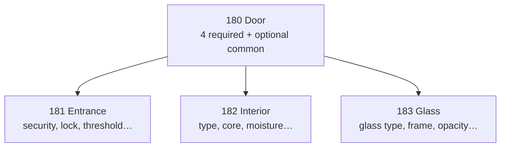

# Шпаргалка: характеристики каталога (категория Doors)

**Назначение:** быстрый справочник для добавления и расширения typed-характеристик через `CategoryAttributeDefinition` / `CategoryAttributeOption` в Django Admin.

**Scope:** категории дверей (id из e2e/prod admin):

| id | name в API | parent |
|----|------------|--------|
| 180 | Door | — |
| 181 | Entrance doors | 180 |
| 182 | Interior doors | 180 |
| 183 | Glass doors | 180 |

**Связанные документы:**

- [iteration-5-category-attributes.md](./iteration-5-category-attributes.md) — модели и API
- [iteration-1-adr-04-category-inheritance.md](./iteration-1-adr-04-category-inheritance.md) — наследование по MPTT
- [iteration-6-public-filters-facets-search.md](./iteration-6-public-filters-facets-search.md) — фильтры на витрине

---

## Модели (кратко)

| Слой | Модель | Назначение |
|------|--------|------------|
| Схема | `CategoryAttributeDefinition` | Описание поля: `code`, `data_type`, флаги |
| Опции enum | `CategoryAttributeOption` | `value` (slug) + `label` (UI) |
| Значение товара | `ProductAttributeValue` | `value_text` / `value_number` / `value_boolean` / `value_option` |
| Бренд | `Brand` → `BaseProduct.brand` | **Не** CategoryAttribute; отдельный фильтр `brand_id` |
| Legacy | `ProductParameter` | Свободный key/value; не для фильтров |

**Наследование:** атрибуты с категории **180** автоматически попадают в **181–183**. Если на листе тот же `code` — определение листа **переопределяет** родительское.

**Обязательность:** `is_required=true` только у четырёх атрибутов на **180**. Все остальные — `is_required=false`. Валидация required срабатывает при `PUT /api/sellers/products/{id}/attributes/`, старые товары без значений не ломаются.

---

## Бренд vs производитель

| | Бренд (`Brand`) | Производитель (текст) |
|---|---|---|
| Где | `BaseProduct.brand` | Нет отдельной модели |
| Фильтр | `?brand_id=` / `?brand=` | TEXT-атрибут не даёт нормальных facets |
| Рекомендация | Использовать для витрины | Не дублировать в CategoryAttribute |

Артикул производителя — `ProductExternalIdentifier` (тип `mpn`) или fallback `BaseProduct.article`.

---

## Как добавить / расширить характеристику

### 1. Django Admin

**Путь:** Admin → **Product** → **Category attribute definitions** → Add

| Поле Admin | Правило |
|------------|---------|
| **Category** | `180` / `181` / `182` / `183` |
| **Code** | Стабильный slug (`door_width_mm`). После запуска не менять |
| **Name** | Подпись в Admin / API — **английский** (см. колонку `name` в таблицах ниже) |
| **name_ru** | Русская подпись для UI/i18n — в модели пока нет отдельного поля; использовать при локализации |
| **Data type** | `text` / `number` / `boolean` / `enum` |
| **Unit** | Для number: `mm`, `dB`, `W/m²K`, `%` |
| **Group** | Группировка в UI: «Размеры», «Материалы»… |
| **Is required** | Только 4 поля на **180** (см. ниже) |
| **Is filterable** | ✓ для фильтров листинга; ✗ для справочных text |
| **Is public** | ✓ для показа покупателю |
| **Is active** | ✓ |
| **Sort order** | Порядок в форме (меньше = выше) |
| **Validation rules** | JSON, опционально: `{"min": 400, "max": 1200}` |

Для **enum** — inline **Category attribute options**:

| Поле | Пример |
|------|--------|
| **Value** | `steel` (slug, латиница, `_`) |
| **Label** | `Steel` (отображение) |
| **Sort order** | Порядок в выпадающем списке / фильтре |

### 2. Проверка схемы

```http
GET /api/sellers/categories/{category_id}/attribute-schema/
```

Для **181** ожидается: 4 унаследованных с **180** (`is_inherited: true`) + атрибуты самой **181**.

### 3. Запись значений продавцом

```http
PUT /api/sellers/products/{product_id}/attributes/
```

```json
[
  {"attribute_definition": 10, "value_number": "900"},
  {"attribute_definition": 11, "value_number": "2100"},
  {"attribute_definition": 12, "value_option": 3},
  {"attribute_definition": 13, "value_option": 1}
]
```

`attribute_definition` — числовой `id` из attribute-schema.

### 4. Фильтры на листинге

```http
GET /api/products/categories/181/?attr[door_material]=steel
GET /api/products/categories/181/?attr[door_width_mm_min]=800&attr[door_width_mm_max]=1000
GET /api/products/categories/181/?brand_id=5
```

Facets строятся только для `is_filterable=true` и `is_public=true`.

---

## Категория 180 Door — обязательный минимум

> **Единственный блок с `is_required=true`.** Наследуется в 181–183.

| sort | code | name | name_ru | type | unit | required | filterable | group |
|------|------|------|---------|------|------|:--------:|:----------:|-------|
| 10 | `door_width_mm` | Width | Ширина | number | mm | ✓ | ✓ | Размеры |
| 20 | `door_height_mm` | Height | Высота | number | mm | ✓ | ✓ | Размеры |
| 30 | `door_material` | Material | Материал | enum | — | ✓ | ✓ | Материалы |
| 40 | `opening_type` | Opening type | Тип открывания | enum | — | ✓ | ✓ | Конструкция |

### `door_material` — опции enum

| value | label |
|-------|-------|
| `steel` | Steel |
| `wood` | Wood |
| `aluminum` | Aluminum |
| `pvc` | PVC |
| `mdf` | MDF |
| `composite` | Composite |
| `glass` | Glass |

### `opening_type` — опции enum

| value | label |
|-------|-------|
| `single` | Single leaf |
| `double` | Double leaf |
| `one_and_half` | One and a half leaf |

---

## Категория 180 Door — расширение (все optional)

| sort | code | name | name_ru | type | unit | filterable | group |
|------|------|------|---------|------|------|:----------:|-------|
| 50 | `leaf_thickness_mm` | Leaf thickness | Толщина полотна | number | mm | ✓ | Размеры |
| 60 | `frame_depth_mm` | Frame depth | Глубина коробки | number | mm | ✓ | Размеры |
| 70 | `opening_direction` | Opening direction | Направление открывания | enum | — | ✓ | Конструкция |
| 80 | `surface_finish` | Surface finish | Отделка поверхности | enum | — | ✓ | Материалы |
| 90 | `color` | Color | Цвет | enum | — | ✓ | Материалы |
| 100 | `fire_rating` | Fire rating | Противопожарный класс | enum | — | ✓ | Эксплуатация |
| 110 | `sound_insulation_rw_db` | Sound insulation Rw | Звукоизоляция Rw | number | dB | ✓ | Эксплуатация |
| 120 | `thermal_transmittance_ud` | Thermal transmittance Ud | Теплопередача Ud | number | W/m²K | ✓ | Эксплуатация |
| 130 | `lock_included` | Lock included | Замок в комплекте | boolean | — | ✓ | Комплектация |
| 140 | `hinges_included` | Hinges included | Петли в комплекте | boolean | — | ✓ | Комплектация |
| 150 | `handle_included` | Handle included | Ручка в комплекте | boolean | — | ✓ | Комплектация |
| 160 | `frame_included` | Frame included | Коробка в комплекте | boolean | — | ✓ | Комплектация |
| 170 | `threshold_included` | Threshold included | Порог в комплекте | boolean | — | ✓ | Комплектация |
| 180 | `has_insulation` | Insulation | Утепление | boolean | — | ✓ | Эксплуатация |
| 190 | `has_weatherstripping` | Weatherstripping | Уплотнитель | boolean | — | ✓ | Эксплуатация |
| 200 | `model_series` | Model series | Серия / модель | text | — | ✗ | Дополнительно |
| 210 | `ral_color_code` | RAL color code | Код RAL | text | — | ✗ | Дополнительно |
| 220 | `installation_notes` | Installation notes | Особенности монтажа | text | — | ✗ | Дополнительно |

### `opening_direction`

| value | label |
|-------|-------|
| `left` | Left (LH) |
| `right` | Right (RH) |
| `reversible` | Reversible |

### `surface_finish`

| value | label |
|-------|-------|
| `painted` | Painted |
| `laminate` | Laminate |
| `veneer` | Veneer |
| `powder_coated` | Powder coated |
| `foil` | Foil |
| `raw` | Raw / unfinished |

### `color`

| value | label |
|-------|-------|
| `white` | White |
| `oak` | Oak |
| `walnut` | Walnut |
| `anthracite` | Anthracite |
| `black` | Black |
| `grey` | Grey |
| `beech` | Beech |
| `wenge` | Wenge |
| `custom` | Custom / RAL |

### `fire_rating`

| value | label |
|-------|-------|
| `none` | None |
| `ei30` | EI 30 |
| `ei60` | EI 60 |
| `ei90` | EI 90 |

---

## Категория 181 Entrance doors (все optional)

Наследует всё с **180**. Ниже — дополнительные атрибуты только для **181**.

| sort | code | name | name_ru | type | unit | filterable | group |
|------|------|------|---------|------|------|:----------:|-------|
| 50 | `security_class` | Security class | Класс взломостойкости | enum | — | ✓ | Безопасность |
| 60 | `lock_type` | Lock type | Тип замка | enum | — | ✓ | Безопасность |
| 70 | `multipoint_lock` | Multipoint lock | Многоточечный замок | boolean | — | ✓ | Безопасность |
| 80 | `anti_burglary_glazing` | Anti-burglary glazing | Противовзломное остекление | boolean | — | ✓ | Безопасность |
| 90 | `peephole_included` | Peephole included | Глазок в комплекте | boolean | — | ✓ | Комплектация |
| 100 | `door_style` | Entrance door style | Стиль входной двери | enum | — | ✓ | Конструкция |
| 110 | `threshold_type` | Threshold type | Тип порога | enum | — | ✓ | Конструкция |
| 120 | `outer_finish` | Outer finish | Наружная отделка | enum | — | ✓ | Материалы |
| 130 | `glazing_share_percent` | Glazing share | Доля остекления | number | % | ✓ | Конструкция |

### `security_class`

| value | label |
|-------|-------|
| `rc1` | RC 1 |
| `rc2` | RC 2 |
| `rc3` | RC 3 |
| `rc4` | RC 4 |

### `lock_type`

| value | label |
|-------|-------|
| `cylinder` | Cylinder lock |
| `multipoint` | Multipoint lock |
| `electronic` | Electronic / smart lock |
| `none` | Not included |

### `door_style`

| value | label |
|-------|-------|
| `panel` | Panel |
| `full_glazed` | Full glazed |
| `with_sidelight` | With sidelight |
| `double_glazed` | Double glazed panel |

### `threshold_type`

| value | label |
|-------|-------|
| `standard` | Standard |
| `low` | Low threshold |
| `barrier_free` | Barrier-free |

### `outer_finish`

| value | label |
|-------|-------|
| `weather_resistant` | Weather resistant |
| `standard` | Standard |

---

## Категория 182 Interior doors (все optional)

| sort | code | name | name_ru | type | unit | filterable | group |
|------|------|------|---------|------|------|:----------:|-------|
| 50 | `interior_door_type` | Interior door type | Тип межкомнатной двери | enum | — | ✓ | Конструкция |
| 60 | `core_type` | Core type | Тип наполнения | enum | — | ✓ | Конструкция |
| 70 | `door_style` | Door style | Стиль | enum | — | ✓ | Конструкция |
| 80 | `glazing_type` | Glazing type | Остекление | enum | — | ✓ | Конструкция |
| 90 | `moisture_resistant` | Moisture resistant | Влагостойкая | boolean | — | ✓ | Эксплуатация |

> **Примечание:** `door_style` на **182** переопределяет одноимённый атрибут с **181**, если он был бы унаследован. На **182** используйте свой набор опций ниже.

### `interior_door_type`

| value | label |
|-------|-------|
| `hinged` | Hinged |
| `sliding` | Sliding |
| `pocket` | Pocket |
| `folding` | Folding |
| `barn` | Barn / loft |

### `core_type`

| value | label |
|-------|-------|
| `hollow` | Hollow core |
| `honeycomb` | Honeycomb |
| `solid` | Solid core |
| `particle_board` | Particle board |

### `door_style` (interior)

| value | label |
|-------|-------|
| `flush` | Flush |
| `panel` | Panel |
| `glazed_insert` | Glazed insert |
| `louvered` | Louvered |

### `glazing_type`

| value | label |
|-------|-------|
| `none` | None |
| `clear` | Clear glass |
| `frosted` | Frosted |
| `decorative` | Decorative |

---

## Категория 183 Glass doors (все optional)

| sort | code | name | name_ru | type | unit | filterable | group |
|------|------|------|---------|------|------|:----------:|-------|
| 50 | `glass_type` | Glass type | Тип стекла | enum | — | ✓ | Стекло |
| 60 | `frame_material` | Frame material | Материал рамы | enum | — | ✓ | Рама |
| 70 | `opacity` | Opacity | Прозрачность | enum | — | ✓ | Стекло |
| 80 | `glass_thickness_mm` | Glass thickness | Толщина стекла | number | mm | ✓ | Стекло |
| 90 | `max_opening_width_mm` | Max opening width | Макс. ширина проёма | number | mm | ✓ | Размеры |
| 100 | `glass_door_type` | Glass door type | Тип конструкции | enum | — | ✓ | Конструкция |
| 110 | `handle_type` | Handle type | Тип ручки | enum | — | ✓ | Комплектация |

### `glass_type`

| value | label |
|-------|-------|
| `tempered` | Tempered |
| `laminated` | Laminated |
| `double_glazed` | Double glazed |
| `frosted` | Frosted |
| `tinted` | Tinted |

### `frame_material`

| value | label |
|-------|-------|
| `aluminum` | Aluminum |
| `steel` | Steel |
| `wood` | Wood |
| `frameless` | Frameless |

### `opacity`

| value | label |
|-------|-------|
| `transparent` | Transparent |
| `frosted` | Frosted |
| `smoked` | Smoked |
| `mirrored` | Mirrored |

### `glass_door_type`

| value | label |
|-------|-------|
| `swing` | Swing |
| `sliding` | Sliding |
| `pivot` | Pivot |
| `partition` | Partition / office |

### `handle_type`

| value | label |
|-------|-------|
| `pull` | Pull handle |
| `lever` | Lever handle |
| `knob` | Knob |
| `profile` | Profile / integrated |

---

## Чеклист: добавление новой характеристики

1. Выбрать **category** (180 для общих, 181–183 для специфики).
2. Задать уникальный в рамках категории **code** (slug).
3. Выбрать **data_type**:
   - дискретный выбор → `enum` + опции;
   - размеры / физ. величины → `number` + `unit`;
   - да/нет → `boolean`;
   - свободный текст → `text`, `is_filterable=false`.
4. Выставить флаги: `is_required` только для 4 полей на **180**; `is_filterable` по необходимости.
5. Сохранить → проверить `GET .../attribute-schema/`.
6. Заполнить на тестовом товаре → проверить facets и `attr[code]` на листинге.

---

## Что не выносить в CategoryAttribute

| Данные | Где хранить |
|--------|-------------|
| Бренд | `Brand` + `BaseProduct.brand` |
| Гарантия | `BaseProduct.warranty_months` |
| Страна происхождения | `BaseProduct.country_of_origin` |
| Цена | `ProductVariant.price` |
| Наличие | `WarehouseItem` + `stock_status` |
| Габариты упаковки (доставка) | `ProductVariant.width_mm` / `height_mm` / `length_mm` / `weight_grams` |
| Цвет/размер как отдельный SKU | `ProductVariant` (`name` + `text` / `image`) |

---

## Порядок внедрения (ops)

1. Создать 4 **обязательных** определения на **180** + enum-опции.
2. При необходимости — расширение на **180** и специфику на **181–183**.
3. Проверить attribute-schema для каждой подкатегории.
4. Завести бренды в **Brand** (`status=approved`).
5. Заполнить атрибуты на 2–3 тестовых товарах → проверить facets и фильтры.

---

## Диаграмма наследования


