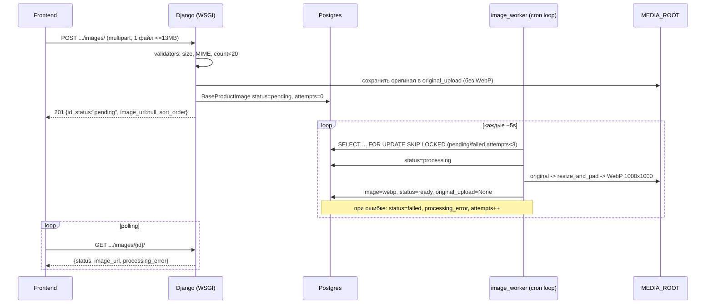

# Iteration 7.10 — Стабилизация загрузки изображений товара + async-обработка

**Статус:** запланировано
**Scope:** seller image upload (transport + лимиты), async WebP-обработка (статусная модель, cron-воркер), фильтрация публичной выдачи по статусу, frontend upload-очередь и polling
**Решение архитектуры:** `iteration-1-adr-09-seller-image-async-processing.md`
**Зависимости:** Iteration 7 (seller wizard), `product.compat.get_product_cover_image`, существующая WebP-логика `BaseProductImage`
**Совместимо с:** `iteration-7-7` (main/order, `ProductMedia`) — фичи gallery вынесены в Фазу 2

> Этот документ — исполняемый runbook. Раздел **«Runbook для Composer 2.5 Fast»** содержит пошаговый детерминированный план. Остальные разделы — спецификация, на которую шаги ссылаются.

---

## 1. Цель

1. Сделать загрузку изображений **предсказуемой и устойчивой** при 20 файлах до 13MB каждый.
2. Перенести WebP-конвертацию из HTTP-запроса в **асинхронный обработчик** (cron + management-команда), не меняя алгоритм.
3. Ввести **статусную модель** изображения и async-shaped контракт (`pending → processing → ready | failed`).
4. Не сломать публичный API `images[]`, legacy `bulk_upload`, главное фото и order/payment/delivery.
5. Заложить контракт и UX так, чтобы Фаза 2 (DnD, paste, lightbox, выбор main, reorder) и Фаза 3 (очередь, CDN) подключались без переделок.

## 2. Лимиты и контракты (зафиксировано)

| Параметр | Значение | Источник истины |
|---|---|---|
| Макс. изображений на товар | **20** | `settings.MAX_PRODUCT_IMAGES` (новая константа) |
| Макс. размер одного файла | **13 MB** | `settings.MAX_UPLOAD_SIZE` (reuse) |
| Форматы | JPEG / PNG / WebP | MIME magic-check (как сейчас) |
| Выходной формат | WebP 1000×1000, белый фон | `resize_and_pad` — без изменений |
| Транспорт нового upload | `multipart/form-data`, 1 файл = 1 запрос | endpoint `POST .../images/` |
| Конкурентность upload (FE) | 2–3 | upload-очередь |

---

## 3. Текущие точки в коде

| Слой | Файл | Сейчас |
|---|---|---|
| Модель | `backend/product/models.py` → `BaseProductImage` | `product`, `image`; `save()` синхронно конвертит в WebP |
| Cover helper | `backend/product/compat.py` → `get_product_cover_image` | `images.order_by("id").first()` (без учёта статуса) |
| Seller upload | `backend/sellers/views.py` → `BaseProductImageViewSet.bulk_upload` | цикл base64 → `BaseProductImage.save()` |
| Seller serializer | `backend/sellers/serializers.py` → `BaseProductImageSerializer`, `BulkBaseProductImageSerializer` | `id`, `image`, `image_url` |
| Public serializer | `backend/product/serializers.py` → `BaseProductDetailSerializer.images` | все `images[]` |
| Base64 image field | `backend/sellers/fields.py` → `RestrictedBase64ImageField` | MIME-проверка JPEG/PNG/WebP |
| Settings | `backend/backend/settings.py` | `MAX_UPLOAD_SIZE=13MB`; нет `DATA_UPLOAD_MAX_MEMORY_SIZE` |
| nginx | `Frontend/nginx/default.conf` | `client_max_body_size 15M` |
| FE create state | `Frontend/Frontend3/src/redux/createProdPrevSlice.js` | `images` хранят base64 |
| FE edit state | `Frontend/Frontend3/src/redux/editGoodsSlice.js` | `images` (`local`/`server`) |
| FE create UI | `.../Seller/create/sellerCreateImages/SellerCreateImage.jsx` | Swiper, `arr=6`, base64 |
| FE edit UI | `.../Seller/edit/sellerEditImage/SellerEditImages.jsx` | Swiper, `arr=6`, base64 |
| FE api create | `Frontend/Frontend3/src/api/seller/sellerProduct.js` → `postSellerImages` | base64 `bulk_upload` |
| FE api edit | `Frontend/Frontend3/src/api/seller/editProduct.js` → `patchSellerImages` | base64 `bulk_upload` |
| FE lightbox | `.../Product/ProdImageModal/ProdImageModal.jsx` | fullscreen preview (reuse для Фазы 2) |

---

## 4. Целевая архитектура



## 5. Модель данных (миграция, аддитивно)

`backend/product/models.py` → `BaseProductImage`:

| Поле | Тип | Дефолт | Назначение |
|---|---|---|---|
| `status` | `CharField(choices)` | `ready` | `pending/processing/ready/failed`; дефолт `ready` сохраняет валидность legacy/старых строк |
| `original_upload` | `FileField(null, blank)` | `None` | временный оригинал до конвертации |
| `processing_error` | `TextField(blank)` | `""` | текст последней ошибки обработки |
| `attempts` | `PositiveSmallIntegerField` | `0` | счётчик попыток обработки |

Доп. правила:
- ввести `class ImageStatus(models.TextChoices)`: `PENDING`, `PROCESSING`, `READY`, `FAILED`.
- `save()`: конвертацию в WebP выполнять **только** когда нужно (legacy/admin путь). Ввести инстанс-флаг `_skip_webp_processing` (default `False`); worker, сохраняя уже готовый WebP, выставляет его в `True`, чтобы не было повторной конвертации.
- `resize_and_pad` и `process_image` — **не менять**.
- Индекс по `status` (частичный/обычный) для выборки воркером.

Миграция — аддитивная, обратимая (ADR-08). Существующие строки получают `status=ready`. `makemigrations --check` обязан проходить.

## 6. Бэкенд по слоям (`050-architecture.mdc`)

**`backend/product/validators.py`** (или существующий модуль валидаторов product):
- `validate_product_image_file(file)`: размер ≤ `MAX_UPLOAD_SIZE`, MIME magic ∈ {jpeg,png,webp}. Сообщения — переиспользовать стиль license-валидаторов.
- `validate_product_image_count(product)`: текущее число изображений < `MAX_PRODUCT_IMAGES`.

**`backend/product/services/product_images.py`** (новый сервис-модуль):
- `ProductImageUploadService.upload_single(product, file) -> BaseProductImage`:
  валидирует count, сохраняет `file` в `original_upload` (без WebP), создаёт запись `status=pending`, `sort_order = next`. Транзакция на запись.
- `ImageProcessingService.process(image) -> None`:
  открывает `original_upload`, прогоняет `process_image`, присваивает `image`, ставит `_skip_webp_processing=True`, `status=ready`, очищает `original_upload`, `processing_error=""`. При исключении — `status=failed`, `processing_error=str(e)`, `attempts += 1`. Идемпотентна по статусу.

**`backend/product/selectors.py`**:
- `claimable_images_for_processing(batch)`: `pending` ∪ (`failed` и `attempts < 3`), `select_for_update(skip_locked=True)`, лимит `batch`.
- `public_ready_images(product)`: queryset `images.filter(status=READY)` для prefetch в публичной выдаче.

**`backend/product/management/commands/process_pending_product_images.py`**:
- аргумент `--batch` (default 5);
- в транзакции claim → `status=processing`; затем обработка вне «длинного» лока по возможности; финализация статуса;
- логирование по каждой записи (id, результат, время);
- безопасно при параллельных запусках (skip_locked); возвращает ненулевой код только при фатальной ошибке окружения, не при `failed` отдельных картинок.

**`backend/sellers/views.py`** (тонкие views):
- новый action/endpoint `POST .../images/` (multipart) → `ProductImageUploadService.upload_single`, ответ `201` сериализованной записью;
- `retrieve` (`GET .../images/{id}/`) — отдаёт `status`, `image_url`, `processing_error`;
- `POST .../images/{id}/reprocess/` — для `failed`: сбрасывает в `pending` (если `attempts < 3`), 409/400 иначе;
- права — только владелец (как в текущем `BaseProductImageViewSet`).

**`backend/sellers/serializers.py`**:
- расширить `BaseProductImageSerializer` (sellers) полями `status`, `processing_error` (read-only), `sort_order`;
- ввести `ProductImageUploadSerializer` с `image = serializers.ImageField()` (multipart) + валидаторы.

**`backend/product/serializers.py` + `compat.py`**:
- публичная `BaseProductDetailSerializer.images` — отдавать только `status=READY` (через prefetch `public_ready_images` или `SerializerMethodField`); форма ответа не меняется;
- `get_product_cover_image` — учитывать только `READY`, сохранив детерминированный порядок.

## 7. Инфраструктура

**`backend/backend/settings.py`**:
- `MAX_PRODUCT_IMAGES = 20`
- `DATA_UPLOAD_MAX_MEMORY_SIZE = 14 * 1024 * 1024`
- `FILE_UPLOAD_MAX_MEMORY_SIZE` — выставить так, чтобы крупные файлы стримились на диск (например 2.5–5MB порог), комментарий «почему».

**`Frontend/nginx/default.conf`**: `client_max_body_size 15M;` → `16M;` (оба server-блока, где есть upload-route).

**`docker-compose.yml`** — новый сервис:
```yaml
  image_worker:
    container_name: image_worker
    build:
      context: backend/
    command: >
      bash -c "while true; do python manage.py process_pending_product_images --batch 5 || true; sleep 5; done"
    volumes:
      - ./backend/:/app
      - /opt/reli/reli.one/backend/media:/app/media
    depends_on:
      - postgres_db
    env_file:
      - envs/database.env
      - envs/backend.env
    restart: always
```
> Важно: тот же media-volume, что у `backend`, иначе воркер не увидит `original_upload`.

## 8. Frontend (Фаза 1)

**API** (`api/seller/`):
- `uploadProductImage(productId, file)` — `FormData`, `Content-Type: multipart/form-data`; возвращает `{id, status, image_url, sort_order}`.
- `getProductImage(productId, imageId)` — для polling.
- `reprocessProductImage(productId, imageId)` — retry.
- Legacy `postSellerImages`/`patchSellerImages` оставить до полного перехода UI (не удалять в этом PR).

**Upload-очередь** (`utils/`):
- конкурентность 2–3, методы enqueue/cancel, ретраи (до 3) с backoff.
- покрыть unit-тестами.

**Redux** (`createProdPrevSlice.js`, `editGoodsSlice.js`):
- элемент `images`: `{ id, status, image_url, previewUrl, sort_order, error }` — **без base64**;
- редьюсеры: addUploading, setStatus, setReady(image_url), setFailed(error), remove.
- `previewUrl` через `URL.createObjectURL`, revoke при удалении/ready.

**Компоненты** (`SellerCreateImage.jsx`, `SellerEditImages.jsx`):
- 20 слотов вместо `arr=6`;
- per-slot статус: `uploading %` → `processing` (spinner) → `ready` (картинка) / `failed` (иконка + retry);
- блокировать добавление при достижении 20, показывать сообщение (i18n ключи в `sellerHome*`);
- валидация размера/MIME до отправки (UX), backend — финальный gate;
- polling незавершённых (`pending/processing`) c интервалом и остановкой после N попыток;
- edit — upload-on-add (product id есть); create — per-file multipart на submit (upload-on-add вынесен в Фазу 2: требует draft-product).

**Детальная страница** (`ProductImages.jsx`, `MobileProdSlice.jsx`, `PreviewImage.jsx`):
- `loading="lazy"` + `decoding="async"` на `` миниатюр/галереи;
- бэкенд уже отдаёт только `ready` → доп. фильтрация на фронте не требуется.

## 9. Тестовая стратегия (`030-testing.mdc`)

**Backend (pytest-django):**
- `validators`: размер (граница 13MB ±1), MIME (плохой тип отклоняется), count (20-й отклоняется).
- `ProductImageUploadService.upload_single`: создаёт `pending`, оригинал сохранён, `image` пуст, `sort_order` инкремент.
- `process_pending_product_images`: happy `pending→ready` (есть webp, оригинал удалён); `failed` на битом файле + `attempts++` + `processing_error`; повторный запуск идемпотентен; `skip_locked` — две «параллельные» выборки не берут одну запись; retry `failed` при `attempts<3`, стоп при `>=3`.
- serializer: seller отдаёт `status/processing_error/sort_order`; public `images` — только `ready` (pending/failed не попадают), форма ответа неизменна.
- `get_product_cover_image`: только `ready`, детерминирован; pending/failed игнорируются.
- API: `POST multipart` → `201 pending`; `400` на oversize / 21-й файл / плохой MIME; `retrieve` отдаёт статус; owner-only (чужой → 403); `reprocess` для `failed`.
- Регрессия: существующие `backend/product/test_catalog_*` зелёные; legacy `bulk_upload` поведение не изменилось.

**Frontend (vitest):**
- upload-очередь: соблюдение конкурентности, ретраи, cancel.
- file-validation util: размер/MIME.
- slice reducers: статусные переходы, отсутствие base64, revoke preview.
- компонент: spinner на `processing`, retry на `failed`, блок добавления при 20.
- api client: формирование `FormData` (мок axios).

## 10. Definition of Done

- [ ] Миграция аддитивна, `makemigrations --check` чистый, откат проверен.
- [ ] `POST .../images/` (multipart) создаёт `pending` и не выполняет PIL в запросе.
- [ ] `image_worker` обрабатывает `pending→ready`, генерирует WebP 1000×1000 идентично текущему алгоритму.
- [ ] `failed` фиксирует ошибку, retry работает, `attempts` ограничивает повтор.
- [ ] Публичная выдача и cover — только `ready`; форма публичного ответа не изменилась.
- [ ] Legacy `bulk_upload` и order/payment/delivery не затронуты.
- [ ] Лимиты 20 / 13MB enforced на backend (не только UI).
- [ ] nginx/settings лимиты согласованы; `docker-compose` содержит `image_worker` с общим media-volume.
- [ ] FE: 20 слотов, статусы, polling, retry, без base64 в state.
- [ ] Backend и frontend тесты из раздела 9 зелёные; покрытие новых модулей значимое.
- [ ] Комментарии в коде объясняют «почему» (async, skip_locked, guard-флаг), без нарратива.
- [ ] Документация трека обновлена (ссылки из `task.md` при необходимости).

## 11. Rollout / Rollback

**Rollout:** миграция → деплой backend → поднять `image_worker` → переключить FE на новый endpoint. До переключения FE legacy путь работает.

**Rollback:** остановить `image_worker`; FE вернуть на legacy `bulk_upload`; миграцию можно откатить (поля аддитивны, данные не менялись). Записи в `ready` остаются валидными.

## 12. Вне scope (следующие фазы)

- **Фаза 2 (gallery, по `iteration-7-7`):** `sort_order`/`is_main` UX, выбор главного фото, drag-reorder (`PATCH .../images/reorder/`), DnD-зона, paste из буфера, lightbox-зум, dual-write `ProductMedia`.
- **Фаза 3 (масштаб):** переход cron → django-q2/Procrastinate; доп. размеры (thumbnail/zoom); object storage + CDN; chunked/resumable upload; upload-on-add в create через draft-product.

---

## 13. Runbook для Composer 2.5 Fast

> Особенности агента: быстрый, но менее склонный к глубокому многофайловому рассуждению. Поэтому работать **маленькими детерминированными шагами**, по одной capability за шаг (совпадает с `050-architecture.mdc`), с явной проверкой после каждого шага.

### Глобальные guardrails (соблюдать на каждом шаге)
- НЕ менять алгоритм `resize_and_pad` / `process_image`.
- НЕ удалять и НЕ менять поведение legacy `bulk_upload`.
- Публичный ответ `images[]` менять только **аддитивно**; форму существующих полей не трогать.
- НЕ затрагивать order / payment / delivery.
- Перед правкой файла — прочитать его целиком (`010-backend-django.mdc`).
- Миграции — только в шаге с моделью; затем `python manage.py makemigrations --check`.
- Коммиты маленькие, сообщения короткие, **без служебного трейлера**.
- Комментарии — только «почему», не «что».
- Не вводить Celery/Redis. Воркер — только management-команда.

### Порядок шагов (каждый = отдельный коммит)

**Шаг 1 — Валидаторы (backend, без зависимостей).**
- Файл: `backend/product/validators.py` (или существующий модуль).
- Добавить `validate_product_image_file`, `validate_product_image_count`; константа `MAX_PRODUCT_IMAGES=20` в `settings.py`.
- Тест: `backend/product/test_product_image_validators.py`.
- Проверка: `pytest backend/product -k image_validators`.

**Шаг 2 — Модель + миграция.**
- Файл: `backend/product/models.py` — `ImageStatus`, поля `status/original_upload/processing_error/attempts`, guard `_skip_webp_processing` в `save()`, индекс по `status`.
- Команда: `python manage.py makemigrations product && python manage.py makemigrations --check`.
- Тест: создание записи дефолтит `status=ready`; legacy `save()` всё ещё конвертит в WebP.
- Проверка: `pytest backend/product -k image_model` + `--check` чистый.

**Шаг 3 — Сервисы + селекторы.**
- Файлы: `backend/product/services/product_images.py`, `backend/product/selectors.py`.
- `upload_single`, `ImageProcessingService.process`, `claimable_images_for_processing`, `public_ready_images`.
- Тест: сервис создаёт `pending`/оригинал; `process` даёт `ready`+webp, на битом — `failed`+attempts++.
- Проверка: `pytest backend/product -k image_service`.

**Шаг 4 — Management-команда.**
- Файл: `backend/product/management/commands/process_pending_product_images.py`.
- `--batch`, claim `skip_locked`, finalize, логирование, retry `attempts<3`.
- Тест: happy/failed/idempotent/skip_locked.
- Проверка: `pytest backend/product -k process_pending`.

**Шаг 5 — Seller endpoint + сериализаторы.**
- Файлы: `backend/sellers/serializers.py` (`ProductImageUploadSerializer`, расширить `BaseProductImageSerializer`), `backend/sellers/views.py` (multipart `create`/action, `retrieve` со статусом, `reprocess`).
- Тест: `201 pending`; `400` oversize/количество/MIME; owner-only; `reprocess`.
- Проверка: `pytest backend/sellers -k image`.

**Шаг 6 — Публичная фильтрация по статусу.**
- Файлы: `backend/product/serializers.py`, `backend/product/compat.py`.
- Публичные `images` и cover — только `ready`; форма ответа неизменна.
- Тест: pending/failed не видны публично; cover детерминирован; регрессия `test_catalog_*`.
- Проверка: `pytest backend/product -k "catalog or cover"`.

**Шаг 7 — Инфраструктура.**
- Файлы: `backend/backend/settings.py` (`DATA_UPLOAD_MAX_MEMORY_SIZE`, `FILE_UPLOAD_MAX_MEMORY_SIZE`), `Frontend/nginx/default.conf` (`16M`), `docker-compose.yml` (`image_worker`).
- Проверка: контейнеры поднимаются; воркер читает общий media-volume.

**Шаг 8 — Frontend API + очередь + slice.**
- Файлы: `api/seller/sellerProduct.js`/`editProduct.js` (новые методы), `utils/uploadQueue.js`, `redux/createProdPrevSlice.js`, `redux/editGoodsSlice.js`.
- Тест (vitest): очередь, валидация, редьюсеры (без base64).
- Проверка: `npm test -- --run` (в `Frontend/Frontend3`).

**Шаг 9 — Frontend компоненты + polling + детальная.**
- Файлы: `SellerCreateImage.jsx`, `SellerEditImages.jsx`, `ProductImages.jsx`, `MobileProdSlice.jsx`, `PreviewImage.jsx`, i18n `sellerHome*`.
- 20 слотов, статусы, polling, retry, `lazy/async` на img.
- Тест (vitest): статусные состояния, блок при 20.
- Проверка: `npm test -- --run`.

**Шаг 10 — DoD-ревизия и документация.**
- Пройти чек-лист раздела 10; обновить ссылки в `task.md` при необходимости.
- Проверка: полный прогон `pytest backend` (релевантные) + `npm test -- --run`.

### Контракты для копирования

`POST /api/sellers/products/{id}/images/` (multipart) → `201`:
```json
{ "id": 123, "status": "pending", "image_url": null, "sort_order": 0 }
```

`GET /api/sellers/products/{id}/images/{imageId}/` → `200`:
```json
{ "id": 123, "status": "ready", "image_url": "https://.../media/base_product_images/uuid.webp", "sort_order": 0, "processing_error": "" }
```

`POST /api/sellers/products/{id}/images/{imageId}/reprocess/` → `200` (для `failed`, `attempts<3`) / `409` иначе.

Публичный `GET /api/products/{id}/` → `images[]` — **только `ready`**, форма как сейчас (`image_url`).
