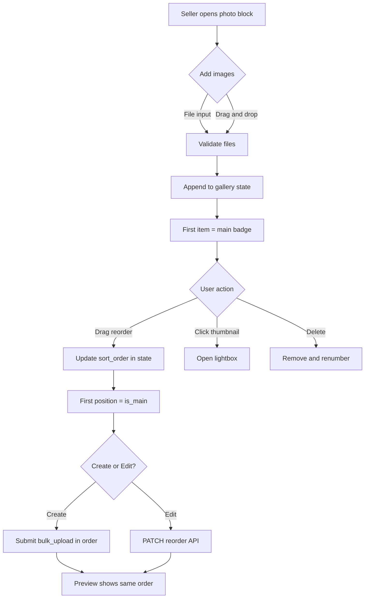

# Iteration 7.7 — Seller Product Media: main image и порядок изображений

**Статус:** запланировано  
**Scope:** backend seller API + синхронизация с `ProductMedia` + **Gallery UX** в seller create/edit (main/order, lightbox, drag-and-drop)  
**Зависимости:** Iteration 4 (`ProductMedia`), Iteration 7 (seller wizard), `product.compat.get_product_cover_image`  
**Блокирует:** корректный preview gallery order после edit, будущий переход public API на `ProductMedia`

---

## Проблема

При создании и редактировании товара продавцом изображения сохраняются только в legacy-модель `BaseProductImage`:

- поля `is_main` и `sort_order` отсутствуют;
- seller endpoint `POST /api/sellers/products/{id}/images/bulk_upload/` принимает только base64 `image`;
- порядок картинок неявный: определяется порядком создания записей и автоинкрементом `id`;
- «главное» фото неявное: `get_product_cover_image()` берёт `BaseProductImage` с минимальным `id`.

Модель `ProductMedia` уже существует (`sort_order`, `is_main`, `status`, constraint «одно main media на product»), но seller write flow в неё **не пишет**. Data migration `0005` перенесла только **старые** `BaseProductImage` в `ProductMedia`; новые загрузки туда не попадают.

В Iteration 7 зафиксирован временный компромисс: сохранять порядок массива в `bulk_upload` и не трогать `ProductMedia.is_main`. Этого недостаточно для:

- явного выбора главного фото;
- изменения порядка при edit без пересоздания всех изображений;
- единого cover image для list/detail/order/GMC через `ProductMedia`;
- модерации медиа по статусу.

### Текущие точки в коде

| Слой | Файл | Поведение сейчас |
| --- | --- | --- |
| Модель legacy | `backend/product/models.py` → `BaseProductImage` | только `product`, `image` |
| Модель target | `backend/product/models.py` → `ProductMedia` | `sort_order`, `is_main`, `legacy_image` |
| Seller upload | `backend/sellers/views.py` → `bulk_upload` | цикл `BaseProductImage.save()` без порядка |
| Serializer | `backend/sellers/serializers.py` → `BaseProductImageSerializer` | поля `id`, `image`, `image_url` |
| Cover helper | `backend/product/compat.py` → `get_product_cover_image` | `images.order_by("id").first()` |
| Frontend create | `Frontend/Frontend3/src/Components/Seller/create/sellerCreateImages/SellerCreateImage.jsx` | горизонтальный Swiper, file input, delete; **нет** main badge, order, DnD, lightbox |
| Frontend edit | `Frontend/Frontend3/src/Components/Seller/edit/sellerEditImage/SellerEditImages.jsx` | аналогично create; порядок не управляется |
| Frontend state | `createProdPrevSlice.js` / `editGoodsSlice.js` | массив `images` без `is_main`/`sort_order` |
| Lightbox (reuse) | `Frontend/Frontend3/src/Components/Product/ProdImageModal/ProdImageModal.jsx` | fullscreen preview с навигацией; можно адаптировать для seller gallery |

---

## Цель

### Backend

Сделать сохранение изображений при create/edit **детерминированным и явным**:

1. у каждого изображения есть `sort_order`;
2. ровно одно изображение помечено как главное (`is_main=True`);
3. порядок и главное фото совпадают с выбором продавца в UI;
4. данные синхронизируются в `ProductMedia` без поломки legacy `BaseProduct.images`;
5. `get_product_cover_image` и public consumers получают тот же cover до и после изменения.

### Frontend (Gallery UX)

Сделать блок загрузки фото **понятным и управляемым** для продавца:

1. визуально видно, какое фото будет **главным** на витрине;
2. видна **последовательность** остальных фото (2-е, 3-е, …);
3. можно **открыть увеличенный просмотр** любого загруженного изображения;
4. можно **добавлять** файлы перетаскиванием (drag-and-drop) в зону gallery;
5. можно **менять порядок** уже загруженных фото перетаскиванием;
6. перестановка первого фото или явное «сделать главным» обновляет `is_main` в state и на backend.

---

## Рекомендуемый подход

**Dual-write на переходный период** (совместимо с Iteration 10 cleanup):

1. Seller API продолжает писать `BaseProductImage` (не ломать существующие consumers `images[]`).
2. После каждой write-операции с изображениями сервис синхронизирует `ProductMedia` для product:
   - `sort_order` = позиция в запросе (0-based);
   - `is_main=True` только у первого элемента **или** у элемента с явным флагом `is_main` (если передан);
   - `legacy_image` → соответствующий `BaseProductImage`;
   - `file` копируется/ссылается на тот же физический файл, что и legacy image;
   - `status` = `pending` (как у нового product).
3. `get_product_cover_image` обновляется: сначала `ProductMedia` с `is_main=True` и `status=approved` (или `pending` для seller preview), fallback на legacy `images.order_by("id").first()`.

Альтернатива «сразу писать только в `ProductMedia`» **не рекомендуется** в этой итерации: сломает response shape seller detail и отложит Iteration 10.

---

## Scope

### Backend

1. **Сервис синхронизации** `product/services/product_media_sync.py` (или аналог по conventions проекта):
   - `sync_legacy_images_to_product_media(product, *, ordered_image_ids, main_image_id)`;
   - идемпотентность: повторный вызов не создаёт дубликаты;
   - гарантия constraint `uniq_main_media_per_product`;
   - удаление/обновление `ProductMedia`, привязанных к legacy images, которых больше нет.

2. **Расширение `bulk_upload`** (`BaseProductImageViewSet.bulk_upload`):
   - принимать массив в порядке UI;
   - опционально: `{ image, sort_order?, is_main? }` на элемент;
   - если `sort_order`/`is_main` не переданы — выводить из индекса массива (`sort_order=index`, `is_main=(index==0)`);
   - валидировать: не более одного `is_main=True`;
   - после сохранения всех `BaseProductImage` вызывать sync service.

3. **Reorder / set main** (минимум для edit flow):
   - `PATCH /api/sellers/products/{id}/images/reorder/` **или** расширение существующего patch single image;
   - payload: `[{ id, sort_order, is_main }]`;
   - обновляет порядок legacy records (если добавим `sort_order` на `BaseProductImage`) **или** только `ProductMedia` + пересортировка ответа seller detail;
   - **предпочтительно:** не добавлять `sort_order` на `BaseProductImage`, а хранить порядок в `ProductMedia` и отдавать seller read через ordered join/serializer.

4. **Seller read serializer**:
   - `images[]` в product detail возвращать в порядке `sort_order`;
   - добавить `is_main` и `sort_order` в response (additive, backward compatible).

5. **Cover helper**:
   - обновить `get_product_cover_image` / `get_product_cover_image_url` с приоритетом `ProductMedia.is_main`.

6. **Тесты**:
   - bulk_upload: 3 images → `sort_order` 0,1,2; первое `is_main`;
   - reorder endpoint меняет main и порядок;
   - sync не создаёт второе `is_main`;
   - cover helper совпадает с выбранным main;
   - seller permission/ownership не регрессируют.

### Frontend — Gallery UX

Заменить текущие `SellerCreateImage` / `SellerEditImages` на общий компонент **`SellerProductImageGallery`** (или аналог), используемый в create и edit.

#### Визуальная структура блока

```text
┌─────────────────────────────────────────────────────────────┐
│  Product photos                                              │
│  Aspect ratio 1:1 · Drag files here or [Add photos]         │
├─────────────────────────────────────────────────────────────┤
│  ┌──────────┐  ┌────┐ ┌────┐ ┌────┐ ┌────┐   [ + drop ]   │
│  │  MAIN    │  │ 2  │ │ 3  │ │ 4  │ │ 5  │                │
│  │  preview │  │    │ │    │ │    │ │    │                │
│  │  ★ Main  │  │    │ │    │ │    │ │    │                │
│  └──────────┘  └────┘ └────┘ └────┘ └────┘                │
│   sort: 1        2      3      4      5                      │
└─────────────────────────────────────────────────────────────┘
```

Правила отображения:

| Элемент | Поведение |
| --- | --- |
| **Main slot** | Первое фото в порядке (`sort_order=0` / `is_main=true`). Крупнее остальных или с отдельной рамкой. Бейдж «Main» / «Главное фото». |
| **Secondary thumbs** | Остальные фото в порядке слева направо. На каждом — порядковый номер (2, 3, 4…), не путать с `sort_order` backend (можно показывать 1-based для UX). |
| **Пустое состояние** | Drop-zone на всю ширину блока + кнопка «Add photos» + placeholder-слоты (как сейчас, но с hint про drag-and-drop). |
| **Hover/focus** | Delete, «View», опционально «Set as main» на не-главных. |
| **Ошибки** | Сохранить `validateProductImageFiles`; подсветка drop-zone при invalid type. |

#### Drag-and-drop: добавление файлов

- Зона drop: весь gallery block или отдельный `dropTarget` рядом с thumbnails.
- События: `dragenter` / `dragover` / `dragleave` / `drop`.
- При drop — тот же pipeline, что у `<input type="file" multiple>`: валидация MIME/size, FileReader → base64, append в конец списка.
- Визуальная обратная связь: border/background «active drop» при `dragover`.
- Не ломать существующий file input — оба способа добавления равноправны.

#### Drag-and-drop: изменение порядка

- Перетаскивание thumbnail меняет порядок в local state.
- Первый элемент после drop автоматически становится main (`is_main=true`, остальные `false`).
- Альтернатива/дополнение: контекстное действие «Set as main» перемещает фото на позицию 0 без ручного drag на первое место.
- В **create flow** порядок живёт только в Redux до submit.
- В **edit flow** после drop вызывать `PATCH .../images/reorder/` (debounce или save-on-drop — зафиксировать в реализации; рекомендуется immediate save с optimistic UI).

Рекомендация по реализации DnD:

- предпочтительно **HTML5 Drag and Drop API** или **`@dnd-kit/core`** (лёгкий, accessible), если native API окажется хрупким на touch;
- не тянуть тяжёлые зависимости без необходимости;
- mobile: long-press to drag или отдельные кнопки «влево/вправо» как fallback, если drag на touch нестабилен.

#### Просмотр в увеличенном размере (lightbox)

- Клик по thumbnail / main → модальное окно с крупным изображением.
- Переиспользовать или обобщить `ProdImageModal`:
  - принимать массив `{ image_url }` и `initialIndex`;
  - навигация prev/next между фото в **текущем порядке gallery**;
  - закрытие по Esc, overlay click, кнопка close.
- В lightbox показывать подпись: «Main photo» / «Photo 3 of 5».
- Lightbox read-only: не меняет порядок (reorder только в gallery grid).

#### State и payload

Каждый элемент в Redux `images[]`:

```ts
{
  id?: number;           // backend id (edit) или local uuid (create)
  image_url: string;     // blob URL или server URL
  base64?: string;       // для upload
  sort_order: number;    // 0-based
  is_main: boolean;
  status?: 'local' | 'saved';
}
```

- `setImages` / reducers: reorder, setMain, add, remove сохраняют `sort_order` и `is_main` консистентно.
- `postSellerImages`: передавать массив в UI-порядке + опционально `sort_order` / `is_main` на элемент.

#### Файлы (likely touched)

- `Frontend/Frontend3/src/Components/Seller/SellerProductImageGallery/` — новый shared компонент + scss;
- `Frontend/Frontend3/src/Components/Seller/create/sellerCreateImages/SellerCreateImage.jsx` — thin wrapper;
- `Frontend/Frontend3/src/Components/Seller/edit/sellerEditImage/SellerEditImages.jsx` — thin wrapper;
- `Frontend/Frontend3/src/redux/createProdPrevSlice.js` / `editGoodsSlice.js` — reorder/setMain actions;
- `Frontend/Frontend3/src/utils/sellerProductWizard.js` — helpers: `normalizeGalleryImages`, `reorderGalleryImages`;
- `Frontend/Frontend3/src/api/seller/sellerProduct.js` / `editProduct.js` — reorder API;
- i18n: `sellerHome` keys для Main, Photo N, Drag hint, View.

#### Тесты frontend

- unit: reorder обновляет `sort_order` и `is_main`;
- unit: первый элемент всегда main после reorder;
- unit: payload `postSellerImages` сохраняет порядок;
- component: drop zone вызывает add; invalid file → error;
- component: клик открывает lightbox с правильным index.

### Документация

- OpenAPI/spectacular для новых/расширенных полей.
- Обновить `iteration-7-seller-product-wizard.md` (секция Media) — ссылка на эту задачу как canonical implementation.

---

## Out of Scope

- Полный отказ от `BaseProductImage` (это Iteration 10).
- `ProductDocument` / license migration.
- Video media type в seller UI.
- Moderation UI для approve/reject media (Iteration 8).
- Public API switch на nested `media[]` вместо `images[]`.
- Массовый импорт изображений (Iteration 9).
- Crop/rotate/edit изображений в gallery.
- Мультизагрузка с камеры mobile (оставляем стандартный file input).

---

## API Contract (целевой)

### `POST .../images/bulk_upload/`

```json
{
  "images": [
    { "image": "data:image/webp;base64,...", "sort_order": 0, "is_main": true },
    { "image": "data:image/webp;base64,...", "sort_order": 1, "is_main": false }
  ]
}
```

Правила:

- если `sort_order`/`is_main` опущены — выводятся из порядка массива;
- ровно один `is_main=True` (иначе 400);
- `sort_order` уникален в рамках запроса;
- ответ 201: список созданных images с `id`, `image_url`, `sort_order`, `is_main`.

### `PATCH .../images/reorder/` (новый)

```json
{
  "images": [
    { "id": 101, "sort_order": 0, "is_main": true },
    { "id": 102, "sort_order": 1, "is_main": false }
  ]
}
```

Правила:

- все `id` принадлежат product;
- полный список изображений product или явная политика partial reorder (зафиксировать в реализации; рекомендуется full list);
- atomic transaction + sync `ProductMedia`.

---

## Инварианты совместимости

Из `task.md`:

1. **Главное фото** одинаково для public list, detail, order history, GMC.
2. Seller create/edit **не ломается** для клиентов, отправляющих только `{ image }`.
3. `related_name='images'` на `BaseProduct` сохраняется.
4. Public API не отдаёт `rejected` media; `pending` — только если политика ADR это разрешает для seller-owned endpoints.
5. Не менять checkout/order/payment/delivery.

---

## План реализации

### Phase 1 — Backend foundation

1. Сервис sync `BaseProductImage` → `ProductMedia`.
2. Расширить `bulk_upload` (порядок + main + sync).
3. Обновить cover helper.
4. Backend tests.

### Phase 2 — Edit reorder

1. Endpoint reorder / set main.
2. Seller detail serializer: ordered `images` + `is_main`/`sort_order`.
3. Backend tests для edit.

### Phase 3 — Gallery UX (create + edit)

1. Shared `SellerProductImageGallery`: main badge, order numbers, drop zone.
2. Drag-and-drop reorder + set main semantics.
3. Lightbox на базе `ProdImageModal`.
4. Redux actions + нормализация state.
5. Подключить в create/edit forms.
6. Frontend tests.

### Phase 4 — Edit API wiring

1. Reorder endpoint integration в edit flow.
2. Загрузка существующих images с `sort_order` / `is_main` из API.
3. Optimistic UI + error rollback.

### Phase 5 — Preview parity

1. Seller preview/review gallery читает `is_main` и порядок из state/API.
2. Порядок thumbnails совпадает с create/edit gallery.

### Phase 6 — Verification

1. Browser smoke: create 3 images via drop → main badge на первом, номера 2-3 на остальных.
2. Drag reorder → preview показывает новый main и порядок.
3. Lightbox: все фото листаются в порядке gallery.
4. Edit: reorder сохраняется после reload.
5. `generate_gmc_feed --limit N` — image URL от main.
6. Regression: file input без DnD всё ещё работает.

---

## Acceptance Criteria

### Backend

1. При create product seller загружает N изображений — в БД у `ProductMedia` ровно N записей с `sort_order` 0..N-1 и одним `is_main=True`.
2. Первое изображение в UI (или явно помеченное `is_main`) становится cover во всех compatibility consumers.
3. Seller может изменить порядок и главное фото при edit без удаления и повторной загрузки всех файлов.
4. `bulk_upload` без новых полей сохраняет текущее поведение (порядок массива = порядок `id`).
5. Constraint `uniq_main_media_per_product` никогда не нарушается.
6. Seller не может менять media чужого product.
7. Есть автотесты на sync, bulk_upload, reorder, cover helper.
8. OpenAPI обновлён.

### Gallery UX

9. Главное фото визуально отличимо от остальных (бейдж + выделение слота).
10. У каждого secondary thumbnail виден порядковый номер в галерее.
11. Продавец может добавить изображения drag-and-drop в drop-zone (не только через file input).
12. Продавец может изменить порядок загруженных фото drag-and-drop; первое место = main.
13. Клик по фото открывает lightbox с увеличенным просмотром и навигацией по порядку gallery.
14. Create preview и seller review gallery отражают тот же main и порядок, что в форме.
15. Invalid file type/size при drop показывает ту же ошибку, что при file input.
16. Mobile: gallery usable (drag fallback или arrow controls задокументированы в PR).

---

## Риски

| Риск | Митигация |
| --- | --- |
| Дубли `ProductMedia` при повторном bulk_upload | Идемпотентный sync по `legacy_image_id` |
| Расхождение legacy `id` order и `sort_order` | Seller read отдаёт order из `ProductMedia`; cover helper читает `is_main` |
| Двойное хранение файлов | `ProductMedia.file` ссылается на тот же storage path или копируется один раз в sync |
| Edit partial upload ломает порядок | Reorder endpoint как source of truth после initial upload |
| DnD не работает на touch | Fallback: «Set as main» + move left/right buttons |
| Lightbox дублирует логику | Обобщить `ProdImageModal` → `ProductImageLightbox` |
| Redux state без `is_main` | Миграция initial state + normalize helper при load |

---

## Verification

```bash
pytest backend/product/test_product_media_sync.py backend/sellers/test_product_images.py -q
pytest backend/product/test_catalog_compat.py -q
python backend/manage.py generate_gmc_feed --limit 20
npm --prefix Frontend/Frontend3 test -- sellerProductWizard sellerProductImages SellerProductImageGallery
```

Browser smoke (обязательно):

- create: drop 3 files → main badge + order numbers;
- drag 3→1 position → main меняется;
- lightbox: prev/next в порядке gallery;
- edit: reorder persists after page reload.

---

## Связанные документы

- `docs/tasks/024-product-catalog-modernization/task.md` — инвариант главного фото
- `docs/tasks/024-product-catalog-modernization/iteration-4-brand-identifiers-media-documents.md` — модель `ProductMedia`
- `docs/tasks/024-product-catalog-modernization/iteration-7-seller-product-wizard.md` — временный компромисс по media
- `docs/tasks/024-product-catalog-modernization/audit-dependency-map.md` — media migration acceptance
- `docs/tasks/024-product-catalog-modernization/iteration-7-6-product-review-reference-implementation-plan.md` — preview gallery parity
- `docs/design-references/v0-product-review/README.md` — визуальный ориентир Product Gallery
- `docs/tasks/024-product-catalog-modernization/implementation-task-breakdown.md` — Iteration 7.7 в breakdown

---

## UX flow (mermaid)



---

## Rollback

- Feature flag или откат commit: sync service отключается, cover helper возвращается к `images.order_by("id").first()`.
- Новые поля в API optional — старые клиенты продолжают работать.
- `ProductMedia` rows, созданные sync, можно удалить по `legacy_image_id IS NOT NULL` без затрагивания manually created media.
