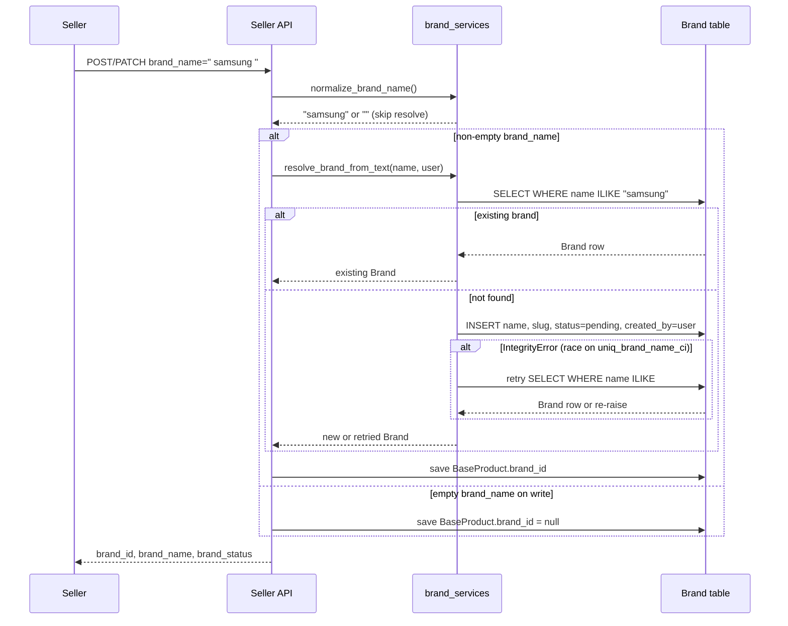

# Iteration 7.9 — Seller brand manual text input

## Goal and scope

Allow sellers to enter a product brand as free text on create/edit forms. The backend resolves or creates a `Brand` record (case-insensitive dedup, `pending` status for new brands) and links it to `BaseProduct.brand`.

**In scope**

- Seller API write field `brand_name` (create / update / patch)
- Seller API read fields `brand_id`, `brand_name`, `brand_status`
- Frontend create/edit form field + preview + validation + i18n (EN/CZ)
- Backend and frontend tests

**Out of scope**

- Brand autocomplete / suggestions UI
- Public product API brand exposure changes
- GMC / `product/compat.py` changes
- Database migrations (Brand model already exists)

---

## UI field order

First `FormSection` on create and edit:

1. Category and type (`CreateCategoryMain`)
2. **Brand** (`CreateFormInp`, `titleSize="big"`, optional)
3. Goods name (`CreateFormInp`, `titleSize="big"`, required)

---

## UI → API mapping

| UI field | Redux state | Write API | Read API |
| --- | --- | --- | --- |
| Brand | `brand_name` | `brand_name` (write-only, optional) | `brand_id`, `brand_name`, `brand_status` |

Create with brand:

```json
{ "brand_name": "Samsung" }
```

Create without brand — omit `brand_name` or send blank; response:

```json
{
  "brand_id": null,
  "brand_name": null,
  "brand_status": null
}
```

PATCH behaviour:

| Request | Effect |
| --- | --- |
| omit `brand_name` | existing brand unchanged |
| `"brand_name": ""` | clear brand (`brand=null`) |
| `"brand_name": "Sony"` | resolve/create and attach |

Legacy products without a brand can be edited and saved without entering a brand.

---

## Validation rules

| Layer | Rule |
| --- | --- |
| Frontend (yup) | optional; trim + collapse whitespace; min 2 / max 150 only when non-empty |
| Backend (serializer) | optional on create; empty after normalize → no brand linked; min/max only when non-empty |

Normalization: strip, collapse internal whitespace to single spaces.

API error codes (stable, mapped to i18n on frontend):

| Code | i18n key |
| --- | --- |
| `brand_min_length` | `goods.validation.brandMinLength` |
| `brand_max_length` | `goods.validation.brandMaxLength` |

---

## Brand resolve logic



Slug generation: `slugify(name)` with numeric suffix on collision (`acme`, `acme-2`, …).

On `IntegrityError`, retry lookup only — no duplicate create with the same name.

---

## i18n (EN / CZ)

| Key | EN | CZ |
| --- | --- | --- |
| `goods.brand` | Brand | Značka |
| `goods.placeholders.brand` | e.g. Samsung (optional) | např. Samsung (volitelné) |
| `goods.validation.brandMinLength` | Brand must be at least 2 characters | Značka musí mít alespoň 2 znaky |
| `goods.validation.brandMaxLength` | Brand must be at most 150 characters | Značka může mít maximálně 150 znaků |

Preview Listing Information uses `t('goods.brand')`. API codes mapped via `mapBrandNameApiError()` / `getBrandNameFieldError()`.

---

## Verification commands

```bash
DB_NAME= DB_USER= DB_PASS= DB_HOST= DB_PORT= MEDIA_ROOT=/tmp/reli-media python3 backend/manage.py test sellers.test_product_brand_api -v 1
cd Frontend/Frontend3 && npm test -- sellerProductWizardSlices.test.js
```

Manual smoke:

1. `/seller/seller-create` — Brand optional between category and name; preview hides empty brand row.
2. Edit legacy product without brand — save without entering brand.
3. Clear brand on edit — empty field + save clears link.

---

## Acceptance criteria / DoD

- [x] Brand optional on create/edit (UI + yup + API)
- [x] Empty brand → `brand=null`; create omits `brand_name` key when empty
- [x] PATCH `brand_name: ""` clears brand; PATCH omit leaves brand unchanged
- [x] Min 2 / max 150 only when non-empty
- [x] i18n EN/CZ: form, preview, API error mapping
- [x] OpenAPI descriptions updated
- [x] IntegrityError race fix (retry lookup, re-raise if missing)
- [x] Backend + frontend tests
- [x] This document updated

---

## Changed files

| Area | Files |
| --- | --- |
| Backend | `sellers/brand_services.py`, `sellers/serializers.py`, `sellers/views.py`, `sellers/test_product_brand_api.py` |
| Frontend | forms, Redux slices, `validationGoods.js`, `sellerProductWizard.js`, preview, locales EN/CZ, API clients, tests |
| Docs | this file |
