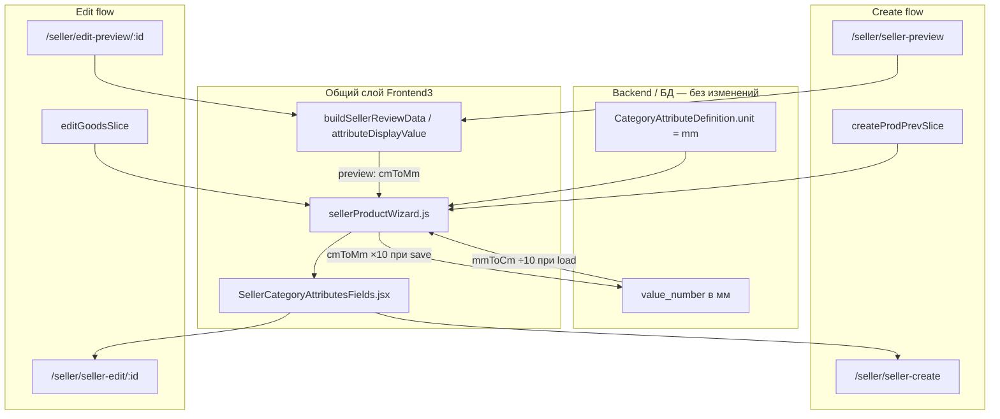

# Task 030 — Category attributes: ввод в мм вместо см (seller create/edit)

## Status
Done

## Цель
Показывать и принимать значения **category attributes** с `unit: "mm"` в **миллиметрах**
на формах продавца (создание и редактирование товара), без конвертации см↔мм.
Хранение в API/БД уже в мм — меняется только UX seller wizard.

## Контекст

### Текущая архитектура (до Task 030 — исторический as-is)



| Слой | Единица | Где |
|------|---------|-----|
| Seed Doors (`seed_doors_category_attributes.py`) | **mm** | `door_width_mm`, `door_height_mm`, `leaf_thickness_mm`, `unit="mm"` |
| API / БД | **mm** | `ProductAttribute.value_number` |
| UI продавца | **mm** | `attributeInputUnit()` → `"mm"`, passthrough + `formatNumberInputValue` |
| Preview seller | **mm** | `attributeDisplayValue` → `"800 mm"` |
| Публичный каталог | **mm** | `sellerCatalogI18n.js`: `${value} ${unit}` |

Документировано в [`024-product-catalog-modernization/cheatsheet-category-attributes-doors.md`](../024-product-catalog-modernization/cheatsheet-category-attributes-doors.md).

### Затронутые страницы и маршруты

| URL | Страница | Redux slice | Category attributes |
|-----|----------|-------------|---------------------|
| `/seller/seller-create` | `SellerCreatePage` → `SellerCreateForm` | `create_prev` | `SellerCategoryAttributesFields` |
| `/seller/seller-preview` | `SellerPreviewPage` | `create_prev` | preview через `buildSellerReviewData` |
| `/seller/seller-edit/:id` | `EditGoodsPage` → `EditGoodsForm` | `edit_goods` | **тот же** `SellerCategoryAttributesFields` |
| `/seller/edit-preview/:id` | `SellerEditPreview` | `edit_goods` | **тот же** `buildSellerReviewData` |

**Edit flow (детально):**

1. `EditGoodsForm` загружает schema (`fetchEditCategoryAttributeSchema`) и values (`fetchEditProductAttributes`).
2. `editGoodsSlice` → `valuesFromAttributeRows(...)` — сейчас **÷10** (800 мм → «80» в форме).
3. Продавец редактирует → `setAttributeValue` → preview → `buildSellerReviewData(edit_goods)`.
4. Save / moderation → `fetchEditProduct` → `buildAttributePayload(...)` — сейчас **×10** («80» → 800 мм в API).

Create flow использует **те же функции** в `createProdPrevSlice` (`buildAttributePayload` при submit wizard).

**Общий UI-компонент:** `SellerCategoryAttributesFields.jsx` — один для create и edit; достаточно изменить helpers + i18n placeholder.

**Габариты варианта (package):** уже в мм в UI (`packageWidthMm: "e.g. 800"`) — **не входят** в эту задачу.

## Scope (область)

### Код

| Файл | Изменение |
|------|-----------|
| `Frontend/Frontend3/src/utils/sellerProductWizard.js` | Убрать cm↔mm для `isMmStoredNumberAttribute`: label, API payload, form load, preview display |
| `Frontend/Frontend3/src/Components/Seller/shared/SellerCategoryAttributesFields.jsx` | Placeholder для mm-атрибутов |
| `Frontend/Frontend3/src/locales/en/sellerHomeEn.json` | `attributeNumberMm` (или переименование ключа) |
| `Frontend/Frontend3/src/locales/cz/sellerHomeCz.json` | то же для CZ |
| `Frontend/Frontend3/src/redux/sellerProductWizardSlices.test.js` | Обновить suite «cm input» → «mm input»; edit round-trip |

### Документация

| Файл | Изменение |
|------|-----------|
| `docs/tasks/024-product-catalog-modernization/cheatsheet-category-attributes-doors.md` | Таблица «Единицы number-атрибутов»: UI продавца → **мм** |
| `docs/tasks/README.md` | Строка Task 030 |

## Не входит в задачу

- Backend: модели, миграции, serializers, `seed_doors_category_attributes.py` (unit уже `mm`).
- Публичный каталог, facets, filters (`public_catalog_filters.py`).
- Delivery / упаковка: `width_cm`, `package_*_mm` в вариантах.
- Блок «Characteristics» / `product_parameters` (отдельные текстовые параметры).
- `SellerEditPreview` success-навигация (`navigate` + `reload`) — отдельный трек (см. Task 029 для create).
- Миграция данных в БД — **не нужна** (значения уже в мм).

## Зависимости

- Task 024 (category attributes Doors MVP) — schema и storage в мм уже есть.

## Риски

| Риск | Митигация |
|------|-----------|
| **Edit round-trip:** после снятия конвертации save без изменений должен отправить то же `value_number` | Тест: API 800 → form 800 → payload 800 |
| **Двойная конвертация при ошибке в коде:** form 800 → payload 8000 | Явный тест `buildAttributePayload` с `"800"` |
| Продавцы привыкли вводить см (80 вместо 800) | Placeholder `e.g. 800`, label `, mm` |
| Preview edit показывал mm из cm | Упростить `attributeDisplayValue` — значение формы = мм |
| `cmToMm` / `mmToCm` станут неиспользуемыми для attributes | Оставить экспорт, если нужен elsewhere; иначе удалить только attribute-вызовы |

## Definition of Done

- [x] Create: поля Doors (`Width`, `Height`, `Leaf thickness`) — **`, mm`**, placeholder `e.g. 800`.
- [x] Edit (`/seller/seller-edit/:id`): загрузка из API показывает мм (800, не 80); save без правок не меняет `value_number`.
- [x] Create preview и edit preview: display `800 mm` при вводе 800.
- [x] Submit create wizard и save edit отправляют `value_number` в мм без ×10.
- [x] Тесты `sellerProductWizardSlices.test.js` обновлены и зелёные.
- [x] `npm run lint` и `npm run test` в Frontend3 — OK.
- [x] Cheatsheet Doors обновлён.
- [x] Backend/API не изменены.

---

# Iterations

## Iteration 1 — Analysis (DONE)

### Цель
Зафиксировать все точки использования cm↔mm, включая seller-edit.

### Output
- Create + edit + оба preview используют `sellerProductWizard.js` helpers.
- Общий UI: `SellerCategoryAttributesFields`.
- Edit: `editGoodsSlice` → `valuesFromAttributeRows` (load), `buildAttributePayload` (save).
- Backend менять не нужно.

### Статус
- [x] Готово

---

## Iteration 2 — Tests first (DONE)

### Цель
Зафиксировать целевое поведение до правок кода.

### Действия
Обновить блок в `sellerProductWizardSlices.test.js` (`"category attribute mm storage with mm input"`):

1. **Payload (create + edit save):** form `{ 10: "800" }` → API `value_number: "800"`.
2. **Load edit form:** API row `value_number: "800"` → `valuesFromAttributeRows` → `{ 10: "800" }`.
3. **Preview (create + edit):** `attributeValues: { 10: "800" }` → `buildSellerReviewData` → display `"800 mm"`.
4. **Round-trip edit:** load 800 → payload без изменений → still `"800"`.

### Статус
- [x] Готово

---

## Iteration 3 — Core logic (`sellerProductWizard.js`) (DONE)

### Цель
Убрать cm-адаптер для category attributes с `unit === "mm"`.

### Действия
1. `attributeInputUnit` — возвращать `"mm"` вместо `"cm"`.
2. `attributeValueNumberForApi` — passthrough `String(value)` без `cmToMm`.
3. `attributeValueNumberForForm` — passthrough через `formatNumberInputValue` (без `mmToCm`; нормализация `800.0000` → `800`).
4. `attributeDisplayValue` — для mm-атрибутов: `${value} mm` без `cmToMm`.

### Статус
- [x] Готово

---

## Iteration 4 — UI labels & i18n (DONE)

### Цель
Согласовать placeholder и подписи полей с мм.

### Действия
1. `SellerCategoryAttributesFields.jsx` — `goods.placeholders.attributeNumberMm`.
2. `sellerHomeEn.json` / `sellerHomeCz.json` — `attributeNumberMm`: `"e.g. 800"` / `"např. 800"`.

### Статус
- [x] Готово

---

## Iteration 5 — Validation (DONE)

### Цель
Проверить create и edit end-to-end.

### Действия
- `npm run lint` + `npm run test` в `Frontend/Frontend3` — OK.
- Ручная проверка create и edit — OK (2026-06-24).

### Ручной чеклист

```
Create (/seller/seller-create)
[x] Label: "Width, mm" (не cm)
[x] Placeholder: e.g. 800
[x] Preview: 800 mm
[x] Network PUT attributes: value_number 800 (не 8000)

Edit (/seller/seller-edit/:id)
[x] После загрузки: width = 800 (не 80, не 800,0000)
[x] Preview edit: 800 mm
[x] Save без изменений: value_number не меняется
[x] Повторное открытие edit: по-прежнем 800
```

### Статус
- [x] Готово

---

## Iteration 6 — Docs (DONE)

### Цель
Синхронизировать документацию с новым UX.

### Действия
- Обновить cheatsheet Doors (таблица «Единицы number-атрибутов»).
- Отметить Task 030 Done в `task.md` и `docs/tasks/README.md`.

### Статус
- [x] Готово

---

## Справка: ключевые функции (было → стало)

| Функция | Было | Стало |
|---------|------|-------|
| `attributeInputUnit(attr)` | `"cm"` if unit=mm | `"mm"` |
| `attributeValueNumberForApi` | cm × 10 | passthrough |
| `attributeValueNumberForForm` | mm ÷ 10 | passthrough + `formatNumberInputValue` |
| `attributeDisplayValue` | cmToMm → `"N mm"` | `"${value} mm"` |

## Справка: файлы edit flow

```
EditGoodsPage.jsx
  └── EditGoodsForm.jsx
        └── SellerCategoryAttributesFields  ← UI
        └── navigate → /seller/edit-preview/:id

editGoodsSlice.js
  fetchEditProductAttributes.fulfilled → valuesFromAttributeRows  ← load
  fetchEditProduct → buildAttributePayload                        ← save

SellerEditPreview.jsx
  buildSellerReviewData(state.edit_goods)                         ← preview
```
