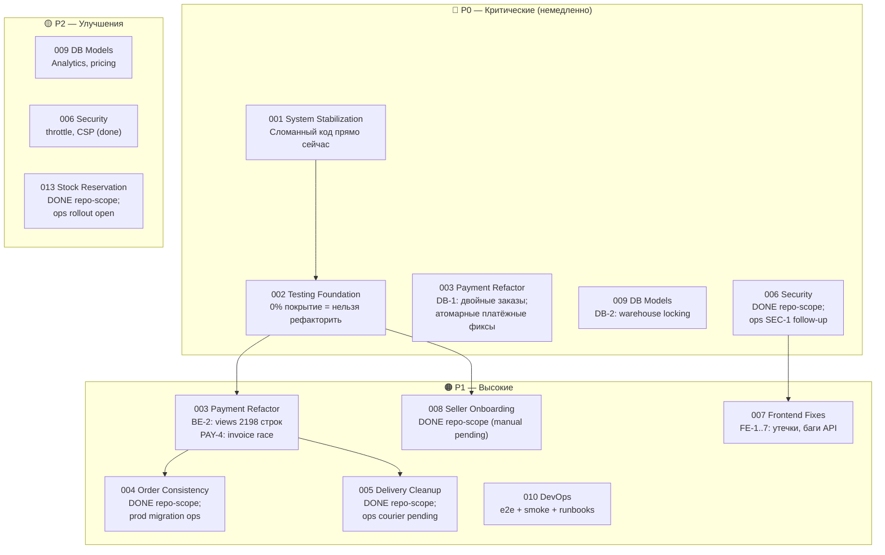
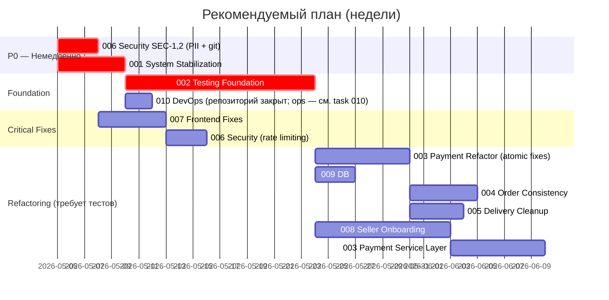

# Tasks — Структурированный план разработки reli.one

> Результат полного аудита проекта. Дата: май 2026.
> **Актуализация (май 2026, после e2e/DevOps/docs):** см. раздел [Состояние после e2e-контура](#состояние-после-e2e-контура-и-devops-доков-май-2026).
> Все задачи следуют workflow из `docs/10-agent-workflow.md`.

**Навигация:** точка входа в документацию — [`docs/README.md`](../README.md); агрегированный порядок треков — [`docs/roadmap.md`](../roadmap.md) (детали всегда в `task.md` и во [frontend/tasks](../frontend/tasks/README.md)).

---

## Состояние после e2e-контура и DevOps-доков (май 2026)

Краткая сводка **только по артефактам в `docs/` и smoke-результатам**, без новых архитектурных решений за рамками уже зафиксированных proposals. **Task 010 (DevOps)** в текущем roadmap **не** блокируется **Task 013** (stock reservation) ни промокодами: **013** — **DONE repo-scope implementation**, **OPEN ops rollout**; промокоды в продукте сейчас **не используются** (см. [`010-devops-infrastructure/task.md`](./010-devops-infrastructure/task.md) → Deferred).

### Задокументировано и проверено руками в sandbox/e2e

| Артефакт | Ссылка / смысл |
|----------|----------------|
| Локальный e2e Docker | [`docs/testing/e2e-local-contour.md`](../testing/e2e-local-contour.md) |
| Stripe smoke (не prod) | [`docs/testing/stripe-e2e-checklist.md`](../testing/stripe-e2e-checklist.md) — *Verification evidence* |
| PayPal sandbox smoke (не prod) | [`docs/testing/paypal-e2e-checklist.md`](../testing/paypal-e2e-checklist.md) — *Verification evidence — latest local smoke result* |
| Склад / резерв до оплаты | [**Task 013**](./013-stock-reservation/task.md) — **DONE repo-scope** (модели, сервис, checkout/webhook, cleanup, tests); **OPEN ops rollout** (флаг на staging/prod, cron, monitoring). **Не** блокирует **010** repo-scope |
| `/health/`, deployment + Sentry + **operational monitoring** runbooks | [`docs/07-deployment.md`](../07-deployment.md), [`docs/operations/monitoring-alerts.md`](../operations/monitoring-alerts.md) |
| Health regression tests | `backend/test_health_endpoint.py` |
| PostgreSQL backup / restore в e2e | [`docs/operations/database-backup-restore.md`](../operations/database-backup-restore.md) |

### Статус задач (аудиторская формулировка)

Задачи **не закрыты целиком** по продуктовому смыслу, если в их `task.md` остаются обязательные **кодовые** чекбоксы. **Исключения по закрытию для git без боевой приёмки:** **[Task 010 — DevOps](./010-devops-infrastructure/task.md)** (**DONE git**), см. [финальную таблицу DoD](./010-devops-infrastructure/task.md#финальный-аудит-и-таблица-dod); **[Task 004](./004-order-consistency/task.md)** — **DONE repo-scope** для **Payment cleanup** и **structural Order Consistency**, при этом **production/live PSP acceptance** и **production migration verification** остаются **manual/ops** и этим репозиторием **не утверждаются**; **[Task 005 — Delivery cleanup](./005-delivery-cleanup/task.md)** — **DONE repo-scope**, см. [Final DoD table](./005-delivery-cleanup/task.md#final-dod-table-task-005), при этом **ручная приёмка перевозчиков в production** — **pending (ops)** и этим репозиторием **не утверждается**; **[Task 006 — Security hardening](./006-security-hardening/task.md)** — **DONE (repo-scope)**, см. [Final Audit Summary](./006-security-hardening/task.md#final-audit-summary-task-006-repo-scope); **Ops follow-up required:** ротация credentials в production и выполнение git history rewrite — см. [`docs/security-incident-response.md`](../security-incident-response.md). **[Task 008 — Seller onboarding](./008-seller-onboarding-stabilization/task.md)** — **DONE (repo-scope)**, см. [Final DoD table](./008-seller-onboarding-stabilization/task.md#final-dod-table-task-008), при этом **ручная UI/staging-приёмка онбординга** и **Frontend3 e2e** — **pending / deferred** и этим репозиторием **не утверждаются**. Эксплуатационная приёмка описана как **pending** и не отменяет эти закрытия.

| # | После аудита |
|---|----------------|
| **010** | **DONE (репозиторий):** e2e-compose, env examples, Mailpit, Stripe/PayPal **local/sandbox** smoke (evidence в docs), `/health/` + тесты, backup/restore runbook, migrations+CI, deployment A–G, cookies env, Sentry+monitoring **runbooks в `docs/`**. **OPEN (ops):** прогон тех же runbook на **staging/prod**, evidence, `check --deploy`, включение алертов — см. [DoD-таблицу 010](./010-devops-infrastructure/task.md#финальный-аудит-и-таблица-dod). **Не входит в закрытие 010:** промокоды, **013**. Опционально позже: startup env validation (Iter. 5), RTO/RPO+медиа (Iter. 6). |
| **003** | **DONE (repo-scope)** платежного контура и cleanup — см. **[task.md](./003-payment-refactor/task.md)** и **[Final DoD table Task 004](./004-order-consistency/task.md#final-dod-table)**. **OPEN:** необязательный polish (не блокирует closure). Промокоды и **013** не блокируют. |
| **004** | **DONE (repo-scope)** для **Payment cleanup** и **structural Order Consistency** (миграция `0009_order_consistency`, константы статусов, `SET_NULL`, индексы, timezone-aware `received_at`, order/reviews evidence). **OPEN (ops/manual):** production/live PSP acceptance и production migration verification — см. [task.md](./004-order-consistency/task.md). |
| **013** | **DONE (repo-scope implementation):** `StockReservation*`, `StockReservationService`, checkout 409, webhook confirm/release, cleanup command, tests, FE-014 UX 409. **OPEN (ops rollout):** `STOCK_RESERVATION_ENABLED=True` на staging/prod, cron/Celery, monitoring, production evidence — см. [task.md](./013-stock-reservation/task.md). **Не** блокирует **010** repo-scope. |
| **009** | **DONE (repo-scope)** по [`009-db-model-improvements/task.md`](./009-db-model-improvements/task.md) Iteration 5 — см. финальный аудит в `task.md`; reservation/spisanie реализованы в [**Task 013**](./013-stock-reservation/task.md) (rollout — ops). |
| **002** | **Core — done** по прежнему определению задачи; extended части исторически делегированы другим задачам. |
| **005** | **DONE (repo-scope):** dev-gating курьерских dev-endpoints, изоляция сбоев post-payment parcels, [`test_async_parcels_errors.py`](../../backend/delivery/test_async_parcels_errors.py), playbook retry/follow-up в [`payment-flow.md`](../payment-flow.md), связка с [`monitoring-alerts.md`](../operations/monitoring-alerts.md) — см. **[Final DoD table](./005-delivery-cleanup/task.md#final-dod-table-task-005)**. **OPEN (ops):** ручная приёмка перевозчиков в **production** (**pending**). **Deferred:** Celery, automatic retry, идемпотентность у перевозчика — в `task.md`. **Не** смешивать с PromoCode и **013**. |

Остальные задачи (**007, 011, 012** и др.) этим проходом **не перепроверялись построчно** в коде — их статус следует брать из соответствующих `task.md`, пока те файлы явно не обновлены (**003**, **004**, **005**, **006**, **008**, **013** — repo-scope closed; **010** обновлены май 2026).

### Next priority (рекомендация аудита — не смешивать с выполненными фактами)

**P0 — продуктовые и финансово значимые риски без полной закрывающей реализации в коде**

> **Master ops checklist (ручные шаги, evidence вне git):** [`docs/operations/repo-ops-followup-checklist.md`](../operations/repo-ops-followup-checklist.md)

1. [**Task 013**](./013-stock-reservation/task.md) — **DONE repo-scope**; **OPEN ops rollout:** включение флага на staging/prod, cron, monitoring, production evidence. **Не** блокирует **010** repo-scope.
2. [**Task 003**](./003-payment-refactor/task.md) **(payment):** **DONE (repo-scope)** — см. также **[Task 004 — Final DoD](./004-order-consistency/task.md#final-dod-table)**; открыт только **необязательный** polish в `task.md` **003**. Промокоды — **не** блокеры.
3. [**006**](./006-security-hardening/task.md) — **DONE (repo-scope)** — см. [Final Audit Summary](./006-security-hardening/task.md#final-audit-summary-task-006-repo-scope). **Ops follow-up required:** credential rotation and git history rewrite execution — [`docs/security-incident-response.md`](../security-incident-response.md).

**P1 — эксплуатация, консистентность и закрытие «хвостов» после доков**

> **Master ops checklist:** [`docs/operations/repo-ops-followup-checklist.md`](../operations/repo-ops-followup-checklist.md)

1. Эксплуатация: прогнать runbook [`07-deployment.md`](../07-deployment.md) и [monitoring](../operations/monitoring-alerts.md) на **вашем** staging/prod при выкатах; evidence **вне git** (задача **[010](./010-devops-infrastructure/task.md)** по **коду/докам** уже **DONE** — см. её DoD-таблицу). **[013](./013-stock-reservation/task.md) ops rollout** (флаг, cron, monitoring) — отдельно от DoD **010**.
2. [**004**](./004-order-consistency/task.md) — **DONE repo-scope** для payment cleanup и structural Order Consistency; остаётся **ops/manual:** production/live PSP acceptance и production migration verification. Future order lifecycle extensions вести отдельным backlog, не как незакрытый Task 004. [**013**](./013-stock-reservation/task.md) — **DONE repo-scope**; **OPEN ops rollout.** [**005**](./005-delivery-cleanup/task.md) — **DONE repo-scope**; остаётся **ops:** приёмка перевозчиков в production (**manual/pending**) — см. [Final DoD](./005-delivery-cleanup/task.md#final-dod-table-task-005). [**008**](./008-seller-onboarding-stabilization/task.md) — **DONE (repo-scope)** — см. [Final DoD](./008-seller-onboarding-stabilization/task.md#final-dod-table-task-008); **manual/staging UI** онбординга остаётся **pending (ops)**; **автоматизированный** полный онбординг во Frontend3 **не** в scope; узкий Playwright smoke (корень SPA) — job **`e2e_frontend3`**. **Не зависит** от PromoCode, **005** (кроме общего payment/order фундамента) — см. [task.md](./008-seller-onboarding-stabilization/task.md).
3. **Регулярные Postgres backups на проде и проверки восстановления** — описать в **`docs/07-deployment.md`** (runbook уже покрывает технологию дампа).

**P2**

1. [**009**](./009-db-model-improvements/task.md) — аналитика/цены/locking для `decrease_stock` когда появится записывающийся складской путь.
2. [**011**](./011-order-product-received-at-timezone/task.md) и прочее по вашему backlog.

---

**Proposal vs done:** любая строка выше вида «резерв / RTO» — **направление работ**, а не утверждение о уже внедрённой системе. Детали — только в ADR/задачах после явного решения.

---

## Архитектура проблем



---

## Сводная таблица задач

| # | Задача | Priority | Complexity | Зависит от | GO/NO-GO |
|---|--------|----------|------------|------------|----------|
| 001 | [system-stabilization](./001-system-stabilization/task.md) | **P0** | Medium | — | GO |
| 002 | [testing-foundation](./002-testing-foundation/task.md) | **P0** | High | 001 | **DONE (Core)**; Extended → 009, 010, 012 |
| 003 | [payment-refactor](./003-payment-refactor/task.md) | **P0/P1** | High | **002** | **DONE (repo-scope)**; см. [004 Final DoD](./004-order-consistency/task.md#final-dod-table); polish — опционально |
| 004 | [order-consistency](./004-order-consistency/task.md) | P1 | Medium | 002 | **DONE (repo-scope)** payment audit + structural Order Consistency; **ops/manual:** production PSP acceptance + production migration verification |
| 005 | [delivery-cleanup](./005-delivery-cleanup/task.md) | P1 | Medium | 002 | **DONE (repo-scope)** — см. [Final DoD](./005-delivery-cleanup/task.md#final-dod-table-task-005); **ops:** courier acceptance pending |
| 006 | [security-hardening](./006-security-hardening/task.md) | **P0/P1** | Medium | — | **DONE (repo-scope)** — см. [Final Audit Summary](./006-security-hardening/task.md#final-audit-summary-task-006-repo-scope); **ops:** credential rotation + history rewrite per [`security-incident-response.md`](../security-incident-response.md) |
| 007 | [frontend-critical-fixes](./007-frontend-critical-fixes/task.md) | P1 | Low | 006 | GO |
| 008 | [seller-onboarding-stabilization](./008-seller-onboarding-stabilization/task.md) | P1 | High | 002 (Core **done**) | **DONE (repo-scope)** — см. [Final DoD](./008-seller-onboarding-stabilization/task.md#final-dod-table-task-008); manual UI/staging — **ops**; полный Frontend3 e2e онбординга — **не** в закрытии repo; smoke корня SPA — CI **`e2e_frontend3`** |
| 009 | [db-model-improvements](./009-db-model-improvements/task.md) | **P0**/P2 | Medium | 002 | **DONE (repo-scope)** — см. Iteration 5 в `task.md`; reservation/spisanie — **013** (repo done, rollout ops) |
| 010 | [devops-infrastructure](./010-devops-infrastructure/task.md) | P1 | Medium | 002 | **DONE (git)**; см. [DoD-таблицу](./010-devops-infrastructure/task.md#финальный-аудит-и-таблица-dod); ops acceptance — отдельно |
| 011 | [order-product-received-at-timezone](./011-order-product-received-at-timezone/task.md) | P2 | Low | 002 | **DONE (repo-scope)** |
| 012 | [order-lifecycle-extended-tests](./012-order-lifecycle-extended-tests/task.md) | P1 | Medium | 002 (Core) | **DONE (repo-scope)** — см. [`task.md`](./012-order-lifecycle-extended-tests/task.md) |
| **013** | [**stock-reservation**](./013-stock-reservation/task.md) | **P0**/P1 | High | **002**, **003**, **004** | **DONE (repo-scope)** implementation; **OPEN (ops rollout):** staging/prod flag, cron, monitoring; **не** блокирует **010** repo-scope |
| **014** | [**frontend3-stabilization-audit**](./014-frontend3-stabilization-audit/task.md) | P1 | Medium | — | **Done** — аудит Frontend3 + roadmap стабилизации (аналитика; см. `task.md`) |
| **015** | [**full-stack-e2e-design**](./015-full-stack-e2e-design/task.md) | P2 | Medium | FE-008–010, 012, future order lifecycle extensions | **Done (design);** FS-001–003 via **018/019**; optional follow-ups remain |
| **016** | [**webhook-idempotency-verification**](./016-webhook-idempotency-verification/task.md) | P1 | Low | 003, 004, 012, 015 | **DONE (documentation-only):** аудит подтвердил полное покрытие; новые тесты не потребовались |
| **017** | [**e2e-safety-ci-readiness-audit**](./017-e2e-safety-ci-readiness-audit/task.md) | P1 | Low | 015, 016, FS-003 | **DONE (documentation-only):** safety audit PASS; CI proposal → реализован в **018** |
| **018** | [**full-stack-e2e-ci-implementation**](./018-full-stack-e2e-ci-implementation/task.md) | P2 | Medium | 015, 017, FS-001–003 | **DONE:** job `e2e_fullstack` в CI; FS-001/002/003 против docker-compose e2e |
| **019** | [**e2e-catalog-fixture**](./019-e2e-catalog-fixture/task.md) | P2 | Low–Med | 018, FS-002/003 | **DONE:** `e2e_categories.json` + `loaddata` в CI вместо runtime seed |
| **020** | [**product-stock-availability-api**](./020-product-stock-availability-api/task.md) | P1 | Low–Med | 013 (repo), FE-014 | **DONE (repo-scope):** catalog API fields `total_available_quantity`, `stock_status`; см. `task.md` |
| **022** | [**ares-onboarding-automation**](./022-ares-onboarding-automation/task.md) | P1 | High | 008 | **IN PROGRESS:** ARES CZ company lookup по IČO: assisted prefill + entry modal + submit verification for moderator; auto-approve pilot deferred behind evidence gate; см. `task.md` |
| **023** | [**ares-self-employed-assist**](./023-ares-self-employed-assist/task.md) | P1 | High | 022 | **PLANNED follow-up:** self-employed Czech-only ARES assist по IČO after 022 MVP company/shared ARES foundation is closed |
| **024** | [**product-catalog-modernization**](./024-product-catalog-modernization/task.md) | P1 | High | — | **DRAFT** после архитектурного ревью: модернизация товарного каталога (атрибуты категории, варианты, facets, импорт) |
| **025** | [**translate-resilient-frontend**](./025-translate-resilient-frontend/task.md) | P1 | Medium | 024 | **PLANNED:** устойчивость Frontend3 к автопереводу браузера + глобальный ErrorBoundary на seller create/preview |
| **026** | [**eol-normalization-policy**](./026-eol-normalization-policy/task.md) | P3 | Low | — | **DONE (repo-scope, forward-only):** политика нормализации EOL через `.gitattributes` |
| **027** | [**frontend-path-case-normalization**](./027-frontend-path-case-normalization/task.md) | P2 | Medium | — | **DONE:** нормализация регистра путей каталога компонентов Frontend3 (подтверждено на CI, Linux) |
| **028** | [**seller-characteristics-optional-validation**](./028-seller-characteristics-optional-validation/task.md) | P2 | Low | 024 | **PLANNED:** блок «Characteristics» должен оставаться опциональным после add/delete (seller create/edit) |

## Отложенные задачи (Deferred / backlog)

Не блокируют CI и merge; брать в «тихий» спринт или при наведении порядка в Annotations.

| ID | Задача | Приоритет | Статус |
|----|--------|-----------|--------|
| **021** | [**ci-annotations-lint-warnings**](./021-ci-annotations-lint-warnings/task.md) | **P3** | **Deferred** — 25 warnings в GitHub Actions Annotations (ESLint warn + Node 20 actions deprecation); CI зелёный |

## Рекомендуемый порядок выполнения



---

## Ответы на ключевые вопросы аудита

### 1. Есть ли достаточно тестов для безопасного рефакторинга?

**Частично.** Актуальный снимок: [`docs/08-testing-strategy.md`](../08-testing-strategy.md). В backend есть тестовые наборы в `payment`, `order`, `product`, `delivery`, `sellers`, `accounts`, `promocode`; CI выполняет `makemigrations --check`, `migrate`, `manage.py test`, **`pytest`**. Отдельно: регресс `GET /health/` — [`backend/test_health_endpoint.py`](../../backend/test_health_endpoint.py).

Пробелы, релевантные для решения о крупном рефакторинге:

| Область | Замечание (май 2026) |
|---------|---------------------|
| `warehouse` | **`warehouses/tests_stock.py`** (Task **009**); заготовка `warehouses/tests.py` может быть пустой |
| Автоматизация full чекаута PSP | Полный счастливый путь Stripe/PayPal у внешних провайдеров дополняется **ручными** e2e-чеклистами (`docs/testing/`) |
| `promocode` | Код и тесты остаются в репозитории; **промокоды не в продуктовом roadmap** — конкурентные сценарии / **DB-6** не блокируют **010**; при возврате фичи — **003** или отдельная задача |
| Frontend3 | **`npm run test`** (Vitest + RTL) в `Frontend3/package.json`; CI job `frontend3` выполняет `npm run test` после lint |

Вывод аудита январского отчёта «≈ 0% покрытие» по backend **устарел**; **013** repo-scope закрыт, открыт только ops rollout; **не** продлевает **010** repo-scope.

### 2. Какие критические сценарии НЕ покрыты / требуют внимания?

- Контролируемая идемпотентность платёжных webhook в продукте — есть **автотестовая база** в `payment` (Stripe/PayPal flow), см. задачи и CI; регрессии держать при изменениях **003**.
- **Inventory reservation** до оплаты (**Task 013**) — **реализовано repo-scope** под `STOCK_RESERVATION_ENABLED`; **OPEN:** staging/prod rollout, cron, monitoring. **Не** блокер **010** repo-scope.
- **`decrease_stock` через reservation confirm** — реализовано в **013** repo-scope; конкурентность покрыта тестами при включённом флаге.
- Конкурентный `increment_used_count` / промокоды (**DB-6**) — **не** блокер **010**; при возврате промокодов в продукт — верифицировать **003**/код и покрытие отдельно.
- Параллельная генерация инвойсов / жизненный цикл заказа / смежные сценарии — см. **004**, **012** и расширенное покрытие (**002**/домены).

### 3. Какие P0 архитектурные риски существуют?

```
РИСК 1 (DB-1): Payment.session_id не уникален
→ Stripe может доставить webhook дважды → 2 заказа, 2 списания промокода

РИСК 2 (DB-2): Oversell без reservation — **смягчён в repo** Task 013 при `STOCK_RESERVATION_ENABLED=True`; **OPEN:** production rollout и мониторинг. Списание через `confirm_reservation` + `decrease_stock` покрыто тестами.

РИСК 3 (DB-6): PromoCode.increment_used_count не атомарный
→ Промокод применяется больше max_usage раз

РИСК 4 (BE-1): promocode/signal.py — 3 AttributeError
→ Любое сохранение PromoCode через Admin → 500

РИСК 5 (SEC-1,2): Секреты и PII в git истории
→ При клоне репозитория — компрометация credentials
```

### 4. Можно ли начинать рефакторинг?

```
GO / NO-GO DECISION:

✅ GO — исправления без рефакторинга (Task 001):
   - Исправление сломанных endpoints
   - Добавление try/except
   - Исправление Frontend bagов

✅ GO — безопасные security fixes (Task 006 SEC-1,2):
   - Удаление PII файла
   - Очистка git истории (требует координации)

⚠️  GO с осторожностью — атомарные DB fixes (Task 003 Iter 3):
   - Unique на session_id + get_or_create
   - F() для promo increment
   - select_for_update для invoice
   (Можно делать параллельно с написанием тестов)

🔴 NO-GO — рефакторинг **без** регрессий (декомпозиция `payment/views.py` и др.):
   - НЕЛЬЗЯ начинать без Task 002 (тесты)
   - Без regression tests рефакторинг монолитов неприемлем
   (**Seller onboarding:** декомпозиция выполнена — **Task 008** **DONE (repo-scope)**; см. [Final DoD](./008-seller-onboarding-stabilization/task.md#final-dod-table-task-008).)
```

---

## Итоговый вывод

**Приоритеты после e2e/DevOps-доков** — см. раздел **[Состояние после e2e-контура](#состояние-после-e2e-контура-и-devops-доков-май-2026)** (списки P0 / P1 / P2 и явное разделение *proposal* vs сделано).

Исторический план аудита («002 блокирует рефакторинг», «удалить PII файл») сохраняет смысл для **монолитного** рефакторинга `payment`/`onboarding`, но численная оценка «ноль тестов» по backend к маю 2026 **неактуальна** — см. ответ №1 выше и `docs/08-testing-strategy.md`.

---

## Файлы задач

```
docs/tasks/
├── README.md                              ← этот файл
├── _task_template.md                      ← шаблон задачи
├── 001-system-stabilization/task.md
├── 002-testing-foundation/task.md
├── 003-payment-refactor/task.md
├── 004-order-consistency/task.md
├── 005-delivery-cleanup/task.md
├── 006-security-hardening/task.md
├── 007-frontend-critical-fixes/task.md
├── 008-seller-onboarding-stabilization/task.md
├── 009-db-model-improvements/task.md
├── 010-devops-infrastructure/task.md
├── 011-order-product-received-at-timezone/task.md
├── 012-order-lifecycle-extended-tests/task.md
├── 013-stock-reservation/task.md
├── 014-frontend3-stabilization-audit/task.md
├── 015-full-stack-e2e-design/task.md
├── 016-webhook-idempotency-verification/task.md
├── 017-e2e-safety-ci-readiness-audit/task.md
└── 018-full-stack-e2e-ci-implementation/task.md
└── 019-e2e-catalog-fixture/task.md
└── 020-product-stock-availability-api/task.md
└── 021-ci-annotations-lint-warnings/task.md
└── 022-ares-onboarding-automation/task.md
└── 023-ares-self-employed-assist/task.md
└── 024-product-catalog-modernization/task.md
└── 025-translate-resilient-frontend/task.md
└── 026-eol-normalization-policy/task.md
└── 027-frontend-path-case-normalization/task.md
└── 028-seller-characteristics-optional-validation/task.md
```

См. также: [`docs/operations/database-backup-restore.md`](../operations/database-backup-restore.md) (runbook PostgreSQL / восстановление в e2e); **[Seller onboarding flow](../seller-onboarding-flow.md)** (продуктово-техническое описание API и статусов).
