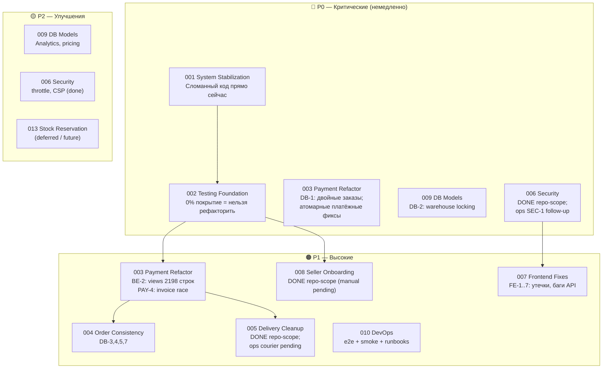
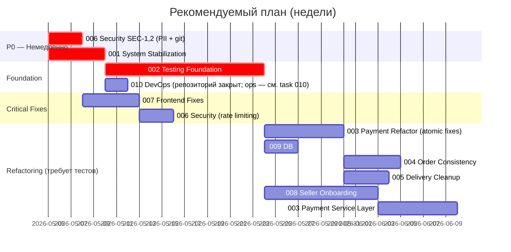

# Tasks — Структурированный план разработки reli.one

> Результат полного аудита проекта. Дата: май 2026.  
> **Актуализация (май 2026, после e2e/DevOps/docs):** см. раздел [Состояние после e2e-контура](#состояние-после-e2e-контура-и-devops-доков-май-2026).  
> Все задачи следуют workflow из `docs/10-agent-workflow.md`.

---

## Состояние после e2e-контура и DevOps-доков (май 2026)

Краткая сводка **только по артефактам в `docs/` и smoke-результатам**, без новых архитектурных решений за рамками уже зафиксированных proposals. **Task 010 (DevOps)** в текущем roadmap **не** блокируется **Task 013** (stock reservation) ни промокодами: **013** и складской резерв — **future / design-only**; промокоды в продукте сейчас **не используются** (см. [`010-devops-infrastructure/task.md`](./010-devops-infrastructure/task.md) → Deferred).

### Задокументировано и проверено руками в sandbox/e2e

| Артефакт | Ссылка / смысл |
|----------|----------------|
| Локальный e2e Docker | [`docs/testing/e2e-local-contour.md`](../testing/e2e-local-contour.md) |
| Stripe smoke (не prod) | [`docs/testing/stripe-e2e-checklist.md`](../testing/stripe-e2e-checklist.md) — *Verification evidence* |
| PayPal sandbox smoke (не prod) | [`docs/testing/paypal-e2e-checklist.md`](../testing/paypal-e2e-checklist.md) — *Verification evidence — latest local smoke result* |
| Склад / резерв до оплаты (design-only) | [**Task 013**](./013-stock-reservation/task.md) — **не** блокирует **010**; имплементации нет; связь с **009** по метрикам/блокировкам — только если вернуть склад в roadmap |
| `/health/`, deployment + Sentry + **operational monitoring** runbooks | [`docs/07-deployment.md`](../07-deployment.md), [`docs/operations/monitoring-alerts.md`](../operations/monitoring-alerts.md) |
| Health regression tests | `backend/test_health_endpoint.py` |
| PostgreSQL backup / restore в e2e | [`docs/operations/database-backup-restore.md`](../operations/database-backup-restore.md) |

### Статус задач (аудиторская формулировка)

Задачи **не закрыты целиком** по продуктовому смыслу, если в их `task.md` остаются обязательные **кодовые** чекбоксы. **Исключения по закрытию для git без боевой приёмки:** **[Task 010 — DevOps](./010-devops-infrastructure/task.md)** (**DONE git**), см. [финальную таблицу DoD](./010-devops-infrastructure/task.md#финальный-аудит-и-таблица-dod); **[Payment cleanup](./004-order-consistency/task.md#final-dod-table)** — **DONE repo-scope** в **[Task 004](./004-order-consistency/task.md)** при этом **структурный backlog Order Consistency** в том же файле остаётся **OPEN**; **[Task 005 — Delivery cleanup](./005-delivery-cleanup/task.md)** — **DONE repo-scope**, см. [Final DoD table](./005-delivery-cleanup/task.md#final-dod-table-task-005), при этом **ручная приёмка перевозчиков в production** — **pending (ops)** и этим репозиторием **не утверждается**; **[Task 006 — Security hardening](./006-security-hardening/task.md)** — **DONE (repo-scope)**, см. [Final Audit Summary](./006-security-hardening/task.md#final-audit-summary-task-006-repo-scope); **Ops follow-up required:** ротация credentials в production и выполнение git history rewrite — см. [`docs/security-incident-response.md`](../security-incident-response.md). **[Task 008 — Seller onboarding](./008-seller-onboarding-stabilization/task.md)** — **DONE (repo-scope)**, см. [Final DoD table](./008-seller-onboarding-stabilization/task.md#final-dod-table-task-008), при этом **ручная UI/staging-приёмка онбординга** и **Frontend3 e2e** — **pending / deferred** и этим репозиторием **не утверждаются**. Эксплуатационная приёмка описана как **pending** и не отменяет эти закрытия.

| # | После аудита |
|---|----------------|
| **010** | **DONE (репозиторий):** e2e-compose, env examples, Mailpit, Stripe/PayPal **local/sandbox** smoke (evidence в docs), `/health/` + тесты, backup/restore runbook, migrations+CI, deployment A–G, cookies env, Sentry+monitoring **runbooks в `docs/`**. **OPEN (ops):** прогон тех же runbook на **staging/prod**, evidence, `check --deploy`, включение алертов — см. [DoD-таблицу 010](./010-devops-infrastructure/task.md#финальный-аудит-и-таблица-dod). **Не входит в закрытие 010:** промокоды, **013**. Опционально позже: startup env validation (Iter. 5), RTO/RPO+медиа (Iter. 6). |
| **003** | **DONE (repo-scope)** платежного контура и cleanup — см. **[task.md](./003-payment-refactor/task.md)** и **[Final DoD table Task 004](./004-order-consistency/task.md#final-dod-table)**. **OPEN:** необязательный polish (не блокирует closure). Промокоды и **013** не блокируют. |
| **004** | **DONE (repo-scope)** для **Payment cleanup** (аудит, regression, ссылки на evidence). **OPEN / backlog:** структурная **Order Consistency** (миграции, константы статусов) — см. [task.md](./004-order-consistency/task.md#order-domain-backlog). |
| **013** | **Только документация** (baseline риска + целевой proposal). Имплементации **нет**. **Вне текущего roadmap** как обязательного трека; **не** зависимость для **010**. |
| **009** | **Pending:** analytics/pricing/warehouse-lock и т.д. по собственному `task.md`; не смешивать с «готовым складом». |
| **002** | **Core — done** по прежнему определению задачи; extended части исторически делегированы другим задачам. |
| **005** | **DONE (repo-scope):** dev-gating курьерских dev-endpoints, изоляция сбоев post-payment parcels, [`test_async_parcels_errors.py`](../../backend/delivery/test_async_parcels_errors.py), playbook retry/follow-up в [`payment-flow.md`](../payment-flow.md), связка с [`monitoring-alerts.md`](../operations/monitoring-alerts.md) — см. **[Final DoD table](./005-delivery-cleanup/task.md#final-dod-table-task-005)**. **OPEN (ops):** ручная приёмка перевозчиков в **production** (**pending**). **Deferred:** Celery, automatic retry, идемпотентность у перевозчика — в `task.md`. **Не** смешивать с PromoCode и **013**. |

Остальные задачи (**007, 011, 012** и др.) этим проходом **не перепроверялись построчно** в коде — их статус следует брать из соответствующих `task.md`, пока те файлы явно не обновлены (**003**, **004**, **005**, **006**, **008** — repo-scope closed; **010** обновлены май 2026).

### Next priority (рекомендация аудита — не смешивать с выполненными фактами)

**P0 — продуктовые и финансово значимые риски без полной закрывающей реализации в коде**

1. [**Task 013**](./013-stock-reservation/task.md) — **deferred / future:** при возврате продукта с учётом остатков — планирование итераций и согласование с **003**; до решения **не** трактовать как блокер **010** или текущего релиза.
2. [**Task 003**](./003-payment-refactor/task.md) **(payment):** **DONE (repo-scope)** — см. также **[Task 004 — Final DoD](./004-order-consistency/task.md#final-dod-table)**; открыт только **необязательный** polish в `task.md` **003**. Промокоды и склад (**013**) — **не** блокеры.
3. [**006**](./006-security-hardening/task.md) — **DONE (repo-scope)** — см. [Final Audit Summary](./006-security-hardening/task.md#final-audit-summary-task-006-repo-scope). **Ops follow-up required:** credential rotation and git history rewrite execution — [`docs/security-incident-response.md`](../security-incident-response.md).

**P1 — эксплуатация, консистентность и закрытие «хвостов» после доков**

1. Эксплуатация: прогнать runbook [`07-deployment.md`](../07-deployment.md) и [monitoring](../operations/monitoring-alerts.md) на **вашем** staging/prod при выкатах; evidence **вне git** (задача **[010](./010-devops-infrastructure/task.md)** по **коду/докам** уже **DONE** — см. её DoD-таблицу). Промокоды и **013** — не DoD **010**.
2. [**004**](./004-order-consistency/task.md) — структурная **Order Consistency** (backlog в `task.md`); платежный audit там же уже **DONE repo-scope**. [**005**](./005-delivery-cleanup/task.md) — **DONE repo-scope**; остаётся **ops:** приёмка перевозчиков в production (**manual/pending**) — см. [Final DoD](./005-delivery-cleanup/task.md#final-dod-table-task-005). [**008**](./008-seller-onboarding-stabilization/task.md) — **DONE (repo-scope)** — см. [Final DoD](./008-seller-onboarding-stabilization/task.md#final-dod-table-task-008); **manual/staging UI** онбординга и **Frontend3 e2e** — **pending / deferred**, вне закрытия репозитория. **Не зависит** от PromoCode, **013**, **005** (кроме общего payment/order фундамента) — см. [task.md](./008-seller-onboarding-stabilization/task.md).
3. **Регулярные Postgres backups на проде и проверки восстановления** — описать в **`docs/07-deployment.md`** (runbook уже покрывает технологию дампа).

**P2**

1. [**009**](./009-db-model-improvements/task.md) — аналитика/цены/locking для `decrease_stock` когда появится записывающийся складской путь.
2. [**011**](./011-order-product-received-at-timezone/task.md) и прочее по вашему backlog.

---

**Proposal vs done:** любая строка выше вида «резерв / RTO» — **направление работ**, а не утверждение о уже внедрённой системе. Детали — только в ADR/задачах после явного решения.

---

## Архитектура проблем



---

## Сводная таблица задач

| # | Задача | Priority | Complexity | Зависит от | GO/NO-GO |
|---|--------|----------|------------|------------|----------|
| 001 | [system-stabilization](./001-system-stabilization/task.md) | **P0** | Medium | — | GO |
| 002 | [testing-foundation](./002-testing-foundation/task.md) | **P0** | High | 001 | **DONE (Core)**; Extended → 009, 010, 012 |
| 003 | [payment-refactor](./003-payment-refactor/task.md) | **P0/P1** | High | **002** | **DONE (repo-scope)**; см. [004 Final DoD](./004-order-consistency/task.md#final-dod-table); polish — опционально |
| 004 | [order-consistency](./004-order-consistency/task.md) | P1 | Medium | 002 | **DONE (repo-scope)** payment audit; **OPEN** order backlog — см. [Order domain backlog](./004-order-consistency/task.md#order-domain-backlog) |
| 005 | [delivery-cleanup](./005-delivery-cleanup/task.md) | P1 | Medium | 002 | **DONE (repo-scope)** — см. [Final DoD](./005-delivery-cleanup/task.md#final-dod-table-task-005); **ops:** courier acceptance pending |
| 006 | [security-hardening](./006-security-hardening/task.md) | **P0/P1** | Medium | — | **DONE (repo-scope)** — см. [Final Audit Summary](./006-security-hardening/task.md#final-audit-summary-task-006-repo-scope); **ops:** credential rotation + history rewrite per [`security-incident-response.md`](../security-incident-response.md) |
| 007 | [frontend-critical-fixes](./007-frontend-critical-fixes/task.md) | P1 | Low | 006 | GO |
| 008 | [seller-onboarding-stabilization](./008-seller-onboarding-stabilization/task.md) | P1 | High | 002 (Core **done**) | **DONE (repo-scope)** — см. [Final DoD](./008-seller-onboarding-stabilization/task.md#final-dod-table-task-008); manual UI/staging + Frontend3 e2e — **не** в закрытии repo |
| 009 | [db-model-improvements](./009-db-model-improvements/task.md) | **P0**/P2 | Medium | 002 | NO-GO без 002 |
| 010 | [devops-infrastructure](./010-devops-infrastructure/task.md) | P1 | Medium | 002 | **DONE (git)**; см. [DoD-таблицу](./010-devops-infrastructure/task.md#финальный-аудит-и-таблица-dod); ops acceptance — отдельно |
| 011 | [order-product-received-at-timezone](./011-order-product-received-at-timezone/task.md) | P2 | Low | 002 | GO |
| 012 | [order-lifecycle-extended-tests](./012-order-lifecycle-extended-tests/task.md) | P1 | Medium | 002 (Core) | перенос Extended из 002 |
| **013** | [**stock-reservation**](./013-stock-reservation/task.md) | **Future** / design-only | High | при старте: **002**, **003** | **Не** в текущем roadmap; **не** блокирует **010**; в коде нет целевого резерва (см. `task.md`) |

## Рекомендуемый порядок выполнения



---

## Ответы на ключевые вопросы аудита

### 1. Есть ли достаточно тестов для безопасного рефакторинга?

**Частично.** Актуальный снимок: [`docs/08-testing-strategy.md`](../08-testing-strategy.md). В backend есть тестовые наборы в `payment`, `order`, `product`, `delivery`, `sellers`, `accounts`, `promocode`; CI выполняет `makemigrations --check`, `migrate`, `manage.py test`, **`pytest`**. Отдельно: регресс `GET /health/` — [`backend/test_health_endpoint.py`](../../backend/test_health_endpoint.py).

Пробелы, релевантные для решения о крупном рефакторинге:

| Область | Замечание (май 2026) |
|---------|---------------------|
| `warehouse` | По документированной стратегии **`warehouses/tests.py` минимальны / пусты** |
| Автоматизация full чекаута PSP | Полный счастливый путь Stripe/PayPal у внешних провайдеров дополняется **ручными** e2e-чеклистами (`docs/testing/`) |
| `promocode` | Код и тесты остаются в репозитории; **промокоды не в продуктовом roadmap** — конкурентные сценарии / **DB-6** не блокируют **010**; при возврате фичи — **003** или отдельная задача |
| Frontend3 | Раннер тестов в `package.json` **не описан как подключённый** |

Вывод аудита январского отчёта «≈ 0% покрытие» по backend **устарел**; отдельные **P0**-риски по складу (**013**) и платежам остаются предметом соответствующих `task.md` и **не** продлевают **010**, пока **013**/промокоды вне текущего roadmap.

### 2. Какие критические сценарии НЕ покрыты / требуют внимания?

- Контролируемая идемпотентность платёжных webhook в продукте — есть **автотестовая база** в `payment` (Stripe/PayPal flow), см. задачи и CI; регрессии держать при изменениях **003**.
- Отсутствие **inventory reservation** до оплаты (**Task 013** — только proposal + baseline по коду): значимо **если** склад/остатки снова станут обязательным продуктовым треком; в **текущем roadmap** — **deferred**, **не** блокер **010**.
- Конкурентный **`decrease_stock`** — актуально **после** возврата списания в webhook и наличия **013** (**Task 009** — технические элементы блокировок).
- Конкурентный `increment_used_count` / промокоды (**DB-6**) — **не** блокер **010**; при возврате промокодов в продукт — верифицировать **003**/код и покрытие отдельно.
- Параллельная генерация инвойсов / жизненный цикл заказа / смежные сценарии — см. **004**, **012** и расширенное покрытие (**002**/домены).

### 3. Какие P0 архитектурные риски существуют?

```
РИСК 1 (DB-1): Payment.session_id не уникален
→ Stripe может доставить webhook дважды → 2 заказа, 2 списания промокода

РИСК 2 (DB-2): Нет end-to-end учёта остатка до оплаты; списание в webhook отключено → см. Task 013. При возврате списания без `select_for_update()` — параллельные подтверждения могут испортить `quantity_in_stock`

РИСК 3 (DB-6): PromoCode.increment_used_count не атомарный
→ Промокод применяется больше max_usage раз

РИСК 4 (BE-1): promocode/signal.py — 3 AttributeError
→ Любое сохранение PromoCode через Admin → 500

РИСК 5 (SEC-1,2): Секреты и PII в git истории
→ При клоне репозитория — компрометация credentials
```

### 4. Можно ли начинать рефакторинг?

```
GO / NO-GO DECISION:

✅ GO — исправления без рефакторинга (Task 001):
   - Исправление сломанных endpoints
   - Добавление try/except
   - Исправление Frontend bagов

✅ GO — безопасные security fixes (Task 006 SEC-1,2):
   - Удаление PII файла
   - Очистка git истории (требует координации)

⚠️  GO с осторожностью — атомарные DB fixes (Task 003 Iter 3):
   - Unique на session_id + get_or_create
   - F() для promo increment
   - select_for_update для invoice
   (Можно делать параллельно с написанием тестов)

🔴 NO-GO — рефакторинг **без** регрессий (декомпозиция `payment/views.py` и др.):
   - НЕЛЬЗЯ начинать без Task 002 (тесты)
   - Без regression tests рефакторинг монолитов неприемлем
   (**Seller onboarding:** декомпозиция выполнена — **Task 008** **DONE (repo-scope)**; см. [Final DoD](./008-seller-onboarding-stabilization/task.md#final-dod-table-task-008).)
```

---

## Итоговый вывод

**Приоритеты после e2e/DevOps-доков** — см. раздел **[Состояние после e2e-контура](#состояние-после-e2e-контура-и-devops-доков-май-2026)** (списки P0 / P1 / P2 и явное разделение *proposal* vs сделано).

Исторический план аудита («002 блокирует рефакторинг», «удалить PII файл») сохраняет смысл для **монолитного** рефакторинга `payment`/`onboarding`, но численная оценка «ноль тестов» по backend к маю 2026 **неактуальна** — см. ответ №1 выше и `docs/08-testing-strategy.md`.

---

## Файлы задач

```
docs/tasks/
├── README.md                              ← этот файл
├── _task_template.md                      ← шаблон задачи
├── 001-system-stabilization/task.md
├── 002-testing-foundation/task.md
├── 003-payment-refactor/task.md
├── 004-order-consistency/task.md
├── 005-delivery-cleanup/task.md
├── 006-security-hardening/task.md
├── 007-frontend-critical-fixes/task.md
├── 008-seller-onboarding-stabilization/task.md
├── 009-db-model-improvements/task.md
├── 010-devops-infrastructure/task.md
├── 011-order-product-received-at-timezone/task.md
├── 012-order-lifecycle-extended-tests/task.md
└── 013-stock-reservation/task.md
```

См. также: [`docs/operations/database-backup-restore.md`](../operations/database-backup-restore.md) (runbook PostgreSQL / восстановление в e2e); **[Seller onboarding flow](../seller-onboarding-flow.md)** (продуктово-техническое описание API и статусов).

