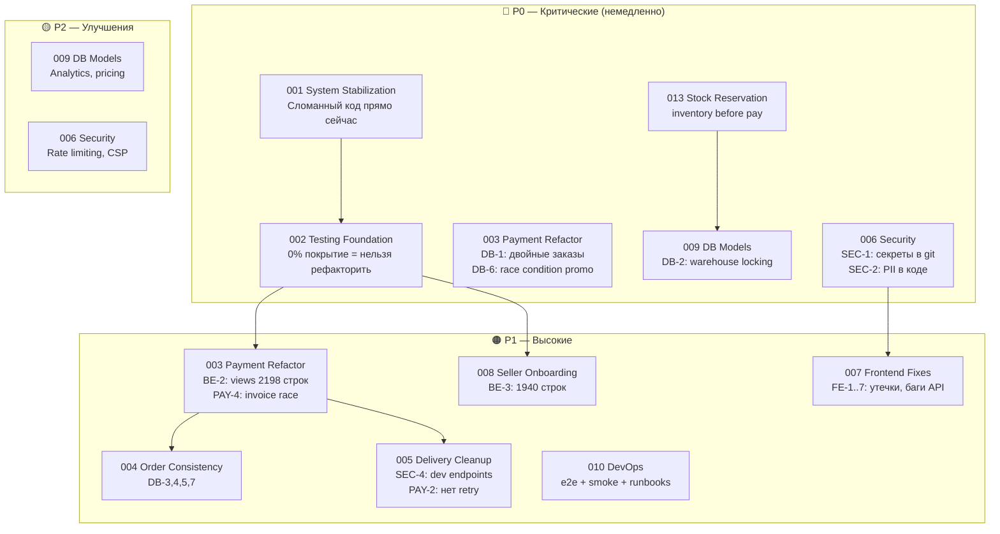

# Tasks — Структурированный план разработки reli.one

> Результат полного аудита проекта. Дата: май 2026.  
> **Актуализация (май 2026, после e2e/DevOps/docs):** см. раздел [Состояние после e2e-контура](#состояние-после-e2e-контура-и-devops-доков-май-2026).  
> Все задачи следуют workflow из `docs/10-agent-workflow.md`.

---

## Состояние после e2e-контура и DevOps-доков (май 2026)

Краткая сводка **только по артефактам в `docs/` и smoke-результатам**, без новых архитектурных решений за рамками уже зафиксированных proposals (в т.ч. **Task 013** — целевой flow резерва описан как proposal, в коде не реализован).

### Задокументировано и проверено руками в sandbox/e2e

| Артефакт | Ссылка / смысл |
|----------|----------------|
| Локальный e2e Docker | [`docs/testing/e2e-local-contour.md`](../testing/e2e-local-contour.md) |
| Stripe smoke (не prod) | [`docs/testing/stripe-e2e-checklist.md`](../testing/stripe-e2e-checklist.md) — *Verification evidence* |
| PayPal sandbox smoke (не prod) | [`docs/testing/paypal-e2e-checklist.md`](../testing/paypal-e2e-checklist.md) — *Verification evidence — latest local smoke result* |
| Склад / оплата без резерва — baseline | [**Task 013**](./013-stock-reservation/task.md) (+ уточнения в **Task 009**) |
| `/health/`, Sentry-условия, prod checklist | [`docs/07-deployment.md`](../07-deployment.md) |
| Health regression tests | `backend/test_health_endpoint.py` |
| PostgreSQL backup / restore в e2e | [`docs/operations/database-backup-restore.md`](../operations/database-backup-restore.md) |

### Статус задач (аудиторская формулировка)

Задачи **не закрыты целиком**, если в их `task.md` остаются неотмеченные чекбоксы или явный **Partial / In Progress**.

| # | После аудита |
|---|----------------|
| **010** | **Частично выполнена:** локальный stack, handbook payment providers, Stripe+PayPal smoke evidence, health+deployment docs, Postgres runbook; **файлы миграций под `backend/*/migrations/` в git**, `makemigrations --check` без дрейфа (аудит 2026-05-11). **Не списывать в «done»:** тест PromoCode concurrency; эксплуатация Sentry/алерты/load balancer health в prod; RTO/RPO и backup **медиа/Cloudinary** в deployment doc; закрыть TODO деплоя/CI/TLS в `docs/07-deployment.md`; startup env validation (**010** DoD). |
| **013** | **Только документация** (baseline риска + целевой proposal). Имплементации **нет**. |
| **009** | **Pending:** analytics/pricing/warehouse-lock и т.д. по собственному `task.md`; не смешивать с «готовым складом». |
| **002** | **Core — done** по прежнему определению задачи; extended части исторически делегированы другим задачам. |

Остальные задачи (**003–008, 011, 012** и др.) этим проходом **не перепроверялись построчно** в коде — их статус следует брать из соответствующих `task.md` и трактовать здесь без изменений, пока те файлы явно не обновлены.

### Next priority (рекомендация аудита — не смешивать с выполненными фактами)

**P0 — продуктовые и финансово значимые риски без полной закрывающей реализации в коде**

1. [**Task 013**](./013-stock-reservation/task.md) — перевести proposal в планируемые итерации (резерв до оплаты + согласование с **003**); до реализации **не** включать слепое списание склада из webhook (уже правило зафиксировано в задаче).
2. Свериться с кодом/`task.md`: остаются ли открытыми атомарные фиксы **003** по DB-уникальности платежной сессии и промокоду (**DB-1, DB-6**) — трактовать как P0 пока есть подтверждённая брешь.
3. [**006**](./006-security-hardening/task.md) — любые незакрытые пункты SEC-1/SEC-2/PII/`git`-истории по вашему `task.md`.

**P1 — эксплуатация, консистентность и закрытие «хвостов» после доков**

1. [**010**](./010-devops-infrastructure/task.md) — завершить оставшиеся DoD: ~~миграции в git~~ (уже в репо; поддерживать `--check`); PromoCode concurrency test; **Iteration 7** (Sentry в prod, `check --deploy`); дополнить `docs/07-deployment.md`: RTO/RPO, медиа, ручной деплой, CI/CD, TLS (**без смешения с уже готовым runbook’ом Postgres**).
2. [**004**, **005**, **008**](./004-order-consistency/task.md) — по вашему темпу после стабильного тестового фундамента.
3. **Регулярные Postgres backups на проде и проверки восстановления** — описать в **`docs/07-deployment.md`** (runbook уже покрывает технологию дампа).

**P2**

1. [**009**](./009-db-model-improvements/task.md) — аналитика/цены/locking для `decrease_stock` когда появится записывающийся складской путь.
2. [**011**](./011-order-product-received-at-timezone/task.md) и прочее по вашему backlog.

---

**Proposal vs done:** любая строка выше вида «резерв / RTO» — **направление работ**, а не утверждение о уже внедрённой системе. Детали — только в ADR/задачах после явного решения.

---

## Архитектура проблем



---

## Сводная таблица задач

| # | Задача | Priority | Complexity | Зависит от | GO/NO-GO |
|---|--------|----------|------------|------------|----------|
| 001 | [system-stabilization](./001-system-stabilization/task.md) | **P0** | Medium | — | GO |
| 002 | [testing-foundation](./002-testing-foundation/task.md) | **P0** | High | 001 | **DONE (Core)**; Extended → 009, 010, 012 |
| 003 | [payment-refactor](./003-payment-refactor/task.md) | **P0/P1** | High | **002** | NO-GO без 002 |
| 004 | [order-consistency](./004-order-consistency/task.md) | P1 | Medium | 002 | NO-GO без 002 |
| 005 | [delivery-cleanup](./005-delivery-cleanup/task.md) | P1 | Medium | 002 | NO-GO без 002 |
| 006 | [security-hardening](./006-security-hardening/task.md) | **P0/P1** | Medium | — | GO (SEC-1,2 немедленно) |
| 007 | [frontend-critical-fixes](./007-frontend-critical-fixes/task.md) | P1 | Low | 006 | GO |
| 008 | [seller-onboarding-stabilization](./008-seller-onboarding-stabilization/task.md) | P1 | High | 002 | NO-GO без 002 |
| 009 | [db-model-improvements](./009-db-model-improvements/task.md) | **P0**/P2 | Medium | 002 | NO-GO без 002 |
| 010 | [devops-infrastructure](./010-devops-infrastructure/task.md) | P1 | Medium | 002 | **Частично** (docs+e2e+smokes+runbooks; см. задачу) |
| 011 | [order-product-received-at-timezone](./011-order-product-received-at-timezone/task.md) | P2 | Low | 002 | GO |
| 012 | [order-lifecycle-extended-tests](./012-order-lifecycle-extended-tests/task.md) | P1 | Medium | 002 (Core) | перенос Extended из 002 |
| **013** | [**stock-reservation**](./013-stock-reservation/task.md) | **P0** | High | **002**, согласование с **003** | продуктовый риск: оплата без учёта остатков |

## Рекомендуемый порядок выполнения


---

## Ответы на ключевые вопросы аудита

### 1. Есть ли достаточно тестов для безопасного рефакторинга?

**Частично.** Актуальный снимок: [`docs/08-testing-strategy.md`](../08-testing-strategy.md). В backend есть тестовые наборы в `payment`, `order`, `product`, `delivery`, `sellers`, `accounts`, `promocode`; CI выполняет `makemigrations --check`, `migrate`, `manage.py test`, **`pytest`**. Отдельно: регресс `GET /health/` — [`backend/test_health_endpoint.py`](../../backend/test_health_endpoint.py).

Пробелы, релевантные для решения о крупном рефакторинге:

| Область | Замечание (май 2026) |
|---------|---------------------|
| `warehouse` | По документированной стратегии **`warehouses/tests.py` минимальны / пусты** |
| Автоматизация full чекаута PSP | Полный счастливый путь Stripe/PayPal у внешних провайдеров дополняется **ручными** e2e-чеклистами (`docs/testing/`) |
| `promocode` конкуренция | По **010** всё ещё открыт перенос/написание теста атомарности |
| Frontend3 | Раннер тестов в `package.json` **не описан как подключённый** |

Вывод аудита январского отчёта «≈ 0% покрытие» по backend **устарел**; это **не** отменяет P0-бизнес-риски (**013** и см. ниже).

### 2. Какие критические сценарии НЕ покрыты / требуют внимания?

- Контролируемая идемпотентность платёжных webhook в продукте — есть **автотестовая база** в `payment` (Stripe/PayPal flow), см. задачи и CI; регрессии держать при изменениях **003**.
- Отсутствие **inventory reservation** до оплаты (**Task 013** — только proposal + baseline по коду) — самостоятельный продуктовый разрыв.
- Конкурентный **`decrease_stock`** — актуально **после** возврата списания в webhook и наличия **013** (**Task 009** — технические элементы блокировок).
- Конкурентный `increment_used_count` / промокоды (**DB-6**) — верифицировать статус атомарных фиксов в **003**/коде; тест закрывает **010**.
- Параллельная генерация инвойсов / жизненный цикл заказа / смежные сценарии — см. **004**, **012** и расширенное покрытие (**002**/домены).

### 3. Какие P0 архитектурные риски существуют?

```
РИСК 1 (DB-1): Payment.session_id не уникален
→ Stripe может доставить webhook дважды → 2 заказа, 2 списания промокода

РИСК 2 (DB-2): Нет end-to-end учёта остатка до оплаты; списание в webhook отключено → см. Task 013. При возврате списания без `select_for_update()` — параллельные подтверждения могут испортить `quantity_in_stock`

РИСК 3 (DB-6): PromoCode.increment_used_count не атомарный
→ Промокод применяется больше max_usage раз

РИСК 4 (BE-1): promocode/signal.py — 3 AttributeError
→ Любое сохранение PromoCode через Admin → 500

РИСК 5 (SEC-1,2): Секреты и PII в git истории
→ При клоне репозитория — компрометация credentials
```

### 4. Можно ли начинать рефакторинг?

```
GO / NO-GO DECISION:

✅ GO — исправления без рефакторинга (Task 001):
   - Исправление сломанных endpoints
   - Добавление try/except
   - Исправление Frontend bagов

✅ GO — безопасные security fixes (Task 006 SEC-1,2):
   - Удаление PII файла
   - Очистка git истории (требует координации)

⚠️  GO с осторожностью — атомарные DB fixes (Task 003 Iter 3):
   - Unique на session_id + get_or_create
   - F() для promo increment
   - select_for_update для invoice
   (Можно делать параллельно с написанием тестов)

🔴 NO-GO — рефакторинг (декомпозиция payment/views.py, onboarding):
   - НЕЛЬЗЯ начинать без Task 002 (тесты)
   - Без regression tests рефакторинг монолитов неприемлем
```

---

## Итоговый вывод

**Приоритеты после e2e/DevOps-доков** — см. раздел **[Состояние после e2e-контура](#состояние-после-e2e-контура-и-devops-доков-май-2026)** (списки P0 / P1 / P2 и явное разделение *proposal* vs сделано).

Исторический план аудита («002 блокирует рефакторинг», «удалить PII файл») сохраняет смысл для **монолитного** рефакторинга `payment`/`onboarding`, но численная оценка «ноль тестов» по backend к маю 2026 **неактуальна** — см. ответ №1 выше и `docs/08-testing-strategy.md`.

---

## Файлы задач

```
docs/tasks/
├── README.md                              ← этот файл
├── _task_template.md                      ← шаблон задачи
├── 001-system-stabilization/task.md
├── 002-testing-foundation/task.md
├── 003-payment-refactor/task.md
├── 004-order-consistency/task.md
├── 005-delivery-cleanup/task.md
├── 006-security-hardening/task.md
├── 007-frontend-critical-fixes/task.md
├── 008-seller-onboarding-stabilization/task.md
├── 009-db-model-improvements/task.md
├── 010-devops-infrastructure/task.md
├── 011-order-product-received-at-timezone/task.md
├── 012-order-lifecycle-extended-tests/task.md
└── 013-stock-reservation/task.md
```

См. также: [`docs/operations/database-backup-restore.md`](../operations/database-backup-restore.md) (runbook PostgreSQL / восстановление в e2e).

