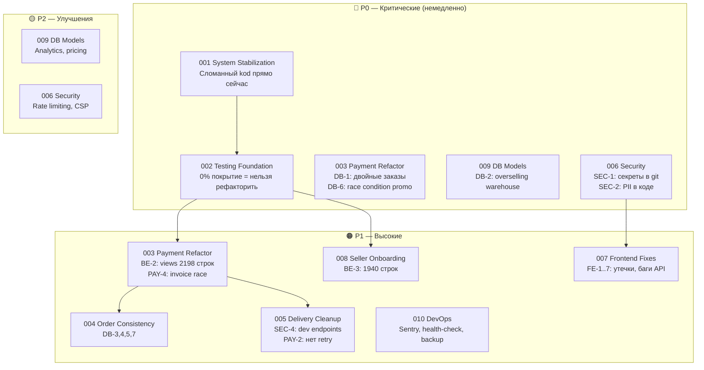
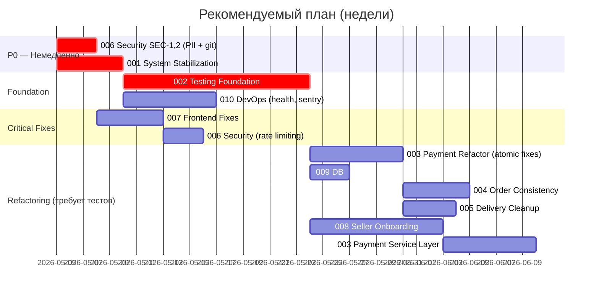

# Tasks — Структурированный план разработки reli.one

> Результат полного аудита проекта. Дата: май 2026.  
> Все задачи следуют workflow из `docs/10-agent-workflow.md`.

---

## Архитектура проблем



---

## Сводная таблица задач

| # | Задача | Priority | Complexity | Зависит от | GO/NO-GO |
|---|--------|----------|------------|------------|----------|
| 001 | [system-stabilization](./001-system-stabilization/task.md) | **P0** | Medium | — | GO |
| 002 | [testing-foundation](./002-testing-foundation/task.md) | **P0** | High | 001 | GO |
| 003 | [payment-refactor](./003-payment-refactor/task.md) | **P0/P1** | High | **002** | NO-GO без 002 |
| 004 | [order-consistency](./004-order-consistency/task.md) | P1 | Medium | 002 | NO-GO без 002 |
| 005 | [delivery-cleanup](./005-delivery-cleanup/task.md) | P1 | Medium | 002 | NO-GO без 002 |
| 006 | [security-hardening](./006-security-hardening/task.md) | **P0/P1** | Medium | — | GO (SEC-1,2 немедленно) |
| 007 | [frontend-critical-fixes](./007-frontend-critical-fixes/task.md) | P1 | Low | 006 | GO |
| 008 | [seller-onboarding-stabilization](./008-seller-onboarding-stabilization/task.md) | P1 | High | 002 | NO-GO без 002 |
| 009 | [db-model-improvements](./009-db-model-improvements/task.md) | **P0**/P2 | Medium | 002 | NO-GO без 002 |
| 010 | [devops-infrastructure](./010-devops-infrastructure/task.md) | P1 | Medium | 002 | GO параллельно |

---

## Рекомендуемый порядок выполнения



---

## Ответы на ключевые вопросы аудита

### 1. Есть ли достаточно тестов для безопасного рефакторинга?

**НЕТ.** Текущее покрытие ≈ 0% по критическим доменам:

| Domain | Текущие тесты | Достаточно? |
|--------|--------------|-------------|
| payment | ~22 кейса | Частично (нет idempotency) |
| sellers | ~4 кейса | Нет |
| accounts | ~4 кейса | Нет |
| order | 0 | Нет |
| warehouse | 0 | Нет |
| delivery | 1 файл | Нет |
| product, favorites, reviews, promocode | 0 | Нет |

### 2. Какие критические сценарии НЕ покрыты?

- Дублирующийся Stripe webhook → создание двух заказов
- Конкурентный `decrease_stock` → overselling
- Конкурентный `increment_used_count` → превышение лимита промокода
- Параллельная генерация инвойсов → дублирующиеся номера
- Order lifecycle transitions (Pending → Processing → Shipped → Closed)
- Logout с невалидным токеном → 500

### 3. Какие P0 архитектурные риски существуют?

```
РИСК 1 (DB-1): Payment.session_id не уникален
→ Stripe может доставить webhook дважды → 2 заказа, 2 списания промокода

РИСК 2 (DB-2): WarehouseItem без select_for_update
→ Параллельные webhook-и → quantity_in_stock < 0 → overselling

РИСК 3 (DB-6): PromoCode.increment_used_count не атомарный
→ Промокод применяется больше max_usage раз

РИСК 4 (BE-1): promocode/signal.py — 3 AttributeError
→ Любое сохранение PromoCode через Admin → 500

РИСК 5 (SEC-1,2): Секреты и PII в git истории
→ При клоне репозитория — компрометация credentials
```

### 4. Можно ли начинать рефакторинг?

```
GO / NO-GO DECISION:

✅ GO — исправления без рефакторинга (Task 001):
   - Исправление сломанных endpoints
   - Добавление try/except
   - Исправление Frontend bagов

✅ GO — безопасные security fixes (Task 006 SEC-1,2):
   - Удаление PII файла
   - Очистка git истории (требует координации)

⚠️  GO с осторожностью — атомарные DB fixes (Task 003 Iter 3):
   - Unique на session_id + get_or_create
   - F() для promo increment
   - select_for_update для invoice
   (Можно делать параллельно с написанием тестов)

🔴 NO-GO — рефакторинг (декомпозиция payment/views.py, onboarding):
   - НЕЛЬЗЯ начинать без Task 002 (тесты)
   - Без regression tests рефакторинг монолитов неприемлем
```

---

## Итоговый вывод

**Рекомендуемый следующий шаг:**

1. **Сегодня:** Запустить Task 006 Iteration 2 — удалить `src/code/test.js` с PII
2. **Эта неделя:** Task 001 — исправить все сломанные endpoints
3. **Следующие 2 недели:** Task 002 — написать тесты (блокирует рефакторинг)
4. **Параллельно с Task 002:** Task 010 (health-check, Sentry), Task 007 (frontend bugs)
5. **После Task 002:** Task 003 Iter 3 (атомарные DB fixes), Task 009 (warehouse lock)

**Рефакторинг Payment и Onboarding монолитов — только после Task 002.**

---

## Файлы задач

```
docs/tasks/
├── README.md                              ← этот файл
├── _task_template.md                      ← шаблон задачи
├── 001-system-stabilization/task.md
├── 002-testing-foundation/task.md
├── 003-payment-refactor/task.md
├── 004-order-consistency/task.md
├── 005-delivery-cleanup/task.md
├── 006-security-hardening/task.md
├── 007-frontend-critical-fixes/task.md
├── 008-seller-onboarding-stabilization/task.md
├── 009-db-model-improvements/task.md
└── 010-devops-infrastructure/task.md
```
